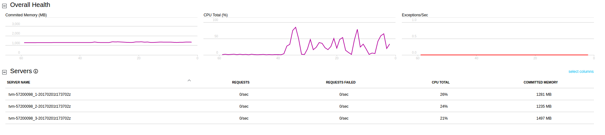
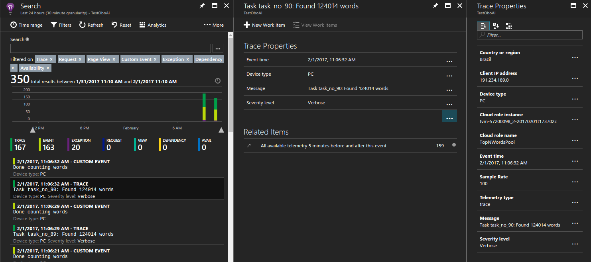
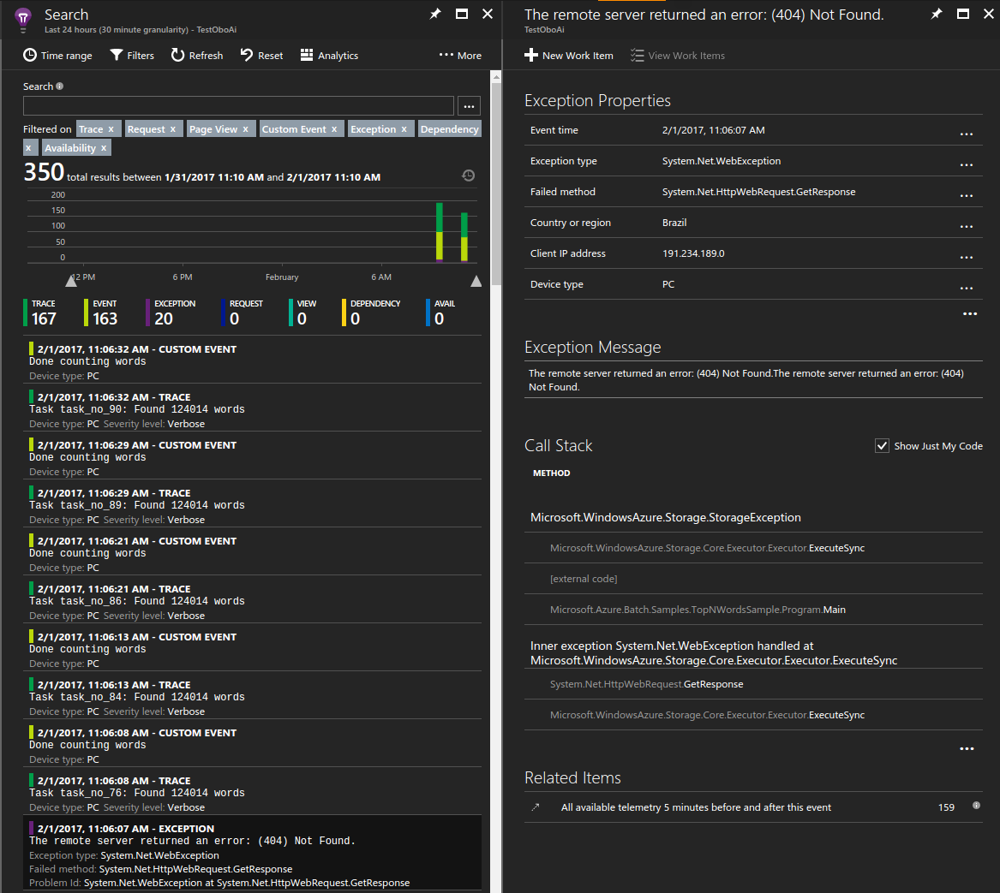
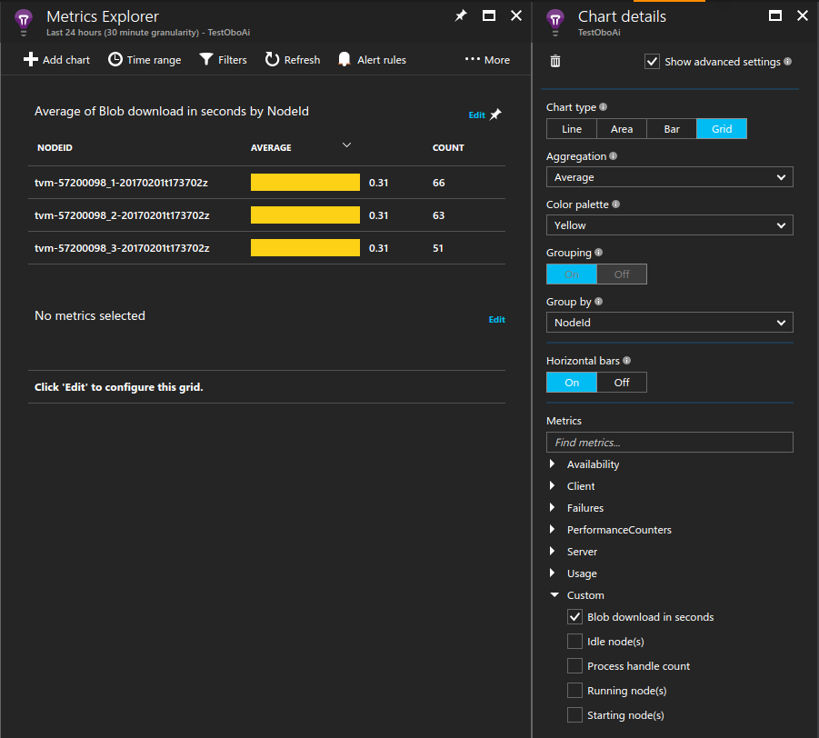

# Monitor and debug an Azure Batch application with Application Insights

[Application Insights](../application-insights/app-insights-overview.md) provides an elegant and powerful way for developers to monitor and debug 
applications deployed to Azure services. Using Application Insights you can 
monitor performance counters and exceptions as well as instrument your code 
with custom metrics and tracing. Integrating Application Insights with your 
Azure Batch application allows you to gain deep insights into behaviors 
and investigate issues in near-real-time.

This article shows how to add and configure the Application Insights library 
into your Azure Batch .NET solution and instrument your application code. It also provides
examples on how to monitor your application via the Azure portal and build 
custom dashboards.

A sample C# solution with code to accompany this article is available on [GitHub](https://github.com/Azure/azure-batch-samples/tree/master/CSharp/ArticleProjects/ApplicationInsights). 

## Prerequisites
* [Visual Studio IDE](https://www.visualstudio.com/vs) (Visual Studio 2015 or a more recent version). 
* [Batch account](batch-account-create-portal.md)
* [Application Insights resource](../application-insights/app-insights-create-new-resource.md)
  
  To persist your application logs and performance counters, you must create an Application Insights resource where Azure stores data. Select the *General* **Application type**.

  Copy the [instrumentation 
key](../application-insights/app-insights-create-new-resource.md#copy-the-instrumentation-key) from the portal. It is required later in this article.
  
  > [!NOTE]
  > You may be [charged](https://azure.microsoft.com/pricing/details/application-insights/) for the data stored in your Application Insights account. 
  > This includes the diagnostic and monitoring data discussed in this article.
  > 

## Add Application Insights to your project

The **Microsoft.ApplicationInsights.WindowsServer** NuGet package and its dependencies are required for your project. Add or restore them to your application's project. If you need to download missing packages, ensure the [NuGet Package Manager](https://docs.nuget.org/consume/installing-nuget) is installed.

```powershell
Install-Package Microsoft.ApplicationInsights.WindowsServer
```
You can now reference them using the **Microsoft.ApplicationInsights** namespace.

## Instrument your code

First, update the ApplicationInsights.config file in the TopNWords solution with your instrumentation key.

```xml
<InstrumentationKey>YOUR-IKEY-GOES-HERE</InstrumentationKey>
```

The example in TopNWords.cs uses the following instrumentation calls from the [Application Insights API](../application-insights/app-insights-api-custom-events-metrics.md):
* `TrackMetric()` - Tracks how long, on average, a compute node takes to download the required text file.
* `TrackTrace()` - Adds debugging calls to your code.
* `TrackEvent()` - Tracks interesting events to capture.

This example purposely leaves out exception 
handling to see how Application Insights automatically reports unhandled 
exceptions and significantly improves the debugging experience. The 
following snippet illustrates how to use these methods.

```csharp
public void CountWords(string blobName, int numTopN, string storageAccountName, string storageAccountKey)
{
    // simulate exception for some set of tasks
    Random rand = new Random();
    if (rand.Next(0, 10) % 10 == 0)
    {
        blobName += ".badUrl";
    }

    // log the url we are downloading the file from
    insightsClient.TrackTrace(new TraceTelemetry(string.Format("Task {0}: Download file from: {1}", this.taskId, blobName), SeverityLevel.Verbose));

    // open the cloud blob that contains the book
    var storageCred = new StorageCredentials(storageAccountName, storageAccountKey);
    CloudBlockBlob blob = new CloudBlockBlob(new Uri(blobName), storageCred);
    using (Stream memoryStream = new MemoryStream())
    {
        // calculate blob download time
        DateTime start = DateTime.Now;
        blob.DownloadToStream(memoryStream);
        TimeSpan downloadTime = DateTime.Now.Subtract(start);

        // track how long the blob takes to download on this node
        // this will help debug timing issues or identify poorly performing nodes
        insightsClient.TrackMetric("Blob download in seconds", downloadTime.TotalSeconds, this.CommonProperties);

        memoryStream.Position = 0; //Reset the stream
        var sr = new StreamReader(memoryStream);
        var myStr = sr.ReadToEnd();
        string[] words = myStr.Split(' ');

        // log how many words were found in the text file
        insightsClient.TrackTrace(new TraceTelemetry(string.Format("Task {0}: Found {1} words", this.taskId, words.Length), SeverityLevel.Verbose));
        var topNWords =
            words.
                Where(word => word.Length > 0).
                GroupBy(word => word, (key, group) => new KeyValuePair<String, long>(key, group.LongCount())).
                OrderByDescending(x => x.Value).
                Take(numTopN).
                ToList();
        foreach (var pair in topNWords)
        {
            Console.WriteLine("{0} {1}", pair.Key, pair.Value);
        }

        // emit an event to track the completion of the task
        insightsClient.TrackEvent("Done counting words");
    }
}
```

### Azure Batch telemetry initializer helper
When reporting telemetry for a given server and instance, Application Insights 
uses the Azure VM Role and VM name for the default values. In the context of Azure Batch, we would like to use the pool name and compute 
node name instead. Use a [telemetry initializer](../application-insights/app-insights-api-filtering-sampling.md#add-properties) to override the default 
values. (See a code  
example on [GitHub](https://github.com/Microsoft/ApplicationInsights-dotnet-server/blob/develop/Src/WindowsServer/WindowsServer.Shared/AzureWebAppRoleEnvironmentTelemetryInitializer.cs).)

```csharp
using Microsoft.ApplicationInsights.Channel;
using Microsoft.ApplicationInsights.Extensibility;
using System;
using System.Threading;

namespace Microsoft.Azure.Batch.Samples.TopNWordsSample
{
    public class AzureBatchNodeTelemetryInitializer : ITelemetryInitializer
    {
        // Azure Batch environment variables
        private const string PoolIdEnvironmentVariable = "AZ_BATCH_POOL_ID";
        private const string NodeIdEnvironmentVariable = "AZ_BATCH_NODE_ID";

        private string roleInstanceName;
        private string roleName;

        public void Initialize(ITelemetry telemetry)
        {
            if (string.IsNullOrEmpty(telemetry.Context.Cloud.RoleName))
            {
                // override the role name with the Azure Batch Pool name
                string name = LazyInitializer.EnsureInitialized(ref this.roleName, this.GetPoolName);
                telemetry.Context.Cloud.RoleName = name;
            }

            if (string.IsNullOrEmpty(telemetry.Context.Cloud.RoleInstance))
            {
                // override the role instance with the Azure Batch Compute Node name
                string name = LazyInitializer.EnsureInitialized(ref this.roleInstanceName, this.GetNodeName);
                telemetry.Context.Cloud.RoleInstance = name;
            }
        }

        private string GetPoolName()
        {
            return Environment.GetEnvironmentVariable(PoolIdEnvironmentVariable) ?? string.Empty;
        }

        private string GetNodeName()
        {
            return Environment.GetEnvironmentVariable(NodeIdEnvironmentVariable) ?? string.Empty;
        }
    }
}
```

To enable the telemetry initializer, update the ApplicationInsights.config file. In this example:

```xml
<TelemetryInitializers>
    <Add Type="Microsoft.Azure.Batch.Samples.TopNWordsSample.AzureBatchNodeTelemetryInitializer, TopNWordsSample"/>
</TelemetryInitializers>
``` 

## Update the job and tasks to include Aplication Insights binaries

In order for Application Insights to run correctly on your compute nodes, make sure the binaries are correctly placed. Add the required 
binaries to your task's resource files collection so that they get downloaded 
at the time your task executes. The following snippets are similar to code in Job.cs.

First, create a static list of files to upload.

```csharp
private static readonly List<string> AIFilesToUpload = new List<string>()
{
    // Application Insights config and assemblies
    "ApplicationInsights.config",
    "Microsoft.ApplicationInsights.dll",
    "Microsoft.AI.Agent.Intercept.dll",
    "Microsoft.AI.DependencyCollector.dll",
    "Microsoft.AI.PerfCounterCollector.dll",
    "Microsoft.AI.ServerTelemetryChannel.dll",
    "Microsoft.AI.WindowsServer.dll",

    // custom telemetry initializer assemblies
    "Microsoft.Azure.Batch.Samples.TelemetryInitializer.dll",
 };
```

Next, create the staging files that are used by the task.
```csharp
// create file staging objects that represent the executable and its dependent assembly to run as the task.
// These files are copied to every node before the corresponding task is scheduled to run on that node.
FileToStage topNWordExe = new FileToStage(TopNWordsExeName, stagingStorageAccount);
FileToStage storageDll = new FileToStage(StorageClientDllName, stagingStorageAccount);

// Upload Application Insights assemblies
List<FileToStage> aiStagedFiles = new List<FileToStage>();
foreach (string aiFile in AIFilesToUpload)
{
    aiStagedFiles.Add(new FileToStage(aiFile, stagingStorageAccount));
}
```

The `FileToStage` method is a helper function in the code sample that allows you to easily upload a file from local disk to an Azure Storage blob. This is later downloaded to a compute node and referenced by a task.

Finally add the tasks to the job and include the necessary Application Insights binaries.
```csharp
// initialize a collection to hold the tasks that will be submitted in their entirety
List<CloudTask> tasksToRun = new List<CloudTask>(topNWordsConfiguration.NumberOfTasks);
for (int i = 1; i <= topNWordsConfiguration.NumberOfTasks; i++)
{
    CloudTask task = new CloudTask("task_no_" + i, String.Format("{0} --Task {1} {2} {3} {4}",
        TopNWordsExeName,
        bookFileUri,
        topNWordsConfiguration.TopWordCount,
        accountSettings.StorageAccountName,
        accountSettings.StorageAccountKey));

    //This is the list of files to stage to a container -- for each job, one container is created and 
    //files all resolve to Azure Blobs by their name (so two tasks with the same named file will create just 1 blob in
    //the container).
    task.FilesToStage = new List<IFileStagingProvider>
                        {
                            // required application binaries
                            topNWordExe,
                            storageDll,
                        };
    foreach (FileToStage stagedFile in aiStagedFiles)
   {
        task.FilesToStage.Add(stagedFile);
   }    
    task.RunElevated = false;
    tasksToRun.Add(task);
}
```

## View data in the Azure portal

Now that you've configured the job and tasks to use Application Insights, run 
the job in your pool. Navigate to the Azure portal and open the Application 
Insghts resource that you provisioned. At this point, you should start to see 
data flowing and getting logged. In the rest of this article, we only touch on a few 
features, but feel free to explore the full feature set provided by 
Application Insights.

### View live stream data

The following screenshot shows how to view live data coming from the 
compute nodes in the pool, for example the CPU usage per compute node.



### View trace logs

To view trace logs in your Applications Insights resource, click **Search**. This view shows a list of diagnostic data 
captured by Application Insights including traces, events, exceptions, and more. 

The following screenshot shows how a single trace for a task is logged and later queried for debugging purposes.



### View unhandled exceptions

The following image shows how Application Insights logs exceptions thrown from your application. In this case, within seconds of the application throwing the exception you can drill into a specific exception and diagnose the issue.



### Measure blob download time

Custom metrics are also a valuable tool in the portal. The following image shows the average time it took each compute node to download the required text file it was processing.



To create a chart such as this one:
1. In your Application Insights resource, click **Metrics**. > **Add chart**.
2. Click **Edit** on the chart that was added.
2. Update the chart details as shown in the preceding image.

## Get performance counters from compute nodes when no tasks are running

You may have noticed that all metrics, including performance counters, are only 
logged when the tasks are running. This behavior is useful because it limits the amount of
data getting logged to Application Insights. However, there are cases 
when you would always like to monitor the compute nodes; for example, they might be 
running background work which is not scheduled via the Batch service. In this case, you set up a monitoring process running for the life of the 
compute node. 

One way to achieve this behavior is to spawn a process that loads 
the Application Insights library and runs in the background. Configure the 
Application Insights configuration file to emit data you're interested in, such 
as performance counters. In the samples, the start task loads the 
binaries on the machine and keeps a process running indefinitely.

```csharp
CloudPool pool = client.PoolOperations.CreatePool(
    topNWordsConfiguration.PoolId,
    targetDedicated: topNWordsConfiguration.PoolNodeCount,
    virtualMachineSize: "small",
    cloudServiceConfiguration: new CloudServiceConfiguration(osFamily: "4"));

// Create file staging objects that represent the executable and its dependent assembly to run as the task.
// These files are copied to every node before the corresponding task is scheduled to run on that node.
FileToStage applicationMonitoringExe = new FileToStage(BatchApplicationInsightsAssemblyExeName, stagingStorageAccount);
FileToStage applicationMonitoringConfig = new FileToStage(ApplicationInsightsConfigName, stagingStorageAccount);

// List of files required to run the start task.
List<string> files = new List<string>
{
    BatchApplicationInsightsAssemblyExeName,
    ApplicationInsightsConfigName,
    AIDllName,
    AIDependencyCollectorName,
    AIInterceptDllAgentName,
    AIPerfCounterCollectorName,
    AIServerTelemetryName,
    AIWindowsServerName

};

var resourceHelperTask = SampleHelpers.UploadResourcesAndCreateResourceFileReferencesAsync(
    cloudStorageAccount,
    "monitoringdemo",
    files);

List<ResourceFile> resourceFiles = resourceHelperTask.Result;

// Create a start task which will run a dummy exe in background that simply emit performance
// counter data as defined in the relevant ApplicationInsights.config.
// Note that the waitForSuccess on the start task was not set so the Compute Node will be
// available immediately after this command is run.
pool.StartTask = new StartTask()
{
    CommandLine = "cmd /c BatchApplicationInsightsAssembly.exe",
    ResourceFiles = resourceFiles
};
```

> [!TIP]
> To increase the manageability of your solution, you can bundle the assembly in an [application package](./batch-application-packages.md). Then, to deploy the application package automatically to your pools, add an application package reference to the pool configuration.
>

## Throttle and sample data in Application Insights

Due to the large-scale nature of Azure Batch workloads, for applications 
running in production you may want to limit the amount of data collected by 
Application Insights to manage costs. 
This [article](../application-insights/app-insights-sampling) provides some mechanisms to achieve this.


## Next steps
* Learn more about [Application Insights](../application-insights/app-insights-overview.md).

* For Application Insights support in other languages, look at the 
[languages, platforms and integrations documentation](../application-insights/app-insights-platforms.md).


