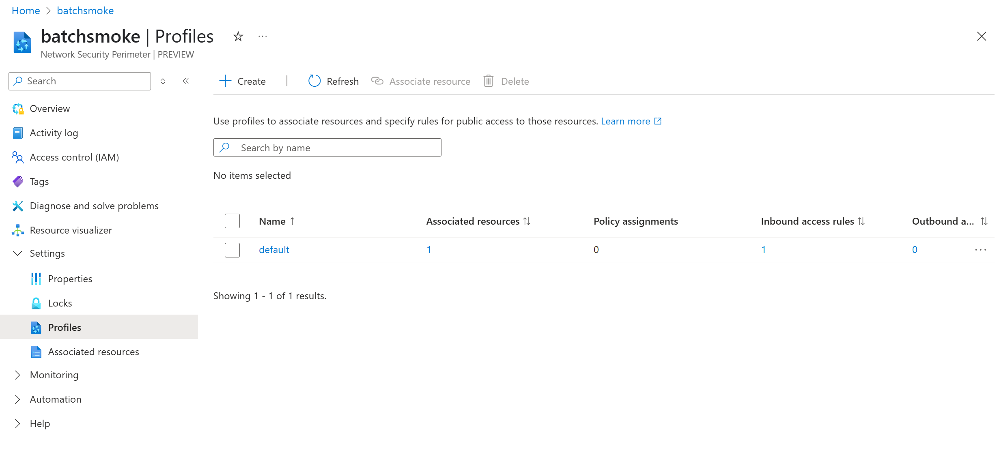
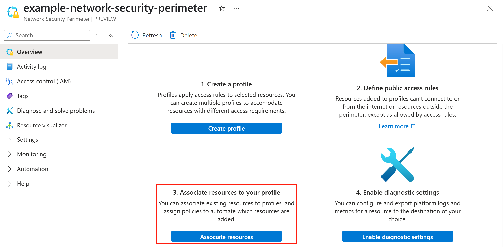
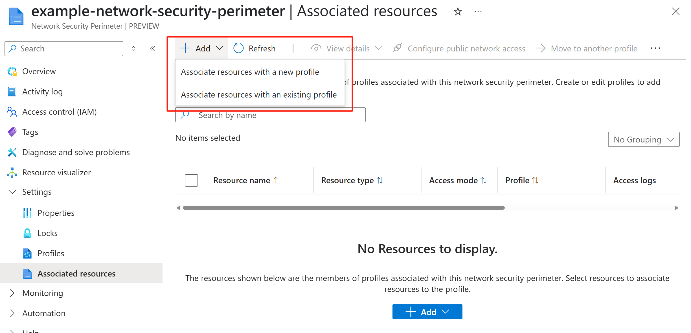

# Associate Azure Batch accounts with network security perimeter

The [network security perimeter (NSP)](../private-link/network-security-perimeter-concepts.md) provided by Azure networking serves as a comprehensive tool for customers to ensure optimal security when utilizing PaaS resources. It allows customers to establish logical boundaries for network isolation and collectively manage public access controls for numerous PaaS resources.

With a network security perimeter:
  - PaaS resources associated with a specific perimeter are, by default, only able to communicate with other PaaS resources within the same perimeter.
  - Explicit access rules can actively permit external inbound and outbound communication.
  - [Diagnostic Logs](../private-link/network-security-perimeter-diagnostic-logs.md) are enabled for PaaS resources within perimeter for Audit and Compliance.

> [!IMPORTANT]
> Network security perimeter rules do not govern the private link with the [private endpoint](../private-link/private-endpoint-overview.md).

## Network security perimeter scenarios in Batch service

Azure Batch service is designed to support various scenarios that necessitate access to other PaaS resources:

  - Application packages require communication with Azure Storage. For more information, see [batch-application-packages](./batch-application-packages.md).
  - Customer managed key requires communication with Azure KeyVault. For more information, see [batch-customer-managed-key](./batch-customer-managed-key.md).

Network administrators can use the network security perimeter feature to create an isolation boundary for their PaaS services. This security perimeter permits the setting up of public access controls for various PaaS resources, providing a consistent user experience and a uniform API. Setting up network security perimeter for PaaS communications supported by Batch, refer to the [Network security perimeter in Azure Storage](/azure/storage/common/storage-network-security#network-secuirty-perimeter-preview) and [Network security perimeter in Azure Key Vault](/azure/key-vault/general/network-security#network-security-perimeter-preview) for more details. 

Network security perimeter provides several methods to enable Batch to interact with other PaaS services if the target PaaS service is in network security perimeter:
  - Associate the Batch account with the same perimeter as the target resource and assign the necessary permissions to the Managed Identity used across these resources.
  - Create the profile with appropriate inbound access rules (for example, creating an inbound access rule for the Batch account's fully qualified domain name) and apply it to the target PaaS resource. This profile is used to evaluate inbound traffic (sent from Batch) from outside the perimeter traffic.

Batch users can also use the network security perimeter to secure inbound traffic, not just the outbound traffic scenarios with Azure Storage and Azure Key Vault.

> [!NOTE]
> Network security perimeters do not regulate nodes within Batch pools. To ensure network isolation for the pool, you may still need to create a **nodeManagement** private endpoint for [the Batch pool without public ip addresses](./simplified-node-communication-pool-no-public-ip.md).
> To enable a node to access Azure Storage and other PaaS resources associated with a network security perimeter, ensure that relevant access rules are added to the target PaaS resource's profile. These access rules grant the node the necessary permissions to visit.

## Configure network security perimeter for Azure Batch account

### Prerequisite

1. Set up your Batch account by using a user-assigned managed identity.
2. It's optional but recommended to change the public network access of your Batch account to `SecuredByPerimeter`.

    This public network access value guarantees that the resource's inbound and outbound connectivity is restricted to resources within the same perimeter. The associated perimeter profile sets the rules that control public access.
    
    This Batch account modification can be made using the [Batch management Account API](/rest/api/batchmanagement/batch-account/update?#publicnetworkaccesstype) or [SDK BatchPublicNetworkAccess Enum value](/dotnet/api/azure.resourcemanager.batch.models.batchpublicnetworkaccess).

3. Make sure your Batch account operates only with the simplified node communication pool.

### Create a network security perimeter

Create your own network security perimeter resource using [Azure portal](../private-link/create-network-security-perimeter-portal.md) or [PowerShell](../private-link/create-network-security-perimeter-powershell.md) or [Azure CLI](../private-link/create-network-security-perimeter-cli.md).

### Associate Batch account with the network security perimeter

#### Using Azure portal
1. Navigate to your network security perimeter resource in the Azure portal, where you should establish a profile for your Batch account to associate with. If you do not create the profile, go to **Settings** -> **Profiles** to create a network security perimeter profile initially.



2. In **Overview**, select the third option **Associate resources to your profile**



3. Associate resources with a new profile or associate resources with an existing profile



#### Using PowerShell
1. Create a new profile for your network security perimeter

    ```azurepowershell-interactive
        # Create a new profile 
        $nspProfile = @{
            Name = '<ProfileName>' 
            ResourceGroupName = '<ResourceGroupName>'
            SecurityPerimeterName = '<NetworkSecurityPerimeterName>'
            }
        
        $profile = New-AzNetworkSecurityPerimeterProfile @nspProfile
    ```

2. Associate the Batch account with the network security perimeter profile

     ```azurepowershell-interactive
        # Associate the PaaS resource with the above created profile
        $nspAssociation = @{
            AssociationName = '<AssociationName>'
            ResourceGroupName = '<ResourceGroupName>'
            SecurityPerimeterName = '<NetworkSecurityPerimeterName>'
            AccessMode = 'Learning'
            ProfileId = '<NetworkSecurityPerimeterProfileId>'
            PrivateLinkResourceId = '<BatchAccountResourceId>'
            }
    
        New-AzNetworkSecurityPerimeterAssociation @nspAssociation | format-list
    ```

#### Using Azure CLI

1. Create a new profile for your network security perimeter with the following command:

    ```azurecli-interactive
    # Create a new profile
    az network perimeter profile create \
        --name <ProfileName> \
        --resource-group <ResourceGroupName> \
        --perimeter-name <NetworkSecurityPerimeterName>

    ```

2. Associate the Batch account (PaaS resource) with the network security perimeter profile with the following commands. 

    ```azurecli-interactive        
    # Get the profile id
    az network perimeter profile show \
        --name <ProfileName> \
        --resource-group <ResourceGroupName> \
        --perimeter-name <NetworkSecurityPerimeterName>
    
    # Associate the Batch account with the network security perimeter profile
    # Replace <PaaSArmId> and <NetworkSecurityPerimeterProfileId> with the values for your Batch account resource id and profile
    az network perimeter association create \
        --name <NetworkSecurityPerimeterAssociationName> \
        --perimeter-name <NetworkSecurityPerimeterName> \
        --resource-group <ResourceGroupName> \
        --access-mode Learning  \
        --private-link-resource "{id:<PaaSArmId>}" \
        --profile "{id:<NetworkSecurityPerimeterProfileId>}"
        
    ```

## Next steps

- Learn more about [Security Best Practices in Azure Batch](security-best-practices.md).
- Learn more about [Network Security Perimeter Concepts](../private-link/network-security-perimeter-concepts.md).
- Learn more about [Network Security Perimeter Diagnostic Logs](../private-link/network-security-perimeter-diagnostic-logs.md).
- Learn more about [Network Security Perimeter Role Based Access Control](../private-link/network-security-perimeter-role-based-access-control-requirements.md).
- Learn more about [Network Security Perimeter Transition](../private-link/network-security-perimeter-transition.md).