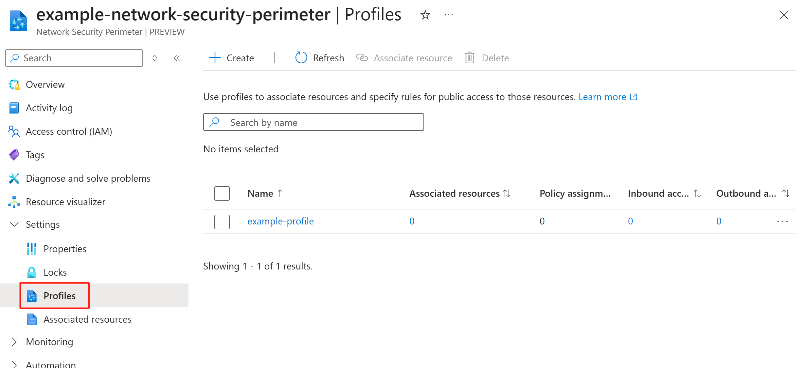

# Network Security Perimeter

The [network security perimeter (NSP)](/azure/private-link/network-security-perimeter-concepts.md) provided by Azure networking serves as a comprehensive tool for customers to ensure optimal security when utilizing PaaS resources. It allows customers to establish logical boundaries for network isolation and collectively manage public access controls for numerous PaaS resources.

With a network security perimeter:
  - PaaS resources associated with a specific perimeter are, by default, only able to communicate with other PaaS resources within the same perimeter.
  - External inboound and outbound communication can be allowed by explicit access rules.
  - [Diagnostic Logs](/azure/private-link/network-security-perimeter-diagnostic-logs.md) are enabled for PaaS resources within perimeter for Audit and Compliance.

> [!IMPORTANT]
> Network security perimeter rules will not govern the private link with the [private endpoint](/azure/private-link/private-endpoint-overview.md).

## Network Security Perimeter Scenarios in Batch service

Azure Batch service is designed to support various scenarios that necessitate access to other PaaS resources:

  - **Application packages**: This requires communication with Azure Storage. For more details refer to [batch-application-packages](./batch-application-packages.md).
  - **Customer-managed Keys**: This requires communication with Azure KeyVault. For more details refer to [batch-customer-managed-key](./batch-customer-managed-key.md).

Using network security perimeter, network administrators can create a network isolation boundary for their PaaS services. This security perimeter permits the setting up of public access controls for various PaaS resources, providing a consistent user experience and a uniform API. Regarding the PaaS communications supported by Batch, Azure Storage and Azure KeyVault have incorporated network security perimeters. For more information, please refer to the [Network security perimeter in Azure Storage](/azure/storage/common/storage-network-security?tabs=azure-portal#network-security-perimeter-preview) and [Network security perimeter in Azure Key Vault](/azure/key-vault/general/network-security#network-security-perimeter-preview).

Network security perimeter provides several methods to enable Batch to interact with other PaaS services if the target PaaS service is in network security perimeter:
  - Associate the Batch account with the same perimeter as the target resource and assign the necessary permissions to the Managed Identity used across these resources.
  - Create the profile with appropriate inbound access rules (for example, creating an inbound access rule for the Batch account's fully qualified domain name) and apply it to the target PaaS resource. This profile is used to evaluate inbound traffic (sent from Batch) from outside the perimeter traffic.

Note that Batch users can also use the network security perimeter to secure inbound traffic, not just the outbound traffic scenarios with Azure Storage and Azure Key Vault.

> [!NOTE]
> Network security perimeters do not regulate nodes within Batch pools. To ensure network isolation for the pool, you may still need to create a **nodeManagement** private endpoint for [the Batch pool without public ip addresses](./simplified-node-communication-pool-no-public-ip.md).
> To enable a node to access Azure Storage and other PaaS resources associated with a network security perimeter, ensure that relevant access rules are added to the target PaaS resource's profile. These access rules grant the node the necessary permissions to visit.

## Configure Network Security Perimeter for Azure Batch account

### Prerequisite

1. Set up your Batch account by using a user-assigned managed identity.
2. It's optional but recommended to change the public network access of your Batch account to `SecuredByPerimeter`.

    This guarantees that both inbound and outbound connectivity of the resource is restricted to those resources within the same perimeter, and the related perimeter profile determines the access rules that govern public access.
    
    This Batch account modification can be made using the [Batch management Account API](/rest/api/batchmanagement/batch-account/update?#publicnetworkaccesstype) or [SDK BatchPublicNetworkAccess Enum value](/dotnet/api/azure.resourcemanager.batch.models.batchpublicnetworkaccess).

3. Make sure your Batch account operates only with the simplified node communication pool.

### Create a Network Security Perimeter

Create your own network security perimeter resource using [Azure portal](/azure/private-link/create-network-security-perimeter-portal.md) or [PowerShell](/azure/private-link/create-network-security-perimeter-powershell.md) or [Azure CLI](/azure/private-link/create-network-security-perimeter-cli.md).

### Associate Batch account with the Network Security Perimeter

#### Using Azure portal
1. Navigate to your network security perimeter resource in the Azure portal, where you should establish a profile for your Batch account to associate with. If you have not created the profile, go to **Settings** -> **Profiles** to create a network security perimeter profile initially.



2. In **Overview**, select the third option **Associate resources to your profile**


3. Associate resources with a new profile or associate resources with an existing profile


#### Using PowerShell
1. Create a new profile for your network security perimeter

    ```azurepowershell-interactive
        # Create a new profile
        
        $nspProfile = @{ 
            Name = 'nsp-profile' 
            ResourceGroupName = $rgParams.name 
            SecurityPerimeterName = $nsp.name 
            }
        
        $profile = New-AzNetworkSecurityPerimeterProfile @nspProfile
    ```

2. Associate the Batch account with the network security perimeter profile

     ```azurepowershell-interactive
        # Associate the PaaS resource with the above created profile
        
        $nspAssociation = @{ 
            AssociationName = 'nsp-association' 
            ResourceGroupName = $rgParams.name 
            SecurityPerimeterName = $nsp.name 
            AccessMode = 'Learning'  
            ProfileId = $Profile.Id 
            PrivateLinkResourceId = $batchAccount.ResourceID
            }
    
        New-AzNetworkSecurityPerimeterAssociation @nspAssociation | format-list
    ```

#### Using Azure CLI

1. Create a new profile for your network security perimeter with the following command:

    ```azurecli-interactive
    # Create a new profile
    az network perimeter profile create \
        --name network-perimeter-profile \
        --resource-group resource-group \
        --perimeter-name network-security-perimeter

    ```

2. Associate the Batch account (PaaS resource) with the network security perimeter profile with the following commands. 

    ```azurecli-interactive
    
    # Get key vault id
    az keyvault show \
        --name $key_vault_name \
        --resource-group resource-group \
        --query 'id'
        
    # Get the profile id
    az network perimeter profile show \
        --name network-perimeter-profile \
        --resource-group resource-group \
        --perimeter-name network-security-perimeter
    
    # Associate the Azure Key Vault with the network security perimeter profile
    # Replace <PaaSArmId> and <networkSecurityPerimeterProfileId> with the ID values for your Batch account and profile
    az network perimeter association create \
        --name network-perimeter-association \
        --perimeter-name network-security-perimeter \
        --resource-group resource-group \
        --access-mode Learning  \
        --private-link-resource "{id:<PaaSArmId>}" \
        --profile "{id:<networkSecurityPerimeterProfileId>}"
        
    ```

## Next steps

- Learn more about [Security Best Practices in Azure Batch](security-best-practices.md).
- Learn more about [Network Security Perimeter Concepts](/azure/private-link/network-security-perimeter-concepts.md).
- Learn more about [Network Security Perimeter Diagnostic Logs](/azure/private-link/network-security-perimeter-diagnostic-logs.md).
- Learn more about [Network Security Perimeter Role Based Access Control](/azure/private-link/network-security-perimeter-role-based-access-control-requirements.md).
- Learn more about [Network Security Perimeter Transition](/azure/private-link/network-security-perimeter-transition.md).