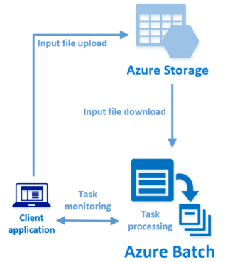

# Quickstart: Run your first Azure Batch job with the .NET API

Get started with Azure Batch by running a job from a C# application built on the Azure Batch .NET API. The app uploads several input data files to Azure storage and then creates a pool of Batch compute nodes (virtual machines). Then, it creates a sample job that runs tasks to process each input file on the pool using a basic command.

After completing this quickstart, you will understand the key concepts of the Batch service and be ready to try Batch with more realistic workloads at larger scale.



## Prerequisites

- An Azure account with an active subscription. [Create an account for free](https://azure.microsoft.com/free/?WT.mc_id=A261C142F).

- A Batch account and a linked Azure Storage account. To create these accounts, see the Batch quickstarts using the [Azure portal](quick-create-portal.md) or [Azure CLI](quick-create-cli.md).

- [Visual Studio 2017 or later](https://www.visualstudio.com/vs), or [.NET Core 2.1 SDK](https://dotnet.microsoft.com/download/dotnet/2.1) for Linux, macOS, or Windows. 

## Sign in to Azure

Sign in to the Azure portal at [https://portal.azure.com](https://portal.azure.com).

[!INCLUDE [batch-common-credentials](../../includes/batch-common-credentials.md)]

## Download the sample

[Download or clone the sample app](https://github.com/Azure-Samples/batch-dotnet-quickstart) from GitHub. To clone the sample app repo with a Git client, use the following command:

```
git clone https://github.com/Azure-Samples/batch-dotnet-quickstart.git
```

Navigate to the directory that contains the Visual Studio solution file `BatchDotNetQuickstart.sln`.

Open the solution file in Visual Studio, and update the credential strings in `Program.cs` with the values you obtained for your accounts. For example:

```csharp
// Batch account credentials
private const string BatchAccountName = "mybatchaccount";
private const string BatchAccountKey  = "xxxxxxxxxxxxxxxxE+yXrRvJAqT9BlXwwo1CwF+SwAYOxxxxxxxxxxxxxxxx43pXi/gdiATkvbpLRl3x14pcEQ==";
private const string BatchAccountUrl  = "https://mybatchaccount.mybatchregion.batch.azure.com";

// Storage account credentials
private const string StorageAccountName = "mystorageaccount";
private const string StorageAccountKey  = "xxxxxxxxxxxxxxxxy4/xxxxxxxxxxxxxxxxfwpbIC5aAWA8wDu+AFXZB827Mt9lybZB1nUcQbQiUrkPtilK5BQ==";
```

[!INCLUDE [batch-credentials-include](../../includes/batch-credentials-include.md)]

## Build and run the app

To see the Batch workflow in action, build and run the application in Visual Studio, or at the command line with the `dotnet build` and `dotnet run` commands. After running the application, review the code to learn what each part of the application does. For example, in Visual Studio:

- Right-click the solution in Solution Explorer, and click **Build Solution**. 

- Confirm the restoration of any NuGet packages, if you're prompted. If you need to download missing packages, ensure the [NuGet Package Manager](https://docs.nuget.org/consume/installing-nuget) is installed.

When you run the sample application, the console output is similar to the following. During execution, you experience a pause at `Monitoring all tasks for 'Completed' state, timeout in 00:30:00...` while the pool's compute nodes are started. Tasks are queued to run as soon as the first compute node is running. Go to your Batch account in the [Azure portal](https://portal.azure.com) to monitor the pool, compute nodes, job, and tasks.

```
Sample start: 11/16/2018 4:02:54 PM

Container [input] created.
Uploading file taskdata0.txt to container [input]...
Uploading file taskdata1.txt to container [input]...
Uploading file taskdata2.txt to container [input]...
Creating pool [DotNetQuickstartPool]...
Creating job [DotNetQuickstartJob]...
Adding 3 tasks to job [DotNetQuickstartJob]...
Monitoring all tasks for 'Completed' state, timeout in 00:30:00...
```

After tasks complete, you see output similar to the following for each task:

```
Printing task output.
Task: Task0
Node: tvm-2850684224_3-20171205t000401z
Standard out:
Batch processing began with mainframe computers and punch cards. Today it still plays a central role in business, engineering, science, and other pursuits that require running lots of automated tasks....
stderr:
...
```

Typical execution time is approximately 5 minutes when you run the application in its default configuration. Initial pool setup takes the most time. To run the job again, delete the job from the previous run and do not delete the pool. On a preconfigured pool, the job completes in a few seconds.

## Review the code

The .NET app in this quickstart does the following:

- Uploads three small text files to a blob container in your Azure storage account. These files are inputs for processing by Batch.
- Creates a pool of compute nodes running Windows Server.
- Creates a job and three tasks to run on the nodes. Each task processes one of the input files using a Windows command line. 
- Displays files returned by the tasks.

See the file `Program.cs` and the following sections for details.

### Preliminaries

To interact with a storage account, the app uses the Azure Storage Client Library for .NET. It creates a reference to the account with [CloudStorageAccount](/dotnet/api/microsoft.azure.storage.cloudstorageaccount), and from that creates a [CloudBlobClient](/dotnet/api/microsoft.azure.storage.blob.cloudblobclient).

```csharp
CloudBlobClient blobClient = storageAccount.CreateCloudBlobClient();
```

The app uses the `blobClient` reference to create a container in the storage account and to upload data files to the container. The files in storage are defined as Batch [ResourceFile](/dotnet/api/microsoft.azure.batch.resourcefile) objects that Batch can later download to compute nodes.

```csharp
List<string> inputFilePaths = new List<string>
{
    "taskdata0.txt",
    "taskdata1.txt",
    "taskdata2.txt"
};

List<ResourceFile> inputFiles = new List<ResourceFile>();

foreach (string filePath in inputFilePaths)
{
    inputFiles.Add(UploadFileToContainer(blobClient, inputContainerName, filePath));
}
```

The app creates a [BatchClient](/dotnet/api/microsoft.azure.batch.batchclient) object to create and manage pools, jobs, and tasks in the Batch service. The Batch client in the sample uses shared key authentication. (Batch also supports Azure Active Directory authentication.)

```csharp
BatchSharedKeyCredentials cred = new BatchSharedKeyCredentials(BatchAccountUrl, BatchAccountName, BatchAccountKey);

using (BatchClient batchClient = BatchClient.Open(cred))
...
```

### Create a pool of compute nodes

To create a Batch pool, the app uses the [BatchClient.PoolOperations.CreatePool](/dotnet/api/microsoft.azure.batch.pooloperations.createpool) method to set the number of nodes, VM size, and a pool configuration. Here, a [VirtualMachineConfiguration](/dotnet/api/microsoft.azure.batch.virtualmachineconfiguration) object specifies an [ImageReference](/dotnet/api/microsoft.azure.batch.imagereference) to a Windows Server image published in the Azure Marketplace. Batch supports a wide range of Linux and Windows Server images in the Azure Marketplace, as well as custom VM images.

The number of nodes (`PoolNodeCount`) and VM size (`PoolVMSize`) are defined constants. The sample by default creates a pool of 2 size *Standard_A1_v2* nodes. The size suggested offers a good balance of performance versus cost for this quick example.

The [Commit](/dotnet/api/microsoft.azure.batch.cloudpool.commit) method submits the pool to the Batch service.

```csharp

private static VirtualMachineConfiguration CreateVirtualMachineConfiguration(ImageReference imageReference)
{
    return new VirtualMachineConfiguration(
        imageReference: imageReference,
        nodeAgentSkuId: "batch.node.windows amd64");
}

private static ImageReference CreateImageReference()
{
    return new ImageReference(
        publisher: "MicrosoftWindowsServer",
        offer: "WindowsServer",
        sku: "2016-datacenter-smalldisk",
        version: "latest");
}

private static void CreateBatchPool(BatchClient batchClient, VirtualMachineConfiguration vmConfiguration)
{
    try
    {
        CloudPool pool = batchClient.PoolOperations.CreatePool(
            poolId: PoolId,
            targetDedicatedComputeNodes: PoolNodeCount,
            virtualMachineSize: PoolVMSize,
            virtualMachineConfiguration: vmConfiguration);

        pool.Commit();
    }
...

```

### Create a Batch job

A Batch job is a logical grouping of one or more tasks. A job includes settings common to the tasks, such as priority and the pool to run tasks on. The app uses the [BatchClient.JobOperations.CreateJob](/dotnet/api/microsoft.azure.batch.joboperations.createjob) method to create a job on your pool.

The [Commit](/dotnet/api/microsoft.azure.batch.cloudjob.commit) method submits the job to the Batch service. Initially the job has no tasks.

```csharp
try
{
    CloudJob job = batchClient.JobOperations.CreateJob();
    job.Id = JobId;
    job.PoolInformation = new PoolInformation { PoolId = PoolId };

    job.Commit();
}
...
```

### Create tasks

The app creates a list of [CloudTask](/dotnet/api/microsoft.azure.batch.cloudtask) objects. Each task processes an input `ResourceFile` object using a [CommandLine](/dotnet/api/microsoft.azure.batch.cloudtask.commandline) property. In the sample, the command line runs the Windows `type` command to display the input file. This command is a simple example for demonstration purposes. When you use Batch, the command line is where you specify your app or script. Batch provides a number of ways to deploy apps and scripts to compute nodes.

Then, the app adds tasks to the job with the [AddTask](/dotnet/api/microsoft.azure.batch.joboperations.addtask) method, which queues them to run on the compute nodes.

```csharp
for (int i = 0; i < inputFiles.Count; i++)
{
    string taskId = String.Format("Task{0}", i);
    string inputFilename = inputFiles[i].FilePath;
    string taskCommandLine = String.Format("cmd /c type {0}", inputFilename);

    CloudTask task = new CloudTask(taskId, taskCommandLine);
    task.ResourceFiles = new List<ResourceFile> { inputFiles[i] };
    tasks.Add(task);
}

batchClient.JobOperations.AddTask(JobId, tasks);
```

### View task output

The app creates a [TaskStateMonitor](/dotnet/api/microsoft.azure.batch.taskstatemonitor) to monitor the tasks to make sure they complete. Then, the app uses the [CloudTask.ComputeNodeInformation](/dotnet/api/microsoft.azure.batch.cloudtask.computenodeinformation) property to display the `stdout.txt` file generated by each completed task. When the task runs successfully, the output of the task command is written to `stdout.txt`:

```csharp
foreach (CloudTask task in completedtasks)
{
    string nodeId = String.Format(task.ComputeNodeInformation.ComputeNodeId);
    Console.WriteLine("Task: {0}", task.Id);
    Console.WriteLine("Node: {0}", nodeId);
    Console.WriteLine("Standard out:");
    Console.WriteLine(task.GetNodeFile(Constants.StandardOutFileName).ReadAsString());
}
```

## Clean up resources

The app automatically deletes the storage container it creates, and gives you the option to delete the Batch pool and job. You are charged for the pool while the nodes are running, even if no jobs are scheduled. When you no longer need the pool, delete it. When you delete the pool, all task output on the nodes is deleted.

When no longer needed, delete the resource group, Batch account, and storage account. To do so in the Azure portal, select the resource group for the Batch account and click **Delete resource group**.

## Next steps

In this quickstart, you ran a small app built using the Batch .NET API to create a Batch pool and a Batch job. The job ran sample tasks, and downloaded output created on the nodes. Now that you understand the key concepts of the Batch service, you are ready to try Batch with more realistic workloads at larger scale. To learn more about Azure Batch, and walk through a parallel workload with a real-world application, continue to the Batch .NET tutorial.

> [!div class="nextstepaction"]
> [Process a parallel workload with .NET](tutorial-parallel-dotnet.md)
