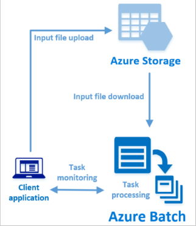

# Run your first Batch job using the Python API

This quickstart runs an Azure Batch job from an application built on the Azure Batch Python API. The app uploads some input data files to Azure storage and creates a *pool* of Batch compute nodes (virtual machines). Then, it creates a sample *job* that runs *tasks* to process each input file on the pool.
 
Each sample task displays the contents of the file downloaded to the compute node. This example is basic but introduces key concepts of the Batch service.



If you don't have an Azure subscription, create a [free account](https://azure.microsoft.com/free/?WT.mc_id=A261C142F) before you begin.

## Prerequisites

* [Python version 2.7 or 3.3 or later](https://www.python.org/downloads/)
* An Azure Batch account and an Azure Storage account. To create these accounts, see the Batch quickstarts using the [Azure portal](quick-create-portal.md) or [Azure CLI](quick-create-cli.md). 

## Download the sample

[Download or clone the sample application](https://github.com/dlepow/batchmvc) from GitHub. 

Change to the directory that contains the sample code:

```bash
cd quickstart_python
```

Install the required packages using `pip`.

```bash
pip install azure.batch
pip install azure.storage
```

[!INCLUDE [batch-common-credentials](../../includes/batch-common-credentials.md)]


Open the file `python_quickstart_client.py` in a text editor. Update the Batch and storage account credential strings with the values unique to your accounts.


```Python
_BATCH_ACCOUNT_NAME = 'mybatchaccount'
_BATCH_ACCOUNT_KEY = 'xxxxxxxxxxxxxxxxE+yXrRvJAqT9BlXwwo1CwF+SwAYOxxxxxxxxxxxxxxxx43pXi/gdiATkvbpLRl3x14pcEQ=='
_BATCH_ACCOUNT_URL = 'https://mybatchaccount.westeurope.batch.azure.com'
_STORAGE_ACCOUNT_NAME = 'mystorageaccount'
_STORAGE_ACCOUNT_KEY = 'xxxxxxxxxxxxxxxxy4/xxxxxxxxxxxxxxxxfwpbIC5aAWA8wDu+AFXZB827Mt9lybZB1nUcQbQiUrkPtilK5BQ=='
```

## Run the app

To see the Batch workflow in action, run the application. After running the application, go to the walkthrough to learn what each part of the application does. 


When you run the sample application, the console output is similar to the following. During execution, you experience a pause at `Monitoring all tasks for 'Completed' state, timeout in 00:30:00...` while the pool's compute nodes are started. Tasks are queued to run as soon as the first compute node is running. Go to your Batch account in the [Azure portal](https://portal.azure.com) to monitor the pool, compute nodes, job, and tasks in your Batch account.

```
Sample start: 12/4/2017 4:02:54 PM

Container [input] created.
Uploading file taskdata0.txt to container [input]...
Uploading file taskdata1.txt to container [input]...
Uploading file taskdata2.txt to container [input]...
Creating pool [PythonQuickstartPool]...
Creating job [PythonQuickstartJob]...
Adding 3 tasks to job [PythonQuickstartJob]...
Monitoring all tasks for 'Completed' state, timeout in 00:30:00...
```

After tasks complete, you see output similar to the following for each task:

```
Printing task output...
Task: Task0
Node: tvm-2850684224_3-20171205t000401z
Standard out:
Processing file taskdata0.txt in task Task0:
Batch processing began with mainframe computers and punch cards. Today it still plays a central role in business, engineering, science, and other pursuits that require running lots of automated tasks....
...
```

Typical execution time is approximately 3 minutes when you run the application in its default configuration. Initial pool setup takes the most time.

## Walkthrough

The Python app in this quickstart does the following:

* Uploads three small text files to a blob container in your Azure storage account. These files are inputs for processing by Batch tasks.
* Creates a pool of two compute nodes running Ubuntu 16.04 LTS.
* Creates a job and three tasks to run on the nodes. Each task processes one of the input files using a bash shell command line.
* Displays files returned by each task.

See the file `python_quickstart_client.py` and the following sections for details. 

### Preliminaries

* To interact with a storage account, the app uses the [azure-storage](https://pypi.python.org/pypi/azure-storage) package to create a [BlockBlobService](/python/api/azure.storage.blob.blockblobservice.blockblobservice) object.

  ```python
  blob_client = azureblob.BlockBlobService(
      account_name=STORAGE_ACCOUNT_NAME,
      account_key=STORAGE_ACCOUNT_KEY)
  ```

* The app uses the `blob_client` reference to create a container in the storage account and to upload data files to the container. The files in storage are defined as Batch [ResourceFile](/python/api/azure.batch.models.resourcefile) objects that Batch can later download to compute nodes.

  ```python
  input_file_paths = [os.path.realpath('./data/taskdata0.txt'),
                      os.path.realpath('./data/taskdata1.txt'),
                      os.path.realpath('./data/taskdata2.txt')]
  input_files = [
    upload_file_to_container(blob_client, input_container_name, file_path)
    for file_path in input_file_paths]
  ```
* The app creates a [BatchServiceClient](/python/api/azure.batch.batchserviceclient) object to create and manage pools, jobs, and tasks in the Batch service. The Batch client in the sample uses shared key authentication. Batch also supports Azure Active Directory authentication.

  ```python
  credentials = batchauth.SharedKeyCredentials(_BATCH_ACCOUNT_NAME,
     _BATCH_ACCOUNT_KEY)

  batch_client = batch.BatchServiceClient(
        credentials,
        base_url=_BATCH_ACCOUNT_URL)
  ```


### Create a Batch pool

To create a Batch pool, the app uses the [PoolAddParameter](/python/api/azure.batch.models.pooladdparameter) method to set the number of nodes, VM size, and a pool configuration. Here, a [VirtualMachineConfiguration](/python/api/azure.batch.models.virtualmachineconfiguration) object specifies an [ImageReference](/python/api/azure.batch.models.imagereference) to an Ubuntu Server 16.04 LTS image published in the Azure Marketplace. Batch supports a wide range of Linux and Windows Server images in the Azure Marketplace, as well as custom VM images.

The number of nodes (`_POOL_NODE_COUNT`) and VM size (`_POOL_VM_SIZE`) are defined constants. The sample by default creates a pool of 2 size *Standard_A1_v2* nodes. The size suggested offers a good balance of performance versus cost for this quick example.

The [pool.add](/python/api/azure.batch.operations.pooloperations#azure_batch_operations_PoolOperations_add) method submits the pool to the Batch service.

```python
new_pool = batch.models.PoolAddParameter(
    id=pool_id,
    virtual_machine_configuration=batchmodels.VirtualMachineConfiguration(
        image_reference=batchmodels.ImageReference(
            publisher="Canonical",
             offer="UbuntuServer",
             sku="16.04.0-LTS",
             version="latest"
            ),
    node_agent_sku_id="batch.node.ubuntu 16.04"),
    vm_size=_POOL_VM_SIZE,
    target_dedicated_nodes=_POOL_NODE_COUNT
)
    try:
        batch_service_client.pool.add(new_pool)
    except batchmodels.batch_error.BatchErrorException as err:
        print_batch_exception(err)
        raise
```
### Create a Batch job

A Batch job specifies a pool to run tasks on and optional settings such as a priority and schedule for the work. The app uses the [JobAddParameter](/python/api/azure.batch.models.jobaddparameter) method to create a job on your pool. The [job.add](/python/api/azure.batch.operations.joboperations#azure_batch_operations_JobOperations_add) method submits the pool to the Batch service. Initially the job has no tasks.

```python
job = batch.models.JobAddParameter(
    job_id,
    batch.models.PoolInformation(pool_id=pool_id))

try:
    batch_service_client.job.add(job)
except batchmodels.batch_error.BatchErrorException as err:
    print_batch_exception(err)
    raise
```

### Create tasks

The app creates a list of task objects using the [TaskAddParameter](/python/api/azure.batch.models.taskaddparameter) method. Each task processes an input `resource_files` object using a `command_line` parameter. In the sample, the `command_line` runs the bash shell `cat` command to display the text file. This is a simple example for demonstration purposes. When you use Batch, the command line is where you specify your app or script. Batch provides a number of ways to deploy apps and scripts to compute nodes.

Then, the app adds tasks to the job with the [task.add_collection](/python/api/azure.batch.operations.taskoperations#azure_batch_operations_TaskOperations_add_collection) method, which queues them to run on the compute nodes. 

```python
tasks = list()

for idx, input_file in enumerate(input_files): 
    command = "/bin/bash -c \"cat {}\"".format(input_file.file_path)
    tasks.append(batch.models.TaskAddParameter(
            id='Task{}'.format(idx),
            command_line=command,
            resource_files=[input_file]
            )
     )
batch_service_client.task.add_collection(job_id, tasks)
```

### View task output

The app monitors task state to make sure the tasks complete. Then, the app displays the `stdout.txt` file generated by each completed task. When the task runs successfully, the output of the task command is written to `stdout.txt`:

```python

tasks = batch_service_client.task.list(job_id)

tasks = batch_service_client.task.list(job_id)

task_ids = [task.id for task in tasks]

for task_id in task_ids:
    
    node_id = batch_service_client.task.get(job_id, task_id).node_info.node_id
    print("Task: {}".format(task_id))
    print("Node: {}".format(node_id))

    stream = batch_service_client.file.get_from_task(job_id, task_id, _STANDARD_OUT_FILE_NAME)

    file_text = _read_stream_as_string(
        stream,
        encoding)
    print("Standard output:")
    print(file_text)
```

## Clean up resources

The app automatically deletes the storage container it creates, and gives you the option to delete the Batch pool and job. When you delete the pool, all task output on the nodes is deleted. When you delete the pool, all task output on the nodes is deleted.

When no longer needed, delete the resource group, Batch account, and storage account. To do so in the Azure portal, select the resource group for the Batch account and click **Delete**.

## Next steps

In this quickstart, you ran a basic Azure Batch job to demonstrate key concepts of the Batch service. To learn more about Azure Batch, and walk through a parallel file processing example with ffmpeg, continue to the Batch Python tutorial.


> [!div class="nextstepaction"]
> [Process files in parallel](tutorial-parallel-python.md)
