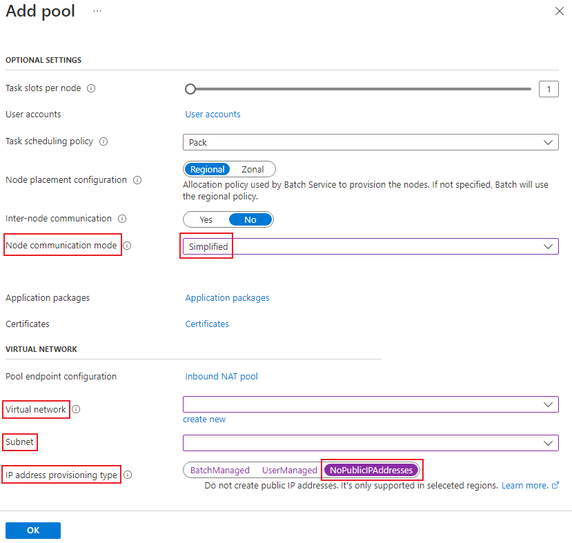

# Create a simplified node communication pool without public IP addresses

> [!NOTE]
> This replaces the previous preview version of [Azure Batch pool without public IP addresses](batch-pool-no-public-ip-address.md). This new version requires [using simplified compute node communication](simplified-compute-node-communication.md).

> [!IMPORTANT]
> Support for pools without public IP addresses in Azure Batch is currently available for [select regions](simplified-compute-node-communication.md#supported-regions).

When you create an Azure Batch pool, you can provision the virtual machine (VM) configuration pool without a public IP address. This article explains how to set up a Batch pool without public IP addresses.

## Why use a pool without public IP addresses?

By default, all the compute nodes in an Azure Batch VM configuration pool are assigned a public IP address. This address is used by the Batch service to support outbound access to the internet, as well inbound access to compute nodes from the internet.

To restrict access to these nodes and reduce the discoverability of these nodes from the internet, you can provision the pool without public IP addresses.

## Prerequisites

> [!IMPORTANT]
> The prerequisites have changed from the previous preview version of this feature. Make sure to review each item for changes before proceeding.

- Use simplified compute node communication. For more information, see [Use simplified compute node communication](simplified-compute-node-communication.md).

- The Batch client API must use Microsoft Entra authentication. Azure Batch support for Microsoft Entra ID is documented in [Authenticate Batch service solutions with Active Directory](batch-aad-auth.md).

- Create your pool in an [Azure virtual network (VNet)](batch-virtual-network.md), follow these  requirements and configurations. To prepare a VNet with one or more subnets in advance, you can use the Azure portal, Azure PowerShell, the Azure Command-Line Interface (Azure CLI), or other methods.

  - The VNet must be in the same subscription and region as the Batch account you use to create your pool.

  - The subnet specified for the pool must have enough unassigned IP addresses to accommodate the number of VMs targeted for the pool; that is, the sum of the `targetDedicatedNodes` and `targetLowPriorityNodes` properties of the pool. If the subnet doesn't have enough unassigned IP addresses, the pool partially allocates the compute nodes, and a resize error occurs.

  - If you plan to use private endpoint, and your virtual network has [private endpoint network policy](../private-link/disable-private-endpoint-network-policy.md) enabled, make sure the inbound connection with TCP/443 to the subnet hosting the private endpoint must be allowed from Batch pool's subnet.

- Enable outbound access for Batch node management. A pool with no public IP addresses doesn't have internet outbound access enabled by default. Choose one of the following options to allow compute nodes to access the Batch node management service (see [Use simplified compute node communication](simplified-compute-node-communication.md)):

  - Use [**nodeManagement private endpoint**](private-connectivity.md) with Batch accounts, which provides private access to Batch node management service from the virtual network. This solution is the preferred method.

  - Alternatively, provide your own internet outbound access support (see [Outbound access to the internet](#outbound-access-to-the-internet)).

> [!IMPORTANT]
> There are two sub-resources for private endpoints with Batch accounts. Please use the **nodeManagement** private endpoint for the Batch pool without public IP addresses. For more details please check [Use private endpoints with Azure Batch accounts](private-connectivity.md).

## Current limitations

1. Pools without public IP addresses must use Virtual Machine Configuration and not Cloud Services Configuration.
1. [Custom endpoint configuration](pool-endpoint-configuration.md) for Batch compute nodes doesn't work with pools without public IP addresses.
1. Because there are no public IP addresses, you can't [use your own specified public IP addresses](create-pool-public-ip.md) with this type of pool.
1. The [task authentication token](/rest/api/batchservice/task/add?tabs=HTTP#request-body) for Batch task is not supported. The workaround is to use [Batch pool with managed identities](managed-identity-pools.md).

## Create a pool without public IP addresses in the Azure portal

1. If needed, create [**nodeManagement**](private-connectivity.md) private endpoint for your Batch account in the virtual network (see the outbound access requirement in [prerequisites](#prerequisites)).
1. Navigate to your Batch account in the Azure portal.
1. In the **Settings** window on the left, select **Pools**.
1. In the **Pools** window, select **Add**.
1. On the **Add Pool** window, select the option you intend to use from the **Image Type** dropdown.
1. Select the correct **Publisher/Offer/Sku** of your image.
1. Specify the remaining required settings, including the **Node size**, **Target dedicated nodes**, and **Target Spot/low-priority nodes**.
1. For **Node communication mode**, select **Simplified** under Optional Settings.
1. Select a virtual network and subnet you wish to use. This virtual network must be in the same location as the pool you're creating.
1. In **IP address provisioning type**, select **NoPublicIPAddresses**.

The following screenshot shows the elements that's required to be modified to create a pool without public
IP addresses.



## Use the Batch REST API to create a pool without public IP addresses

The following example shows how to use the [Batch Service REST API](/rest/api/batchservice/pool/add) to create a pool that uses public IP addresses.

### REST API URI

```http
POST {batchURL}/pools?api-version=2022-10-01.16.0
client-request-id: 00000000-0000-0000-0000-000000000000
```

### Request body

```json
"pool": {
     "id": "pool-npip",
     "vmSize": "standard_d2s_v3",
     "virtualMachineConfiguration": {
          "imageReference": {
               "publisher": "Canonical",
               "offer": "0001-com-ubuntu-server-jammy",
               "sku": "22_04-lts"
          },
          "nodeAgentSKUId": "batch.node.ubuntu 22.04"
     },
     "networkConfiguration": {
          "subnetId": "/subscriptions/<your_subscription_id>/resourceGroups/<your_resource_group>/providers/Microsoft.Network/virtualNetworks/<your_vnet_name>/subnets/<your_subnet_name>",
          "publicIPAddressConfiguration": {
               "provision": "NoPublicIPAddresses"
          }
     },
     "resizeTimeout": "PT15M",
     "targetDedicatedNodes": 2,
     "targetLowPriorityNodes": 0,
     "taskSlotsPerNode": 1,
     "taskSchedulingPolicy": {
          "nodeFillType": "spread"
     },
     "enableAutoScale": false,
     "enableInterNodeCommunication": false,
     "targetNodeCommunicationMode": "simplified"
}
```

## Create a pool without public IP addresses using ARM template

You can use this [Azure Quickstart Template](https://github.com/Azure/azure-quickstart-templates/tree/master/quickstarts/microsoft.batch/batch-pool-no-public-ip) to create a pool without public IP addresses using Azure Resource Manager (ARM) template.

Following resources will be deployed by the template:

- Azure Batch account with IP firewall configured to block public network access to Batch node management endpoint
- Virtual network with network security group to block internet outbound access
- Private endpoint to access Batch node management endpoint of the account
- DNS integration for the private endpoint using private DNS zone linked to the virtual network
- Batch pool deployed in the virtual network and without public IP addresses

If you're familiar with using ARM templates, select the **Deploy to Azure** button. The template will open in the Azure portal.

[](https://portal.azure.com/#create/Microsoft.Template/uri/https%3A%2F%2Fraw.githubusercontent.com%2FAzure%2Fazure-quickstart-templates%2Fmaster%2Fquickstarts%2Fmicrosoft.batch%2Fbatch-pool-no-public-ip%2Fazuredeploy.json)

> [!NOTE]
> If the private endpoint deployment failed due to invalid groupId "nodeManagement", please check if the region is in the supported list for [Simplified compute node communication](simplified-compute-node-communication.md). Choose the right region, and then retry the deployment.

## Outbound access to the internet

In a pool without public IP addresses, your virtual machines won't be able to access the public internet unless you configure your network setup appropriately, such as by using [virtual network NAT](../virtual-network/nat-gateway/nat-overview.md). NAT only allows outbound access to the internet from the virtual machines in the virtual network. Batch-created compute nodes won't be publicly accessible, since they don't have public IP addresses associated.

Another way to provide outbound connectivity is to use a user-defined route (UDR). This method lets you route traffic to a proxy machine that has public internet access, for example [Azure Firewall](../firewall/overview.md).

> [!IMPORTANT]
> There is no extra network resource (load balancer, network security group) created for simplified node communication pools without public IP addresses. Since the compute nodes in the pool are not bound to any load balancer, Azure may provide [Default Outbound Access](../virtual-network/ip-services/default-outbound-access.md). However, Default Outbound Access is not suitable for production workloads, so it is strongly recommended to bring your own Internet outbound access.

## Troubleshooting

### Unusable compute nodes in a Batch pool

If compute nodes run into unusable state in a Batch pool without public IP addresses, the first and most important check is to verify the outbound access to the Batch node management service. It must be configured correctly so that compute nodes are able to connect to service from your virtual network.

#### Using **nodeManagement** private endpoint

If you created node management private endpoint in the virtual network for your Batch account:

- Check if the private endpoint is created in the right virtual network, in provisioning **Succeeded** state, and also in **Approved** status.
- Check if the DNS configuration is set up correctly for the node management endpoint of your Batch account:
  - If your private endpoint is created with automatic private DNS zone integration, check the DNS A record is configured correctly in the private DNS zone `privatelink.batch.azure.com`, and the zone is linked to your virtual network.
  - If you're using your own DNS solution, make sure the DNS record for your Batch node management endpoint is configured correctly and point to the private endpoint IP address.
- Check the DNS resolution for [Batch node management endpoint](batch-account-create-portal.md#view-batch-account-properties) of your account. You can confirm it by running `nslookup <nodeManagementEndpoint>` from within your virtual network, and the DNS name should be resolved to the private endpoint IP address.
- If your virtual network has [private endpoint network policy](../private-link/disable-private-endpoint-network-policy.md) enabled, check NSG and UDR for subnets of both the Batch pool and the private endpoint. The inbound connection with TCP/443 to the subnet hosting the private endpoint must be allowed from Batch pool's subnet.
- From the Batch pool's subnet, run TCP ping to the node management endpoint using default HTTPS port (443). This probe can tell if the private link connection is working as expected.

```
# Windows
Test-TcpConnection -ComputeName <nodeManagementEndpoint> -Port 443
# Linux
nc -v <nodeManagementEndpoint> 443
```

If the TCP ping fails (for example, timed out), it's typically an issue with the private link connection, and you can raise Azure support ticket with this private endpoint resource. Otherwise, this node unusable issue can be troubleshot as normal Batch pools, and you can raise support ticket with your Batch account.

#### Using your own internet outbound solution

If you're using your own internet outbound solution instead of private endpoint, run TCP ping to the node management endpoint. If it's not working, check if your outbound access is configured correctly by following detailed requirements for [simplified compute node communication](simplified-compute-node-communication.md).

### Connect to compute nodes

There's no internet inbound access to compute nodes in the Batch pool without public IP addresses. To access your compute nodes for debugging, you'll need to connect from within the virtual network:

- Use jumpbox machine inside the virtual network, then connect to your compute nodes from there.
- Or, try using other remote connection solutions like [Azure Bastion](../bastion/bastion-overview.md):
  - Create Bastion in the virtual network with [IP based connection](../bastion/connect-ip-address.md) enabled.
  - Use Bastion to connect to the compute node using its IP address.

You can follow the guide [Connect to compute nodes](error-handling.md#connect-to-compute-nodes) to get user credential and IP address for the target compute node in your Batch pool.

## Migration from previous preview version of No Public IP pools

For existing pools that use the [previous preview version of Azure Batch No Public IP pool](batch-pool-no-public-ip-address.md), it's only possible to migrate pools created in a [virtual network](batch-virtual-network.md).

1. Create a [private endpoint for Batch node management](private-connectivity.md) in the virtual network.
1. Update the pool's node communication mode to [simplified](simplified-compute-node-communication.md).
1. Scale down the pool to zero nodes.
1. Scale out the pool again. The pool is then automatically migrated to the new version.

## Next steps

- Learn how to [use simplified compute node communication](simplified-compute-node-communication.md).
- Learn more about [creating pools in a virtual network](batch-virtual-network.md).
- Learn how to [use private endpoints with Batch accounts](private-connectivity.md).
