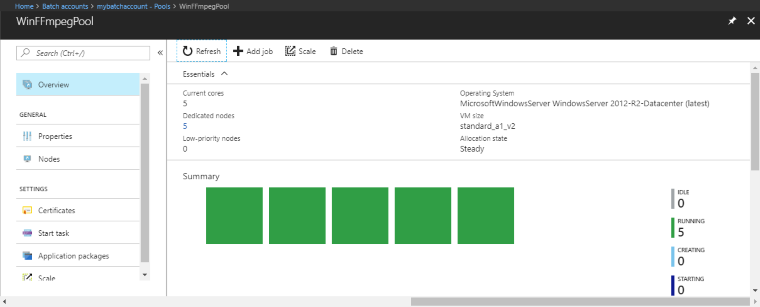

# Tutorial: Run a parallel workload with Azure Batch using the .NET API

Use Azure Batch to run large-scale parallel and high-performance computing (HPC) batch jobs efficiently in Azure. This tutorial walks through a C# example of running a parallel workload using Batch. You learn a common Batch application workflow and how to interact programmatically with Batch and Storage resources. You learn how to:

> [!div class="checklist"]
> * Add an application package to your Batch account
> * Authenticate with Batch and Storage accounts
> * Upload input files to Storage
> * Create a pool of compute nodes to run an application
> * Create a job and tasks to process input files
> * Monitor task execution
> * Retrieve output files

In this tutorial, you convert MP4 media files in parallel to MP3 format using the [ffmpeg](https://ffmpeg.org/) open-source tool. 

[!INCLUDE [quickstarts-free-trial-note.md](../../includes/quickstarts-free-trial-note.md)]

## Prerequisites

* [Visual Studio 2017 or later](https://www.visualstudio.com/vs), or [.NET Core 2.1](https://www.microsoft.com/net/download/dotnet-core/2.1) for Linux, macOS, or Windows.

* A Batch account and a linked Azure Storage account. To create these accounts, see the Batch quickstarts using the [Azure portal](quick-create-portal.md) or [Azure CLI](quick-create-cli.md).

* [Windows 64-bit version of ffmpeg 3.4](https://ffmpeg.zeranoe.com/builds/win64/static/ffmpeg-3.4-win64-static.zip) (.zip). Download the zip file to your local computer. For this tutorial, you only need the zip file. You do not need to unzip the file or install it locally.

## Sign in to Azure

Sign in to the Azure portal at [https://portal.azure.com](https://portal.azure.com).

## Add an application package

Use the Azure portal to add ffmpeg to your Batch account as an [application package](batch-application-packages.md). Application packages help you manage task applications and their deployment to the compute nodes in your pool. 

1. In the Azure portal, click **More services** > **Batch accounts**, and click the name of your Batch account.
3. Click **Applications** > **Add**.
4. For **Application id** enter *ffmpeg*, and a package version of *3.4*. Select the ffmpeg zip file you downloaded previously, and then click **OK**. The ffmpeg application package is added to your Batch account.


[!INCLUDE [batch-common-credentials](../../includes/batch-common-credentials.md)]

## Download and run the sample

### Download the sample

[Download or clone the sample app](https://github.com/Azure-Samples/batch-dotnet-ffmpeg-tutorial) from GitHub. To clone the sample app repo with a Git client, use the following command:

```
git clone https://github.com/Azure-Samples/batch-dotnet-ffmpeg-tutorial.git
```

Navigate to the directory that contains the Visual Studio solution file `BatchDotNetFfmpegTutorial.sln`.

Open the solution file in Visual Studio, and update the credential strings in `Program.cs` with the values you obtained for your accounts. For example:

```csharp
// Batch account credentials
private const string BatchAccountName = "mybatchaccount";
private const string BatchAccountKey  = "xxxxxxxxxxxxxxxxE+yXrRvJAqT9BlXwwo1CwF+SwAYOxxxxxxxxxxxxxxxx43pXi/gdiATkvbpLRl3x14pcEQ==";
private const string BatchAccountUrl  = "https://mybatchaccount.mybatchregion.batch.azure.com";

// Storage account credentials
private const string StorageAccountName = "mystorageaccount";
private const string StorageAccountKey  = "xxxxxxxxxxxxxxxxy4/xxxxxxxxxxxxxxxxfwpbIC5aAWA8wDu+AFXZB827Mt9lybZB1nUcQbQiUrkPtilK5BQ==";
```

[!INCLUDE [batch-credentials-include](../../includes/batch-credentials-include.md)]

Also, make sure that the ffmpeg application package reference in the solution matches the Id and version of the ffmpeg package that you uploaded to your Batch account.

```csharp
const string appPackageId = "ffmpeg";
const string appPackageVersion = "3.4";
```

### Build and run the sample project

Build and run the application in Visual Studio, or at the command line with the `dotnet build` and `dotnet run` commands. After running the application, review the code to learn what each part of the application does. For example, in Visual Studio:

* Right-click the solution in Solution Explorer and click **Build Solution**. 

* Confirm the restoration of any NuGet packages, if you're prompted. If you need to download missing packages, ensure the [NuGet Package Manager](https://docs.nuget.org/consume/installing-nuget) is installed.

Then run it. When you run the sample application, the console output is similar to the following. During execution, you experience a pause at `Monitoring all tasks for 'Completed' state, timeout in 00:30:00...` while the pool's compute nodes are started. 

```
Sample start: 11/19/2018 3:20:21 PM

Container [input] created.
Container [output] created.
Uploading file LowPriVMs-1.mp4 to container [input]...
Uploading file LowPriVMs-2.mp4 to container [input]...
Uploading file LowPriVMs-3.mp4 to container [input]...
Uploading file LowPriVMs-4.mp4 to container [input]...
Uploading file LowPriVMs-5.mp4 to container [input]...
Creating pool [WinFFmpegPool]...
Creating job [WinFFmpegJob]...
Adding 5 tasks to job [WinFFmpegJob]...
Monitoring all tasks for 'Completed' state, timeout in 00:30:00...
Success! All tasks completed successfully within the specified timeout period.
Deleting container [input]...

Sample end: 11/19/2018 3:29:36 PM
Elapsed time: 00:09:14.3418742
```

Go to your Batch account in the Azure portal to monitor the pool, compute nodes, job, and tasks. For example, to see a heat map of the compute nodes in your pool, click **Pools** > *WinFFmpegPool*.

When tasks are running, the heat map is similar to the following:



Typical execution time is approximately **10 minutes** when you run the application in its default configuration. Pool creation takes the most time.

[!INCLUDE [batch-common-tutorial-download](../../includes/batch-common-tutorial-download.md)]

## Review the code

The following sections break down the sample application into the steps that it performs to process a workload in the Batch service. Refer to the file `Program.cs` in the solution while you read the rest of this article, since not every line of code in the sample is discussed.

### Authenticate Blob and Batch clients

To interact with the linked storage account, the app uses the Azure Storage Client Library for .NET. It creates a reference to the account with [CloudStorageAccount](/dotnet/api/microsoft.azure.cosmos.table.cloudstorageaccount), authenticating using shared key authentication. Then, it creates a [CloudBlobClient](/dotnet/api/microsoft.azure.storage.blob.cloudblobclient).

```csharp
// Construct the Storage account connection string
string storageConnectionString = String.Format("DefaultEndpointsProtocol=https;AccountName={0};AccountKey={1}",
                                StorageAccountName, StorageAccountKey);

// Retrieve the storage account
CloudStorageAccount storageAccount = CloudStorageAccount.Parse(storageConnectionString);

CloudBlobClient blobClient = storageAccount.CreateCloudBlobClient();
```

The app creates a [BatchClient](/dotnet/api/microsoft.azure.batch.batchclient) object to create and manage pools, jobs, and tasks in the Batch service. The Batch client in the sample uses shared key authentication. Batch also supports authentication through [Azure Active Directory](batch-aad-auth.md) to authenticate individual users or an unattended application.

```csharp
BatchSharedKeyCredentials sharedKeyCredentials = new BatchSharedKeyCredentials(BatchAccountUrl, BatchAccountName, BatchAccountKey);

using (BatchClient batchClient = BatchClient.Open(sharedKeyCredentials))
...
```

### Upload input files

The app passes the `blobClient` object to the `CreateContainerIfNotExistAsync` method to create a storage container for the input files (MP4 format) and a container for the task output.

```csharp
CreateContainerIfNotExistAsync(blobClient, inputContainerName;
CreateContainerIfNotExistAsync(blobClient, outputContainerName);
```

Then, files are uploaded to the input container from the local `InputFiles` folder. The files in storage are defined as Batch [ResourceFile](/dotnet/api/microsoft.azure.batch.resourcefile) objects that Batch can later download to compute nodes. 

Two methods in `Program.cs` are involved in uploading the files:

* `UploadResourceFilesToContainerAsync`: Returns a collection of ResourceFile objects and internally calls `UploadResourceFileToContainerAsync` to upload each file that is passed in the `inputFilePaths` parameter.
* `UploadResourceFileToContainerAsync`: Uploads each file as a blob to the input container. After uploading the file, it obtains a shared access signature (SAS) for the blob and returns a ResourceFile object to represent it.

```csharp
string inputPath = Path.Combine(Environment.CurrentDirectory, "InputFiles");

List<string> inputFilePaths = new List<string>(Directory.GetFileSystemEntries(inputPath, "*.mp4",
    SearchOption.TopDirectoryOnly));

List<ResourceFile> inputFiles = await UploadResourceFilesToContainerAsync(
  blobClient,
  inputContainerName,
  inputFilePaths);
```

For details about uploading files as blobs to a storage account with .NET, see [Upload, download, and list blobs using .NET](../storage/blobs/storage-quickstart-blobs-dotnet.md).

### Create a pool of compute nodes

Next, the sample creates a pool of compute nodes in the Batch account with a call to `CreatePoolIfNotExistAsync`. This defined method uses the [BatchClient.PoolOperations.CreatePool](/dotnet/api/microsoft.azure.batch.pooloperations.createpool) method to set the number of nodes, VM size, and a pool configuration. Here, a [VirtualMachineConfiguration](/dotnet/api/microsoft.azure.batch.virtualmachineconfiguration) object specifies an [ImageReference](/dotnet/api/microsoft.azure.batch.imagereference) to a Windows Server image published in the Azure Marketplace. Batch supports a wide range of VM images in the Azure Marketplace, as well as custom VM images.

The number of nodes and VM size are set using defined constants. Batch supports dedicated nodes and [low-priority nodes](batch-low-pri-vms.md), and you can use either or both in your pools. Dedicated nodes are reserved for your pool. Low-priority nodes are offered at a reduced price from surplus VM capacity in Azure. Low-priority nodes become unavailable if Azure does not have enough capacity. The sample by default creates a pool containing only 5 low-priority nodes in size *Standard_A1_v2*.

The ffmpeg application is deployed to the compute nodes by adding an [ApplicationPackageReference](/dotnet/api/microsoft.azure.batch.applicationpackagereference) to the pool configuration.

The [CommitAsync](/dotnet/api/microsoft.azure.batch.cloudpool.commitasync) method submits the pool to the Batch service.

```csharp
ImageReference imageReference = new ImageReference(
    publisher: "MicrosoftWindowsServer",
    offer: "WindowsServer",
    sku: "2016-Datacenter-smalldisk",
    version: "latest");

VirtualMachineConfiguration virtualMachineConfiguration =
    new VirtualMachineConfiguration(
    imageReference: imageReference,
    nodeAgentSkuId: "batch.node.windows amd64");

pool = batchClient.PoolOperations.CreatePool(
    poolId: poolId,
    targetDedicatedComputeNodes: DedicatedNodeCount,
    targetLowPriorityComputeNodes: LowPriorityNodeCount,
    virtualMachineSize: PoolVMSize,
    virtualMachineConfiguration: virtualMachineConfiguration);

pool.ApplicationPackageReferences = new List<ApplicationPackageReference>
    {
    new ApplicationPackageReference {
    ApplicationId = appPackageId,
    Version = appPackageVersion}};

await pool.CommitAsync();  
```

### Create a job

A Batch job specifies a pool to run tasks on and optional settings such as a priority and schedule for the work. The sample creates a job with a call to `CreateJobAsync`. This defined method uses the [BatchClient.JobOperations.CreateJob](/dotnet/api/microsoft.azure.batch.joboperations.createjob) method to create a job on your pool.

The [CommitAsync](/dotnet/api/microsoft.azure.batch.cloudjob.commitasync) method submits the job to the Batch service. Initially the job has no tasks.

```csharp
CloudJob job = batchClient.JobOperations.CreateJob();
job.Id = JobId;
job.PoolInformation = new PoolInformation { PoolId = PoolId };

await job.CommitAsync();
```

### Create tasks

The sample creates tasks in the job with a call to the `AddTasksAsync` method, which creates a list of [CloudTask](/dotnet/api/microsoft.azure.batch.cloudtask) objects. Each `CloudTask` runs ffmpeg to process an input `ResourceFile` object using a [CommandLine](/dotnet/api/microsoft.azure.batch.cloudtask.commandline) property. ffmpeg was previously installed on each node when the pool was created. Here, the command line runs ffmpeg to convert each input MP4 (video) file to an MP3 (audio) file.

The sample creates an [OutputFile](/dotnet/api/microsoft.azure.batch.outputfile) object for the MP3 file after running the command line. Each task's output files (one, in this case) are uploaded to a container in the linked storage account, using the task's [OutputFiles](/dotnet/api/microsoft.azure.batch.cloudtask.outputfiles) property. Previously in the code sample, a shared access signature URL (`outputContainerSasUrl`) was obtained to provide write access to the output container. Note the conditions set on the `outputFile` object. An output file from a task is only uploaded to the container after the task has successfully completed (`OutputFileUploadCondition.TaskSuccess`). See the full [code sample](https://github.com/Azure-Samples/batch-dotnet-ffmpeg-tutorial) on GitHub for further implementation details.

Then, the sample adds tasks to the job with the [AddTaskAsync](/dotnet/api/microsoft.azure.batch.joboperations.addtaskasync) method, which queues them to run on the compute nodes.

```csharp
 // Create a collection to hold the tasks added to the job.
List<CloudTask> tasks = new List<CloudTask>();

for (int i = 0; i < inputFiles.Count; i++)
{
    string taskId = String.Format("Task{0}", i);

    // Define task command line to convert each input file.
    string appPath = String.Format("%AZ_BATCH_APP_PACKAGE_{0}#{1}%", appPackageId, appPackageVersion);
    string inputMediaFile = inputFiles[i].FilePath;
    string outputMediaFile = String.Format("{0}{1}",
        System.IO.Path.GetFileNameWithoutExtension(inputMediaFile),
        ".mp3");
    string taskCommandLine = String.Format("cmd /c {0}\\ffmpeg-3.4-win64-static\\bin\\ffmpeg.exe -i {1} {2}", appPath, inputMediaFile, outputMediaFile);

    // Create a cloud task (with the task ID and command line)
    CloudTask task = new CloudTask(taskId, taskCommandLine);
    task.ResourceFiles = new List<ResourceFile> { inputFiles[i] };

    // Task output file
    List<OutputFile> outputFileList = new List<OutputFile>();
    OutputFileBlobContainerDestination outputContainer = new OutputFileBlobContainerDestination(outputContainerSasUrl);
    OutputFile outputFile = new OutputFile(outputMediaFile,
       new OutputFileDestination(outputContainer),
       new OutputFileUploadOptions(OutputFileUploadCondition.TaskSuccess));
    outputFileList.Add(outputFile);
    task.OutputFiles = outputFileList;
    tasks.Add(task);
}

// Add tasks as a collection
await batchClient.JobOperations.AddTaskAsync(jobId, tasks);
return tasks
```

### Monitor tasks

When Batch adds tasks to a job, the service automatically queues and schedules them for execution on compute nodes in the associated pool. Based on the settings you specify, Batch handles all task queuing, scheduling, retrying, and other task administration duties.

There are many approaches to monitoring task execution. This sample defines a `MonitorTasks` method to report only on completion and task failure or success states. The `MonitorTasks` code specifies an [ODATADetailLevel](/dotnet/api/microsoft.azure.batch.odatadetaillevel) to efficiently select only minimal information about the tasks. Then, it creates a [TaskStateMonitor](/dotnet/api/microsoft.azure.batch.taskstatemonitor), which provides helper utilities for monitoring task states. In `MonitorTasks`, the sample waits for all tasks to reach `TaskState.Completed` within a time limit. Then it terminates the job and reports on any tasks that completed but may have encountered a failure such as a non-zero exit code.

```csharp
TaskStateMonitor taskStateMonitor = batchClient.Utilities.CreateTaskStateMonitor();
try
{
    await taskStateMonitor.WhenAll(addedTasks, TaskState.Completed, timeout);
}
catch (TimeoutException)
{
    batchClient.JobOperations.TerminateJob(jobId);
    Console.WriteLine(incompleteMessage);
    return false;
}
batchClient.JobOperations.TerminateJob(jobId);
 Console.WriteLine(completeMessage);
...

```

## Clean up resources

After it runs the tasks, the app automatically deletes the input storage container it created, and gives you the option to delete the Batch pool and job. The BatchClient's [JobOperations](/dotnet/api/microsoft.azure.batch.batchclient.joboperations) and [PoolOperations](/dotnet/api/microsoft.azure.batch.batchclient.pooloperations) classes both have corresponding delete methods, which are called if you confirm deletion. Although you're not charged for jobs and tasks themselves, you are charged for compute nodes. Thus, we recommend that you allocate pools only as needed. When you delete the pool, all task output on the nodes is deleted. However, the output files remain in the storage account.

When no longer needed, delete the resource group, Batch account, and storage account. To do so in the Azure portal, select the resource group for the Batch account and click **Delete resource group**.

## Next steps

In this tutorial, you learned about how to:

> [!div class="checklist"]
> * Add an application package to your Batch account
> * Authenticate with Batch and Storage accounts
> * Upload input files to Storage
> * Create a pool of compute nodes to run an application
> * Create a job and tasks to process input files
> * Monitor task execution
> * Retrieve output files

For more examples of using the .NET API to schedule and process Batch workloads, see the samples on GitHub.

> [!div class="nextstepaction"]
> [Batch C# samples](https://github.com/Azure-Samples/azure-batch-samples/tree/master/CSharp)
