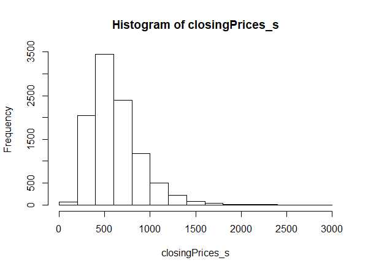
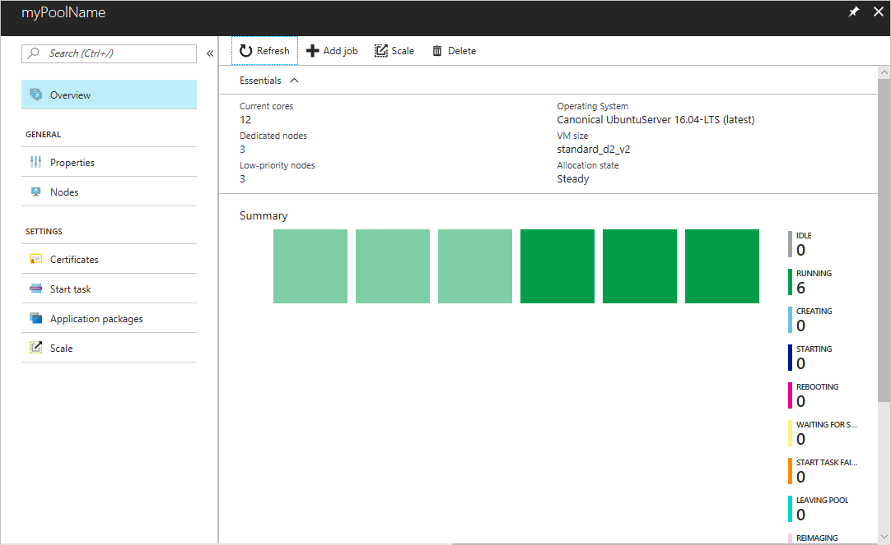
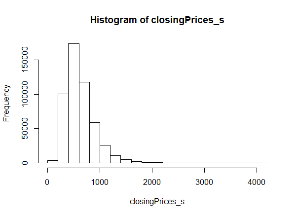

# Tutorial: Run a parallel R simulation with Azure Batch 

Run your parallel R workloads at scale using [doAzureParallel](https://www.github.com/Azure/doAzureParallel), a lightweight R package that allows you to use Azure Batch directly from your R session. The doAzureParallel package is built on top of the popular [foreach](https://cran.r-project.org/web/packages/foreach/index.html) R package. doAzureParallel takes each iteration of the foreach loop and submits it as an Azure Batch task.

This tutorial shows you how to deploy a Batch pool and run a parallel R job in Azure Batch directly within RStudio. You learn how to:
 

> [!div class="checklist"]
> * Install doAzureParallel and configure it to access your Batch and storage accounts
> * Create a Batch pool as a parallel backend for your R session
> * Run a sample parallel simulation on the pool

## Prerequisites

* An installed [R](https://www.r-project.org/) distribution, such as [Microsoft R Open](https://mran.microsoft.com/open). Use R version 3.3.1 or later.

* [RStudio](https://www.rstudio.com/), either the commercial edition or the open-source [RStudio Desktop](https://www.rstudio.com/products/rstudio/#Desktop). 

* An Azure Batch account and an Azure Storage account. To create these accounts, see the Batch quickstarts using the [Azure portal](quick-create-portal.md) or [Azure CLI](quick-create-cli.md). 

## Sign in to Azure

Sign in to the Azure portal at [https://portal.azure.com](https://portal.azure.com).

[!INCLUDE [batch-common-credentials](../../includes/batch-common-credentials.md)] 
## Install doAzureParallel

In the RStudio console, install the [doAzureParallel GitHub package](https://www.github.com/Azure/doAzureParallel). The following commands download and install the package and its dependencies in your current R session: 

```R
# Install the devtools package  
install.packages("devtools") 

# Install rAzureBatch package
devtools::install_github("Azure/rAzureBatch") 

# Install the doAzureParallel package 
devtools::install_github("Azure/doAzureParallel") 
 
# Load the doAzureParallel library 
library(doAzureParallel) 
```
Installation can take several minutes.

To configure doAzureParallel with the account credentials you obtained previously, generate a configuration file called *credentials.json* in your working directory: 

```R
generateCredentialsConfig("credentials.json") 
``` 

Populate this file with your Batch and storage account names and keys. Leave the `githubAuthenticationToken` setting unchanged.

When complete, the credentials file looks similar to the following: 

```json
{
  "batchAccount": {
    "name": "mybatchaccount",
    "key": "xxxxxxxxxxxxxxxxE+yXrRvJAqT9BlXwwo1CwF+SwAYOxxxxxxxxxxxxxxxx43pXi/gdiATkvbpLRl3x14pcEQ==",
    "url": "https://mybatchaccount.mybatchregion.batch.azure.com"
  },
  "storageAccount": {
    "name": "mystorageaccount",
    "key": "xxxxxxxxxxxxxxxxy4/xxxxxxxxxxxxxxxxfwpbIC5aAWA8wDu+AFXZB827Mt9lybZB1nUcQbQiUrkPtilK5BQ=="
  },
  "githubAuthenticationToken": ""
}
```

Save the file. Then, run the following command to set the credentials for your current R session: 

```R
setCredentials("credentials.json") 
```

## Create a Batch pool 

doAzureParallel includes a function to generate an Azure Batch pool (cluster) to run parallel R jobs. The nodes run an Ubuntu-based [Azure Data Science Virtual Machine](../machine-learning/data-science-virtual-machine/overview.md). Microsoft R Open and popular R packages are pre-installed on this image. You can view or customize certain cluster settings, such as the number and size of the nodes. 

To generate a cluster configuration JSON file in your working directory: 
 
```R
generateClusterConfig("cluster.json")
``` 
 
Open the file to view the default configuration, which includes 3 dedicated nodes and 3 [low-priority](batch-low-pri-vms.md) nodes. These settings are just examples that you can experiment with or modify. Dedicated nodes are reserved for your pool. Low-priority nodes are offered at a reduced price from surplus VM capacity in Azure. Low-priority nodes become unavailable if Azure does not have enough capacity. 

For this tutorial, change the configuration as follows:

* Increase the `maxTasksPerNode` to *2*, to take advantage of both cores on each node
* Set `dedicatedNodes` to *0*, so you can try the low-priority VMs available for Batch. Set the `min` of `lowPriorityNodes` to *5*. and the `max` to *10*, or choose smaller numbers if desired. 

Leave defaults for the remaining settings, and save the file. It should look similar to the following:

```json
{
  "name": "myPoolName",
  "vmSize": "Standard_D2_v2",
  "maxTasksPerNode": 2,
  "poolSize": {
    "dedicatedNodes": {
      "min": 0,
      "max": 0
    },
    "lowPriorityNodes": {
      "min": 5,
      "max": 10
    },
    "autoscaleFormula": "QUEUE"
  },
  "containerImage": "rocker/tidyverse:latest",
  "rPackages": {
    "cran": [],
    "github": [],
    "bioconductor": []
  },
  "commandLine": []
}
```

Now create the cluster. Batch creates the pool immediately, but it takes a few minutes to allocate and start the compute nodes. After the cluster is available, register it as the parallel backend for your R session. 

```R
# Create your cluster if it does not exist; this takes a few minutes
cluster <- makeCluster("cluster.json") 
  
# Register your parallel backend 
registerDoAzureParallel(cluster) 
  
# Check that the nodes are running 
getDoParWorkers() 
```

Output shows the number of "execution workers" for doAzureParallel. This number is the number of nodes multiplied by the value of `maxTasksPerNode`. If you modified the cluster configuration as described previously, the number is *10*. 
 
## Run a parallel simulation

Now that your cluster is created, you are ready to run your foreach loop with your registered parallel backend (Azure Batch pool). As an example, run a Monte Carlo financial simulation, first locally using a standard foreach loop, and then running foreach with Batch. This example is a simplified version of predicting a stock price by simulating a large number of different outcomes after 5 years.

Suppose that the stock of Contoso Corporation gains on average 1.001 times its opening price each day, but has a volatility (standard deviation) of 0.01. Given a starting price of $100, use a Monte Carlo pricing simulation to figure out Contoso's stock price after 5 years.

Parameters for the Monte Carlo simulation:

```R
mean_change = 1.001 
volatility = 0.01 
opening_price = 100 
```

To simulate closing prices, define the following function:

```R
getClosingPrice <- function() { 
  days <- 1825 # ~ 5 years 
  movement <- rnorm(days, mean=mean_change, sd=volatility) 
  path <- cumprod(c(opening_price, movement)) 
  closingPrice <- path[days] 
  return(closingPrice) 
} 
```

First run 10,000 simulations locally using a standard foreach loop with the `%do%` keyword:

```R
start_s <- Sys.time() 
# Run 10,000 simulations in series 
closingPrices_s <- foreach(i = 1:10, .combine='c') %do% { 
  replicate(1000, getClosingPrice()) 
} 
end_s <- Sys.time() 
```


Plot the closing prices in a histogram to show the distribution of outcomes:

```R
hist(closingPrices_s)
``` 

Output is similar to the following:


  
A local simulation completes in a few seconds or less:

```R
difftime(end_s, start_s) 
```

Estimated runtime for 10 million outcomes locally, using a linear approximation, is around 30 minutes:

```R 
1000 * difftime(end_s, start_s, unit = "min") 
```


Now run the code using `foreach` with the `%dopar%` keyword to compare how long it takes to run 10 million simulations in Azure. To parallelize the simulation with Batch, run 100 iterations of 100,000 simulations:

```R
# Optimize runtime. Chunking allows running multiple iterations on a single R instance.
opt <- list(chunkSize = 10) 
start_p <- Sys.time()  
closingPrices_p <- foreach(i = 1:100, .combine='c', .options.azure = opt) %dopar% { 
  replicate(100000, getClosingPrice()) 
} 
end_p <- Sys.time() 
```

The simulation distributes tasks to the nodes in the Batch pool. You can see the activity in the heat map for the pool in the Azure portal]. Go to **Batch accounts** > *myBatchAccount*. Click **Pools** > *myPoolName*. 



After a few minutes, the simulation finishes. The package automatically merges the results and pulls them down from the nodes. Then, you are ready to use the results in your R session. 

```R
hist(closingPrices_p) 
```

Output is similar to the following:



How long did the parallel simulation take? 

```R
difftime(end_p, start_p, unit = "min")  
```

You should see that running the simulation on the Batch pool gives you a significant increase in performance over the expected time to run the simulation locally. 

## Clean up resources

The job is deleted automatically after it completes. When the cluster is longer needed, call the `stopCluster` function in the doAzureParallel package to delete it:

```R
stopCluster(cluster)
```

## Next steps
In this tutorial, you learned about how to:

> [!div class="checklist"]
> Install doAzureParallel and configure it to access your Batch and storage accounts
> * Create a Batch pool as a parallel backend for your R session
> * Run a sample parallel simulation on the pool


For more information about doAzureParallel, see the documentation and samples on GitHub.

> [!div class="nextstepaction"]
> [doAzureParallel package](https://github.com/Azure/doAzureParallel/)


