# Tutorial: Render a Blender scene using Batch Explorer

This tutorial shows how to render multiple frames of a Blender demo scene. Blender is used for the tutorial as it is free of charge for both the client and rendering VMs, but the process is very similar if other applications, such as Maya or 3ds Max, were to be used.

In this tutorial, you learn how to:
> [!div class="checklist"]
> * Upload a Blender scene to Azure storage
> * Create a Batch pool with multiple nodes to perform the rendering
> * Render multiple frames
> * View and download the rendered frame files

## Prerequisites

You need a pay-as-you-go subscription or other Azure purchase option to use rendering applications in Batch on a pay-per-use basis. Pay-per-use licensing isn't supported if you use a free Azure offer that provides a monetary credit.

You need an Azure Batch account with an associated storage account.  See any of the Batch Quickstarts articles, such as the [CLI article](https://docs.microsoft.com/azure/batch/quick-create-cli) to create a Batch account.

A low-priority core quota of at least 50 cores is required for the VM size and number of VMs specified in this tutorial; the default quota can be used, but a smaller VM size will have to be used which will mean the images take longer to render. The process for requesting an increased core quota is detailed in [this article](https://docs.microsoft.com/azure/batch/batch-quota-limit).

Finally, [Batch Explorer](https://azure.github.io/BatchExplorer/) has to be installed; it is available for Windows, OSX, and Linux. It is optional, but if [Blender](https://www.blender.org/download/) is installed then the sample model file can be viewed.

## Download the demo scene

Download the “Class room” demo ZIP file for Blender from the [Blender Demo Files web page](https://www.blender.org/download/demo-files/) and unzip it to a local drive.

## Upload a scene to Azure storage

Create a storage account container for the demo scene files:

* Start Batch Explorer
* Select the 'Data' menu-item from the main menu on the left-hand side.
* Ensure 'File groups' is selected in the pulldown.
* Select the '+' button and create a new 'Empty file group' called 'blender-classroom'
  * A file group is simply an Azure Storage blob container with a 'fgrp-' prefix; it is a convention used to filter out other containers in the storage account

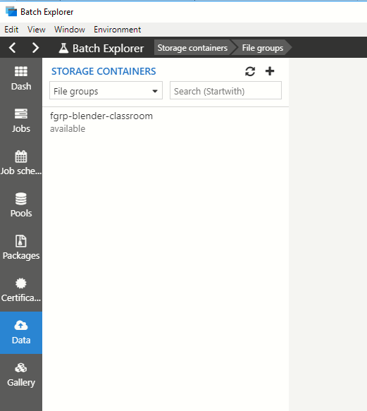

Upload the scene files:

* Select the new container and drag-and-drop the contents of the 'classroom' folder to the container in Batch Explorer.

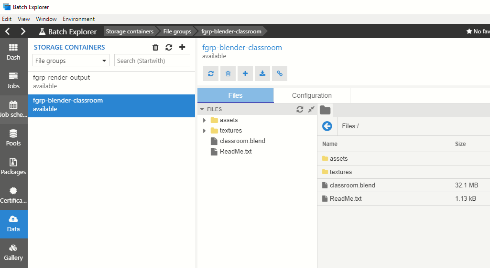

## Create Azure storage container for output images

Create a storage account container for the demo scene output files:

* Select the 'Data' menu-item from the main menu on the left-hand side.
* Select the '+' button and create a new 'Empty file group' called 'render-output'

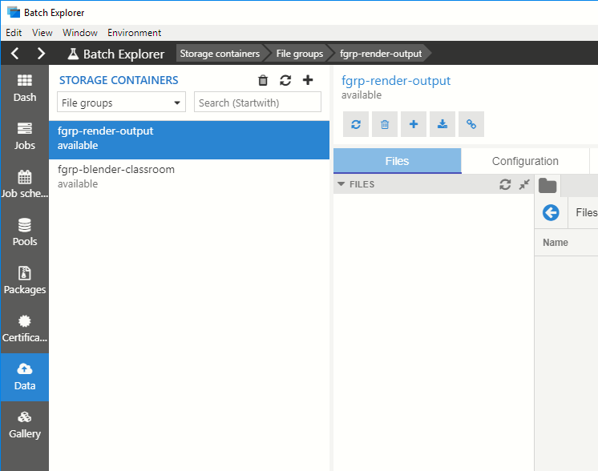

## Create a pool of VMs for rendering

Create a Batch pool using rendering Azure Marketplace VM image that contains the Blender application:

* Select the 'Gallery' menu-item from the main menu on the left-hand side.
* Select the 'Blender' item for the list of application items.
* Select the items for rendering frames on Windows Server
* The link icon on the right-hand side of the item can optionally be selected to view the template files that will be used to create a pool and job.

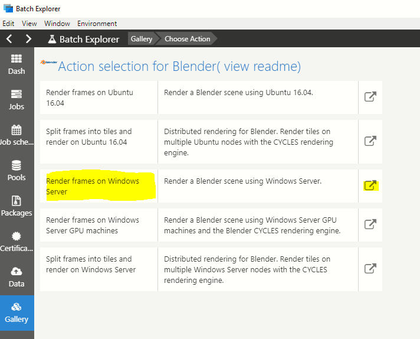

* Select the button ‘Create pool for later use’
  *	Leave the Pool name as “blender-windows”
  * Set the ‘Dedicated vm count’ to “0”
  * Set the ‘Low priority vm count’ to “3”
  * Set the ‘Node size’ to “Standard_F16” – another VM size can be selected, but time to render a frame will mainly be dependent on the number of cores.
* Select the green button to create the pool
  * The pool will be created almost immediately, but it will take a few minutes for the VMs to be allocated and started.

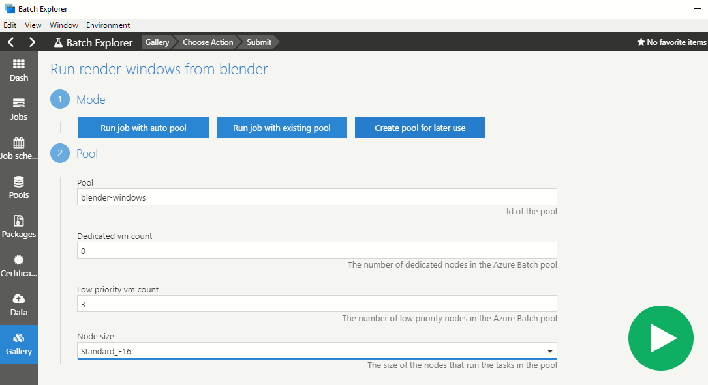

> [!WARNING]
> Note that when VMs are present in a pool, the cost of those VMs are charged to your Azure subscription. The pool needs to deleted or the VMs need to be deleted to stop the charges. Delete the pool at the end of this tutorial to prevent ongoing charges.

The status of the pool and VMs can be monitored in the 'Pools' view; the following example shows all three VMs have been allocated, two have been started and are idle, one is still starting:
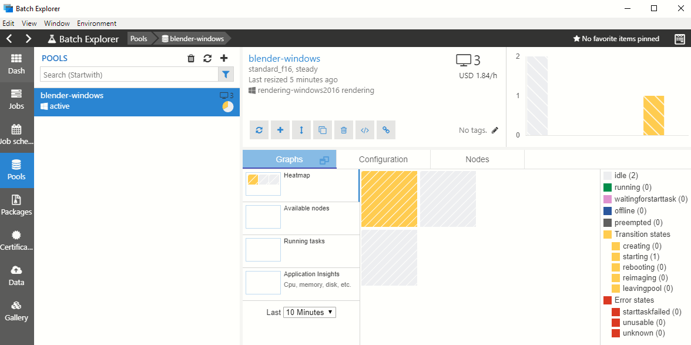

## Create a rendering job

Create a rendering job to render some frames using the pool that was created:
* Select the 'Gallery' menu-item from the main menu on the left-hand side.
* Select the 'Blender' item for the list of application items.
* Select the items for rendering frames on Windows Server.
* Select the 'Run job with existing pool' button
* Select the 'blender-windows' pool
* Set the 'Job name' to 'blender-render-tutorial1'
* Select 'fgrp-blender-classroom' for 'Input data'
* Select the file icon for the 'Blend file' and select 'classroom.blend'
* Leave 'Frame start' as '1' and set 'Frame end' to '5'
* Set 'Outputs' to 'fgrp-render-output'
* Select the green button to create the job; a job will be created with five tasks, one for each frame

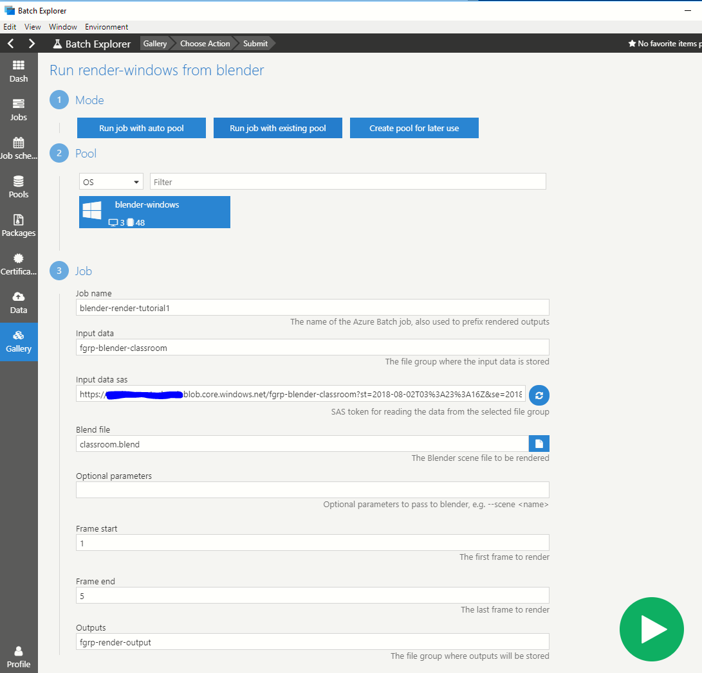

Once the job and all tasks have been created, the job will be displayed together with the job tasks:
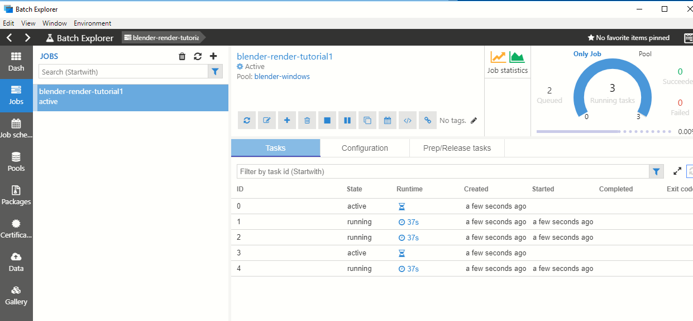

When a task starts running for the first time on a pool VM, a Batch job preparation task is run which copies the scene files from the storage file group onto the VM so they can be accessed by Blender.
The status of the render can be determined by viewing the stdout.txt log file produced by Blender.  Select a task, the 'Task Outputs' are displayed by default, and the 'stdout.txt' file can be selected and viewed.
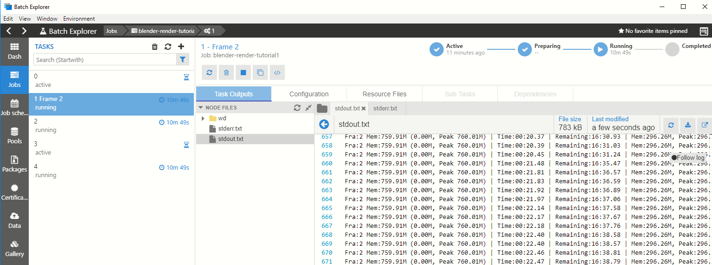

If the 'blender-windows' pool is selected, the pool VMs will be seen in a running state:
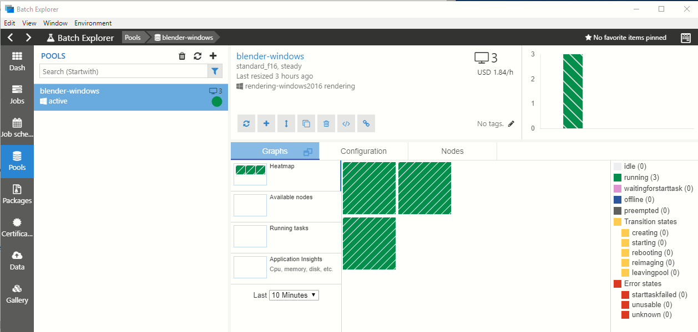

The rendered images will take several minutes to produce depending on the VM size selected.  Using the F16 VM specified earlier, frames took about 16 minutes to render.

## View the rendering output

When frames have finished rendering, those tasks will be shown as completed:
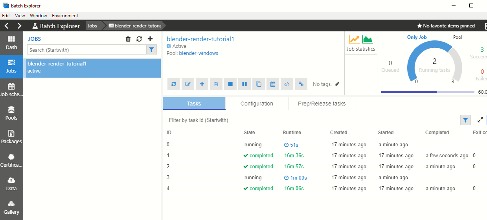

The rendered image is written to the VM first and can be viewed by selecting the 'wd' folder:
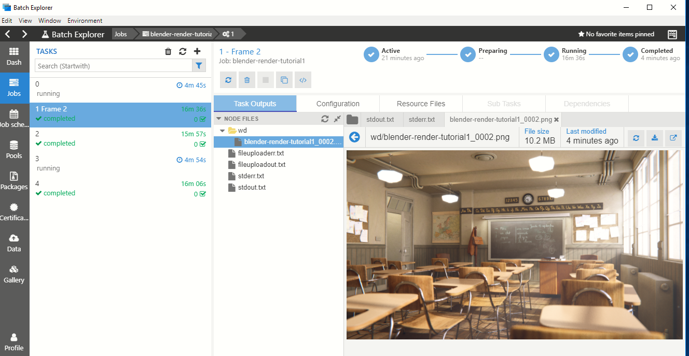

The job template also specifies that the output frame and log files are written back to the Azure Storage account file group specified when the job was created.  The 'Data' UI can be used to view the output files and logs; it can be also used to download the files:
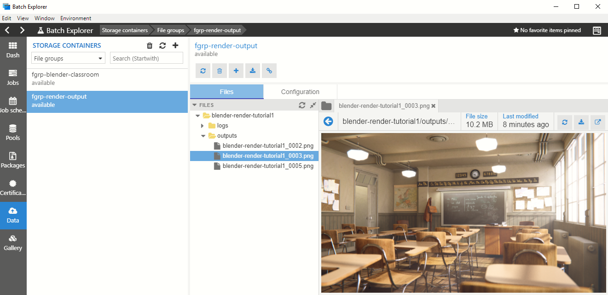

When all tasks have completed, the job will be marked as being completed:
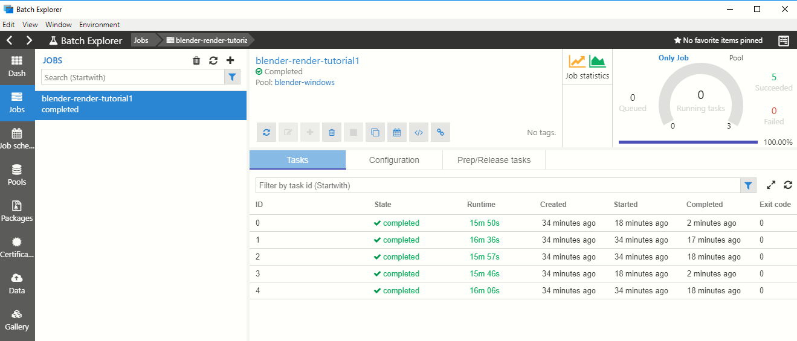

## Clean up resources

> [!WARNING]
> The pool must be deleted (it could also be resized down to zero nodes) to stop charges for the VMs accruing to the Azure subscription.

* Select 'Pools'
* Select the 'blender-windows' pool
* Either right-click and 'Delete' or select the trash can icon above the pool

## Next steps
* In the ‘Gallery’ section, explore the rendering applications available via Batch Explorer.
* For each application there are several templates available, which will expand over time.  For example, for Blender templates exist that split up a single image into tiles, so parts of an image can be rendered in parallel.
* For a comprehensive description of rendering capabilities, see the set of articles [here](https://docs.microsoft.com/azure/batch/batch-rendering-service).
