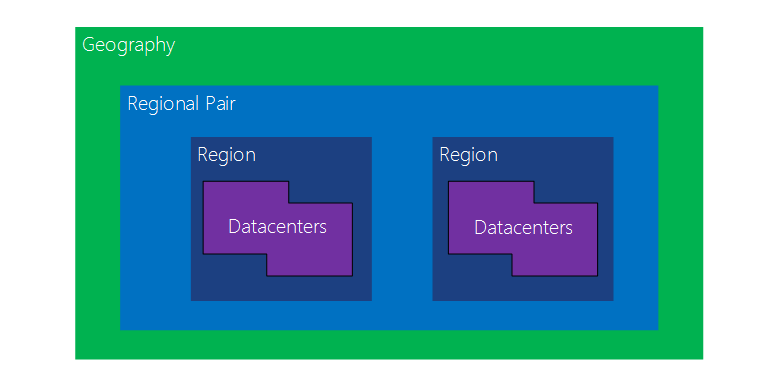
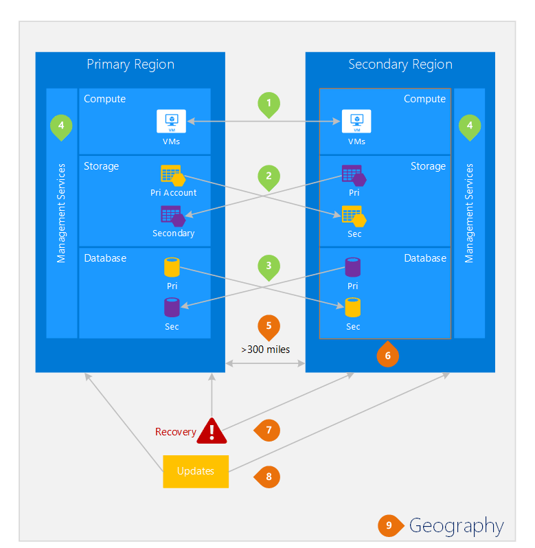

<properties
	pageTitle="Business continuity and disaster recovery (BCDR): Azure Paired Regions | Microsoft Azure"
	description="Azure regional pairs ensure that applications are resilient during data center failures."
	services="site-recovery"
	documentationCenter=""
	authors="rayne-wiselman"
	manager="jwhit"
	editor=""/>

<tags
    ms.service="site-recovery"
    ms.workload="storage-backup-recovery"
    ms.tgt_pltfrm="na"
    ms.devlang="na"
    ms.topic="article"
    ms.date="03/20/2016"
    ms.author="raynew"/>

# Business continuity and disaster recovery (BCDR): Azure Paired Regions

## What are paired regions?

Azure operates in multiple geographies around the world. An Azure geography is a defined area of the world that contains at least one Azure Region. An Azure region is an area within a geography containing one or more datacenters.

Each Azure region is paired with another region within the same geography (with the exception of Brazil South which is paired with a region outside its geography), together making a regional pair.

Figure 1 – Azure regional pair diagram

| Geography     |  Paired Regions  |                  |
| :-------------| :-------------   | :-------------   |
| North America | North Central US | South Central US |
| North America | East US          | West US          |
| North America | US East 2        | US Central       |
|North America  | West US 2        | West Central US  |
| Europe        | North Europe     | West Europe      |
| Asia          | South East Asia  | East Asia        |
| China         | East China       | North China      |
| Japan         | Japan East       | Japan West       |
| Brazil        | Brazil South (1) | South Central US |
| Australia     | Australia East   | Australia Southeast|
| US Government | US Gov Iowa      | US Gov Virginia  |
| India         | Central India    | South India      |
| Canada        | Canada Central   | Canada East      |

Table 1 - Mapping of azure regional pairs

> (1) Brazil South is unique because it is paired with a region outside of its own geography. Note that Brazil South’s secondary region is South Central US but South Central US’s secondary region is not Brazil South.

We recommend that you replicate workloads across regional pairs to benefit from Azure’s isolation and availability policies. For example, planned Azure system updates are deployed sequentially (not at the same time) across paired regions. That means that even in the rare event of a faulty update, both regions will not be affected simultaneously. Furthermore, in the unlikely event of a broad outage, recovery of at least one region out of every pair is prioritized.

## An example of paired regions
Figure 2 below shows a hypothetical application which uses the regional pair for disaster recovery. The green numbers highlight the cross-region activities of three Azure services (Azure Compute, Storage, and Database) and how they are configured to replicate across regions. The unique benefits of deploying across paired regions are highlighted by the orange numbers.

Figure 2 – Hypothetical Azure regional pair

## Cross-region activities
As referred to in figure 2.

 **Azure Compute (PaaS)** – You must provision additional compute resources in advance to ensure resources are available in another region during a disaster. For more information, see [Azure resiliency technical guidance](./resiliency/resiliency-technical-guidance.md).

 **Azure Storage** - Geo-Redundant storage (GRS) is configured by default when an Azure Storage account is created. With GRS, your data is automatically replicated three times within the primary region, and three times in the paired region. For more information,  see [Azure Storage Redundancy Options](storage/storage-redundancy.md).

 **Azure SQL Databases** – With Azure SQL Standard Geo-Replication, you can configure asynchronous replication of transactions to a paired region. With Premium Geo-replication, you can configure replication to any region in the world; however, we recommend you deploy these resources in a paired region for most disaster recovery scenarios. For more information, see  [Geo-Replication in Azure SQL Database](./sql-database/sql-database-geo-replication-overview.md).

 **Azure Resource Manager (ARM)** - ARM inherently provides logical isolation of service management components across regions. This means logical failures in one region are less likely to impact another.

## Benefits of paired regions
As referred to in figure 2.  

**Physical isolation** – When possible, Azure prefers at least 300 miles of separation between datacenters in a regional pair, although this is not practical or possible in all geographies. Physical datacenter separation reduces the likelihood of natural disasters, civil unrest, power outages, or physical network outages affecting both regions at once. Isolation is subject to the constraints within the geography (geography size, power/network infrastructure availability, regulations, etc.).  

**Platform-provided replication** - Some services such as Geo-Redundant Storage provide automatic replication to the paired region.

**Region recovery order** – In the event of a broad outage, recovery of one region is prioritized out of every pair. Applications that are deployed across paired regions are guaranteed to have one of the regions recovered with priority. If an application is deployed across regions that are not paired, recovery may be delayed – in the worst case the chosen regions may be the last two to be recovered.

**Sequential updates** –  Planned Azure system updates are rolled out to paired regions sequentially (not at the same time) to minimize downtime, the effect of bugs, and logical failures in the rare event of a bad update.

**Data residency** – A region resides within the same geography as its pair (with the exception of Brazil South) in order to meet data residency requirements for tax and law enforcement jurisdiction purposes.
