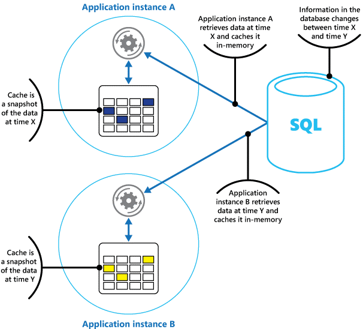
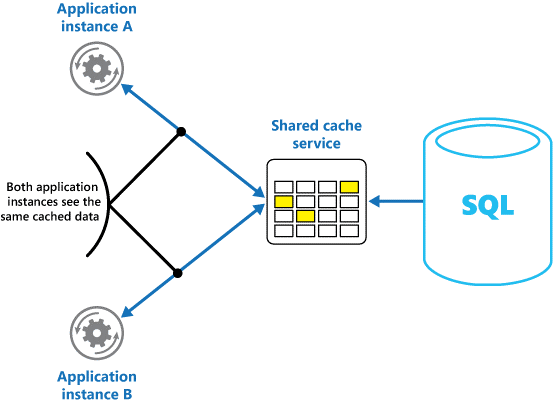
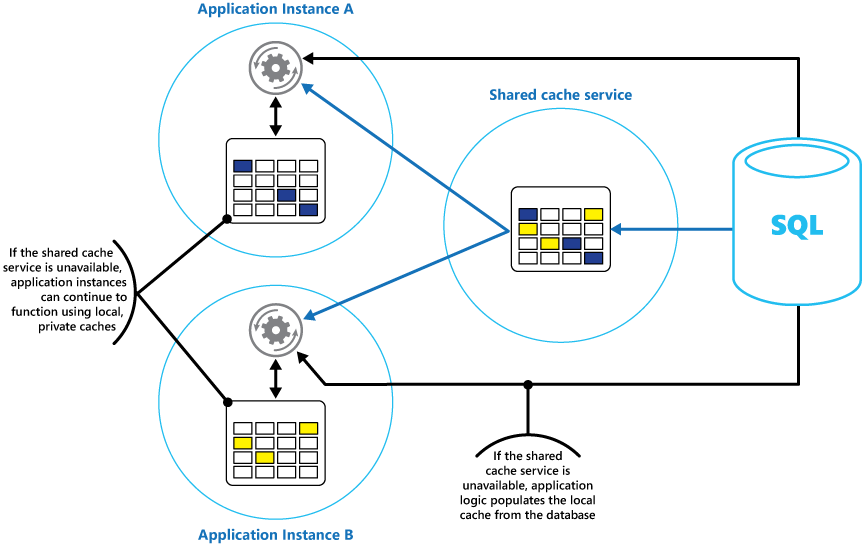

<properties
   pageTitle="Caching guidance | Microsoft Azure"
   description="Guidance on caching to improve performance and scalability."
   services=""
   documentationCenter="na"
   authors="dragon119"
   manager="masimms"
   editor=""
   tags=""/>

<tags
   ms.service="best-practice"
   ms.devlang="na"
   ms.topic="article"
   ms.tgt_pltfrm="na"
   ms.workload="na"
   ms.date="04/28/2015"
   ms.author="masashin"/>

# Caching guidance


Caching is a common technique that aims to improve the performance and
scalability of a system by temporarily copying frequently accessed data
to fast storage located close to the application. If this fast data storage
is located closer to the application than the original source then caching
can significantly improve response times for client applications by serving
data more quickly. Caching is most effective when a client instance repeatedly
reads the same data, especially if the data remains relatively static and
the original data store is slow relative to the speed of the cache, is
subject to a high level of contention, or is far away when network latency
can cause access to be slow.

## Caching in distributed applications

Distributed applications typically implement either or both of the
following strategies when caching data:

- Using a private cache, where data is held locally on the computer running an instance of an application or service.
- Using a shared cache, serving as a common source which can be accessed by multiple processes and/or machines.

In both cases, caching could be performed client-side (by the process providing
the user interface for a system, such as a web browser or desktop application),
and/or server-side (by the process providing the business services
running remotely).

### Private caching

The most basic type of cache is an in-memory store, held in the address
space of a single process and accessed directly by the code that runs
in that process. This type of cache is very quick to access, and it can
provide an extremely effective strategy for storing modest amounts of
static data as the size of a cache is typically constrained by the
volume of memory available on the machine hosting the process. If you
need to cache more information than is physically possible in memory,
you can write cached data to the local file system. This will
necessarily be slower to access than data held in-memory, but should
still be faster and more reliable than retrieving data across a network.

If you have multiple instances of an application that uses this model
running concurrently, each application instance will have its own
independent cache holding its own copy of data.

You should think of a cache as a snapshot of the original data at some
point in the past. If this data is not static, it is likely that
different application instances will hold different versions of the
data in their caches. Therefore, the same query performed by these
instances could return different results, as shown in Figure 1.



_Figure 1: Using an in-memory cache in different instances of an application_

### Shared Caching

Using a shared cache can help to alleviate the concern that data may
differ in each cache, as can occur with in-memory caching. Shared
caching ensures that different application instances see the same
view of cached data by locating the cache in a separate location,
typically hosted as part of a separate service, as shown in Figure 2.



_Figure 2: Using a shared cache_

An important benefit of using the shared caching approach is the
scalability it can help to provide. Many shared cache services are
implemented by using a cluster of servers, and utilize software that
distributes the data across the cluster in a transparent manner. An
application instance simply sends a request to the cache service,
and the underlying infrastructure is responsible for determining the
location of the cached data in the cluster. You can easily scale the
cache by adding more servers.

The disadvantages of the shared caching approach are that the cache
is slower to access because it is no longer held locally to each
application instance, and the requirement to implement a separate
cache service may add complexity to the solution.

## Considerations for using caching

The following sections describe in more detail the considerations
for designing and using a cache.

### When should data be cached?

Caching can dramatically improve performance, scalability, and availability. The more data
that you have and the larger the number of users that need to access this data, the greater
the benefits of caching become by reducing latency and contention associated with handling
large volumes of concurrent requests in the original data store. For example, a database
may support a limited number of concurrent connections, but retrieving data from a shared
cache rather than the underlying database allows a client application to access this data
even if the number of available connections is currently exhausted. Additionally, if the
database becomes unavailable, client applications may be able to continue by using the
data held in the cache.

You should consider caching data that is read frequently but that is modified infrequently
(the data has a high proportion of read operations compared to write operations). However,
you should not use the cache as the authoritative store of critical information; you should
ensure that all changes that your application cannot afford to lose are always saved to a
persistent data store. In this way, if the cache is unavailable, your application can
still continue to operate by using the data store and you will not lose important
information.

### Types of data and cache population strategies

The key to using a cache effectively lies in determining the most appropriate data to
cache, and caching it at the appropriate time. The data may be added to the cache on
demand the first time it is retrieved by an application, so that the application needs
fetch the data only once from the data store and subsequent accesses can be satisfied
by using the cache.

Alternatively, a cache may be partially or fully populated with data in advance,
typically when the application starts (an approach known as seeding). However, it may
not be advisable to implement seeding for a large cache as this approach can impose
a sudden, high load on the original data store when the application starts running.

Often an analysis of usage patterns can help to decide whether to fully or partially
prepopulate a cache, and to choose the data that should be cached. For example, it
would probably be useful to seed the cache with the static user profile data for
customers who use the application regularly (perhaps every day), but not for
customers who use the application only once a week.

Caching typically works well with data that is immutable or that changes
infrequently. Examples include reference information such as product and pricing
information in an ecommerce application, or shared static resources that are costly
to construct. Some or all of this data can be loaded into the cache at application
startup to minimize demand on resources and to improve performance. It may also be
appropriate to have a background process that periodically updates reference data
in the cache to ensure it is up to date, or refreshes the cache when reference
data changes.

Caching may be less useful for dynamic data, although there are some exceptions to
this consideration (see the section Caching Highly Dynamic Data later in this
guidance for more information). When the original data regularly changes, either
the cached information can become stale very quickly or the overhead of keeping
the cache synchronized with the original data store reduces the effectiveness of
caching. Note that a cache does not have to include the complete data for an
entity. For example, if a data item represents a multivalued object such as a bank
customer with a name, address, and account balance, some of these elements may
remain static (the name and address), while others (such as the account balance)
may be more dynamic. In these situations, it could be useful to cache the static
portions of the data and only retrieve (or calculate) the remaining information as
and when it is required.

Performance testing and usage analysis should be carried out to determine whether
pre-population or on-demand loading of the cache, or a combination of both, is
appropriate. The decision should be based on a combination of the volatility and
usage pattern of the data. Cache utilization and performance analysis is
particularly important in applications that encounter heavy loads and must be
highly scalable. For example, in highly scalable scenarios it may make sense to
seed the cache to reduce the load on the data store at peak times.

Caching can also be used to avoid repeating computations as the application is
running. If an operation transforms data or performs a complicated calculation,
it can save the results of the operation in the cache. If the same calculation
is required subsequently, the application can simply retrieve the results from
the cache.

An application can modify data held in a cache, but you should consider the
cache as a transient data store that could disappear at any time. Do not store
valuable data only in the cache, but make sure that you maintain the information
in the original data store as well. In this way, if the cache should become
unavailable, you minimize the chance of losing data.

### Caching highly dynamic data

Storing information that changes rapidly in a persistent data store can impose
an overhead on the system. For example, consider a device that continually reports
status or some other measurement. If an application chooses not to cache this
data on the basis that the cached information will nearly always be outdated, then
the same consideration could be true when storing and retrieving this information
from the data store; in the time taken to save and fetch this data it may have
changed. In a situation such as this, consider the benefits of storing the dynamic
information directly in the cache instead of the persistent data store. If the
data is non-critical and does not require to be audited, then it does not matter
if the occasional change is lost.

### Managing data expiration in a cache

In most cases, data held in a cache is a copy of the data held in the original data
store. The data in the original data store might change after it was cached, causing
the cached data to become stale. Many caching systems enable you to configure the
cache to expire data and reduce the period for which data may be out of date.

When cached data expires it is removed from the cache, and the application must
retrieve the data from the original data store (it can put the newly-fetched
information back into cache). You can set a default expiration policy when you
configure the cache. In many cache services you can also stipulate the expiration
period for individual objects when you store them programmatically in the cache
(some caches enable you to specify the expiration period as an absolute value, or
as a sliding value that causes the item to be removed from cache if it is not
accessed within the specified time. This setting overrides any cache-wide
expiration policy, but only for the specified objects.

> [AZURE.NOTE] Consider the expiration period for the cache and the objects that it contains carefully. If you make it too short, objects will expire too quickly and you will reduce the benefits of using the cache. If you make the period too long, you risk the data becoming stale.

It is also possible that the cache might fill up if data is allowed to remain
resident for a long time. In this case, any requests to add new items to the
cache might cause some items to be forcibly removed, in a process known as
eviction. Cache services typically evict data on a least-recently-used (LRU)
basis, but you can usually override this policy and prevent items from being
evicted. However, if you adopt this approach you risk your cache exceeding the
memory that it has available, and an application that attempts to add an item
to the cache will fail with an exception.

Some caching implementations may provide additional eviction policies. These
typically include the most-recently-used policy (in the expectation that the
data will not be required again), first-in-first-out policy (oldest data is
evicted first), or explicit removal based on a triggered event (such as the
data being modified).

### Invalidating data in a client-side cache

Data held in a client-side cache is generally considered to be outside of
the auspices of the service providing the data to the client; a service
cannot directly force a client to add or remove information from a
client-side cache. This means that it is possible for a client that uses
a poorly configured cache (for example, expiration policies are not
properly implemented) to continue using outdated information cached
locally when the information in the original data source has changed.

If you are building a web application that serves data over an HTTP
connection, you can implicitly force a web client (such as a browser or
web proxy) to fetch the most recent information if a resource is updated
by changing the URI of that resource. Web clients typically use the URI
of a resource as the key in the client-side cache, so changing the URI
causes the web client to ignore any previously cached version of a
resource and fetch the new version instead.

## Managing concurrency in a cache

Caches are often designed to be shared by multiple instances of an
application. Each application instance can read and modify data in
the cache. Consequently, the same concurrency issues that arise with
any shared data store are also applicable to a cache. In a situation
where an application needs to modify data held in the cache, you may
need to ensure that updates made by one instance of the application
do not blindly overwrite the changes made by another instance.

Depending on the nature of the data and the likelihood of collisions,
you can adopt one of two approaches to concurrency:

- __Optimistic.__ The application checks to see whether the data in the cache has changed since it was retrieved, immediately prior to updating it. If the data is still the same, the change can be made. Otherwise, the application has to decide whether to update it (the business logic that drives this decision will be application-specific). This approach is suitable for situations where updates are infrequent, or where collisions are unlikely to occur.
- __Pessimistic.__ The application locks the data in the cache when it retrieves it to prevent another instance from changing the data. This process ensures that collisions cannot occur, but could block other instances that need to process the same data. Pessimistic concurrency can affect the scalability of the solution and should be used only for short-lived operations. This approach may be appropriate for situations where collisions are more likely, especially if an application updates multiple items in the cache and must ensure that these changes are applied consistently.

### Implementing high availability, and scalability, and improving performance

A cache should not be the primary repository of data; this is the role
of the original data store from which the cache is populated. The
original data store is responsible for ensuring the persistence of the
data.

Be careful not to introduce critical dependencies on the availability
of a shared cache service into your solutions. An application should be
able to continue functioning if the service providing the shared cache
is unavailable; the application should not hang or fail while waiting
for the cache service to resume. Therefore, the application must be
prepared to detect the availability of the cache service and fall back
to the original data store if the cache is inaccessible. The
[Circuit-Breaker Pattern](http://msdn.microsoft.com/library/dn589784.aspx) is useful for handling this scenario. The
service providing the cache can be recovered, and once it becomes
available the cache can be repopulated as data is read form the
original data store, following a strategy such as the [Cache-Aside pattern](http://msdn.microsoft.com/library/dn589799.aspx).

However, falling back to the original data store if the cache is
temporarily unavailable may have a scalability impact on the system;
while the data store is being recovered the original data store
could be swamped with requests for data, resulting in timeouts and
failed connections. A strategy that you should consider is to
implement a local, private cache in each instance of an application
together with the shared cache that all application instances
access. When the application retrieves an item, it can check first
in its local cache, then the shared cache, and finally the original
data store. The local cache can be populated using the data in the
shared cache, or the database if the shared cache is unavailable.
This approach requires careful configuration to prevent the local
cache becoming too stale with respect to the shared cache, but it
acts as a buffer if the shared cache is unreachable. Figure 3
shows this structure.


_Figure 3: Using a local, private cache with a shared cache_

To support large caches that hold relatively long-lived data, some
cache services provide a high-availability option that implements
automatic failover if the cache becomes unavailable. This approach
typically involves replicating the cached data stored on a primary
cache server to a secondary cache server, and switching to the
secondary server if the primary server fails or connectivity is
lost. To reduce the latency associated with writing to multiple
destinations, when data is written to the cache on the primary
server, the replication to the secondary server may occur
asynchronously.  This approach leads to the possibility that some
cached information may be lost in the event of a failure, but the
proportion of this data should be small compared to the overall
size of the cache.

If a shared cache is large, it may be beneficial to partition the
cached data across nodes to reduce the chances of contention and
improve scalability. Many shared caches support the ability to
dynamically add (and remove) nodes and rebalance the data across
partitions. This approach may involve clustering whereby the
collection of nodes is presented to client applications as a
seamless, single cache, but internally the data is dispersed
between nodes following some predefined distribution strategy
which balances the load evenly. The [Data Partitioning Guidance document](http://msdn.microsoft.com/library/dn589795.aspx)
on the Microsoft website provides more information about possible
partitioning strategies.

Clustering can also add further availability of the cache; if a
node fails, the remainder of the cache is still accessible.
Clustering is frequently used in conjunction with replication
and failover; each node can be replicated and the replica
quickly brought online if the node fails.

Many read and write operations will likely involve single data
values or objects. However, there may be times when it is
necessary to store or retrieve large volumes of data quickly.
For example, seeding a cache could involve writing hundreds or
thousands of items to the cache, or an application may need to
retrieve a large number of related items from the cache as
part of the same request. Many large-scale caches provide batch
operations for these purposes, enabling a client application to
package up a large volume of items into a single request and
reducing the overhead associated with performing a large number
of small requests.

## Caching and eventual consistency

The Cache-Aside pattern depends on the instance of the application
populating the cache having access to the most recent and
consistent version of the data. In a system that implements
eventual consistency (such as a replicated data store) this may
not be the case. One instance of an application could modify a
data item and invalidate the cached version of that item. Another
instance of the application may attempt to read this item from
cache which causes a cache-miss, so it reads the data from the
data store and adds it to the cache. However, if the data store
has not been fully synchronized with the other replicas the
application instance could read and populate the cache with the
old value.

For more information about handling data consistency, see the
Data Consistency Guidance page on the Microsoft website.

### Protecting cached data

Irrespective of the cache service you use, you should consider
how to protect the data held in the cache from unauthorized
access. There are two main concerns:

- The privacy of the data in the cache.
- The privacy of data as it flows between the cache and the
  application using the cache.

To protect data in the cache, the cache service may implement
an authentication mechanism requiring that applications
identify themselves, and an authorization scheme that
specifies which identities can access data in the cache, and
the operations (read and write) that these identities are
allowed to perform. To reduce overheads associated with
reading and writing data, once an identity has been granted
write and/or read access to the cache, that identity can use
any data in the cache. If you need to restrict access to
subsets of the cached data, you can:

- Split the cache into partitions (by using different cache
  servers) and only grant access to identities for the
  partitions that they should be allowed to use, or
- Encrypt the data in each subset by using different keys
  and only provide the encryption keys to identities that
  should have access to each subset. A client application
  may still be able to retrieve all of the data in the cache,
  but it will only be able to decrypt the data for which it
  has the keys.

To protect the data as it flows into and out of the cache you
are dependent on the security features provided by the network
infrastructure that client applications use to connect to the
cache. If the cache is implemented using an on-site server
within the same organization that hosts the client applications,
then the isolation of the network itself may not require you to
take any additional steps. If the cache is located remotely and
requires a TCP or HTTP connection over a public network (such
as the Internet), you should consider implementing SSL.

## Considerations for implementing caching with Microsoft Azure

Azure provides the Azure Redis Cache. This is an implementation
of the open source Redis Cache that runs as a service in an
Azure datacenter. It provides a caching service that can be
accessed from any Azure application, whether the application
is implemented as a cloud service, a website, or inside an
Azure virtual machine. Caches can be shared by client
applications that have the appropriate access key.

Redis is a high-performance caching solution that provides
availability, scalability and security. It typically runs
as a service spread across one or more dedicated machines and
attempts to store as much information as it can in memory to
ensure fast access. This architecture is intended to provide
low latency and high throughput by reducing the need to
perform slow I/O operations.

The Azure Redis cache is compatible with many of the various
APIs used by client applications. If you have existing
applications that already use Redis running on-premises, the
Azure Redis cache provides a quick migration path to caching
in the cloud.

> [AZURE.NOTE] Azure also provides the Managed Cache Service. This
  service is based on the Microsoft AppFabric Cache engine. It
  enables you to create a distributed cache that can be shared
  by loosely-coupled applications. The cache is hosted on
  high-performance servers running in an Azure datacenter.
  However, this option is no longer recommended and is only
  provided to support existing applications that have been built
  to use it. For all new development, use the Azure Redis
  Cache instead.
>
> Additionally, Azure supports in-role caching. This feature
  enables you to create a cache specific to a cloud service.
  The cache is hosted by instances of a web or worker role, and
  can only be accessed by roles operating as part of the same
  cloud service deployment unit (a deployment unit is the set
  of role instances deployed as a cloud service to a specific
  region). The cache is clustered, and all instances of the
  role within the same deployment unit that host the cache
  become part of the same cache cluster. Existing applications
  that use in-role caching can continue to do so, but
  migrating to the Azure Redis Cache may bring more benefits.
  For more information about whether to use Azure Redis Cache
  or an in-role cache, visit the page
  [Which Azure Cache offering is right for me?](http://msdn.microsoft.com/library/azure/dn766201.aspx) on the Microsoft website.


### Features of Redis

Redis is more than a simple cache server; it provides a distributed in-memory
database with an extensive command set that supports many common scenarios,
as described in the section Use-cases for Redis caching later in this
document. This section summarizes some of the key features that Redis
provides.

### Redis as an in-memory database

Redis supports both reading and writing operations. Unlike many caches (which should be considered as transitory data stores), writes can be protected from system failure either by being stored in periodically in a local snapshot file or in an append-only log file. All writes are asynchronous and do not block clients reading and writing data. When Redis starts running, it reads the data from the snapshot or log file and uses it to construct the in-memory cache. For more information, see [Redis Persistence](http://redis.io/topics/persistence) on the Redis website.

> [AZURE.NOTE] Redis does not guarantee that all writes will be saved in the event
  of a catastrophic failure, but at worst you should only lose a few-seconds
  worth of data. Remember that a cache is not intended to act as an
  authoritative data source, and it is the responsibility of the applications
  using the cache to ensure that critical data is saved successfully to an
  appropriate data store. For more information, see the Cache-Aside pattern.

#### Redis data types

Redis is a key-value store, where values can contain simple types or complex data structures such as hashes, lists, and sets. It supports a set of atomic operations on these data types. Keys can be permanent or tagged with a limited time to live at which point the key and its corresponding value are automatically removed from the cache. For more information about redis keys and values, visit the page [An Introduction to Redis data types and abstractions](http://redis.io/topics/data-types-intro) on the Redis website.

#### Redis replication and clustering

Redis supports master/subordinate replication to help ensure availability and maintain throughput; write operations to a Redis master node are replicated to one or more subordinate nodes, and read operations can be served by the master or any of the subordinates. In the event of a network partition, subordinates can continue to serve data and then transparently resynchronize with the master when the connection is reestablished. For further details, visit the [Replication](http://redis.io/topics/replication) page on the Redis website.

Redis also provides clustering, enabling you to transparently partition data into shards across servers and spread the load. This feature improves scalability as new Redis servers can be added and the data repartitioned as the size of the cache increases. Furthermore, each server in the cluster can be replicated by using master/subordinate replication to ensure availability across each node in the cluster. For more information about clustering and sharding, visit the [Redis Cluster Tutorial page](http://redis.io/topics/cluster-tutorial) on the Redis website.

> [AZURE.NOTE] Azure Redis Cache does not currently support clustering. If you wish to create a Redis cluster you can build your own custom Redis server. For more information, see the section Building a Custom Redis Cache later in this document.

### Redis memory use

A Redis cache has a finite size depending on the resources available on the host computer. When you configure a Redis server, you can specify the maximum amount of memory it can use. A key in a Redis cache can be configured with an expiration time, after which it is automatically removed from the cache. This feature can help prevent the in-memory cache from being filled with old or stale data.

As memory fills up, Redis can automatically evict keys and their values by following a number of policies. The default is LRU (least recently used), but you can also select other policies such as evicting keys at random, or turning off eviction altogether (in which case, attempts to add items to the cache will fail if it is full). The page [Using Redis as an LRU Cache](http://redis.io/topics/lru-cache) provides more information.

### Redis transactions and batches

Redis enables a client application to submit a series of operations that read and write data in the cache as an atomic transaction. All of the commands in the transaction are guaranteed to be executed sequentially and no commands issued by other concurrent clients will be interwoven between them. However, these are not true transactions as a relational database would perform them. Transaction processing consists of two stages; command queuing and command execution. During the command queuing stage, the commands that comprise the transaction are submitted by the client. If some sort of error occurs at this point (such as a syntax error, or the wrong number of parameters) then Redis will refuse to process the entire transaction and discard it. During the execution phase, Redis performs each queued command in sequence. If a command fails during this phase Redis will continue with the next queued command and it does not roll back the effects of any commands that have already been executed. This simplified form of transaction helps to maintain performance and avoid performance problems caused by contention. Redis does implement a form of optimistic locking to assist in maintaining consistency. For detailed information about transactions and locking with Redis, visit the [Transactions page](http://redis.io/topics/transactions) on the Redis website.

Redis also supports non-transactional batching of requests. The Redis protocol that clients use to send commands to a Redis server enables a client to send a series of operations as part of the same request. This can help to reduce packet fragmentation on the network. When the batch is processed, each command is performed. Unlike a transaction, if any of these commands are malformed they will be rejected but the remaining commands will be performed. There is also no guarantee on the order in which the commands in the batch will be processed.

### Redis security

Redis is focused purely on providing fast access to data, and is designed to run inside a trusted environment and be accessed only by trusted clients. Redis only supports a limited security model based on password authentication (it is possible to remove authentication completely, although this is not recommended). All authenticated clients share the same global password, and have access to the same resources. If you need more comprehensive login security, you must implement your own security layer in front of the Redis server and all client requests should pass through this additional layer; Redis should not be directly exposed to untrusted or unauthenticated clients.

You can restrict access to commands by disabling them or renaming them (and only providing privileged clients with the new names).

Redis does not directly support any form of data encryption, so all encoding must be performed by client applications. Additionally, Redis does not provide any form of transport security, so if you need to protect data as it flows across the network you should implement an SSL proxy.

For more information, visit the [Redis Security](http://redis.io/topics/security) page on the Redis website.

> [AZURE.NOTE] Azure Redis Cache provides its own security layer through which clients connect; the underlying Redis
  servers are not exposed to the public network.

### Using the Azure Redis cache

The Azure Redis Cache provides access to Redis servers running on servers hosted at an Azure datacenter; it acts as a façade that provides access control and security. You can provision a cache by using the Azure Management portal. The portal provides a number of predefined configurations, ranging from a 53GB cache running as a dedicated service that supports SSL communications (for privacy) and master/subordinate replication with an SLA of 99.9% availability, down to a 250MB cache without replication (no availability guarantees) running on shared hardware.

Using the Azure Management portal you can also configure the eviction policy of the cache, and control access to the cache by adding users to the roles provided; Owner, Contributor, Reader. These roles define the operations that members can perform. For example, members of the Owner role have complete control over the cache (including security) and its contents, members of the Contributor role can read and write information in the cache, and members of the Reader role can only retrieve data from the cache.

Most administrative tasks are performed through the Azure Management portal, and for this reason many of the administrative commands available in the standard version of Redis are not available, including the ability to modify the configuration programmatically, shutdown the Redis server, configure additional slaves, or forcibly save data to disk.

The Azure management portal includes a convenient graphical display that enables you to monitor the performance of the cache. For example, you can view the number of connections being made, the number of requests performed, the volume of reads and writes, and the number of cache hits versus cache misses. Using this information you can determine the effectiveness of the cache and if necessary switch to a different configuration or change the eviction policy. Additionally, you can create alerts that send email messages to an administrator if one or more critical metrics fall outside of an expected range. For example, if the number of cache misses exceeds a specified value in the last hour, an administrator could be alerted as the cache may be too small or data may be being evicted too quickly.

You can also monitor CPU, memory, and network usage for the cache.

> [AZURE.NOTE] Azure Redis Cache is intended to act purely as a cache rather than a database. As a result, it does not currently implement Redis persistence.

For further information and examples showing how to create and configure an Azure Redis Cache, visit the page [Lap around Azure Redis Cache](http://azure.microsoft.com/blog/2014/06/04/lap-around-azure-redis-cache-preview/) on the Azure blog.

## Caching session state and HTML output

If you building ASP.NET web applications that run by using Azure web roles, you can save session state information and HTML output in an Azure Redis Cache. The Session State Provider for Azure Redis Cache enables you to share session information between different instances of an ASP.NET web application, and is very useful in web farm situations where client-server affinity is not available and caching session data in-memory would not be appropriate.

Using the Session State Provider with Azure Redis Cache delivers several benefits, including:

- It can share session state amongst a large number of instances of an ASP.NET web application, providing improved scalability,
- It supports controlled, concurrent access to the same session state data for multiple readers and a single writer, and
- It can use compression to save memory and improve network performance.

For more information visit the [ASP.NET Session State Provider for Azure Redis Cache](http://msdn.microsoft.com/library/azure/dn690522.aspx) page on the Microsoft website.

> [AZURE.NOTE] Do not use the Session State Provider for Azure Redis Cache for ASP.NET applications that run outside of the Azure environment. The latency of accessing the cache from outside of Azure can eliminate the performance benefits of caching data.

Similarly, the Output Cache Provider for Azure Redis Cache enables you to save the HTTP responses generated by an ASP.NET web application. Using the Output Cache Provider with Azure Redis Cache can improve the response times of applications that render complex HTML output; application instances generating similar responses can make use of the shared output fragments in the cache rather than generating this HTML output afresh.  For more information visit the [ASP.NET Output Cache Provider for Azure Redis Cache](http://msdn.microsoft.com/library/azure/dn798898.aspx) page on the Microsoft website.

## Building a custom Redis cache

The Azure Redis cache acts as a façade to the underlying Redis servers. Currently it supports a fixed set of configurations but does not provide for Redis clustering. If you require an advanced configuration that is not covered by the Azure Redis cache (such as a cache bigger than 53GB) you can build and host your own Redis servers by using Azure virtual machines. This is a potentially complex process as you may need to create several VMs to act as master and subordinate nodes if you want to implement replication. Furthermore, if you wish to create a cluster, then you will need multiple masters and subordinate servers; a minimal clustered, replication topology that provides a high degree of availability and scalability comprises at least 6 VMs organized as 3 pairs of master/subordinate servers (a cluster must contain at least 3 master nodes). Each master/subordinate pair should be located close together to minimize latency, but each set of pairs can be running in different Azure datacenters located in different regions if you wish to locate cached data close to the applications that are most likely to use it. The page [Running Redis on a CentOS Linux VM in Azure](http://blogs.msdn.com/b/tconte/archive/2012/06/08/running-redis-on-a-centos-linux-vm-in-windows-azure.aspx) on the Microsoft website walks through an example showing how to build and configure a Redis node running as an Azure VM.

Note that if you implement your own Redis cache in this way, you are responsible for monitoring, managing, and securing the service.

## Partitioning a Redis cache

Partitioning the cache involves splitting the cache across multiple computers. This structure gives you several advantages over using a single cache server, including:

- Creating a cache that is much bigger than can be stored on a single server.
- Distributing data across servers, improving availability. If one server fails or becomes inaccessible, only the data that it holds is unavailable; the data on the remaining servers can still be accessed. For a cache, this is not crucial as the cached data is only a transient copy of the data held in a database, and cached data on a server that becomes inaccessible can be cached on a different server instead.
- Spreading the load across servers, thereby improving performance and scalability.
- Geolocating data close to the users that access it, reducing latency.

For a cache, the most common form of partitioning is sharding. In this strategy each partition (or shard) is a Redis cache in its own right. Data is directed to a specific partition by using sharding logic, which can use a variety of approaches to distribute the data. The [Sharding Pattern](http://msdn.microsoft.com/library/dn589797.aspx) provides more information on implementing sharding.

To implement partitioning in a Redis cache, you can adopt one of the following approaches:

- _Server-side query routing._ In this technique, a client application sends a request to any of the
  Redis servers that comprise the cache (probably the closest server). Each Redis server stores
  metadata that describes the partition that it holds, and also contains information about which
  partitions are located on other servers. The Redis server examines the client request and if it
  can be resolved locally it will perform the requested operation, otherwise it will forward the
  request on to the appropriate server. This model is implemented by Redis clustering, and is
  described in more detail on the [Redis cluster tutorial](http://redis.io/topics/cluster-tutorial) page on the Redis website. Redis clustering
  is transparent to client applications, and additional Redis servers can be added to the cluster
  (and the data re-partitioned) without requiring that you reconfigure the clients.

  > [AZURE.IMPORTANT] Azure Redis Cache does not currently support Redis clustering. If you wish to
  implement this approach then you should build a custom Redis cache as described earlier.

- _Client-side partitioning._ In this model, the client application contains logic (possibly in
  the form of a library) that routes requests to the appropriate Redis server. This approach
  can be used with Azure Redis Cache; create multiple Azure Redis Caches (one for each data
  partition) and implement the client-side logic that routes the requests to the correct
  cache. If the partitioning scheme changes (if additional Azure Redis Caches are created,
  for example), client applications may need to be reconfigured.

- _Proxy-assisted partitioning._ In this scheme, client applications send requests to an
  intermediary proxy service which understands how the data is partitioned and then routes
  the request to the appropriate Redis server. This approach can also be used with Azure
  Redis Cache; the proxy service could be implemented as an Azure cloud service. This
  approach requires an additional level of complexity to implement the service, and
  requests may take longer to perform than using client-side partitioning.

The page [Partitioning: how to split data among multiple Redis instances](http://redis.io/topics/partitioning)
on the Redis website provides further information about implementing partitioning with Redis.

### Implementing Redis cache client applications

Redis supports client applications written in numerous programming languages. If you are building new applications by using the .NET Framework, the recommended approach is to use the StackExchange.Redis client library. This library provides a .NET Framework object model that abstracts the details for connecting to a Redis server, sending commands, and receiving responses. It is available in Visual Studio as a NuGet package. You can use this same library to connect to an Azure Redis cache, or a custom Redis cache hosted on a VM.

To connect to a Redis server you use the static `Connect` method of the `ConnectionMultiplexer` class. The connection that this method creates is designed to be used throughout the lifetime of the client application, and the same connection can be used by multiple concurrent threads; do not reconnect and disconnect each time you perform a Redis operation as this can degrade performance. You can specify the connection parameters, such as the address of the Redis host and the password. If you are using the Azure Redis cache, the password this is either the primary or secondary key generated for the Azure Redis Cache by using the Azure Management portal.

After you have connected to the Redis server, you can obtain a handle on the Redis database that acts as the cache. The Redis connection provides the `GetDatabase` method to do this. You can then retrieve items from the cache and store data in the cache by using the `StringGet` and `StringSet` methods. These methods expect a key as a parameter, and either return the item in the cache that has a matching value (`StringGet`) or add the item to the cache with this key (`StringSet`).

Depending on the location of the Redis server, many operations may incur some latency while a request is transmitted to the server and a response returned to the client. The StackExchange library provides asynchronous versions of many of the methods that it exposes to help client applications remain responsive. These methods support the [Task-based Asynchronous Pattern](http://msdn.microsoft.com/library/hh873175.aspx) in the .NET Framework.

The following code snippet shows a method named `RetrieveItem` that illustrates an example of an implementation of the cache-aside pattern based on Redis and the StackExchange library. The method takes a string key value, and attempts to retrieve the corresponding item from the Redis cache by calling the `StringGetAsync` method (the asynchronous version of `StringGet`). If the item is not found, it is fetched from the underlying data source using the `GetItemFromDataSourceAsync` method (which is a local method and not part of the StackExchange library), and then added to the cache by using the `StringSetAsync` method so it can be retrieved more quickly next time.

```csharp
// Connect to the Azure Redis cache
ConfigurationOptions config = new ConfigurationOptions();
config.EndPoints.Add("<your DNS name>.redis.cache.windows.net");
config.Password = "<Redis cache key from management portal>";
ConnectionMultiplexer redisHostConnection = ConnectionMultiplexer.Connect(config);
IDatabase cache = redisHostConnection.GetDatabase();
...
private async Task<string> RetrieveItem(string itemKey)
{
    // Attempt to retrieve the item from the Redis cache
    string itemValue = await cache.StringGetAsync(itemKey);

    // If the value returned is null, the item was not found in the cache
    // So retrieve the item from the data source and add it to the cache
    if (itemValue == null)
    {
        itemValue = await GetItemFromDataSourceAsync(itemKey);
        await cache.StringSetAsync(itemKey, itemValue);
    }

    // Return the item
    return itemValue;
}
```

The `StringGet` and `StringSet` methods are not restricted to retrieving or storing string values; they can take any item serialized as an array of bytes. If you need to save a .NET object you can serialize it as a byte stream and use the StringSet method to write it to the cache. Similarly, you can read an object from cache by using the StringGet method and deserialize it as a .NET object. The following code shows a set of extension methods for the IDatabase interface (the GetDatabase method of a Redis connection returns an `IDatabase` object),  and some sample code that uses these methods to read and write a BlogPost object to the cache:

```csharp
public static class RedisCacheExtensions
{
    public static async Task<T> GetAsync<T>(this IDatabase cache, string key)
    {
        return Deserialize<T>(await cache.StringGetAsync(key));
    }

    public static async Task<object> GetAsync(this IDatabase cache, string key)
    {
        return Deserialize<object>(await cache.StringGetAsync(key));
    }

    public static async Task SetAsync(this IDatabase cache, string key, object value)
    {
        await cache.StringSetAsync(key, Serialize(value));
    }

    static byte[] Serialize(object o)
    {
        byte[] objectDataAsStream = null;

        if (o != null)
        {
            BinaryFormatter binaryFormatter = new BinaryFormatter();
            using (MemoryStream memoryStream = new MemoryStream())
            {
                binaryFormatter.Serialize(memoryStream, o);
                objectDataAsStream = memoryStream.ToArray();
            }
        }

        return objectDataAsStream;
    }

    static T Deserialize<T>(byte[] stream)
    {
        T result = default(T);

        if (stream != null)
        {
            BinaryFormatter binaryFormatter = new BinaryFormatter();
            using (MemoryStream memoryStream = new MemoryStream(stream))
            {
                result = (T)binaryFormatter.Deserialize(memoryStream);
            }
        }

        return result;
    }
}
```

The following code illustrates a method named `RetrieveBlogPost` that uses these extension methods to read and write a serializable `BlogPost` object to the cache following the cache-aside pattern:

```csharp
// The BlogPost type
[Serializable]
private class BlogPost
{
    private HashSet<string> tags = new HashSet<string>();

    public BlogPost(int id, string title, int score, IEnumerable<string> tags)
    {
        this.Id = id;
        this.Title = title;
        this.Score = score;
        this.tags = new HashSet<string>(tags);
    }

    public int Id { get; set; }
    public string Title { get; set; }
    public int Score { get; set; }
    public ICollection<string> Tags { get { return this.tags; } }
}
...
private async Task<BlogPost> RetrieveBlogPost(string blogPostKey)
{
    BlogPost blogPost = await cache.GetAsync<BlogPost>(blogPostKey);
    if (blogPost == null)
    {
        blogPost = await GetBlogPostFromDataSourceAsync(blogPostKey);
        await cache.SetAsync(blogPostKey, blogPost);
    }

    return blogPost;
}
```

Redis supports command pipelining if a client application sends multiple asynchronous requests. Redis can multiplex the requests using the same connection rather than receiving and responding to commands in a strict sequence. This approach helps to reduce latency by making more efficient use of the network. The following code snippet shows an example that retrieves the details of two customers concurrently. The code submits two requests and then performs some other processing (not shown) before waiting to receive the results. The Wait method of the cache object is similar to the .NET Framework Task.Wait method:

```csharp
ConnectionMultiplexer redisHostConnection = ...;
IDatabase cache = redisHostConnection.GetDatabase();
...
var task1 = cache.StringGetAsync("customer:1");
var task2 = cache.StringGetAsync("customer:2");
...
var customer1 = cache.Wait(task1);
var customer2 = cache.Wait(task2);
```

The page [Develop for Azure Redis Cache](http://msdn.microsoft.com/library/azure/dn690520.aspx) on the Microsoft website provides more information on how to write client applications that can use the Azure Redis cache. Additional information is available on the [Basic Usage page](https://github.com/StackExchange/StackExchange.Redis/blob/master/Docs/Basics.md) on the StackExchange.Redis website, and the page [Pipelines and Multiplexers](https://github.com/StackExchange/StackExchange.Redis/blob/master/Docs/PipelinesMultiplexers.md) on the same website provides more information about asynchronous operations and pipelining with Redis and the StackExchange library.  The section Use-Cases for Redis Caching later in this guidance provides examples of some of the more advanced techniques that you can apply to data held in a Redis cache.

## Use-cases for Redis caching

The simplest use of Redis for caching concerns storing key/value pairs where the value is an uninterpreted string of arbitrary length that can contain any binary data (it is essentially  an array of bytes that can be treated as a string). This scenario was illustrated in the section Implementing Redis Cache Client Applications earlier in this guidance. You should note that keys also contain uninterpreted data, so you can use any binary information as the key, although the longer the key is the more space it will take to store, and the longer it will take to perform lookup operations. For usability and ease of maintenance design your keyspace carefully and use meaningful (but not verbose) keys. For example, use structured keys such as "customer:100" to represent the key for the customer with ID 100 rather than simply "100". This scheme enables you to easily distinguish between values that store different data types. For example, you could also use the key "orders:100" to represent the key for the order with ID 100.

Apart from one-dimensional binary strings, a value in a Redis key/value pair can also hold more structured information, including lists, sets (sorted and unsorted), and hashes. Redis provides a comprehensive command set that can manipulate these types, and many of these commands are available to .NET Framework applications through a client library such as StackExchange. The page [An introduction to Redis data types and abstractions](http://redis.io/topics/data-types-intro) on the Redis website provides a more detailed overview of these types and the commands that you can use to manipulate them.

This section summarizes some common use-cases for these data types and commands.

### Performing atomic and batch operations

Redis supports a series of atomic get-and-set operations on string values. These operations remove the possible race hazards that might occur when using separate `GET` and `SET` commands. The operations available include:

- `INCR`, `INCRBY`, `DECR`, and `DECRBY` which perform atomic increment and decrement operations on
  integer numeric data values. The StackExchange library provides overloaded versions of the
  `IDatabase.StringIncrementAsync` and `IDatabase.StringDecrementAsync` methods to perform
  these operations and return the resulting value stored in the cache. The following code
  snippet illustrates how to use these methods:

  ```csharp
  ConnectionMultiplexer redisHostConnection = ...;
  IDatabase cache = redisHostConnection.GetDatabase();
  ...
  await cache.StringSetAsync("data:counter", 99);
  ...
  long oldValue = await cache.StringIncrementAsync("data:counter");
  // Increment by 1 (the default)
  // oldValue should be 100

  long newValue = await cache.StringDecrementAsync("data:counter", 50);
  // Decrement by 50
  // newValue should be 50
  ```

- `GETSET` which retrieves the value associated with a key and changes it to a new value. The
  StackExchange library makes this operation available through the `IDatabase.StringGetSetAsync`
  method. The code snippet below shows an example of this method. This code returns the current
  value associated with the key "data:counter" from the previous example and resets the value
  for this key back to zero, all as part of the same operation:

  ```csharp
  ConnectionMultiplexer redisHostConnection = ...;
  IDatabase cache = redisHostConnection.GetDatabase();
  ...
  string oldValue = await cache.StringGetSetAsync("data:counter", 0);
  ```

- `MGET` and `MSET`, which can return or change a set of string values as a single operation. The
  `IDatabase.StringGetAsync` and `IDatabase.StringSetAsync` methods are overloaded to support
  this functionality, as shown in the following example:

  ```csharp
  ConnectionMultiplexer redisHostConnection = ...;
  IDatabase cache = redisHostConnection.GetDatabase();
  ...
  // Create a list of key/value pairs
  var keysAndValues =
      new List<KeyValuePair<RedisKey, RedisValue>>()
      {
          new KeyValuePair<RedisKey, RedisValue>("data:key1", "value1"),
          new KeyValuePair<RedisKey, RedisValue>("data:key99", "value2"),
          new KeyValuePair<RedisKey, RedisValue>("data:key322", "value3")
      };

  // Store the list of key/value pairs in the cache
  cache.StringSet(keysAndValues.ToArray());
  ...
  // Find all values that match a list of keys
  RedisKey[] keys = { "data:key1", "data:key99", "data:key322"};
  RedisValue[] values = null;
  values = cache.StringGet(keys);
  // values should contain { "value1", "value2", "value3" }
  ```

You can also combine multiple operations into a single Redis transaction as described in the Redis Transactions and Batches section in this guidance. The StackExchange library provides support for transactions through the `ITransaction` interface. You can create an ITransaction object by using the IDatabase.CreateTransaction method, and invoke commands to the transaction by using the methods provided `ITransaction` object. The `ITransaction` interface provides access to a similar set of methods as the `IDatabase` interface except that all the methods are asynchronous; they are only performed when the `ITransaction.Execute` method is invoked. The value returned by the execute method indicates whether the transaction was created successfully (true) or it failed (false).

The following code snippet shows an example that increments and decrements two counters as part of the same transaction:

```csharp
ConnectionMultiplexer redisHostConnection = ...;
IDatabase cache = redisHostConnection.GetDatabase();
...
ITransaction transaction = cache.CreateTransaction();
var tx1 = transaction.StringIncrementAsync("data:counter1");
var tx2 = transaction.StringDecrementAsync("data:counter2");
bool result = transaction.Execute();
Console.WriteLine("Transaction {0}", result ? "succeeded" : "failed");
Console.WriteLine("Result of increment: {0}", tx1.Result);
Console.WriteLine("Result of decrement: {0}", tx2.Result);
```

Remember that Redis transactions are unlike transactions in relational databases. The Execute method simply queues all the commands that comprise the transaction for execution, and if any of them is malformed then the transaction is aborted. If all the commands have been queued successfully, each command will be run asynchronously. If any command fails, the others will still continue processing. If you need to verify that a command has completed successfully you must fetch the results of the command by using the Result property of the corresponding task, as shown in the example above. Reading the Result property will block until the task has completed.

For more information, see the [Transactions in Redis](https://github.com/StackExchange/StackExchange.Redis/blob/master/Docs/Transactions.md) page on the StackExchange.Redis website.

For performing batch operations, you can use the IBatch interface of the StackExchange library. This interface provides access to a similar set of methods as the IDatabase interface except that all the methods are asynchronous. You create an IBatch object by using the IDatabase.CreateBatch method and then run the batch by using the IBatch.Execute method, as shown in the following example. This code simply sets a string value, and increments and decrements the same counters used in the previous example and displays the results:

```csharp
ConnectionMultiplexer redisHostConnection = ...;
IDatabase cache = redisHostConnection.GetDatabase();
...
IBatch batch = cache.CreateBatch();
batch.StringSetAsync("data:key1", 11);
var t1 = batch.StringIncrementAsync("data:counter1");
var t2 = batch.StringDecrementAsync("data:counter2");
batch.Execute();
Console.WriteLine("{0}", t1.Result);
Console.WriteLine("{0}", t2.Result);
```

It is important to understand that unlike a transaction, if a command in a batch fails because it is malformed the other commands may still run; the IBatch.Execute method does not return any indication of success or failure.

### Performing fire-and-forget cache operations

Redis supports fire-and-forget operations by using command flags. In this situation, the client simply initiates an operation but has no interest in the result and does not wait for the command to be completed. The example below shows how to perform the INCR command as a fire-and-forget operation:

```csharp
ConnectionMultiplexer redisHostConnection = ...;
IDatabase cache = redisHostConnection.GetDatabase();
...
await cache.StringSetAsync("data:key1", 99);
...
cache.StringIncrement("data:key1", flags: CommandFlags.FireAndForget);
```

### Automatically expiring keys

When you store an item in a Redis cache, you can specify a timeout after which the item will be automatically removed from the cache. You can also query how much more time a key has before it expires by using the `TTL` command; this command is available to StackExchange applications by using the IDatabase.KeyTimeToLive method.

The following code snippet shows an example of setting an expiration time of 20 seconds on a key, and querying the remaining lifetime of the key:

```csharp
ConnectionMultiplexer redisHostConnection = ...;
IDatabase cache = redisHostConnection.GetDatabase();
...
// Add a key with an expiration time of 20 seconds
await cache.StringSetAsync("data:key1", 99, TimeSpan.FromSeconds(20));
...
// Query how much time a key has left to live
// If the key has already expired, the KeyTimeToLive function returns a null
TimeSpan? expiry = cache.KeyTimeToLive("data:key1");
```

You can also set the expiration time to a specific date and time by using the EXPIRE command, available in the StackExchange library as the KeyExpireAsync method:

```csharp
ConnectionMultiplexer redisHostConnection = ...;
IDatabase cache = redisHostConnection.GetDatabase();
...
// Add a key with an expiration date of midnight on 1st January 2015
await cache.StringSetAsync("data:key1", 99);
await cache.KeyExpireAsync("data:key1",
    new DateTime(2015, 1, 1, 0, 0, 0, DateTimeKind.Utc));
...
```

> _Tip:_ You can manually remove an item from the cache by using the DEL command, which is available through the StackExchange library as the IDatabase.KeyDeleteAsync method.

### Using tags to cross-correlate cached items

A Redis set is a collection of multiple items that share a single key. You can create a set by using the SADD command. You can retrieve the items in a set by using the SMEMBERS command. The StackExchange library implements the SADD command through the IDatabase.SetAddAsync method, and the SMEMBERS command with the IDatabase.SetMembersAsync method. You can also combine existing sets to create new sets by using the SDIFF (set difference), SINTER (set intersection), and SUNION (set union) commands. The StackExchange library unifies these operations in the IDatabase.SetCombineAsync method; the first parameter to this method specifies the set operation to perform.

The following code snippets show how sets can be useful for quickly storing and retrieving collections of related items. This code uses the BlogPost type described in the section Implementing Redis Cache Client Applications. A BlogPost object contains four fields—an ID, a title, a ranking score, and a collection of tags. The first code snippet below shows the sample data used for populating a C# list of BlogPost objects:

```csharp
List<string[]> tags = new List<string[]>()
{
    new string[] { "iot","csharp" },
    new string[] { "iot","azure","csharp" },
    new string[] { "csharp","git","big data" },
    new string[] { "iot","git","database" },
    new string[] { "database","git" },
    new string[] { "csharp","database" },
    new string[] { "iot" },
    new string[] { "iot","database","git" },
    new string[] { "azure","database","big data","git","csharp" },
    new string[] { "azure" }
};

List<BlogPost> posts = new List<BlogPost>();
int blogKey = 0;
int blogPostId = 0;
int numberOfPosts = 20;
Random random = new Random();
for (int i = 0; i < numberOfPosts; i++)
{
    blogPostId = blogKey++;
    posts.Add(new BlogPost(
        blogPostId,               // Blog post ID
        string.Format(CultureInfo.InvariantCulture, "Blog Post #{0}",
            blogPostId),          // Blog post title
        random.Next(100, 10000),  // Ranking score
        tags[i % tags.Count]));   // Tags – assigned from a collection
                                  // in the tags list
}
```

You can store the tags for each BlogPost object as a set in a Redis cache and associate each set with the ID of the BlogPost. This enables an application to quickly find all the tags belonging to a specific blog post. To enable searching in the opposite direction and find all blog posts that share a specific tag, you can create another set that holds the blog posts referencing the tag ID in the key:

```csharp
ConnectionMultiplexer redisHostConnection = ...;
IDatabase cache = redisHostConnection.GetDatabase();
...
// Tags are easily represented as Redis Sets
foreach (BlogPost post in posts)
{
    string redisKey = string.Format(CultureInfo.InvariantCulture,
        "blog:posts:{0}:tags", post.Id);
    // Add tags to the blog post in redis
    await cache.SetAddAsync(
        redisKey, post.Tags.Select(s => (RedisValue)s).ToArray());

    // Now do the inverse so we can figure how which blog posts have a given tag.
    foreach (var tag in post.Tags)
    {
        await cache.SetAddAsync(string.Format(CultureInfo.InvariantCulture,
            "tag:{0}:blog:posts", tag), post.Id);
    }
}
```

These structures enable you to perform many common queries very efficiently. For example, you can find and display all of the tags for blog post 1 like this:

```csharp
// Show the tags for blog post #1
foreach (var value in await cache.SetMembersAsync("blog:posts:1:tags"))
{
    Console.WriteLine(value);
}
```

You can find all tags that are common to blog post 1 and blog post 2 by performing a set intersection operation, as follows:

```csharp
// Show the tags in common for blog posts #1 and #2
foreach (var value in await cache.SetCombineAsync(SetOperation.Intersect, new RedisKey[]
    { "blog:posts:1:tags", "blog:posts:2:tags" }))
{
    Console.WriteLine(value);
}
```

And you can find all blog posts that contain a specific tag:

```csharp
// Show the ids of the blog posts that have the tag "iot".
foreach (var value in await cache.SetMembersAsync("tag:iot:blog:posts"))
{
    Console.WriteLine(value);
}
```

### Finding recently accessed items

A common problem required by many applications is to find the most recently accessed items. For example, a blogging site might want to display information about the most recently read blog posts. You can implement this functionality by using a Redis list. A Redis list contains multiple items that share the same key, but the list acts as a double-ended queue. You can push items on to either end of the list by using the LPUSH (left push) and RPUSH (right push) commands. You can retrieve items from either end of the list by using the LPOP and RPOP commands.  You can also return a set of elements by using the LRANGE and RRANGE commands. The code snippets below show how you can perform these operations by using the StackExchange library. This code uses the BlogPost type from the previous examples. As a blog post is read by a user, the title of the blog post is pushed onto a list associated with the key "blog:recent_posts" in the Redis cache by using the IDatabase.ListLeftPushAsync method:

```csharp
ConnectionMultiplexer redisHostConnection = ...;
IDatabase cache = redisHostConnection.GetDatabase();
...
string redisKey = "blog:recent_posts";
BlogPost blogPost = ...; // reference to the blog post that has just been read
await cache.ListLeftPushAsync(
    redisKey, blogPost.Title); // push the blog post onto the list
```

As more blog posts are read, their titles are pushed onto the same list. The list is ordered by the sequence in which they have been added; the most recently read blog posts are towards the left end of the list (if the same blog post is read more than once, it will have multiple entries in the list). You can display the titles of the most recently read posts by using the IDatabase.ListRange method. This method takes the key that contains the list, a starting point, and an ending point. The following code retrieves the titles of the 10 blog posts (items from 0 to 9) at the left-most end of the list:

```csharp
// Show latest ten posts
foreach (string postTitle in await cache.ListRangeAsync(redisKey, 0, 9))
{
    Console.WriteLine(postTitle);
}
```

Note that ListRangeAsync does not remove items from the list; to do this you can use the IDatabase.ListLeftPopAsync and IDatabase.ListRightPopAsync methods.

To prevent the list from growing indefinitely, you can periodically cull items by trimming the list. The code snippet below, removes all but the 5 left-most items from the list:

```csharp
await cache.ListTrimAsync(redisKey, 0, 5);
```

### Implementing a leader board

By default the items in a set are not held in any specific order. You can create an ordered set by using the ZADD command (the IDatabase.SortedSetAdd method in the StackExchange library). The items are ordered by using a numeric value called a score provided as a parameter to the command. The following code snippet adds the title of a blog post to an ordered list. In the example, each blog post also has a score field that contains the ranking of the blog post.

```csharp
ConnectionMultiplexer redisHostConnection = ...;
IDatabase cache = redisHostConnection.GetDatabase();
...
string redisKey = "blog:post_rankings";
BlogPost blogPost = ...; // reference to a blog post that has just been rated
await cache.SortedSetAddAsync(redisKey, blogPost.Title, blogpost.Score);
```

You can retrieve the blog post titles and scores in ascending score order by using the IDatabase.SortedSetRangeByRankWithScores method:

```csharp
foreach (var post in await cache.SortedSetRangeByRankWithScoresAsync(redisKey))
{
    Console.WriteLine(post);
}
```

> [AZURE.NOTE] The StackExchange library also provides the IDatabase.SortedSetRangeByRankAsync method which returns the data in score order, but does not return the scores.

You can also retrieve items in descending order of scores, and limit the number of items returned by providing additional parameters to the IDatabase.SortedSetRangeByRankWithScoresAsync method. The next example displays the titles and scores of the top 10 ranked blog posts:

```csharp
foreach (var post in await cache.SortedSetRangeByRankWithScoresAsync(
                               redisKey, 0, 9, Order.Descending))
{
    Console.WriteLine(post);
}
```

The next example uses the IDatabase.SortedSetRangeByScoreWithScoresAsync method which you can use to limit the items returned to those that fall within a given score range:

```csharp
// Blog posts with scores between 5000 and 100000
foreach (var post in await cache.SortedSetRangeByScoreWithScoresAsync(
                               redisKey, 5000, 100000))
{
    Console.WriteLine(post);
}
```

### Messaging by using channels

Apart from acting as a data cache, a Redis server provides messaging through a high-performance publisher/subscriber mechanism. Client applications can subscribe to a channel, and other applications or services can publish messages to the channel. Subscribing applications will then receive these messages and can process them.

To subscribe to channel, Redis provides the SUBSCRIBE command. This command expects the name of one or more channels on which the application will accept messages. The StackExchange library includes the ISubscription interface which enables a .NET Framework application to subscribe and publish to channels. You create an ISubscription object by using the GetSubscriber method of the connection to the Redis server, and then listen for messages on a channel by using the SubscribeAsync method of this object. The following code example shows how to subscribe to a channel named "messages:blogPosts":

```csharp
ConnectionMultiplexer redisHostConnection = ...;
ISubscriber subscriber = redisHostConnection.GetSubscriber();
...
await subscriber.SubscribeAsync("messages:blogPosts", (channel, message) =>
{
    Console.WriteLine("Title is: {0}", message);
});
```

The first parameter to the Subscribe method is the name of the channel. This name follows the same conventions as that used by keys in the cache, and can contain any binary data, although it is advisable to use relatively short, meaningful strings to help ensure good performance and maintainability. You should also note that the namespace used by channels is separate from that used by keys, so you can have channels and keys that have the same name, although this may make your application code more difficult to maintain.

The second parameter is an Action delegate. This delegate runs asynchronously whenever a new message appears on the channel. This example simply displays the message on the console (the message will contain the title of a blog post).

To publish to a channel, an application can use the Redis PUBLISH command. The StackExchange library provides the IServer.PublishAsync method to perform this operation. The next code snippet shows how to publish a message to the "messages:blogPosts" channel:

```csharp
ConnectionMultiplexer redisHostConnection = ...;
ISubscriber subscriber = redisHostConnection.GetSubscriber();
...
BlogPost blogpost = ...;
subscriber.PublishAsync("messages:blogPosts", blogPost.Title);
```

There are several points you should understand about the publish/subscribe mechanism:

- Multiple subscribers can subscribe to the same channel, and they will all receive the messages published to that channel.
- Subscribers only receive messages that have been published after they have subscribed. Channels are not buffered, and once a message is published the Redis infrastructure pushes the message to each subscriber and then removes it.
- By default, messages are received by subscribers in the order in which they are sent. In a highly active system with a large number
  of messages and many subscribers and publishers, guaranteed sequential delivery of messages can slow performance of the system. If
  each message is independent and the order is immaterial you can enable concurrent processing by the Redis system which can help to
  improve responsiveness. You can achieve this in a StackExchange client by setting the PreserveAsyncOrder of the connection used by
  the subscriber to false:
  ```csharp
  ConnectionMultiplexer redisHostConnection = ...;
  redisHostConnection.PreserveAsyncOrder = false;
  ISubscriber subscriber = redisHostConnection.GetSubscriber();
  ```

## Related Patterns and Guidance

The following pattern may also be relevant to your scenario when implementing caching in your applications:

- [Cache-Aside Pattern](http://msdn.microsoft.com/library/dn589799.aspx): This pattern describes how to load data on-demand into a cache from a data store. This pattern also helps to maintain consistency between data held in the cache and the data in the original data store.
- The [Sharding Pattern](http://msdn.microsoft.com/library/dn589797.aspx) provides information on implementing horizontal partitioning to help improve scalability when storing and accessing large volumes of data.

## More Information

- The [MemoryCache Class](http://msdn.microsoft.com/library/system.runtime.caching.memorycache.aspx) page on the Microsoft website.
- The [Microsoft Azure Cache](http://msdn.microsoft.com/library/windowsazure/gg278356.aspx) page on the Microsoft website.
- The [Which Azure Cache offering is right for me?](http://msdn.microsoft.com/library/azure/dn766201.aspx) page on the Microsoft website.
- The [Configuration Model](http://msdn.microsoft.com/library/windowsazure/hh914149.aspx) page on the Microsoft website.
- The [Task-based Asynchronous Pattern](http://msdn.microsoft.com/library/hh873175.aspx) page on the Microsoft website.
- The [Pipelines and Multiplexers](https://github.com/StackExchange/StackExchange.Redis/blob/master/Docs/PipelinesMultiplexers.md) page on the StackExchange.Redis GitHub repo.
- The [Redis Persistence](http://redis.io/topics/persistence) page on the Redis website.
- The [Replication page](http://redis.io/topics/replication) on the Redis website.
- The [Redis Cluster Tutorial](http://redis.io/topics/cluster-tutorial) page on the Redis website.
- The [Partitioning: how to split data among multiple Redis instances](http://redis.io/topics/partitioning) page on the Redis website.
- The page [Using Redis as an LRU Cache](http://redis.io/topics/lru-cache) on the Redis website.
- The [Transactions page](http://redis.io/topics/transactions) on the Redis website.
- The [Redis Security](http://redis.io/topics/security) page on the Redis website.
- The page [Lap around Azure Redis Cache](http://azure.microsoft.com/blog/2014/06/04/lap-around-azure-redis-cache-preview/) on the Azure blog.
- The page [Running Redis on a CentOS Linux VM](http://blogs.msdn.com/b/tconte/archive/2012/06/08/running-redis-on-a-centos-linux-vm-in-windows-azure.aspx) in Azure on the Microsoft website.
- The [ASP.NET Session State Provider for Azure Redis Cache](http://msdn.microsoft.com/library/azure/dn690522.aspx) page on the Microsoft website.
- The [ASP.NET Output Cache Provider for Azure Redis Cache](http://msdn.microsoft.com/library/azure/dn798898.aspx) page on the Microsoft website.
- The page [Develop for Azure Redis Cache](http://msdn.microsoft.com/library/azure/dn690520.aspx) on the Azure site.
- The page [An Introduction to Redis data types and abstractions](http://redis.io/topics/data-types-intro) on the Redis website.
- The [Basic Usage](https://github.com/StackExchange/StackExchange.Redis/blob/master/Docs/Basics.md) page on the StackExchange.Redis website.
- The [Transactions in Redis](https://github.com/StackExchange/StackExchange.Redis/blob/master/Docs/Transactions.md) page on the StackExchange.Redis repo.
- The [Data Partitioning Guide](http://msdn.microsoft.com/library/dn589795.aspx) on the Microsoft website.
