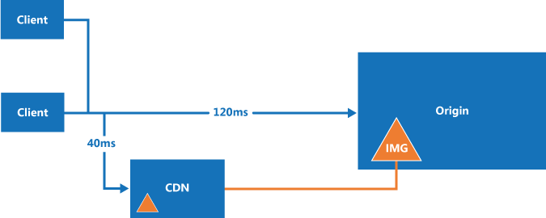

<properties
   pageTitle="Content Delivery Network (CDN) guidance | Microsoft Azure"
   description="Guidance on Content Delivery Network (CDN) to deliver high bandwidth content hosted in Azure."
   services="cdn"
   documentationCenter="na"
   authors="dragon119"
   manager="christb"
   editor=""
   tags=""/>

<tags
   ms.service="best-practice"
   ms.devlang="na"
   ms.topic="article"
   ms.tgt_pltfrm="na"
   ms.workload="na"
   ms.date="03/17/2016"
   ms.author="masashin"/>

# Content Delivery Network (CDN) guidance

[AZURE.INCLUDE [pnp-header](../includes/guidance-pnp-header-include.md)]

## Overview
The Microsoft Azure Content Delivery Network (CDN) offers developers a global solution for delivering high-bandwidth content that is hosted in Azure or any other location. Using the CDN, you can cache publicly available objects loaded from Azure blob storage, a web application, virtual machine, application folder, or other HTTP/HTTPS location. The CDN cache can be held at strategic locations to provide maximum bandwidth for delivering content to users. The CDN is typically used for delivering static content such as images, style sheets, documents, files, client-side scripts, and HTML pages.

You can also use the CDN as a cache for serving dynamic content, such as a PDF report or graph based on specified inputs; if the same input values are provided by different users the result should be the same.

The major advantages of using the CDN are lower latency and faster delivery of content to users irrespective of their geographical location in relation to the datacenter where the application is hosted.  



Using the CDN should also help to reduce the load on on application because it is relieved of the processing required to access and deliver the content. This reduction in load can help to increase the performance and scalability of the application, as well as minimizing hosting costs by reducing the processing resources required to achieve a specific level of performance and availability.

## How and why a CDN is used

Typical uses for a CDN include:  

+ Delivering static resources for client applications, often from a website. These resources can be images, style sheets, documents, files, client-side scripts, HTML pages, HTML fragments, or any other content that the server does not need to modify for each request. The application can create items at runtime and make them available to the CDN (for example, by creating a list of current news headlines), but it does not do so for each request.

+ Delivering public static and shared content to devices such as mobile phones and tablet computers. The application itself is a web service that offers an API to clients running on the various devices. The CDN can also deliver static datasets (via the web service) for the clients to use, perhaps to generate the client UI. For example, the CDN could be used to distribute JSON or XML documents.

+ Serving entire websites that consist of only public static content to clients, without requiring any dedicated compute resources.

+ Streaming video files to the client on demand. Video benefits from the low latency and reliable connectivity available from the globally located datacenters that offer CDN connections.

+ Generally improving the experience for users, especially those located far from the datacenter hosting the application. These users might otherwise suffer higher latency. A large proportion of the total size of the content in a web application is often static, and using the CDN can help to maintain performance and overall user experience while eliminating the requirement to deploy the application to multiple data centers.

+ Handling the growing load on applications that support IoT (Internet of Things) solutions. The huge numbers of such devices and appliances involved could easily overwhelm an application if it was required to process broadcast messages and manage firmware update distribution directly to each device.

+ Coping with peaks and surges in demand without requiring the application to scale, avoiding the consequent increased running costs. For example, when an update to an operating system is released for a hardware device such as a specific model of router, or for a consumer device such as a smart TV, there will be a huge peak in demand as it is downloaded by millions of users and devices over a short period.

The following list shows examples of the median time to first byte from various geographic locations. The target web role is deployed to Azure West US. There is a strong correlation between greater boost due to the CDN and proximity to a CDN node. A complete list of Azure CDN node locations is available at [Azure Content Delivery Network (CDN) Node Locations](./cdn/cdn-pop-locations.md/).


|| Time (ms) to First Byte (Origin) | Time (ms) to First (CDN) |%CDN time improvement|
|-------------|------------------------|--------------------|------------------|
|\*San Jose, CA|  47.5                  | 46.5               |         2 %  |
|\*\*Dulles, VA|     109   |     40.5   |       169% |
|Buenos Aires, AR| 210 | 151 | 39%|
|\*London, UK| 195   | 44 | 343%|
|Shanghai, CN| 242  | 206    | 17%   |
|\*Singapore | 214    | 74       | 189 %  |
|\*Tokyo, JP  |  163 |    48    |     204 %   |
|Seoul, KR|  190      |    190    |     0%   |


\* Has an Azure CDN node in the same city.  
\*\* Has an Azure CDN node in a neighboring city.  

## Challenges  

There are several challenges to take into account when planning to use the CDN:  

+ **Deployment**. You must decide the origin from which the CDN will fetch the content, and whether you need to deploy the content in more than one storage system (such as in the CDN and an alternative location).

  Your application deployment mechanism must take into account the process for deploying static content and resources as well as deploying the application files, such as ASPX pages. For example, you may need to implement a separate step to load content into Azure blob storage.

+ **Versioning and cache-control**. You must consider how you will update static content and deploy new versions. The CDN content may be [purged](./cdn/cdn-purge-endpoint.md) using the Azure Portal when new versions of your assets are available. This is a similar challenge to managing client side caching, such as that which occurs in a web browser.

+ **Testing**. It can be difficult to perform local testing of your CDN settings when developing and testing an application locally or in a staging environment.

+ **Search engine optimisation (SEO)**. Content such as images and documents are served from a different domain when you use the CDN. This can have an effect on SEO for this content.

+ **Content security**. Many CDN services such as Azure CDN do not currently offer any type of access control for the content.

+ **Client security**. Clients might connect from an environment that does not allow access to resources on the CDN. This could be a security-constrained environment that limits access to only a set of known sources, or one that prevents loading of resources from anything other than the page origin. A fallback implementation is required to handle these cases.

+ **Resilience**. The CDN is a potential single point of failure for an application. It has a lower availability SLA than blob storage (which can be used to deliver content directly) so you may need to consider implementing a fallback mechanism for critical content.

  You can monitor your CDN content availability, bandwidth, data transferred, hits, cache hit ratio and cache metrics from the Azure Portal in [real-time](./cdn/cdn-real-time-stats.md) and [aggregate reports](./cdn/cdn-analyze-usage-patterns.md).

Scenarios where CDN may be less useful include:  

+ If the content has a low hit rate it might be accessed only few times while it is valid (determined by its time-to-live setting). The first time an item is downloaded you incur two transaction charges from the origin to the CDN, and then from the CDN to the customer.

+ If the data is private, such as for large enterprises or supply chain ecosystems.


## General guidelines and good practices

Using the CDN is a good way to minimize the load on your application, and maximize availability and performance. You should consider adopting this strategy for all of the appropriate content and resources you application uses. Consider the points in the following sections when designing your strategy to use the CDN:  


### Origin

Deploying content through the CDN simply requires you to specify an HTTP and/or HTTPS endpoint that the CDN service will use to access and cache the content.

The endpoint can specify an Azure blob storage container that holds the static content you want to deliver through the CDN. The container must be marked as public. Only blobs in a public container that have public read access will be available through the CDN.

The endpoint can specify a folder named **cdn** in the root of one of application’s compute layers (such as a web role or a virtual machine). The results from requests for resources, including dynamic resources such as ASPX pages, will be cached on the CDN. The minimum cache period is 300 seconds. Any shorter period will prevent the content from being deployed to the CDN (see the section [cache control](#cache-control) for more information).

If you are using Azure Web Apps, the endpoint is set to the root folder of the site by selecting the site when creating the CDN instance. All of the content for the site will be available through the CDN.

In most cases, pointing your CDN endpoint at a folder within one of the compute layers of your application will offer more flexibility and control. For instance, it makes it easier to manage current and future routing requirements, and dynamically generate static content such as image thumbnails.

You can use [query strings](./cdn/cdn-query-string) to differentiate objects in the cache when content is delivered from dynamic sources, such as ASPX pages. However, this behavior can be disabled by a setting in the Azure Portal when you specify the CDN endpoint. When delivering content from blob storage, query strings are treated as string literals so two items that have the same name but different query strings will be stored as separate items on the CDN.

You can utilize URL rewriting for resources, such as scripts and other content, to avoid moving your files to the CDN origin folder.

When using Azure storage blobs to hold content for the CDN, the URL of the resources in blobs is case sensitive for the container and blob name.

When using custom origins or Azure Web Apps, you specify the path to the CDN instance in the links to resources. For example, the following specifies an image file in the **Images** folder of the site that will be delivered through the CDN:

```XML

```

### Deployment

Static content may need to be provisioned and deployed independently from the application if you do not include it in the application deployment package or process. Consider how this will affect the versioning approach you use to manage both the application components and the static resource content.

Consider how bundling (combining several files into one file) and minification (removing unnecessary characters such as white space, new line characters, comments, and other characters) for script and CSS files will be handled. These are commonly used techniques that can reduce load times for clients, and are compatible with delivering content through the CDN. For more information, see [Bundling and Minification](http://www.asp.net/mvc/tutorials/mvc-4/bundling-and-minification).

If you need to deploy the content to an additional location, this will be an extra step in the deployment process. If the application updates the content for the CDN, perhaps at regular intervals or in response to an event, it must store the updated content in any additional locations as well as the endpoint for the CDN.

You cannot set up a CDN endpoint for an application in the local Azure emulator in Visual Studio. This restriction will affect unit testing, functional testing, and final pre-deployment testing. You must allow for this by implementing an alternative mechanism. For example, you could pre-deploy the content to the CDN using a custom application or utility, and perform testing during the period in which it is cached. Alternatively, use compile directives or global constants to control from where the application loads the resources. For example, when running in debug mode it could load resources such as client-side script bundles and other content from a local folder, and use the CDN when running in release mode.

Consider which compression approach you want your CDN to support:

+ You can [enable compression](./cdn/cdn-improve-performance) on your origin server, in which case the CDN will support compression by default and deliver compressed content to clients in a format such as zip or gzip. When using an application folder as the CDN endpoint, the server may compress some content automatically in the same way as when delivering it directly to a web browser or other type of client. The format depends on the value of the **Accept-Encoding** header in the request sent by the client. In Azure the default mechanism is to automatically compress content when CPU utilization is below 50%. If you are using a cloud service to host the application, changing the settings may require using a startup task to turn on compression of dynamic output in IIS. See [Enabling gzip compression with Microsoft Azure CDN through a Web Role](http://blogs.msdn.com/b/avkashchauhan/archive/2012/03/05/enableing-gzip-compression-with-windows-azure-cdn-through-web-role.aspx) for more information.

+ You can enable compression directly on CDN edge servers, in which case the CDN will compress the files and serve it to end users. For more information, see [Azure CDN Compression](./cdn/cdn-improve-performance.md/).

### Routing and versioning

You may need to use different CDN instances at various times. For example, when you deploy a new version of the application you may want to use a new CDN and retain the old CDN (holding content in an older format) for previous versions. If you use Azure blob storage as the content origin, you can simply create a separate storage account or a separate container and point the CDN endpoint to it. If you use the *cdn* root folder within the application as the CDN endpoint you can use URL rewriting techniques to direct requests to a different folder.

Do not use the query string to denote different versions of the application in links to resources on the CDN because, when retrieving content from Azure blob storage, the query string is part of the resource name (the blob name). This approach can also affect how the client caches resources.

Deploying new versions of static content when you update an application can be a challenge if the previous resources are cached on the CDN. For more information, see the section [cache control](#cache-control").

Consider restricting the CDN content access by country. Azure CDN allows you to filter requests based on the country of origin and restrict the content delivered. For more information, see [Restrict access to your content by country](./cdn/cdn-restrict-access-by-country/).

###Cache control

Consider how to manage caching within the system. For example, when using a folder as the CDN origin you can specify the cacheability of pages that generate the content, and the content expiry time for all the resources in a specific folder. You can also specify cache properties for the CDN, and for the client using standard HTTP headers. Although you should already be managing caching on the server and client, using the CDN will help to make you more aware of how your content is cached, and where.

To prevent objects from being available on the CDN you can delete them from the origin (blob container or application *cdn* root folder), remove or delete the CDN endpoint, or, in the case of blob storage, make the container or blob private. However, items will be removed from the CDN only when their time-to-live expires. If no cache expiry period is specified (such as when content is loaded from blob storage), it will be cached on the CDN for up to 7 days.  You can also manually [purge a CDN endpoint](./cdn/cdn-purge-endpoint.md).

In a web application, you can set the caching and expiry for all content by using the *clientCache* element in the *system.webServer/staticContent* section of the web.config file. Remember that when you place a web.config file in a folder it affects the files in that folder and all subfolders.

If you create the content for the CDN dynamically (in your application code for example), ensure that you specify the *Cache.SetExpires* property on each page. The CDN will not cache the output from pages that use the default cacheability setting of *public*.  Set the cache expiry period to a suitable value to ensure that the content is not discarded and reloaded from the application at very short intervals.  

### Security

The CDN can deliver content over HTTPS (SSL) using the certificate provided by the CDN, but it will also be available over HTTP as well. You cannot block HTTP access to items in the CDN. You may need to use HTTPS to request static content that is displayed in pages loaded through HTTPS (such as a shopping cart) to avoid browser warnings about mixed content.

The Azure CDN does not provide any facilities for access control to secure access to  content. You cannot use Shared Access Signatures (SAS) with the CDN.

If you deliver client-side scripts using the CDN, you may encounter issues if these scripts use an *XMLHttpRequest* call to make HTTP requests for other resources such as data, images, or fonts in a different domain. Many web browsers prevent cross-origin resource sharing (CORS) unless the web server is configured to set the appropriate response headers. You can configure the CDN to support CORS:

+ If the origin from which you are delivering content is Azure blob storage, you can add a *CorsRule* to the service properties. The rule can specify the allowed origins for CORS requests, the allowed methods such as GET, and the maximum age in seconds for the rule (the period within which the client must request the linked resources after loading the original content). For more information, see [Cross-Origin Resource Sharing (CORS) Support for the Azure Storage Services](http://msdn.microsoft.com/library/azure/dn535601.aspx).

+ If the origin from which you are delivering content is a folder within the application, such as the *cdn* root folder, you can configure outbound rules in the application configuration file to set an *Access-Control-Allow-Origin* header on all responses. For more information about using rewrite rules, see [URL Rewrite Module](http://www.iis.net/learn/extensions/url-rewrite-module). Note that this technique is not possible when using Azure Web Sites.

### Custom domains

The Azure CDN allows you to specify a [custom domain name](./cdn/cdn-map-content-to-custom-domain.md) nd use it to access resources through the CDN. You can also set up a custom subdomain name using a *CNAME* record in your DNS. Using this approach can provide an additional layer of abstraction and control.

If you use a *CNAME*, you cannot use SSL because the CDN uses its own single SSL certificate, and this certificate will not match your custom domain/subdomain names.

### CDN fallback

You should consider how your application will cope with a failure or temporary unavailability of the CDN. Client applications may be able to use copies of the resources that were cached locally (on the client) during previous requests, or you can include code that detects failure and instead requests resources from the origin (the application folder or Azure blob container that holds the resources) if the CDN is unavailable.

### Search engine optimisation

If SEO is an important consideration in your application, perform the following tasks:

+ Include a *Rel* canonical header in each page or resource.

+ Use a *CNAME* subdomain record and access the resources using this name.

+ Consider the impact of the fact that the IP address of the CDN may be a country or region that differs from that of the application itself.

+ When using Azure blob storage as the origin, maintain the same file structure for resources on the CDN as in the application folders.


### Monitoring and logging

Include the CDN as part of your application monitoring strategy to detect and measure failures or extended latency occurrences.  Monitoring is available from the CDN profile manager located on the Azure portal site

Enable logging for the CDN and monitor this log as part of your daily operations.

Consider analyzing the CDN traffic for usage patterns. The Azure portal provides tools that enable you to monitor:
+ Bandwidth,
+ Data Transferred,
+ Hits (status codes),
+ Cache Status,
+ Cache HIT Ratio, and
+ Ratio of IPV4/IPV6 requests.

For more information, see [Analyze CDN usage patterns](./cdn/cdn-analyze-usage-patterns.md/).

### Cost implications

You are charged for outbound data transfers from the CDN.  Additionally, if you're using blob storage to host your assets, you are charged for storage transactions when the CDN loads data from your application. You should set realistic cache expiry periods for content to ensure freshness, but not so short as to cause repeated reloading of content from the application or blob storage to the CDN.

Items that are rarely downloaded will incur the two transaction charges without providing any significant reduction in server load.

### Bundling and minification

Use bundling and minification to reduce the size of resources such as JavaScript code and HTML pages stored in the CDN. This strategy can help to reduce the time taken to download these items to the client.

Bundling and minification can be handled by ASP.NET. In an MVC project, you define your bundles in *BundleConfig.cs*. A reference to the minified script bundle is created by calling the *Script.Render* method, typically in code in the view class. This reference contains a query string that includes a hash, which is based on the content of the bundle. If the bundle contents change, the generated hash will also change.  

By default, Azure CDN instances have the *Query String Status* setting disabled. In order for updated script bundles to be handled properly by the CDN, you must enable the *Query String Status* setting for the CDN instance. Note that it may take an hour or more before the setting takes effect.


## Example code
This section contains some examples of code and techniques for working with the CDN.  


### URL rewriting
The following excerpt from a Web.config file in the root of a Cloud Services hosted application demonstrates how to perform [URL rewriting](https://technet.microsoft.com/library/ee215194.aspx) when using the CDN. Requests from the CDN for content that is cached are redirected to specific folders within the application root based on the type of the resource (such as scripts and images).  


```XML
<system.webServer>
  ...
  <rewrite>
    <rules>
      <rule name="VersionedResource" stopProcessing="false">
        <match url="(.*)_v(.*)\.(.*)" ignoreCase="true" />
        <action type="Rewrite" url="{R:1}.{R:3}" appendQueryString="true" />
      </rule>
      <rule name="CdnImages" stopProcessing="true">
        <match url="cdn/Images/(.*)" ignoreCase="true" />
        <action type="Rewrite" url="/Images/{R:1}" appendQueryString="true" />
      </rule>
      <rule name="CdnContent" stopProcessing="true">
        <match url="cdn/Content/(.*)" ignoreCase="true" />
        <action type="Rewrite" url="/Content/{R:1}" appendQueryString="true" />
      </rule>
      <rule name="CdnScript" stopProcessing="true">
        <match url="cdn/Scripts/(.*)" ignoreCase="true" />
        <action type="Rewrite" url="/Scripts/{R:1}" appendQueryString="true" />
      </rule>
      <rule name="CdnScriptBundles" stopProcessing="true">
        <match url="cdn/bundles/(.*)" ignoreCase="true" />
        <action type="Rewrite" url="/bundles/{R:1}" appendQueryString="true" />
      </rule>
    </rules>
  </rewrite>
  ...
</system.webServer>
```

These rewrite rules perform the following redirections:

+ The first rule allows you to embed a version in the file name of a resource, which is then ignored. For example, *Filename_v123.jpg *is rewritten as *Filename.jpg*.

+ The next four rules show how to redirect requests if you do not want to store the resources in a folder named *cdn** in the root of the web role. The rules map the *cdn/Images*, *cdn/Content*, *cdn/Scripts*, and *cdn/bundles* URLs to their respective root folders in the web role.

Note that using URL rewriting requires you to make some changes to the bundling of resources.   

## More information


+ [Azure CDN](https://azure.microsoft.com/services/cdn/)
+ [Azure Content Delievery Network (CDN) Documentation](https://azure.microsoft.com/documentation/services/cdn/)
+ [Serve Content from Azure CDN in Your Web Application](./cdn/cdn-serve-content-from-cdn-in-your-web-application/)
+ [Integrate a cloud service with Azure CDN](./cdn/cdn-cloud-service-with-cdn.md/)
+ [Best Practices for the Microsoft Azure Content Delivery Network](https://azure.microsoft.com/blog/2011/03/18/best-practices-for-the-windows-azure-content-delivery-network/)
