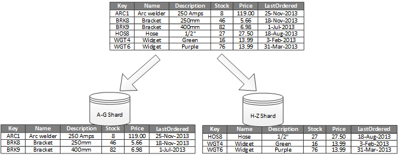
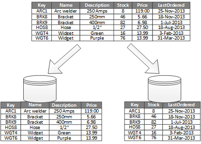
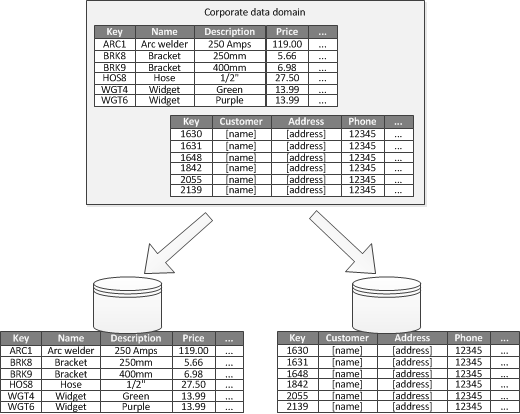
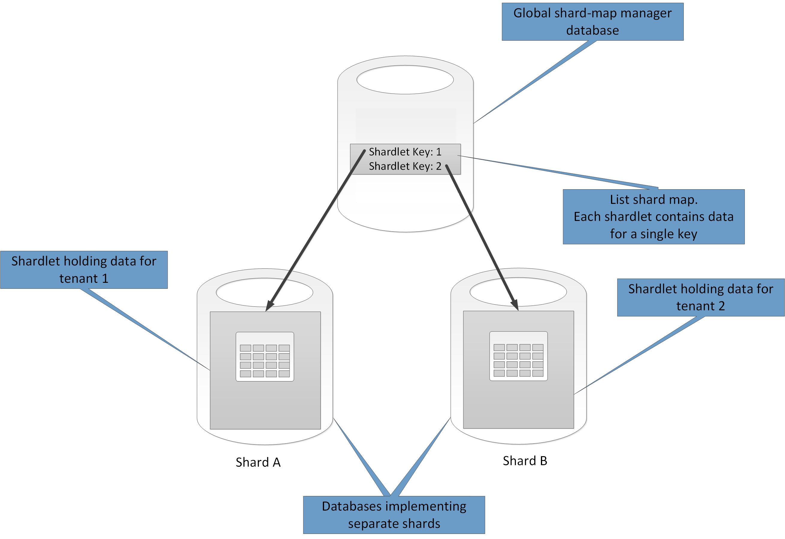
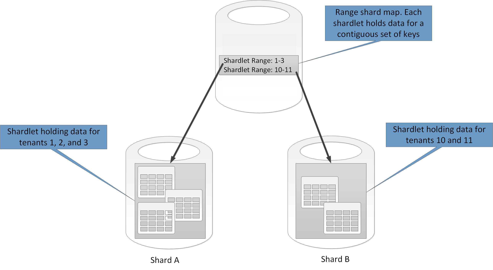
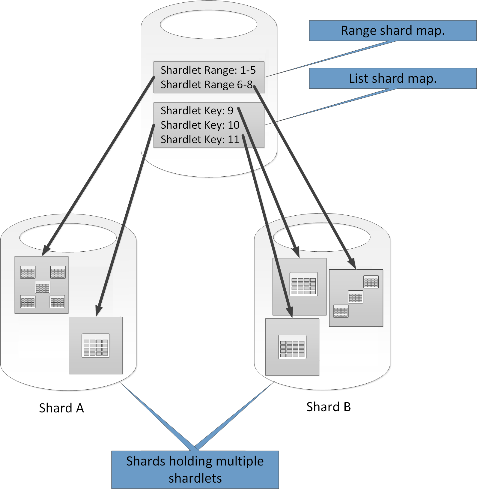
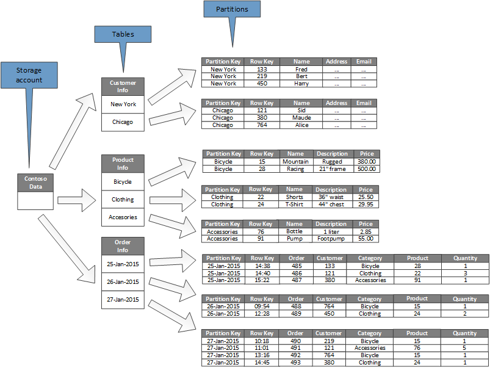
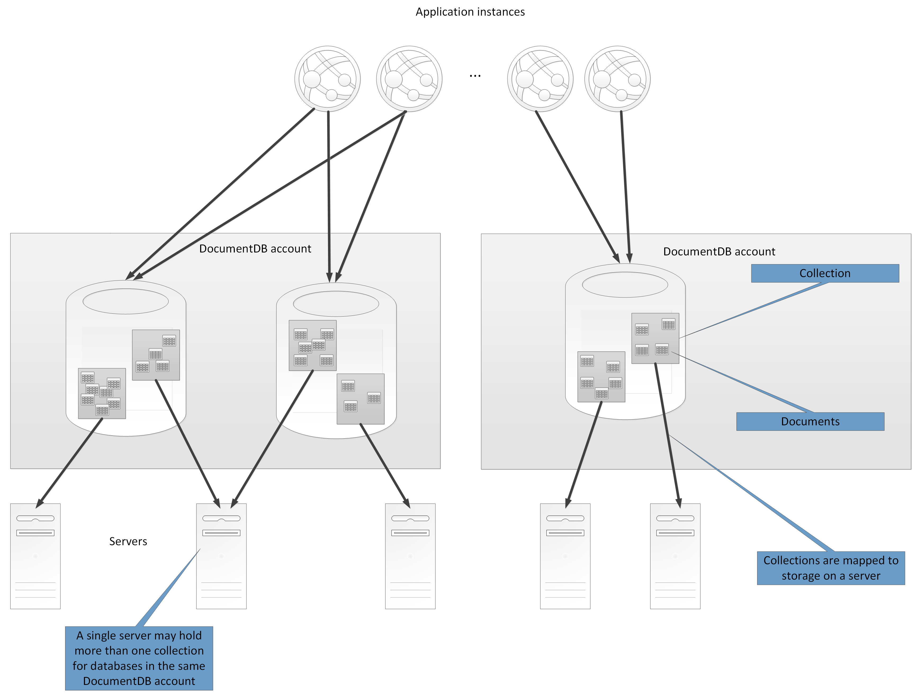
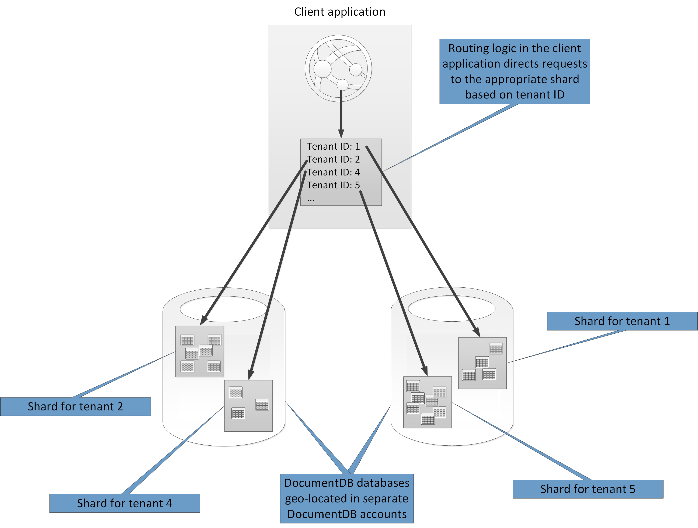
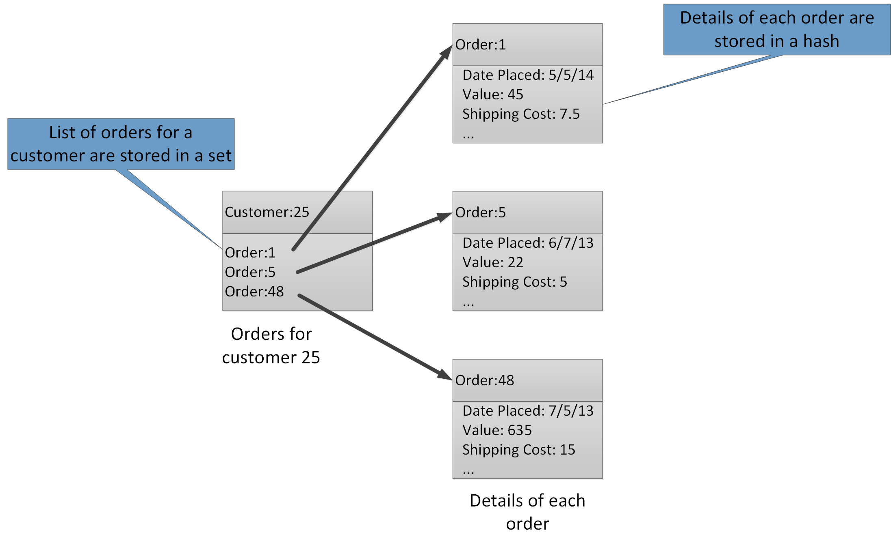

<properties
   pageTitle="Data partitioning guidance | Microsoft Azure"
   description="Guidance for how to separate partitions to be managed and accessed separately."
   services=""
   documentationCenter="na"
   authors="dragon119"
   manager="christb"
   editor=""
   tags=""/>

<tags
   ms.service="best-practice"
   ms.devlang="na"
   ms.topic="article"
   ms.tgt_pltfrm="na"
   ms.workload="na"
   ms.date="07/14/2016"
   ms.author="masashin"/>

# Data partitioning guidance

[AZURE.INCLUDE [pnp-header](../includes/guidance-pnp-header-include.md)]

## Overview

In many large-scale solutions, data is divided into separate partitions that can be managed and accessed separately. The partitioning strategy must be chosen carefully to maximize the benefits while minimizing adverse effects. Partitioning can help improve scalability, reduce contention, and optimize performance. Another benefit of partitioning is that it can provide a mechanism for dividing data by the pattern of use. For example, you can archive older, less active (cold) data in cheaper data storage.

## Why partition data?

Most cloud applications and services store and retrieve data as part of their operations. The design of the data stores that an application uses can have a significant bearing on the performance, throughput, and scalability of a system. One technique that is commonly applied in large-scale systems is to divide the data into separate partitions.

> The term _partitioning_ that's used in this guidance refers to the process of physically dividing data into separate data stores. This is not the same as SQL Server table partitioning, which is a different concept.

Partitioning data can offer a number of benefits. For example, it can be applied in order to:

- **Improve scalability**. When you scale up a single database system, it will eventually reach a physical hardware limit. If you divide data across multiple partitions, each of which is hosted on a separate server, you can scale out the system almost indefinitely.
- **Improve performance**. Data access operations on each partition take place over a smaller volume of data. Provided that the data is partitioned in a suitable way, partitioning can make your system more efficient. Operations that affect more than one partition can run in parallel. Each partition can be located near the application that uses it to minimize network latency.
- **Improve availability**. Separating data across multiple servers avoids a single point of failure. If a server fails, or is undergoing planned maintenance, only the data in that partition is unavailable. Operations on other partitions can continue. Increasing the number of partitions reduces the relative impact of a single server failure by reducing the percentage of data that will be unavailable. Replicating each partition can further reduce the chance of a single partition failure affecting operations. It also makes it possible to separate critical data that must be continually and highly available from low-value data that has lower availability requirements (log files, for example).
- **Improve security**. Depending on the nature of the data and how it is partitioned, it might be possible to separate sensitive and non-sensitive data into different partitions, and therefore into different servers or data stores. Security can then be specifically optimized for the sensitive data.
- **Provide operational flexibility**. Partitioning offers many opportunities for fine tuning operations, maximizing administrative efficiency, and minimizing cost. For example, you can define different strategies for management, monitoring, backup and restore, and other administrative tasks based on the importance of the data in each partition.
- **Match the data store to the pattern of use**. Partitioning allows each partition to be deployed on a different type of data store, based on cost and the built-in features that data store offers. For example, large binary data can be stored in a blob data store, while more structured data can be held in a document database. For more information, see [Building a polyglot solution] in the patterns & practices guide and [Data access for highly-scalable solutions: Using SQL, NoSQL, and polyglot persistence] on the Microsoft website.

Some systems do not implement partitioning because it is considered a cost rather than an advantage. Common reasons for this rationale include:

- Many data storage systems do not support joins across partitions, and it can be difficult to maintain referential integrity in a partitioned system. It is frequently necessary to implement joins and integrity checks in application code (in the partitioning layer), which can result in additional I/O and application complexity.
- Maintaining partitions is not always a trivial task. In a system where the data is volatile, you might need to rebalance partitions periodically to reduce contention and hot spots.
- Some common tools do not work naturally with partitioned data.

## Designing partitions

Data can be partitioned in different ways: horizontally, vertically, or functionally. The strategy you choose depends on the reason for partitioning the data, and the requirements of the applications and services that will use the data.

> [AZURE.NOTE] The partitioning schemes described in this guidance are explained in a way that is independent of the underlying data storage technology. They can be applied to many types of data stores, including relational and NoSQL databases.

### Partitioning strategies

The three typical strategies for partitioning data are:

- **Horizontal partitioning** (often called _sharding_). In this strategy, each partition is a data store in its own right, but all partitions have the same schema. Each partition is known as a _shard_ and holds a specific subset of the data, such as all the orders for a specific set of customers in an e-commerce application.
- **Vertical partitioning**. In this strategy, each partition holds a subset of the fields for items in the data store. The fields are divided according to their pattern of use. For example, frequently accessed fields might be placed in one vertical partition and less frequently accessed fields in another.
- **Functional partitioning**. In this strategy, data is aggregated according to how it is used by each bounded context in the system. For example, an e-commerce system that implements separate business functions for invoicing and managing product inventory might store invoice data in one partition and product inventory data in another.

It’s important to note that the three strategies described here can be combined. They are not mutually exclusive, and we recommend that you consider them all when you design a partitioning scheme. For example, you might divide data into shards and then use vertical partitioning to further subdivide the data in each shard. Similarly, the data in a functional partition can be split into shards (which can also be vertically partitioned).

However, the differing requirements of each strategy can raise a number of conflicting issues. You must evaluate and balance all of these when designing a partitioning scheme that meets the overall data processing performance targets for your system. The following sections explore each of the strategies in more detail.

### Horizontal partitioning (sharding)

Figure 1 shows an overview of horizontal partitioning or sharding. In this example, product inventory data is divided into shards based on the product key. Each shard holds the data for a contiguous range of shard keys (A-G and H-Z), organized alphabetically.

_Figure 1. Horizontally partitioning (sharding) data based on a partition key_

Sharding helps you spread the load over more computers, which reduces contention and improves performance. You can scale the system out by adding further shards that run on additional servers.

The most important factor when implementing this partitioning strategy is the choice of sharding key. It can be difficult to change the key after the system is in operation. The key must ensure that data is partitioned so that the workload is as even as possible across the shards.

Note that different shards do not have to contain similar volumes of data. Rather, the more important consideration is to balance the number of requests. Some shards might be very large, but each item is the subject of a low number of access operations. Other shards might be smaller, but each item is accessed much more frequently. It is also important to ensure that a single shard does not exceed the scale limits (in terms of capacity and processing resources) of the data store that's being used to host that shard.

If you use a sharding scheme, avoid creating hotspots (or hot partitions) that can affect performance and availability. For example, if you use a hash of a customer identifier instead of the first letter of a customer’s name, you prevent the unbalanced distribution that results from common and less common initial letters. This is a typical technique that helps distribute data more evenly across partitions.

Choose a sharding key that minimizes any future requirements to split large shards into smaller pieces, coalesce small shards into larger partitions, or change the schema that describes the data stored in a set of partitions. These operations can be very time consuming, and might require taking one or more shards offline while they are performed.

If shards are replicated, it might be possible to keep some of the replicas online while others are split, merged, or reconfigured. However, the system might need to limit the operations that can be performed on the data in these shards while the reconfiguration is taking place. For example, the data in the replicas can be marked as read-only to limit the scope of inconsistences that might occur while shards are being restructured.

> For more detailed information and guidance about many of these considerations, and good practice techniques for designing data stores that implement horizontal partitioning, see [Sharding pattern].

### Vertical partitioning

The most common use for vertical partitioning is to reduce the I/O and performance costs associated with fetching the items that are accessed most frequently. Figure 2 shows an example of vertical partitioning. In this example, different properties for each data item are held in different partitions. One partition holds data that is accessed more frequently, including the name, description, and price information for products. Another holds the volume in stock and the last ordered date.

_Figure 2. Vertically partitioning data by its pattern of use_

In this example, the application regularly queries the product name, description, and price when displaying the product details to customers. The stock level and date when the product was last ordered from the manufacturer are held in a separate partition because these two items are commonly used together.

This partitioning scheme has the added advantage that the relatively slow-moving data (product name, description, and price) is separated from the more dynamic data (stock level and last ordered date). An application might find it beneficial to cache the slow-moving data in memory if it is frequently accessed.

Another typical scenario for this partitioning strategy is to maximize the security of sensitive data. For example, you can do this by storing credit card numbers and the corresponding card security verification numbers in separate partitions.

Vertical partitioning can also reduce the amount of concurrent access that's needed to the data.

> Vertical partitioning operates at the entity level within a data store, partially normalizing an entity to break it down from a _wide_ item to a set of _narrow_ items. It is ideally suited for column-oriented data stores such as HBase and Cassandra. If the data in a collection of columns is unlikely to change, you can also consider using column stores in SQL Server.

### Functional partitioning

For systems where it is possible to identify a bounded context for each distinct business area or service in the application, functional partitioning provides a technique for improving isolation and data access performance. Another common use of functional partitioning is to separate read-write data from read-only data that's used for reporting purposes. Figure 3 shows an overview of functional partitioning where inventory data is separated from customer data.

_Figure 3. Functionally partitioning data by bounded context or subdomain_

This partitioning strategy can help reduce data access contention across different parts of a system.

## Designing partitions for scalability

It's vital to consider size and workload for each partition and balance them so that data is distributed to achieve maximum scalability. However, you must also partition the data so that it does not exceed the scaling limits of a single partition store.

Follow these steps when designing partitions for scalability:

1. Analyze the application to understand the data access patterns, such as the size of the result set returned by each query, the frequency of access, the inherent latency, and the server-side compute processing requirements. In many cases, a few major entities will demand most of the processing resources.
2. Use this analysis to determine the current and future scalability targets, such as data size and workload. Then distribute the data across the partitions to meet the scalability target. In the horizontal partitioning strategy, choosing the appropriate shard key is important to make sure distribution is even. For more information, see the [Sharding pattern].
3. Make sure that the resources available to each partition are sufficient to handle the scalability requirements in terms of data size and throughput. For example, the node that's hosting a partition might impose a hard limit on the amount of storage space, processing power, or network bandwidth that it provides. If the data storage and processing requirements are likely to exceed these limits, it might be necessary to refine your partitioning strategy or split data out further. For example, one scalability approach might be to separate logging data from the core application features. You do this by using separate data stores to prevent the total data storage requirements from exceeding the scaling limit of the node. If the total number of data stores exceeds the node limit, it might be necessary to use separate storage nodes.
4. Monitor the system under use to verify that the data is distributed as expected and that the partitions can handle the load that is imposed on them. It's possible that the usage does not match the usage that's anticipated by the analysis. In that case, it might be possible to rebalance the partitions. Failing that, it might be necessary to redesign some parts of the system to gain the required balance.

Note that some cloud environments allocate resources in terms of infrastructure boundaries. Ensure that the limits of your selected boundary provide enough room for any anticipated growth in the volume of data, in terms of data storage, processing power, and bandwidth.

For example, if you use Azure table storage, a busy shard might require more resources than are available to a single partition to handle requests. (There is a limit to the volume of requests that can be handled by a single partition in a particular period of time. See the page [Azure storage scalability and performance targets] on the Microsoft website for more details.)

 If this is the case, the shard might need to be repartitioned to spread the load. If the total size or throughput of these tables exceeds the capacity of a storage account, it might be necessary to create additional storage accounts and spread the tables across these accounts. If the number of storage accounts exceeds the number of accounts that are available to a subscription, then it might be necessary to use multiple subscriptions.

## Designing partitions for query performance

Query performance can often be boosted by using smaller data sets and by running parallel queries. Each partition should contain a small proportion of the entire data set. This reduction in volume can improve the performance of queries. However, partitioning is not an alternative for designing and configuring a database appropriately. For example, make sure that you have the necessary indexes in place if you are using a relational database.

Follow these steps when designing partitions for query performance:

1. Examine the application requirements and performance:
	- Use the business requirements to determine the critical queries that must always perform quickly.
	- Monitor the system to identify any queries that perform slowly.
	- Establish which queries are performed most frequently. A single instance of each query might have minimal cost, but the cumulative consumption of resources could be significant. It might be beneficial to separate the data that's retrieved by these queries into a distinct partition, or even a cache.
2. Partition the data that is causing slow performance:
	- Limit the size of each partition so that the query response time is within target.
	- Design the shard key so that the application can easily find the partition if you are implementing horizontal partitioning. This prevents the query from having to scan through every partition.
	- Consider the location of a partition. If possible, try to keep data in partitions that are geographically close to the applications and users that access it.
3. If an entity has throughput and query performance requirements, use functional partitioning based on that entity. If this still doesn't satisfy the requirements, apply horizontal partitioning as well. In most cases a single partitioning strategy will suffice, but in some cases it is more efficient to combine both strategies.
4. Consider using asynchronous queries that run in parallel across partitions to improve performance.

## Designing partitions for availability

Partitioning data can improve the availability of applications by ensuring that the entire dataset does not constitute a single point of failure and that individual subsets of the dataset can be managed independently. Replicating partitions that contain critical data can also improve availability.

When designing and implementing partitions, consider the following factors that affect availability:

- **How critical the data is to business operations**. Some data might include critical business information such as invoice details or bank transactions. Other data might include less critical operational data, such as log files, performance traces, and so on. After identifying each type of data, consider:
	- Storing critical data in highly-available partitions with an appropriate backup plan.
	- Establishing separate management and monitoring mechanisms or procedures for the different criticalities of each dataset. Place data that has the same level of criticality in the same partition so that it can be backed up together at an appropriate frequency. For example, partitions that hold data for bank transactions might need to be backed up more frequently than partitions that hold logging or trace information.
- **How individual partitions can be managed**. Designing partitions to support independent management and maintenance provides several advantages. For example:
	- If a partition fails, it can be recovered independently without affecting instances of applications that access data in other partitions.
	- Partitioning data by geographical area allows scheduled maintenance tasks to occur at off-peak hours for each location. Ensure that partitions are not too big to prevent any planned maintenance from being completed during this period.
- **Whether to replicate critical data across partitions**. This strategy can improve availability and performance, although it can also introduce consistency issues. It takes time for changes made to data in a partition to be synchronized with every replica. During this period, different partitions will contain different data values.

## Understanding how partitioning affects design and development

Using partitioning adds complexity to the design and development of your system. Consider partitioning as a fundamental part of system design even if the system initially only contains a single partition. If you address partitioning as an afterthought, when the system starts to suffer performance and scalability issues, the complexity increases because you already have a live system to maintain.

If you update the system to incorporate partitioning in this environment, it necessitates modifying the data access logic. It can also involve migrating large quantities of existing data to distribute it across partitions, often while users expect to be able to continue using the system.

In some cases, partitioning is not considered important because the initial dataset is small and can be easily handled by a single server. This might be true in a system that is not expected to scale beyond its initial size, but many commercial systems need to expand as the number of users increases. This expansion is typically accompanied by a growth in the volume of data.

It's also important to understand that partitioning is not always a function of large data stores. For example, a small data store might be heavily accessed by hundreds of concurrent clients. Partitioning the data in this situation can help to reduce contention and improve throughput.

Consider the following points when you design a data partitioning scheme:

- **Where possible, keep data for the most common database operations together in each partition to minimize cross-partition data access operations**. Querying across partitions can be more time-consuming than querying only within a single partition, but optimizing partitions for one set of queries might adversely affect other sets of queries. When you can't avoid querying across partitions, minimize query time by running parallel queries and aggregating the results within the application. This approach might not be possible in some cases, such as when it's necessary to obtain a result from one query and use it in the next query.
- **If queries make use of relatively static reference data, such as postal code tables or product lists, consider replicating this data in all of the partitions to reduce the requirement for separate lookup operations in different partitions**. This approach can also reduce the likelihood of the reference data becoming a "hot" dataset that is subject to heavy traffic from across the entire system. However,   there is an additional cost associated with synchronizing any changes that might occur to this reference data.
- **Where possible, minimize requirements for referential integrity across vertical and functional partitions**. In these schemes, the application itself is responsible for maintaining referential integrity across partitions when data is updated and consumed. Queries that must join data across multiple partitions run more slowly than queries that join data only within the same partition because the application typically needs to perform consecutive queries based on a key and then on a foreign key. Instead, consider replicating or de-normalizing the relevant data. To minimize the query time where cross-partition joins are necessary, run parallel queries over the partitions and join the data within the application.
- **Consider the effect that the partitioning scheme might have on the data consistency across partitions.** Evaluate whether strong consistency is actually a requirement. Instead, a common approach in the cloud is to implement eventual consistency. The data in each partition is updated separately, and the application logic ensures that the updates are all completed successfully. It also handles the inconsistencies that can arise from querying data while an eventually consistent operation is running. For more information about implementing eventual consistency, see the [Data consistency primer].
- **Consider how queries locate the correct partition**. If a query must scan all partitions to locate the required data, there is a significant impact on performance, even when multiple parallel queries are running. Queries that are used with vertical and functional partitioning strategies can naturally specify the partitions. However, horizontal partitioning (sharding) can make locating an item difficult because every shard has the same schema. A typical solution for sharding is to maintain a map that can be used to look up the shard location for specific items of data. This map can be implemented in the sharding logic of the application, or maintained by the data store if it supports transparent sharding.
- **When using a horizontal partitioning strategy, consider periodically rebalancing the shards**. This helps distribute the data evenly by size and by workload to minimize hotspots, maximize query performance, and work around physical storage limitations. However, this is a complex task that often requires the use of a custom tool or process.
- **If you replicate each partition, it provides additional protection against failure**. If a single replica fails, queries can be directed towards a working copy.
- **If you reach the physical limits of a partitioning strategy, you might need to extend the scalability to a different level**. For example, if partitioning is at the database level, you might need to locate or replicate partitions in multiple databases. If partitioning is already at the database level, and physical limitations are an issue, it might mean that you need to locate or replicate partitions in multiple hosting accounts.
- **Avoid transactions that access data in multiple partitions**. Some data stores implement transactional consistency and integrity for operations that modify data, but only when the data is located in a single partition. If you need transactional support across multiple partitions, you will probably need to implement this as part of your application logic because most partitioning systems do not provide native support.

All data stores require some operational management and monitoring activity. The tasks can range from loading data, backing up and restoring data, reorganizing data, and ensuring that the system is performing correctly and efficiently.

Consider the following factors that affect operational management:

- **How to implement appropriate management and operational tasks when the data is partitioned**. These tasks might include backup and restore, archiving data, monitoring the system, and other administrative tasks. For example, maintaining logical consistency during backup and restore operations can be a challenge.
- **How to load the data into multiple partitions and add new data that's arriving from other sources**. Some tools and utilities might not support sharded data operations such as loading data into the correct partition. This means that you might have to create or obtain new tools and utilities.
- **How to archive and delete the data on a regular basis**. To prevent the excessive growth of partitions, you need to archive and delete data on a regular basis (perhaps monthly). It might be necessary to transform the data to match a different archive schema.
- **How to locate data integrity issues**. Consider running a periodic process to locate any data integrity issues such as data in one partition that references missing information in another. The process can either attempt to fix these issues automatically or raise an alert to an operator to correct the problems manually. For example, in an e-commerce application, order information might be held in one partition but the line items that constitute each order might be held in another. The process of placing an order needs to add data to other partitions. If this process fails, there might be line items stored for which there is no corresponding order.

Different data storage technologies typically provide their own features to support partitioning. The following sections summarize the options that are implemented by data stores commonly used by Azure applications. They also describe considerations for designing applications that can best take advantage of these features.

## Partitioning strategies for Azure SQL Database

Azure SQL Database is a relational database-as-a-service that runs in the cloud. It is based on Microsoft SQL Server. A relational database divides information into tables, and each table holds information about entities as a series of rows. Each row contains columns that hold the data for the individual fields of an entity. The page [What is Azure SQL Database?] on the Microsoft website provides detailed documentation about creating and using SQL databases.

## Horizontal partitioning with Elastic Database

A single SQL database has a limit to the volume of data that it can contain. Throughput is constrained by architectural factors and the number of concurrent connections that it supports. The Elastic Database feature of SQL Database supports horizontal scaling for a SQL database. Using Elastic Database, you can partition your data into shards that are spread across multiple SQL databases. You can also add or remove shards as the volume of data that you need to handle grows and shrinks. Using Elastic Database can also help reduce contention by distributing the load across databases.

> [AZURE.NOTE] Elastic Database is a replacement for the Federations feature of Azure SQL Database. Existing SQL Database Federation installations can be migrated to Elastic Database by using the Federations migration utility. Alternatively, you can implement your own sharding mechanism if your scenario does not lend itself naturally to the features that are provided by Elastic Database.

Each shard is implemented as a SQL database. A shard can hold more than one dataset (referred to as a _shardlet_). Each database maintains metadata that describes the shardlets that it contains. A shardlet can be a single data item, or it can be a group of items that share the same shardlet key. For example, if you are sharding data in a multitenant application, the shardlet key can be the tenant ID, and all data for a given tenant can be held as part of the same shardlet. Data for other tenants would be held in different shardlets.

It is the programmer's responsibility to associate a dataset with a shardlet key. A separate SQL database acts as a global shard map manager. This database contains a list of all the shards and shardlets in the system. A client application that accesses data connects first to the global shard map manager database to obtain a copy of the shard map (listing shards and shardlets), which it then caches locally.

The application then uses this information to route data requests to the appropriate shard. This functionality is hidden behind a series of APIs that are contained in the Azure SQL Database Elastic Database Client Library, which is available as a NuGet package. The page [Elastic Database features overview] on the Microsoft website provides a more comprehensive introduction to Elastic Database.

> [AZURE.NOTE] You can replicate the global shard map manager database to reduce latency and improve availability. If you implement the database by using one of the Premium pricing tiers, you can configure active geo-replication to continuously copy data to databases in different regions. Create a copy of the database in each region in which users are based. Then configure your application to connect to this copy to obtain the shard map.

> An alternative approach is to use Azure SQL Data Sync or an Azure Data Factory pipeline to replicate the shard map manager database across regions. This form of replication runs periodically and is more suitable if the shard map changes infrequently. Additionally, the shard map manager database does not have to be created by using a Premium pricing tier.

Elastic Database provides two schemes for mapping data to shardlets and storing them in shards:

- A **list shard map** describes an association between a single key and a shardlet. For example, in a multitenant system, the data for each tenant can be associated with a unique key and stored in its own shardlet. To guarantee privacy and isolation (that is, to prevent one tenant from exhausting the data storage resources available to others), each shardlet can be held within its own shard.

_Figure 4. Using a list shard map to store tenant data in separate shards_

- A **range shard map** describes an association between a set of contiguous key values and a shardlet. In the multitenant example described previously, as an alternative to implementing dedicated shardlets, you can group the data for a set of tenants (each with their own key) within the same shardlet. This scheme is less expensive than the first (because tenants share data storage resources), but it also creates a risk of reduced data privacy and isolation.

_Figure 5. Using a range shard map to store data for a range of tenants in a shard_

Note that a single shard can contain the data for several shardlets. For example, you can use list shardlets to store data for different non-contiguous tenants in the same shard. You can also mix range shardlets and list shardlets in the same shard, although they will be addressed through different maps in the global shard map manager database. (The global shard map manager database can contain multiple shard maps.) Figure 6 depicts this approach.

_Figure 6. Implementing multiple shard maps_

The partitioning scheme that you implement can have a significant bearing on the performance of your system. It can also affect the rate at which shards have to be added or removed, or the rate at which data must be repartitioned across shards. Consider the following points when you use Elastic Database to partition data:

- Group data that is used together in the same shard, and avoid operations that need to access data that's held in multiple shards. Keep in mind that with Elastic Database, a shard is a SQL database in its own right, and Azure SQL Database does not support cross-database joins (which have to be performed on the client side). Remember also that in Azure SQL Database, referential integrity constraints, triggers, and stored procedures in one database cannot reference objects in another. Therefore, don't design a system that has dependencies between shards. A SQL database can, however, contain tables that hold copies of reference data frequently used by queries and other operations. These tables do not have to belong to any specific shardlet. Replicating this data across shards can help remove the need to join data that spans databases. Ideally, such data should be static or slow-moving to minimize the replication effort and reduce the chances of it becoming stale.

	> [AZURE.NOTE] Although SQL Database does not support cross-database joins, you can perform cross-shard queries with the Elastic Database API. These queries can transparently iterate through the data held in all the shardlets that are referenced by a shard map. The Elastic Database API breaks cross-shard queries down into a series of individual queries (one for each database) and then merges the results. For more information, see the page [Multi-shard querying] on the Microsoft website.

- The data stored in shardlets that belong to the same shard map should have the same schema. For example, don't create a list shard map that points to some shardlets containing tenant data and other shardlets containing product information. This rule is not enforced by Elastic Database, but data management and querying becomes very complex if each shardlet has a different schema. In the example just cited, a good is solution is to create two list shard maps: one that references tenant data and another that points to product information. Remember that the data belonging to different shardlets can be stored in the same shard.

	> [AZURE.NOTE] The cross-shard query functionality of the Elastic Database API depends on each shardlet in the shard map containing the same schema.

- Transactional operations are only supported for data that's held within the same shard, and not across shards. Transactions can span shardlets as long as they are part of the same shard. Therefore, if your business logic needs to perform transactions, either store the affected data in the same shard or implement eventual consistency. For more information, see the [Data consistency primer].
- Place shards close to the users that access the data in those shards (in other words, geo-locate the shards). This strategy helps reduce latency.
- Avoid having a mixture of highly active (hotspots) and relatively inactive shards. Try to spread the load evenly across shards. This might require hashing the shardlet keys.
- If you are geo-locating shards, make sure that the hashed keys map to shardlets held in shards stored close to the users that access that data.
- Currently, only a limited set of SQL data types are supported as shardlet keys; _int, bigint, varbinary,_ and _uniqueidentifier_. The SQL _int_ and _bigint_ types correspond to the _int_ and _long_ data types in C#, and have the same ranges. The SQL _varbinary_ type can be handled by using a _Byte_ array in C#, and the SQL _uniqueidentier_ type corresponds to the _Guid_ class in the .NET Framework.

As the name implies, Elastic Database makes it possible for a system to add and remove shards as the volume of data shrinks and grows. The APIs in the Azure SQL Database Elastic Database client library enable an application to create and delete shards dynamically (and transparently update the shard map manager). However, removing a shard is a destructive operation that also requires deleting all the data in that shard.

If an application needs to split a shard into two separate shards or combine shards, Elastic Database provides a separate split-merge service. This service runs in a cloud-hosted service (which must be created by the developer) and migrates data safely between shards. For more information, see the topic [Scaling using the Elastic Database split-merge tool] on the Microsoft website.

## Partitioning strategies for Azure Storage

Azure storage provides three abstractions for managing data:

- Table storage, which implements scalable structure storage. A table contains a collection of entities, each of which can include a set of properties and values.
- Blob storage, which supplies storage for large objects and files.
- Storage queues, which support reliable asynchronous messaging between applications.

Table storage and blob storage are essentially key-value stores that are optimized to hold structured and unstructured data respectively. Storage queues provide a mechanism for building loosely coupled, scalable applications. Table storage, blob storage, and storage queues are created within the context of an Azure storage account. Storage accounts support three forms of redundancy:

- **Locally redundant storage**, which maintains three copies of data within a single datacenter. This form of redundancy protects against hardware failure but not against a disaster that encompasses the entire datacenter.
- **Zone-redundant storage**, which maintains three copies of data spread across different datacenters within the same region (or across two geographically close regions). This form of redundancy can protect against disasters that occur within a single datacenter, but cannot protect against large-scale network disconnects that affect an entire region. Note that zone-redundant storage is currently only currently available for block blobs.
- **Geo-redundant storage**, which maintains six copies of data: three copies in one region (your local region), and another three copies in a remote region. This form of redundancy provides the highest level of disaster protection.

Microsoft has published scalability targets for Azure Storage. For more information, see the page [Azure Storage scalability and performance targets] on the Microsoft website. Currently, the total storage account capacity cannot exceed 500 TB. (This includes the size of data that's held in table storage and blob storage, as well as outstanding messages that are held in storage queue).

The maximum request rate (assuming a 1-KB entity, blob, or message size) is 20 KBps. If your system is likely to exceed these limits, consider partitioning the load across multiple storage accounts. A single Azure subscription can create up to 100 storage accounts. However, note that these limits might change over time.

## Partitioning Azure table storage

Azure table storage is a key-value store that's designed around partitioning. All entities are stored in a partition, and partitions are managed internally by Azure table storage. Each entity that's stored in a table must provide a two-part key that includes:

- **The partition key**. This is a string value that determines in which partition Azure table storage will place the entity. All entities with the same partition key will be stored in the same partition.
- **The row key**. This is another string value that identifies the entity within the partition. All entities within a partition are sorted lexically, in ascending order, by this key. The partition key/row key combination must be unique for each entity and cannot exceed 1 KB in length.

The remainder of the data for an entity consists of application-defined fields. No particular schemas are enforced, and each row can contain a different set of application-defined fields. The only limitation is that the maximum size of an entity (including the partition and row keys) is currently 1 MB. The maximum size of a table is 200 TB, although these figures might change in the future. (Check the page [Azure Storage scalability and performance targets] on the Microsoft website for the most recent information about these limits.)

If you are attempting to store entities that exceed this capacity, then consider splitting them into multiple tables. Use vertical partitioning to divide the fields into the groups that are most likely to be accessed together.

Figure 7 shows the logical structure of an example storage account (Contoso Data) for a fictitious e-commerce application. The storage account contains three tables: Customer Info, Product Info, and Order Info. Each table has multiple partitions.

In the Customer Info table, the data is partitioned according to the city in which the customer is located, and the row key contains the customer ID. In the Product Info table, the products are partitioned by product category, and the row key contains the product number. In the Order Info table, the orders are partitioned by the date on which they were placed, and the row key specifies the time the order was received. Note that all data is ordered by the row key in each partition.

_Figure 7. The tables and partitions in an example storage account_

> [AZURE.NOTE] Azure table storage also adds a timestamp field to each entity. The timestamp field is maintained by table storage and is updated each time the entity is modified and written back to a partition. The table storage service uses this field to implement optimistic concurrency. (Each time an application writes an entity back to table storage, the table storage service compares the value of the timestamp in the entity that's being written with the value that's held in table storage. If the values are different, it means that another application must have modified the entity since it was last retrieved, and the write operation fails. Don't modify this field in your own code, and don't specify a value for this field when you create a new entity.

Azure table storage uses the partition key to determine how to store the data. If an entity is added to a table with a previously unused partition key, Azure table storage creates a new partition for this entity. Other entities with the same partition key will be stored in the same partition.

This mechanism effectively implements an automatic scale-out strategy. Each partition is stored on a single server in an Azure datacenter to help ensure that queries that retrieve data from a single partition run quickly. However, different partitions can be distributed across multiple servers. Additionally, a single server can host multiple partitions if these partitions are limited in size.

Consider the following points when you design your entities for Azure table storage:

- The selection of partition key and row key values should be driven by the way in which the data is accessed. Choose a partition key/row key combination that supports the majority of your queries. The most efficient queries retrieve data by specifying the partition key and the row key. Queries that specify a partition key and a range of row keys can be completed by scanning a single partition. This is relatively fast because the data is held in row key order. If queries don't specify which partition to scan, the partition key might require Azure table storage to scan every partition for your data.

	> [AZURE.TIP] If an entity has one natural key, then use it as the partition key and specify an empty string as the row key. If an entity has a composite key comprising two properties, select the slowest changing property as the partition key and the other as the row key. If an entity has more than two key properties, use a concatenation of properties to provide the partition and row keys.

- If you regularly perform queries that look up data by using fields other than the partition and row keys, consider implementing the [index table pattern].
- If you generate partition keys by using a monotonic increasing or decreasing sequence (such as "0001", "0002", "0003", and so on) and each partition only contains a limited amount of data, then Azure table storage can physically group these partitions together on the same server. This mechanism assumes that the application is most likely to perform queries across a contiguous range of partitions (range queries) and is optimized for this case. However, this approach can lead to hotspots focused on a single server because all insertions of new entities are likely to be concentrated at one end or the other of the contiguous ranges. It can also reduce scalability. To spread the load more evenly across servers, consider hashing the partition key to make the sequence more random.
- Azure table storage supports transactional operations for entities that belong to the same partition. This means that an application can perform multiple insert, update, delete, replace, or merge operations as an atomic unit (as long as the transaction doesn't include more than 100 entities and the payload of the request doesn't exceed 4 MB). Operations that span multiple partitions are not transactional, and might require you to implement eventual consistency as described by the [Data consistency primer]. For more information about table storage and transactions, go to the page [Performing entity group transactions] on the Microsoft website.
- Give careful attention to the granularity of the partition key because of the following reasons:
	- Using the same partition key for every entity causes the table storage service to create a single large partition that's held on one server. This prevents it from scaling out and instead focuses the load on a single server. As a result, this approach is only suitable for systems that manage a small number of entities. However, this approach does ensure that all entities can participate in entity group transactions.
	- Using a unique partition key for every entity causes the table storage service to create a separate partition for each entity, possibly resulting in a large number of small partitions (depending on the size of the entities). This approach is more scalable than using a single partition key, but entity group transactions are not possible. Also, queries that fetch more than one entity might involve reading from more than one server. However, if the application performs range queries, then using a monotonic sequence to generate the partition keys might help to optimize these queries.
	- Sharing the partition key across a subset of entities makes it possible for you to group related entities in the same partition. Operations that involve related entities can be performed by using entity group transactions, and queries that fetch a set of related entities can be satisfied by accessing a single server.

For additional information about partitioning data in Azure table storage, see the article [Azure storage table design guide] on the Microsoft website.

## Partitioning Azure blob storage

Azure blob storage makes it possible to hold large binary objects--currently up to 200 GB in size for block blobs or 1 TB for page blobs. (For the most recent information, go to the page [Azure Storage scalability and performance targets] on the Microsoft website.) Use block blobs in scenarios such as streaming where you need to upload or download large volumes of data quickly. Use page blobs for applications that require random rather than serial access to parts of the data.

Each blob (either block or page) is held in a container in an Azure storage account. You can use containers to group related blobs that have the same security requirements, although this grouping is logical rather than physical. Inside a container, each blob has a unique name.

Blob storage is automatically partitioned based on the blob name. Each blob is held in its own partition. Blobs in the same container do not share a partition. This architecture helps Azure blob storage to balance the load across servers transparently because different blobs in the same container can be distributed across different servers.

The actions of writing a single block (block blob) or page (page blob) are atomic, but operations that span blocks, pages, or blobs are not. If you need to ensure consistency when performing write operations across blocks, pages, and blobs, take out a write lock by using a blob lease.

Azure blob storage supports transfer rates of up to 60 MB per second or 500 requests per second for each blob. If you anticipate surpassing these limits, and the blob data is relatively static, then consider replicating blobs by using the Azure Content Delivery Network. For more information, see the page [Using Delivery Content Network for Azure] on the Microsoft website. For additional guidance and considerations, see  [Using Content Delivery Network for Azure].

## Partitioning Azure storage queues

Azure storage queues enable you to implement asynchronous messaging between processes. An Azure storage account can contain any number of queues, and each queue can contain any number of messages. The only limitation is the space that's available in the storage account. The maximum size of an individual message is 64 KB. If you require messages bigger than this, then consider using Azure Service Bus queues instead.

Each storage queue has a unique name within the storage account that contains it. Azure partitions queues based on the name. All messages for the same queue are stored in the same partition, which is controlled by a single server. Different queues can be managed by different servers to help balance the load. The allocation of queues to servers is transparent to applications and users.

 In a large-scale application, don't use the same storage queue for all instances of the application because this approach might cause the server that's hosting the queue to become a hotspot. Instead, use different queues for different functional areas of the application. Azure storage queues do not support transactions, so directing messages to different queues should have little impact on messaging consistency.

An Azure storage queue can handle up to 2,000 messages per second.  If you need to process messages at a greater rate than this, consider creating multiple queues. For example, in a global application, create separate storage queues in separate storage accounts to handle application instances that are running in each region.

## Partitioning strategies for Azure Service Bus

Azure Service Bus uses a message broker to handle messages that are sent to a Service Bus queue or topic. By default, all messages that are sent to a queue or topic are handled by the same message broker process. This architecture can place a limitation on the overall throughput of the message queue. However, you can also partition a queue or topic when it is created. You do this by setting the _EnablePartitioning_ property of the queue or topic description to _true_.

A partitioned queue or topic is divided into multiple fragments, each of which is backed by a separate message store and message broker. Service Bus takes responsibility for creating and managing these fragments. When an application posts a message to a partitioned queue or topic, Service Bus assigns the message to a fragment for that queue or topic. When an application receives a message from a queue or subscription, Service Bus checks each fragment for the next available message and then passes it to the application for processing.

This structure helps distribute the load across message brokers and message stores, increasing scalability and improving availability. If the message broker or message store for one fragment is temporarily unavailable, Service Bus can retrieve messages from one of the remaining available fragments.

Service Bus assigns a message to a fragment as follows:

- If the message belongs to a session, all messages with the same value for the _ SessionId_  property are sent to the same fragment.
- If the message does not belong to a session, but the sender has specified a value for the _PartitionKey_ property, then all messages with the same _PartitionKey_ value are sent to the same fragment.

	> [AZURE.NOTE] If the _SessionId_ and _PartitionKey_ properties are both specified, then they must be set to the same value or the message will be rejected.
- If the _SessionId_ and _PartitionKey_ properties for a message are not specified, but duplicate detection is enabled, the _MessageId_ property will be used. All messages with the same _MessageId_ will be directed to the same fragment.
- If messages do not include a _SessionId, PartitionKey,_ or _MessageId_ property, then Service Bus assigns messages to fragments sequentially. If a fragment is unavailable, Service Bus will move on to the next. This means that a temporary fault in the messaging infrastructure does not cause the message-send operation to fail.

Consider the following points when deciding if or how to partition a Service Bus message queue or topic:

- Service Bus queues and topics are created within the scope of a Service Bus namespace. Service Bus currently allows up to 100 partitioned queues or topics per namespace.
- Each Service Bus namespace imposes quotas on the available resources, such as the number of subscriptions per topic, the number of concurrent send and receive requests per second, and the maximum number of concurrent connections that can be established. These quotas are documented on the Microsoft website on the page [Service Bus quotas]. If you expect to exceed these values, then create additional namespaces with their own queues and topics, and spread the work across these namespaces. For example, in a global application, create separate namespaces in each region and configure application instances to use the queues and topics in the nearest namespace.
- Messages that are sent as part of a transaction must specify a partition key. This can be a _SessionId_, _PartitionKey_, or _MessageId_ property. All messages that are sent as part of the same transaction must specify the same partition key because they must be handled by the same message broker process. You cannot send messages to different queues or topics within the same transaction.
- Partitioned queues and topics can't be configured to be automatically deleted when they become idle.
- Partitioned queues and topics can't currently be used with the Advanced Message Queuing Protocol (AMQP) if you are building cross-platform or hybrid solutions.

## Partitioning strategies for Azure DocumentDB databases

Azure DocumentDB is a NoSQL database that can store documents. A document in a DocumentDB database is a JSON-serialized representation of an object or other piece of data. No fixed schemas are enforced except that every document must contain a unique ID.

Documents are organized into collections. You can group related documents together in a collection. For example, in a system that maintains blog postings, you can store the contents of each blog post as a document in a collection. You can also create collections for each subject type. Alternatively, in a multitenant application, such as a system where different authors control and manage their own blog posts, you can partition blogs by author and create separate collections for each author. The storage space that's allocated to collections is elastic and can shrink or grow as needed.

Document collections provide a natural mechanism for partitioning data within a single database. Internally, a DocumentDB database can span several servers and might attempt to spread the load by distributing collections across servers. The simplest way to implement sharding is to create a collection for each shard.

> [AZURE.NOTE] Each DocumentDB database has a _performance level_ that determines the amount of resources it gets. A performance level is associated with a _request unit_ (RU) rate limit. The RU rate limit specifies the volume of resources that's reserved and available for exclusive use by that collection. The cost of a collection depends on the performance level that's selected for that collection. The higher the performance level (and RU rate limit) the higher the charge. You can adjust the performance level of a collection by using the Azure portal. For more information, see the page [Performance levels in DocumentDB] on the Microsoft website.

All databases are created in the context of a DocumentDB account. A single DocumentDB account can contain several databases, and it specifies in which region the databases are created. Each DocumentDB account also enforces its own access control. You can use DocumentDB accounts to geo-locate shards (collections within databases) close to the users who need to access them, and enforce restrictions so that only those users can connect to them.

Each DocumentDB account has a quota that limits the number of databases and collections that it can contain and the amount of document storage that's available. These limits are subject to change, but are described on the page [DocumentDB limits and quotas] on the Microsoft website. It is theoretically possible that if you implement a system where all shards belong to the same database, you might reach the storage capacity limit of the account.

In this case, you might need to create additional DocumentDB accounts and databases, and distribute the shards across these databases. However, even if you are unlikely to reach the storage capacity of a database, it's a good practice to use multiple databases. That's because each database has its own set of users and permissions, and you can use this mechanism to isolate access to collections on a per-database basis.

Figure 8 illustrates the high-level structure of the DocumentDB architecture.

_Figure 8.  The structure of the DocumentDB architecture_

It is the task of the client application to direct requests to the appropriate shard, usually by implementing its own mapping mechanism based on some attributes of the data that define the shard key. Figure 9 shows two DocumentDB databases, each containing two collections that are acting as shards. The data is sharded by a tenant ID and contains the data for a specific tenant. The databases are created in separate DocumentDB accounts. These accounts are located in the same region as the tenants for which they contain data. The routing logic in the client application uses the tenant ID as the shard key.

_Figure 9. Implementing sharding using an Azure DocumentDB database_

Consider the following points when deciding how to partition data with a DocumentDB database:

- **The resources available to a DocumentDB database are subject to the quota limitations of the DocumentDB account**. Each database can hold a number of collections (again, there is a limit), and each collection is associated with a performance level that governs the RU rate limit (reserved throughput) for that collection. For more information, go to the page [DocumentDB limits and quotas] on the Microsoft website.
- **Each document must have an attribute that can be used to uniquely identify that document within the collection in which it is held**. This attribute is different from the shard key, which defines which collection holds the document. A collection can contain a large number of documents. In theory, it's limited only by the maximum length of the document ID. The document ID can be up to 255 characters.
- **All operations against a document are performed within the context of a transaction. Transactions in DocumentDB databases are scoped to the collection in which the document is contained.** If an operation fails, the work that it has performed is rolled back. While a document is subject to an operation, any changes that are made are subject to snapshot-level isolation. This mechanism guarantees that if, for example, a request to create a new document fails, another user who's querying the database simultaneously will not see a partial document that is then removed.
- **DocumentDB database queries are also scoped to the collection level**. A single query can retrieve data from only one collection. If you need to retrieve data from multiple collections, you must query each collection individually and merge the results in your application code.
- **DocumentDB databases supports programmable items that can all be stored in a collection alongside documents**. These include stored procedures, user-defined functions, and triggers (written in JavaScript). These items can access any document within the same collection. Furthermore, these items run either inside the scope of the ambient transaction (in the case of a trigger that fires as the result of a create, delete, or replace operation performed against a document), or by starting a new transaction (in the case of a stored procedure that is run as the result of an explicit client request). If the code in a programmable item throws an exception, the transaction is rolled back. You can use stored procedures and triggers to maintain integrity and consistency between documents, but these documents must all be part of the same collection.
- **The collections that you intend to hold in the databases in a DocumentDB account should be unlikely to exceed the throughput limits defined by the performance levels of the collections**. These limits are described on the page [Manage DocumentDB capacity needs] on the Microsoft website. If you anticipate reaching these limits, consider splitting collections across databases in different DocumentDB accounts to reduce the load per collection.

## Partitioning strategies for Azure Search

The ability to search for data is often the primary method of navigation and exploration that's provided by many web applications. It helps users find resources quickly (for example, products in an e-commerce application) based on combinations of search criteria. The Azure Search service provides full-text search capabilities over web content, and includes features such as type-ahead, suggested queries based on near matches, and faceted navigation. A full description of these capabilities is available on the page [What is Azure Search?] on the Microsoft website.

Azure Search stores searchable content as JSON documents in a database. You define indexes that specify the searchable fields in these documents and provide these definitions to Azure Search. When a user submits a search request, Azure Search uses the appropriate indexes to find matching items.

To reduce contention, the storage that's used by Azure Search can be divided into 1, 2, 3, 4, 6, or 12 partitions, and each partition can be replicated up to 6 times. The product of the number of partitions multiplied by the number of replicas is called the _search unit_ (SU). A single instance of Azure Search can contain a maximum of 36 SUs (a database with 12 partitions only supports a maximum of 3 replicas).

You are billed for each SU that is allocated to your service. As the volume of searchable content increases or the rate of search requests grows, you can add SUs to an existing instance of Azure Search to handle the extra load. Azure Search itself distributes the documents evenly across the partitions. No manual partitioning strategies are currently supported.

Each partition can contain a maximum of 15 million documents or occupy 300 GB of storage space (whichever is smaller). You can create up to 50 indexes. The performance of the service varies and depends on the complexity of the documents, the available indexes, and the effects of network latency. On average, a single replica (1 SU) should be able to handle 15 queries per second (QPS), although we recommend performing benchmarking with your own data to obtain a more precise measure of throughput. For more information, see the page [Service limits in Azure Search] on the Microsoft website.

> [AZURE.NOTE] You can store a limited set of data types in searchable documents, including strings, Booleans, numeric data, datetime data, and some geographical data. For more details, see the page [Supported data types (Azure Search)] on the Microsoft website.

You have limited control over how Azure Search partitions data for each instance of the service. However, in a global environment you might be able to improve performance and reduce latency and contention further by partitioning the service itself using either of the following strategies:

- Create an instance of Azure Search in each geographic region, and ensure that client applications are directed towards the nearest available instance. This strategy requires that any updates to searchable content are replicated in a timely manner across all instances of the service.

- Create two tiers of Azure Search:
    - A local service in each region that contains the data that's most frequently accessed by users in that region. Users can direct requests here for fast but limited results.
    - A global service that encompasses all the data. Users can direct requests here for slower but more complete results.

This approach is most suitable when there is a significant regional variation in the data that's being searched.

## Partitioning strategies for Azure Redis Cache

Azure Redis Cache provides a shared caching service in the cloud that's based on the Redis key-value data store. As its name implies, Azure Redis Cache is intended as a caching solution. Use it only for holding transient data and not as a permanent data store. Applications that utilize Azure Redis Cache should be able to continue functioning if the cache is unavailable. Azure Redis Cache supports primary/secondary replication to provide high availability, but currently limits the maximum cache size to 53 GB. If you need more space than this, you must create additional caches. For more information, go to the page [Azure Redis Cache] on the Microsoft website.

Partitioning a Redis data store involves splitting the data across instances of the Redis service. Each instance constitutes a single partition. Azure Redis Cache abstracts the Redis services behind a façade and does not expose them directly. The simplest way to implement partitioning is to create multiple Azure Redis Cache instances and spread the data across them.

You can associate each data item with an identifier (a partition key) that specifies which cache stores the data item. The client application logic can then use this identifier to route requests to the appropriate partition. This scheme is very simple, but if the partitioning scheme changes (for example, if additional Azure Redis Cache instances are created), client applications might need to be reconfigured.

Native Redis (not Azure Redis Cache) supports server-side partitioning based on Redis clustering. In this approach, you can divide the data evenly across servers by using a hashing mechanism. Each Redis server stores metadata that describes the range of hash keys that the partition holds, and also contains information about which hash keys are located in the partitions on other servers.

Client applications simply send requests to any of the participating Redis servers (probably the closest one). The Redis server examines the client request. If it can be resolved locally, it performs the requested operation. Otherwise it forwards the request on to the appropriate server.

This model is implemented by using Redis clustering, and is described in more detail on the [Redis cluster tutorial] page on the Redis website. Redis clustering is transparent to client applications. Additional Redis servers can be added to the cluster (and the data can be re-partitioned) without requiring that you reconfigure the clients.

> [AZURE.IMPORTANT] Azure Redis Cache does not currently support Redis clustering. If you want to implement this approach with Azure, then you must implement your own Redis servers by installing Redis on a set of Azure virtual machines and configuring them manually. The page [Running Redis on a CentOS Linux VM in Azure] on the Microsoft website walks through an example that shows you how to build and configure a Redis node running as an Azure VM.

The page [Partitioning: how to split data among multiple Redis instances] on the Redis website provides more information about implementing partitioning with Redis. The remainder of this section assumes that you are implementing client-side or proxy-assisted partitioning.

Consider the following points when deciding how to partition data with Azure Redis Cache:

- Azure Redis Cache is not intended to act as a permanent data store, so whatever partitioning scheme you implement, your application code must be able to retrieve data from a location that's not the cache.
- Data that is frequently accessed together should be kept in the same partition. Redis is a powerful key-value store that provides several highly optimized mechanisms for structuring data. These mechanisms can be one of the following:
    - Simple strings (binary data up to 512 MB in length)
    - Aggregate types such as lists (which can act as queues and stacks)
    - Sets (ordered and unordered)
    - Hashes (which can group related fields together, such as the items that represent the fields in an object)

- The aggregate types enable you to associate many related values with the same key. A Redis key identifies a list, set, or hash rather than the data items that it contains. These types are all available with Azure Redis Cache and are described by the [Data types] page on the Redis website. For example, in part of an e-commerce system that tracks the orders that are placed by customers, the details of each customer can be stored in a Redis hash that is keyed by using the customer ID. Each hash can hold a collection of order IDs for the customer. A separate Redis set can hold the orders, again structured as hashes, and keyed by using the order ID. Figure 10 shows this structure. Note that Redis does not implement any form of referential integrity, so it is the developer's responsibility to maintain the relationships between customers and orders.

_Figure 10. Suggested structure in Redis storage for recording customer orders and their details_

> [AZURE.NOTE] In Redis, all keys are binary data values (like Redis strings) and can contain up to 512 MB of data. In theory, a key can contain almost any information. However, we recommend adopting a consistent naming convention for keys that is descriptive of the type of data and that identifies the entity, but is not excessively long. A common approach is to use keys of the form "entity_type:ID". For example, you can use "customer:99" to indicate the key for a customer with the ID 99.

- You can implement vertical partitioning by storing related information in different aggregations in the same database. For example, in an e-commerce application, you can store commonly accessed information about products in one Redis hash and less frequently used detailed information in another.
Both hashes can use the same product ID as part of the key. For example, you can use "product: _nn_" (where _nn_ is the product ID) for the product information and "product_details: _nn_" for the detailed data. This strategy can help reduce the volume of data that most queries are likely to retrieve.
- You can repartition a Redis data store, but keep in mind that it's a complex and time-consuming task. Redis clustering can repartition data automatically, but this capability is not available with Azure Redis Cache. Therefore, when you design your partitioning scheme, try to leave sufficient free space in each partition to allow for expected data growth over time. However, remember that Azure Redis Cache is intended to cache data temporarily, and that data held in the cache can have a limited lifetime specified as a time-to-live (TTL) value. For relatively volatile data, the TTL can be short, but for static data the TTL can be a lot longer. Avoid storing large amounts of long-lived data in the cache if the volume of this data is likely to fill the cache. You can specify an eviction policy that causes Azure Redis Cache to remove data if space is at a premium.

	> [AZURE.NOTE] When you use Azure Redis cache, you specify the maximum size of the cache (from 250 MB to 53 GB) by selecting the appropriate pricing tier. However, after an Azure Redis Cache has been created, you cannot increase (or decrease) its size.

- Redis batches and transactions cannot span multiple connections, so all data that is affected by a batch or transaction should be held in the same database (shard).

	> [AZURE.NOTE] A sequence of operations in a Redis transaction is not necessarily atomic. The commands that compose a transaction are verified and queued before they run. If an error occurs during this phase, the entire queue is discarded. However, after the transaction has been successfully submitted, the queued commands run in sequence. If any command fails, only that command stops running. All previous and subsequent commands in the queue are performed. For more information, go to the [Transactions] page on the Redis website.

- Redis supports a limited number of atomic operations. The only operations of this type that support multiple keys and values are MGET and MSET operations. MGET operations return a collection of values for a specified list of keys, and MSET operations store a collection of values for a specified list of keys. If you need to use these operations, the key-value pairs that are referenced by the MSET and MGET commands must be stored within the same database.

## Rebalancing partitions

As a system matures and you understand the usage patterns better, you might have to adjust the partitioning scheme. For example, individual partitions might start attracting a disproportionate volume of traffic and become hot, leading to excessive contention. Additionally, you might have underestimated the volume of data in some partitions, causing you to approach the limits of the storage capacity in these partitions. Whatever the cause, it is sometimes necessary to rebalance partitions to spread the load more evenly.

In some cases, data storage systems that don't publicly expose how data is allocated to servers can automatically rebalance partitions within the limits of the resources available. In other situations, rebalancing is an administrative task that consists of two stages:

1. Determining the new partitioning strategy to ascertain:
    - Which partitions might need to be split (or possibly combined).
    - How to allocate data to these new partitions by designing new partition keys.
2. Migrating the affected data from the old partitioning scheme to the new set of partitions.

> [AZURE.NOTE] The mapping of DocumentDB database collections to servers is transparent, but you can still reach the storage capacity and throughput limits of a DocumentDB account. If this happens, you might need to redesign your partitioning scheme and migrate the data.

Depending on the data storage technology and the design of your data storage system, you might be able to migrate data between partitions while they are in use (online migration). If this isn't possible, you might need to make the affected partitions temporarily unavailable while the data is relocated (offline migration).

## Offline migration

Offline migration is arguably the simplest approach because it reduces the chances of contention occurring. Don't make any changes to the data while it is being moved and restructured.

Conceptually, this process includes the following steps:

1. Mark the shard offline.
2. Split-merge and move the data to the new shards.
3. Verify the data.
4. Bring the new shards online.
5. Remove the old shard.

To retain some availability, you can mark the original shard as read-only in step 1 rather than making it unavailable. This allows applications to read the data while it is being moved but not to change it.

## Online migration

Online migration is more complex to perform but less disruptive to users because data remains available during the entire procedure. The process is similar to that used by offline migration, except that the original shard is not marked offline (step 1). Depending on the granularity of the migration process (for example, whether it's done item by item or shard by shard), the data access code in the client applications might have to handle reading and writing data that's held in two locations (the original shard and the new shard).

For an example of a solution that supports online migration, see the article [Scaling using the Elastic Database split-merge tool] on the Microsoft website.

## Related patterns and guidance

When considering strategies for implementing data consistency, the following patterns might also be relevant to your scenario:

- The [Data consistency primer] page on the Microsoft website describes strategies for maintaining consistency in a distributed environment such as the cloud.
- The [Data partitioning guidance] page on the Microsoft website provides a general overview of how to design partitions to meet various criteria in a distributed solution.
- The [sharding pattern] as described on the Microsoft website summarizes some common strategies for sharding data.
- The [index table pattern] as described on the Microsoft website illustrates how to create secondary indexes over data. An application can quickly retrieve data with this approach, by using queries that do not reference the primary key of a collection.
- The [materialized view pattern] as described on the Microsoft website describes how to generate pre-populated views that summarize data to support fast query operations. This approach can be useful in a partitioned data store if the partitions that contain the data being summarized are distributed across multiple sites.
- The [Using Azure Content Delivery Network] article on the Microsoft website provides additional guidance on configuring and using Content Delivery Network with Azure.

## More information

- The page [What is Azure SQL Database?] on the Microsoft website provides detailed documentation that describes how to create and use SQL databases.
- The page [Elastic Database features overview] on the Microsoft website provides a comprehensive introduction to Elastic Database.
- The page [Scaling using the Elastic Database split-merge tool] on the Microsoft website contains information about using the split-merge service to manage Elastic Database shards.
- The page [Azure storage scalability and performance targets](https://msdn.microsoft.com/library/azure/dn249410.aspx) on the Microsoft website documents the current sizing and throughput limits of Azure Storage.
- The page [Performing entity group transactions] on the Microsoft website provides detailed information about implementing transactional operations over entities that are stored in Azure table storage.
- The article [Azure Storage table design guide] on the Microsoft website contains detailed information about partitioning data in Azure table storage.
- The page [Using Azure Content Delivery Network] on the Microsoft website describes how to replicate data that's held in Azure blob storage by using the Azure Content Delivery Network.
- The page [Manage DocumentDB capacity needs] on the Microsoft website contains information about how Azure DocumentDB databases allocate resources.
- The page [What is Azure Search?] on the Microsoft website provides a full description of the capabilities that are available in Azure Search.
- The page [Service limits in Azure Search] on the Microsoft website contains information about the capacity of each instance of Azure Search.
- The page [Supported data types (Azure Search)] on the Microsoft website summarizes the data types that you can use in searchable documents and indexes.
- The page [Azure Redis Cache] on the Microsoft website provides an introduction to Azure Redis Cache.
- The [Partitioning: how to split data among multiple Redis instances] page on the Redis website provides information about how to implement partitioning with Redis.
- The page [Running Redis on a CentOS Linux VM in Azure] on the Microsoft website walks through an example that shows you how to build and configure a Redis node running as an Azure VM.
- The [Data types] page on the Redis website describes the data types that are available with Redis and Azure Redis Cache.

[Azure Redis Cache]: http://azure.microsoft.com/services/cache/
[Azure Storage Scalability and Performance Targets]: storage/storage-scalability-targets.md
[Azure Storage Table Design Guide]: storage/storage-table-design-guide.md
[Building a Polyglot Solution]: https://msdn.microsoft.com/library/dn313279.aspx
[Data Access for Highly-Scalable Solutions: Using SQL, NoSQL, and Polyglot Persistence]: https://msdn.microsoft.com/library/dn271399.aspx
[Data consistency primer]: http://aka.ms/Data-Consistency-Primer
[Data Partitioning Guidance]: https://msdn.microsoft.com/library/dn589795.aspx
[Data Types]: http://redis.io/topics/data-types
[DocumentDB limits and quotas]: documentdb/documentdb-limits.md
[Elastic Database features overview]: sql-database/sql-database-elastic-scale-introduction.md
[Federations Migration Utility]: https://code.msdn.microsoft.com/vstudio/Federations-Migration-ce61e9c1
[Index Table Pattern]: http://aka.ms/Index-Table-Pattern
[Manage DocumentDB capacity needs]: documentdb/documentdb-manage.md
[Materialized View Pattern]: http://aka.ms/Materialized-View-Pattern
[Multi-shard querying]: sql-database/sql-database-elastic-scale-multishard-querying.md
[Partitioning: how to split data among multiple Redis instances]: http://redis.io/topics/partitioning
[Performance levels in DocumentDB]: documentdb/documentdb-performance-levels.md
[Performing Entity Group Transactions]: https://msdn.microsoft.com/library/azure/dd894038.aspx
[Redis cluster tutorial]: http://redis.io/topics/cluster-tutorial
[Running Redis on a CentOS Linux VM in Azure]: http://blogs.msdn.com/b/tconte/archive/2012/06/08/running-redis-on-a-centos-linux-vm-in-windows-azure.aspx
[Scaling using the Elastic Database split-merge tool]: sql-database/sql-database-elastic-scale-overview-split-and-merge.md
[Using Azure Content Delivery Network]: cdn/cdn-create-new-endpoint.md
[Service Bus quotas]: service-bus/service-bus-quotas.md
[Service limits in Azure Search]:  search/search-limits-quotas-capacity.md
[Sharding pattern]: http://aka.ms/Sharding-Pattern
[Supported Data Types (Azure Search)]:  https://msdn.microsoft.com/library/azure/dn798938.aspx
[Transactions]: http://redis.io/topics/transactions
[What is Azure Search?]: search/search-what-is-azure-search.md
[What is Azure SQL Database?]: sql-database/sql-database-technical-overview.md
