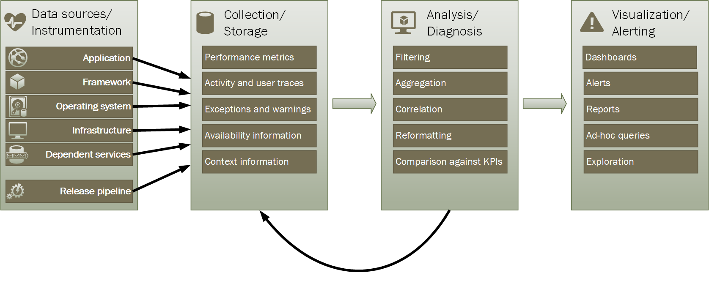
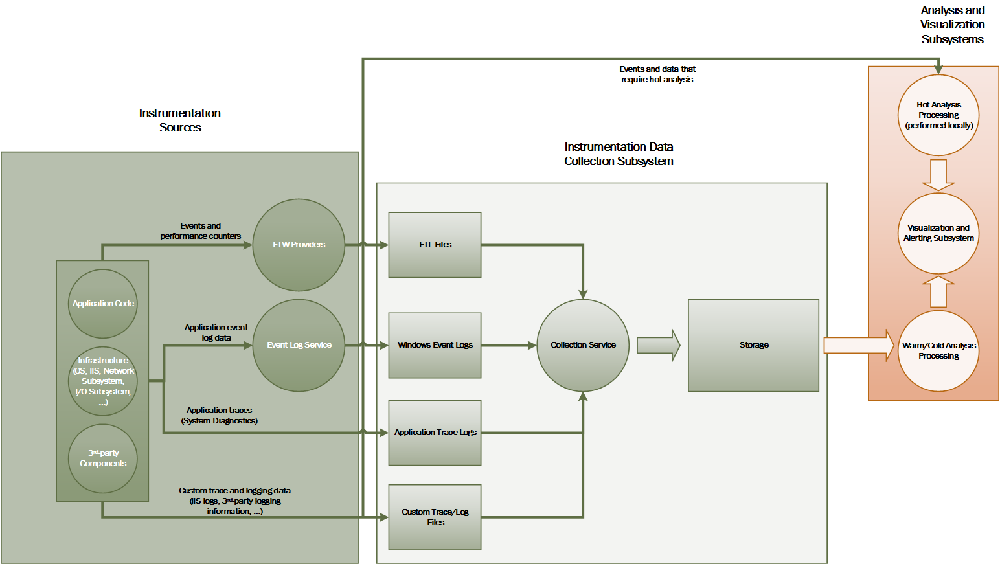
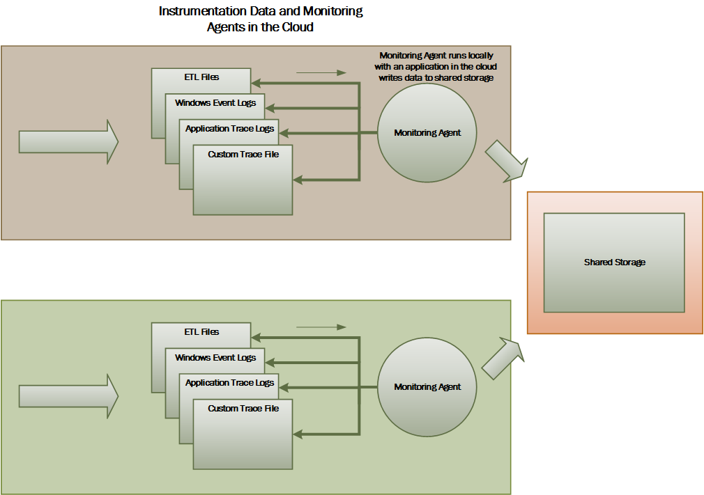
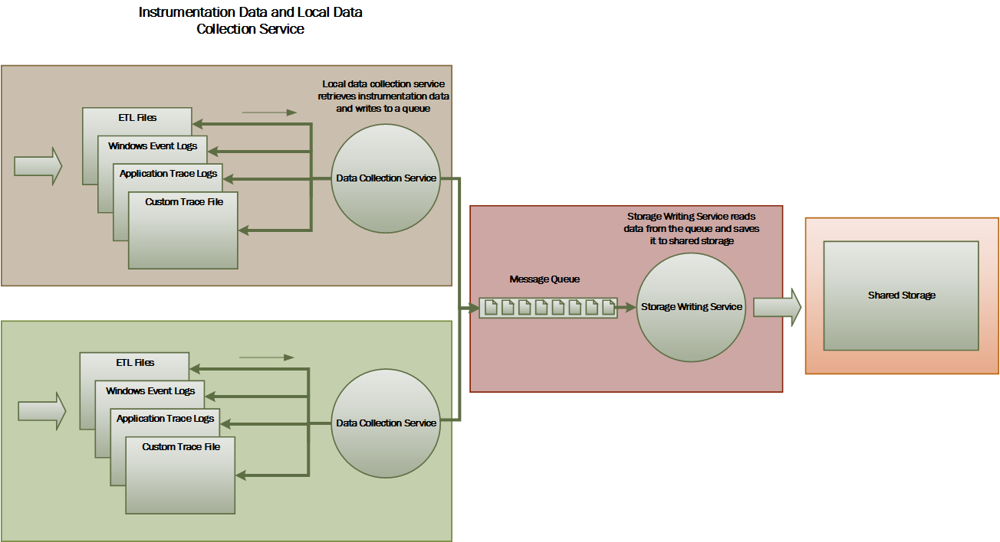
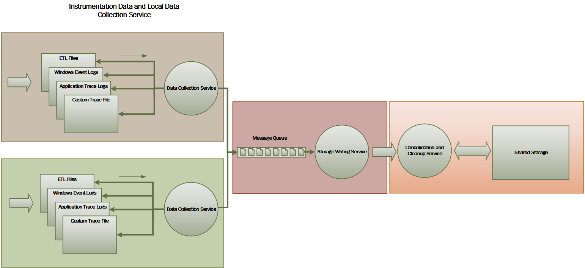
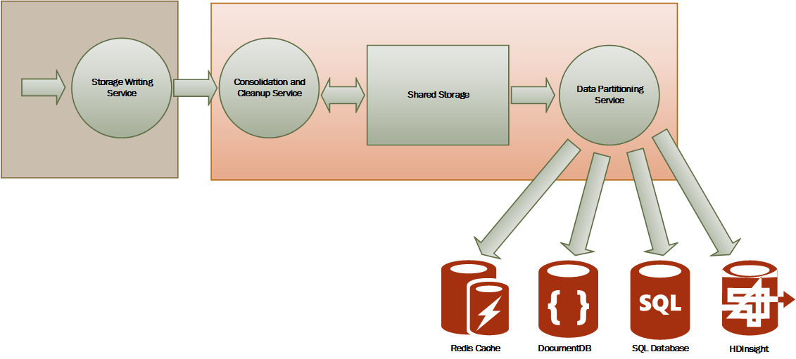

<properties
   pageTitle="Monitoring and diagnostics guidance | Microsoft Azure"
   description="Best practices for monitoring distributed applications in the cloud."
   services=""
   documentationCenter="na"
   authors="dragon119"
   manager="christb"
   editor=""
   tags=""/>

<tags
   ms.service="best-practice"
   ms.devlang="na"
   ms.topic="article"
   ms.tgt_pltfrm="na"
   ms.workload="na"
   ms.date="04/06/2016"
   ms.author="masashin"/>

# Monitoring and diagnostics guidance

[AZURE.INCLUDE [pnp-header](../includes/guidance-pnp-header-include.md)]

## Overview
Distributed applications and services running in the cloud are, by their nature, complex pieces of software that comprise many moving parts. In a production environment, it's important to be able to track the way in which users utilize your system, trace resource utilization, and generally monitor the health and performance of your system. You can use this information as a diagnostic aid to detect and correct issues, and also to help spot potential problems and prevent them from occurring.

## Monitoring and diagnostics scenarios
You can use monitoring to gain an insight into how well a system is functioning. Monitoring is a crucial part of maintaining quality-of-service targets. Common scenarios for collecting monitoring data include:

- Ensuring that the system remains healthy.
- Tracking the availability of the system and its component elements.
- Maintaining performance to ensure that the throughput of the system does not degrade unexpectedly as the volume of work increases.
- Guaranteeing that the system meets any service-level agreements (SLAs) established with customers.
- Protecting the privacy and security of the system, users, and their data.
- Tracking the operations that are performed for auditing or regulatory purposes.
- Monitoring the day-to-day usage of the system and spotting trends that might lead to problems if they're not addressed.
- Tracking issues that occur, from initial report through to analysis of possible causes, rectification, consequent software updates, and deployment.
- Tracing operations and debugging software releases.

> [AZURE.NOTE] This list is not intended to be comprehensive. This document focuses on these scenarios as the most common situations for performing monitoring. There might be others that are less common or are specific to your environment.

The following sections describe these scenarios in more detail. The information for each scenario is discussed in the following format:

1. A brief overview of the scenario
2. The typical requirements of this scenario
3. The raw instrumentation data that's required to support the scenario, and possible sources of this information
4. How this raw data can be analyzed and combined to generate meaningful diagnostic information

## Health monitoring
A system is healthy if it is running and capable of processing requests. The purpose of health monitoring is to generate a snapshot of the current health of the system so that you can verify that all components of the system are functioning as expected.

### Requirements for health monitoring
An operator should be alerted quickly (within a matter of seconds) if any part of the system is deemed to be unhealthy. The operator should be able to ascertain which parts of the system are functioning normally, and which parts are experiencing problems. System health can be highlighted through a traffic-light system:

- Red for unhealthy (the system has stopped)
- Yellow for partially healthy (the system is running with reduced functionality)
- Green for completely healthy

A comprehensive health-monitoring system enables an operator to drill down through the system to view the health status of subsystems and components. For example, if the overall system is depicted as partially healthy, the operator should be able to zoom in and determine which functionality is currently unavailable.

### Data sources, instrumentation, and data-collection requirements
The raw data that's required to support health monitoring can be generated as a result of:

- Tracing execution of user requests. This information can be used to determine which requests have succeeded, which have failed, and how long each request takes.
- Synthetic user monitoring. This process simulates the steps performed by a user and follows a predefined series of steps. The results of each step should be captured.
- Logging exceptions, faults, and warnings. This information can be captured as a result of trace statements embedded into the application code, as well as retrieving information from the event logs of any services that the system references.
- Monitoring the health of any third-party services that the system uses. This monitoring might require retrieving and parsing health data that these services supply. This information might take a variety of formats.
- Endpoint monitoring. This mechanism is described in more detail in the "Availability monitoring" section.
- Collecting ambient performance information, such as background CPU utilization or I/O (including network) activity.

### Analyzing health data
The primary focus of health monitoring is to quickly indicate whether the system is running. Hot analysis of the immediate data can trigger an alert if a critical component is detected as unhealthy. (It fails to respond to a consecutive series of pings, for example.) The operator can then take the appropriate corrective action.

A more advanced system might include a predictive element that performs a cold analysis over recent and current workloads. A cold analysis can spot trends and determine whether the system is likely to remain healthy or whether the system will need additional resources. This predictive element should be based on critical performance metrics, such as:

- The rate of requests directed at each service or subsystem.
- The response times of these requests.
- The volume of data flowing into and out of each service.

If the value of any metric exceeds a defined threshold, the system can raise an alert to enable an operator or autoscaling (if available) to take the preventative actions necessary to maintain system health. These actions might involve adding resources, restarting one or more services that are failing, or applying throttling to lower-priority requests.

## Availability monitoring
A truly healthy system requires that the components and subsystems that compose the system are available. Availability monitoring is closely related to health monitoring. But whereas health monitoring provides an immediate view of the current health of the system, availability monitoring is concerned with tracking the availability of the system and its components to generate statistics about the uptime of the system.

In many systems, some components (such as a database) are configured with built-in redundancy to permit rapid failover in the event of a serious fault or loss of connectivity. Ideally, users should not be aware that such a failure has occurred. But from an availability monitoring perspective, it's necessary to gather as much information as possible about such failures to determine the cause and take corrective actions to prevent them from recurring.

The data that's required to track availability might depend on a number of lower-level factors. Many of these factors might be specific to the application, system, and environment. An effective monitoring system captures the availability data that corresponds to these low-level factors and then aggregates them to give an overall picture of the system. For example, in an e-commerce system, the business functionality that enables a customer to place orders might depend on the repository where order details are stored and the payment system that handles the monetary transactions for paying for these orders. The availability of the order-placement part of the system is therefore a function of the availability of the repository and the payment subsystem.

### Requirements for availability monitoring
An operator should also be able to view the historical availability of each system and subsystem, and use this information to spot any trends that might cause one or more subsystems to periodically fail. (Do services start to fail at a particular time of day that corresponds to peak processing hours?)

A monitoring solution should provide an immediate and historical view of the availability or unavailability of each subsystem. It should also be capable of quickly alerting an operator when one or more services fail or when users can't connect to services. This is a matter of not only monitoring each service, but also examining the actions that each user performs if these actions fail when they attempt to communicate with a service. To some extent, a degree of connectivity failure is normal and might be due to transient errors. But it might be useful to allow the system to raise an alert for the number of connectivity failures to a specified subsystem that occur during a specific period.

### Data sources, instrumentation, and data-collection requirements
As with health monitoring, the raw data that's required to support availability monitoring can be generated as a result of synthetic user monitoring and logging any exceptions, faults, and warnings that might occur. In addition, availability data can be obtained from performing endpoint monitoring. The application can expose one or more health endpoints, each testing access to a functional area within the system. The monitoring system can ping each endpoint by following a defined schedule and collect the results (success or fail).

All timeouts, network connectivity failures, and connection retry attempts must be recorded. All data should be time-stamped.

<a name="analyzing-availability-data"></a>
### Analyzing availability data
The instrumentation data must be aggregated and correlated to support the following types of analysis:

- The immediate availability of the system and subsystems.
- The availability failure rates of the system and subsystems. Ideally, an operator should be able to correlate failures with specific activities: what was happening when the system failed?
- A historical view of failure rates of the system or any subsystems across any specified period, and the load on the system (number of user requests, for example) when a failure occurred.
- The reasons for unavailability of the system or any subsystems. For example, the reasons might be service not running, connectivity lost, connected but timing out, and connected but returning errors.

You can calculate the percentage availability of a service over a period of time by using the following formula:

```
%Availability =  ((Total Time – Total Downtime) / Total Time ) * 100
```

This is useful for SLA purposes. ([SLA monitoring](#SLA-monitoring) is described in more detail later in this guidance.) The definition of _downtime_ depends on the service. For example, Visual Studio Team Services Build Service defines downtime as the period (total accumulated minutes) during which Build Service is unavailable. A minute is considered unavailable if all continuous HTTP requests to Build Service to perform customer-initiated operations throughout the minute either result in an error code or do not return a response.

## Performance monitoring
As the system is placed under more and more stress (by increasing the volume of users), the size of the datasets that these users access grows and the possibility of failure of one or more components becomes more likely. Frequently, component failure is preceded by a decrease in performance. If you're able detect such a decrease, you can take proactive steps to remedy the situation.

System performance depends on a number of factors. Each factor is typically measured through key performance indicators (KPIs), such as the number of database transactions per second or the volume of network requests that are successfully serviced in a specified time frame. Some of these KPIs might be available as specific performance measures, whereas others might be derived from a combination of metrics.

> [AZURE.NOTE] Determining poor or good performance requires that you understand the level of performance at which the system should be capable of running. This requires observing the system while it's functioning under a typical load and capturing the data for each KPI over a period of time. This might involve running the system under a simulated load in a test environment and gathering the appropriate data before deploying the system to a production environment.

> You should also ensure that monitoring for performance purposes does not become a burden on the system. You might be able to dynamically adjust the level of detail for the data that the performance monitoring process gathers.

### Requirements for performance monitoring
To examine system performance, an operator typically needs to see information that includes:

- The response rates for user requests.
- The number of concurrent user requests.
- The volume of network traffic.
- The rates at which business transactions are being completed.
- The average processing time for requests.

It can also be helpful to provide tools that enable an operator to help spot correlations, such as:

- The number of concurrent users versus request latency times (how long it takes to start processing a request after the user has sent it).
- The number of concurrent users versus the average response time (how long it takes to complete a request after it has started processing).
- The volume of requests versus the number of processing errors.

Along with this high-level functional information, an operator should be able to obtain a detailed view of the performance for each component in the system. This data is typically provided through low-level performance counters that track information such as:

- Memory utilization.
- Number of threads.
- CPU processing time.
- Request queue length.
- Disk or network I/O rates and errors.
- Number of bytes written or read.
- Middleware indicators, such as queue length.

All visualizations should allow an operator to specify a time period. The displayed data might be a snapshot of the current situation and/or a historical view of the performance.

An operator should be able to raise an alert based on any performance measure for any specified value during any specified time interval.

### Data sources, instrumentation, and data-collection requirements
You can gather high-level performance data (throughput, number of concurrent users, number of business transactions, error rates, and so on) by monitoring the progress of users' requests as they arrive and pass through the system. This involves incorporating tracing statements at key points in the application code, together with timing information. All faults, exceptions, and warnings should be captured with sufficient data for correlating them with the requests that caused them. The Internet Information Services (IIS) log is another useful source.

If possible, you should also capture performance data for any external systems that the application uses. These external systems might provide their own performance counters or other features for requesting performance data. If this is not possible, record information such as the start time and end time of each request made to an external system, together with the status (success, fail, or warning) of the operation. For example, you can use a stopwatch approach to time requests: start a timer when the request starts and then stop the timer when the request finishes.

Low-level performance data for individual components in a system might be available through features and services such as Windows performance counters and Azure Diagnostics.

### Analyzing performance data
Much of the analysis work consists of aggregating performance data by user request type and/or the subsystem or service to which each request is sent. An example of a user request is adding an item to a shopping cart or performing the checkout process in an e-commerce system.

Another common requirement is summarizing performance data in selected percentiles. For example, an operator might determine the response times for 99 percent of requests, 95 percent of requests, and 70 percent of requests. There might be SLA targets or other goals set for each percentile. The ongoing results should be reported in near real time to help detect immediate issues. The results should also be aggregated over the longer time for statistical purposes.

In the case of latency issues affecting performance, an operator should be able to quickly identify the cause of the bottleneck by examining the latency of each step that each request performs. The performance data must therefore provide a means of correlating performance measures for each step to tie them to a specific request.

Depending on the visualization requirements, it might be useful to generate and store a data cube that contains views of the raw data. This data cube can allow complex ad hoc querying and analysis of the performance information.

## Security monitoring
All commercial systems that include sensitive data must implement a security structure. The complexity of the security mechanism is usually a function of the sensitivity of the data. In a system that requires users to be authenticated, you should record:

- All sign-in attempts, whether they fail or succeed.
- All operations performed by--and the details of all resources accessed by--an authenticated user.
- When a user ends a session and signs out.

Monitoring might be able to help detect attacks on the system. For example, a large number of failed sign-in attempts might indicate a brute-force attack. An unexpected surge in requests might be the result of a distributed denial-of-service (DDoS) attack. You must be prepared to monitor all requests to all resources regardless of the source of these requests. A system that has a sign-in vulnerability might accidentally expose resources to the outside world without requiring a user to actually sign in.

### Requirements for security monitoring
The most critical aspects of security monitoring should enable an operator to quickly:

- Detect attempted intrusions by an unauthenticated entity.
- Identify attempts by entities to perform operations on data for which they have not been granted access.
- Determine whether the system, or some part of the system, is under attack from outside or inside. (For example, a malicious authenticated user might be attempting to bring the system down.)

To support these requirements, an operator should be notified:

- If one account makes repeated failed sign-in attempts within a specified period.
- If one authenticated account repeatedly tries to access a prohibited resource during a specified period.
- If a large number of unauthenticated or unauthorized requests occur during a specified period.

The information that's provided to an operator should include the host address of the source for each request. If security violations regularly arise from a particular range of addresses, these hosts might be blocked.

A key part in maintaining the security of a system is being able to quickly detect actions that deviate from the usual pattern. Information such as the number of failed and/or successful sign-in requests can be displayed visually to help detect whether there is a spike in activity at an unusual time. (An example of this activity is users signing in at 3:00 AM and performing a large number of operations when their working day starts at 9:00 AM). This information can also be used to help configure time-based autoscaling. For example, if an operator observes that a large number of users regularly sign in at a particular time of day, the operator can arrange to start additional authentication services to handle the volume of work, and then shut down these additional services when the peak has passed.

### Data sources, instrumentation, and data-collection requirements
Security is an all-encompassing aspect of most distributed systems. The pertinent data is likely to be generated at multiple points throughout a system. You should consider adopting a Security Information and Event Management (SIEM) approach to gather the security-related information that results from events raised by the application, network equipment, servers, firewalls, antivirus software, and other intrusion-prevention elements.

Security monitoring can incorporate data from tools that are not part of your application. These tools can include utilities that identify port-scanning activities by external agencies, or network filters that detect attempts to gain unauthenticated access to your application and data.

In all cases, the gathered data must enable an administrator to determine the nature of any attack and take the appropriate countermeasures.

### Analyzing security data
A feature of security monitoring is the variety of sources from which the data arises. The different formats and level of detail often require complex analysis of the captured data to tie it together into a coherent thread of information. Apart from the simplest of cases (such as detecting a large number of failed sign-ins, or repeated attempts to gain unauthorized access to critical resources), it might not be possible to perform any complex automated processing of security data. Instead, it might be preferable to write this data, time-stamped but otherwise in its original form, to a secure repository to allow for expert manual analysis.

<a name="SLA-monitoring"></a>

## SLA monitoring
Many commercial systems that support paying customers make guarantees about the performance of the system in the form of SLAs. Essentially, SLAs state that the system can handle a defined volume of work within an agreed time frame and without losing critical information. SLA monitoring is concerned with ensuring that the system can meet measurable SLAs.

> [AZURE.NOTE] SLA monitoring is closely related to performance monitoring. But whereas performance monitoring is concerned with ensuring that the system functions _optimally_, SLA monitoring is governed by a contractual obligation that defines what _optimally_ actually means.

SLAs are often defined in terms of:

- Overall system availability. For example, an organization might guarantee that the system will be available for 99.9 percent of the time. This equates to no more than 9 hours of downtime per year, or approximately 10 minutes a week.
- Operational throughput. This aspect is often expressed as one or more high-water marks, such as guaranteeing that the system can support up to 100,000 concurrent user requests or handle 10,000 concurrent business transactions.
- Operational response time. The system might also make guarantees for the rate at which requests are processed. An example is that 99 percent of all business transactions will finish within 2 seconds, and no single transaction will take longer than 10 seconds.

> [AZURE.NOTE] Some contracts for commercial systems might also include SLAs for customer support. An example is that all help-desk requests will elicit a response within 5 minutes, and that 99 percent of all problems will be fully addressed within 1 working day. Effective [issue tracking](#issue-tracking) (described later in this section) is key to meeting SLAs such as these.

### Requirements for SLA monitoring
At the highest level, an operator should be able to determine at a glance whether the system is meeting the agreed SLAs or not. And if not, the operator should be able to drill down and examine the underlying factors to determine the reasons for substandard performance.

Typical high-level indicators that can be depicted visually include:

- The percentage of service uptime.
- The application throughput (measured in terms of successful transactions and/or operations per second).
- The number of successful/failing application requests.
- The number of application and system faults, exceptions, and warnings.

All of these indicators should be capable of being filtered by a specified period of time.

A cloud application will likely comprise a number of subsystems and components. An operator should be able to select a high-level indicator and see how it's composed from the health of the underlying elements. For example, if the uptime of the overall system falls below an acceptable value, an operator should be able to zoom in and determine which elements are contributing to this failure.

> [AZURE.NOTE] System uptime needs to be defined carefully. In a system that uses redundancy to ensure maximum availability, individual instances of elements might fail, but the system can remain functional. System uptime as presented by health monitoring should indicate the aggregate uptime of each element and not necessarily whether the system has actually halted. Additionally, failures might be isolated. So even if a specific system is unavailable, the remainder of the system might remain available, although with decreased functionality. (In an e-commerce system, a failure in the system might prevent a customer from placing orders, but the customer might still be able to browse the product catalog.)

For alerting purposes, the system should be able to raise an event if any of the high-level indicators exceed a specified threshold. The lower-level details of the various factors that compose the high-level indicator should be available as contextual data to the alerting system.

### Data sources, instrumentation, and data-collection requirements
The raw data that's required to support SLA monitoring is similar to the raw data that's required for performance monitoring, together with some aspects of health and availability monitoring. (See those sections for more details.) You can capture this data by:

- Performing endpoint monitoring.
- Logging exceptions, faults, and warnings.
- Tracing the execution of user requests.
- Monitoring the availability of any third-party services that the system uses.
- Using performance metrics and counters.

All data must be timed and time-stamped.

### Analyzing SLA data
The instrumentation data must be aggregated to generate a picture of the overall performance of the system. Aggregated data must also support drill-down to enable examination of the performance of the underlying subsystems. For example, you should be able to:

- Calculate the total number of user requests during a specified period and determine the success and failure rate of these requests.
- Combine the response times of user requests to generate an overall view of system response times.
- Analyze the progress of user requests to break down the overall response time of a request into the response times of the individual work items in that request.  
- Determine the overall availability of the system as a percentage of uptime for any specific period.
- Analyze the percentage time availability of the individual components and services in the system. This might involve parsing logs that third-party services have generated.

Many commercial systems are required to report real performance figures against agreed SLAs for a specified period, typically a month. This information can be used to calculate credits or other forms of repayments for customers if the SLAs are not met during that period. You can calculate availability for a service by using the technique described in the section [Analyzing availability data](#analyzing-availability-data).

For internal purposes, an organization might also track the number and nature of incidents that caused services to fail. Learning how to resolve these issues quickly, or eliminate them completely, will help to reduce downtime and meet SLAs.

## Auditing
Depending on the nature of the application, there might be statutory or other legal regulations that specify requirements for auditing users' operations and recording all data access. Auditing can provide evidence that links customers to specific requests. Non-repudiation is an important factor in many e-business systems to help maintain trust be between a customer and the organization that's responsible for the application or service.

### Requirements for auditing
An analyst must be able to trace the sequence of business operations that users are performing so that you can reconstruct users' actions. This might be necessary simply as a matter of record, or as part of a forensic investigation.

Audit information is highly sensitive. It will likely include data that identifies the users of the system, together with the tasks that they're performing. For this reason, audit information will most likely take the form of reports that are available only to trusted analysts rather than as an interactive system that supports drill-down of graphical operations. An analyst should be able to generate a range of reports. For example, reports might list all users' activities occurring during a specified time frame, detail the chronology of activity for a single user, or list the sequence of operations performed against one or more resources.

### Data sources, instrumentation, and data-collection requirements
The primary sources of information for auditing can include:

- The security system that manages user authentication.
- Trace logs that record user activity.
- Security logs that track all identifiable and unidentifiable network requests.

The format of the audit data and the way in which it's stored might be driven by regulatory requirements. For example, it might not be possible to clean the data in any way. (It must be recorded in its original format.) Access to the repository where it's held must be protected to prevent tampering.

### Analyzing audit data
An analyst must be able to access the raw data in its entirety, in its original form. Aside from the requirement to generate common audit reports, the tools for analyzing this data are likely to be specialized and kept external to the system.

## Usage monitoring
Usage monitoring tracks how the features and components of an application are used. An operator can use the gathered data to:

- Determine which features are heavily used and determine any potential hotspots in the system. High-traffic elements might benefit from functional partitioning or even replication to spread the load more evenly. An operator can also use this information to ascertain which features are infrequently used and are possible candidates for retirement or replacement in a future version of the system.
- Obtain information about the operational events of the system under normal use. For example, in an e-commerce site, you can record the statistical information about the number of transactions and the volume of customers that are responsible for them. This information can be used for capacity planning as the number of customers grows.
- Detect (possibly indirectly) user satisfaction with the performance or functionality of the system. For example, if a large number of customers in an e-commerce system regularly abandon their shopping carts, this might be due to a problem with the checkout functionality.
- Generate billing information. A commercial application or multitenant service might charge customers for the resources that they use.
- Enforce quotas. If a user in a multitenant system exceeds their paid quota of processing time or resource usage during a specified period, their access can be limited or processing can be throttled.

### Requirements for usage monitoring
To examine system usage, an operator typically needs to see information that includes:

- The number of requests that are processed by each subsystem and directed to each resource.
- The work that each user is performing.
- The volume of data storage that each user occupies.
- The resources that each user is accessing.

An operator should also be able to generate graphs. For example, a graph might display the most resource-hungry users, or the most frequently accessed resources or system features.

### Data sources, instrumentation, and data-collection requirements
Usage tracking can be performed at a relatively high level. It can note the start and end times of each request and the nature of the request (read, write, and so on, depending on the resource in question). You can obtain this information by:

- Tracing user activity.
- Capturing performance counters that measure the utilization for each resource.
- Monitoring the resource consumption by each user.

For metering purposes, you also need to be able to identify which users are responsible for performing which operations, and the resources that these operations utilize. The gathered information should be detailed enough to enable accurate billing.

<a name="issue-tracking"></a>
## Issue tracking
Customers and other users might report issues if unexpected events or behavior occurs in the system. Issue tracking is concerned with managing these issues, associating them with efforts to resolve any underlying problems in the system, and informing customers of possible resolutions.

### Requirements for issue tracking
Operators often perform issue tracking by using a separate system that enables them to record and report the details of problems that users report. These details can include the tasks that the user was trying to perform, symptoms of the problem, the sequence of events, and any error or warning messages that were issued.

### Data sources, instrumentation, and data-collection requirements
The initial data source for issue-tracking data is the user who reported the issue in the first place. The user might be able to provide additional data such as:

- A crash dump (if the application includes a component that runs on the user's desktop).
- A screen snapshot.
- The date and time when the error occurred, together with any other environmental information such as the user's location.

This information can be used to help the debugging effort and help construct a backlog for future releases of the software.

### Analyzing issue-tracking data
Different users might report the same problem. The issue-tracking system should associate common reports.

The progress of the debugging effort should be recorded against each issue report. When the problem is resolved, the customer can be informed of the solution.

If a user reports an issue that has a known solution in the issue-tracking system, the operator should be able to inform the user of the solution immediately.

## Tracing operations and debugging software releases
When a user reports an issue, the user is often only aware of the immediate impact that it has on their operations. The user can only report the results of their own experience back to an operator who is responsible for maintaining the system. These experiences are usually just a visible symptom of one or more fundamental problems. In many cases, an analyst will need to dig through the chronology of the underlying operations to establish the root cause of the problem. This process is called _root cause analysis_.

> [AZURE.NOTE] Root cause analysis might uncover inefficiencies in the design of an application. In these situations, it might be possible to rework the affected elements and deploy them as part of a subsequent release. This process requires careful control, and the updated components should be monitored closely.

### Requirements for tracing and debugging
For tracing unexpected events and other problems, it's vital that the monitoring data provides enough information to enable an analyst to trace back to the origins of these issues and reconstruct the sequence of events that occurred. This information must be sufficient to enable an analyst to diagnose the root cause of any problems. A developer can then make the necessary modifications to prevent them from recurring.

### Data sources, instrumentation, and data-collection requirements
Troubleshooting can involve tracing all the methods (and their parameters) invoked as part of an operation to build up a tree that depicts the logical flow through the system when a customer makes a specific request. Exceptions and warnings that the system generates as a result of this flow need to be captured and logged.

To support debugging, the system can provide hooks that enable an operator to capture state information at crucial points in the system. Or, the system can deliver detailed step-by-step information as selected operations progress. Capturing data at this level of detail can impose an additional load on the system and should be a temporary process. An operator uses this process mainly when a highly unusual series of events occurs and is difficult to replicate, or when a new release of one or more elements into a system requires careful monitoring to ensure that the elements function as expected.

## The monitoring and diagnostics pipeline
Monitoring a large-scale distributed system poses a significant challenge. Each of the scenarios described in the previous section should not necessarily be considered in isolation. There is likely to be a significant overlap in the monitoring and diagnostic data that's required for each situation, although this data might need to be processed and presented in different ways. For these reasons, you should take a holistic view of monitoring and diagnostics.

You can envisage the entire monitoring and diagnostics process as a pipeline that comprises the stages shown in Figure 1.



_Figure 1.
The stages in the monitoring and diagnostics pipeline_

Figure 1 highlights how the data for monitoring and diagnostics can come from a variety of data sources. The instrumentation and collection stages are concerned with identifying the sources from where the data needs to be captured, determining which data to capture, how to capture it, and how to format this data so that it can be easily examined. The analysis/diagnosis stage takes the raw data and uses it to generate meaningful information that an operator can use to determine the state of the system. The operator can use this information to make decisions about possible actions to take, and then feed the results back into the instrumentation and collection stages. The visualization/alerting stage phase presents a consumable view of the system state. It can display information in near real time by using a series of dashboards. And it can generate reports, graphs, and charts to provide a historical view of the data that can help identify long-term trends. If information indicates that a KPI is likely to exceed acceptable bounds, this stage can also trigger an alert to an operator. In some cases, an alert can also be used to trigger an automated process that attempts to take corrective actions, such as autoscaling.

Note that these steps constitute a continuous-flow process where the stages are happening in parallel. Ideally, all the phases should be dynamically configurable. At some points, especially when a system has been newly deployed or is experiencing problems, it might be necessary to gather extended data on a more frequent basis. At other times, it should be possible to revert to capturing a base level of essential information to verify that the system is functioning properly.

Additionally, the entire monitoring process should be considered a live, ongoing solution that's subject to fine-tuning and improvements as a result of feedback. For example, you might start with measuring many factors to determine system health. Analysis over time might lead to a refinement as you discard measures that aren't relevant, enabling you to more precisely focus on the data that you need while minimizing background noise.

## Sources of monitoring and diagnostic data
The information that the monitoring process uses can come from several sources, as illustrated in Figure 1. At the application level, information comes from trace logs incorporated into the code of the system. Developers should follow a standard approach for tracking the flow of control through their code. For example, an entry to a method can emit a trace message that specifies the name of the method, the current time, the value of each parameter, and any other pertinent information. Recording the entry and exit times can also prove useful.

You should log all exceptions and warnings, and ensure that you retain a full trace of any nested exceptions and warnings. Ideally, you should also capture information that identifies the user who is running the code, together with activity correlation information (to track requests as they pass through the system). And you should log attempts to access all resources such as message queues, databases, files, and other dependent services. This information can be used for metering and auditing purposes.

Many applications make use of libraries and frameworks to perform common tasks such as accessing a data store or communicating over a network. These frameworks might be configurable to provide their own trace messages and raw diagnostic information, such as transaction rates and data transmission successes and failures.

> [AZURE.NOTE] Many modern frameworks automatically publish performance and trace events. Capturing this information is simply a matter of providing a means to retrieve and store it where it can be processed and analyzed.

The operating system where the application is running can be a source of low-level system-wide information, such as performance counters that indicate I/O rates, memory utilization, and CPU usage. Operating system errors (such as the failure to open a file correctly) might also be reported.

You should also consider the underlying infrastructure and components on which your system runs. Virtual machines, virtual networks, and storage services can all be sources of important infrastructure-level performance counters and other diagnostic data.

If your application uses other external services, such as a web server or database management system, these services might publish their own trace information, logs, and performance counters. Examples include SQL Server Dynamic Management Views for tracking operations performed against a SQL Server database, and IIS trace logs for recording requests made to a web server.

As the components of a system are modified and new versions are deployed, it's important to be able to attribute issues, events, and metrics to each version. This information should be tied back to the release pipeline so that problems with a specific version of a component can be tracked quickly and rectified.

Security issues might occur at any point in the system. For example, a user might attempt to sign in with an invalid user ID or password. An authenticated user might try to obtain unauthorized access to a resource. Or a user might provide an invalid or outdated key to access encrypted information. Security-related information for successful and failing requests should always be logged.

The section [Instrumenting an application](#instrumenting-an-application) contains more guidance on the information that you should capture. But you can use a variety of strategies to gather this information:

- **Application/system monitoring**. This strategy uses internal sources within the application, application frameworks, operating system, and infrastructure. The application code can generate its own monitoring data at notable points during the lifecycle of a client request. The application can include tracing statements that might be selectively enabled or disabled as circumstances dictate. It might also be possible to inject diagnostics dynamically by using a diagnostics framework. These frameworks typically provide plug-ins that can attach to various instrumentation points in your code and capture trace data at these points.

    Additionally, your code and/or the underlying infrastructure might raise events at critical points. Monitoring agents that are configured to listen for these events can record the event information.

- **Real user monitoring**. This approach records the interactions between a user and the application and observes the flow of each request and response. This information can have a two-fold purpose: it can be used for metering usage by each user, and it can be used to determine whether users are receiving a suitable quality of service (for example, fast response times, low latency, and minimal errors). You can use the captured data to identify areas of concern where failures occur most often. You can also use the data to identify elements where the system slows down, possibly due to hotspots in the application or some other form of bottleneck. If you implement this approach carefully, it might be possible to reconstruct users' flows through the application for debugging and testing purposes.

	> [AZURE.IMPORTANT] You should consider the data that's captured by monitoring real users to be highly sensitive because it might include confidential material. If you save captured data, store it securely. If you want to use the data for performance monitoring or debugging purposes, strip out all personally identifiable information first.

- **Synthetic user monitoring**. In this approach, you write your own test client that simulates a user and performs a configurable but typical series of operations. You can track the performance of the test client to help determine the state of the system. You can also use multiple instances of the test client as part of a load-testing operation to establish how the system responds under stress, and what sort of monitoring output is generated under these conditions.

	> [AZURE.NOTE] You can implement real and synthetic user monitoring by including code that traces and times the execution of method calls and other critical parts of an application.

- **Profiling**. This approach is primarily targeted at monitoring and improving application performance. Rather than operating at the functional level of real and synthetic user monitoring, it captures lower-level information as the application runs. You can implement profiling by using periodic sampling of the execution state of an application (determining which piece of code that the application is running at a given point in time). You can also use instrumentation that inserts probes into the code at important junctures (such as the start and end of a method call) and records which methods were invoked, at what time, and how long each call took. You can then analyze this data to determine which parts of the application might cause performance problems.

- **Endpoint monitoring**. This technique uses one or more diagnostic endpoints that the application exposes specifically to enable monitoring. An endpoint provides a pathway into the application code and can return information about the health of the system. Different endpoints can focus on various aspects of the functionality. You can write your own diagnostics client that sends periodic requests to these endpoints and assimilate the responses. This approach is described more in [Health Endpoint Monitoring Pattern](https://msdn.microsoft.com/library/dn589789.aspx) on the Microsoft website.

For maximum coverage, you should use a combination of these techniques.

<a name="instrumenting-an-application"></a>
## Instrumenting an application
Instrumentation is a critical part of the monitoring process. You can make meaningful decisions about the performance and health of a system only if you first capture the data that enables you to make these decisions. The information that you gather by using instrumentation should be sufficient to enable you to assess performance, diagnose problems, and make decisions without requiring you to sign in to a remote production server to perform tracing (and debugging) manually. Instrumentation data typically comprises metrics and information that's written to trace logs.

The contents of a trace log can be the result of textual data that's written by the application or binary data that's created as the result of a trace event (if the application is using Event Tracing for Windows--ETW). They can also be generated from system logs that record events arising from parts of the infrastructure, such as a web server. Textual log messages are often designed to be human-readable, but they should also be written in a format that enables an automated system to parse them easily.

You should also categorize logs. Don't write all trace data to a single log, but use separate logs to record the trace output from different operational aspects of the system. You can then quickly filter log messages by reading from the appropriate log rather than having to process a single lengthy file. Never write information that has different security requirements (such as audit information and debugging data) to the same log.

> [AZURE.NOTE] A log might be implemented as a file on the file system, or it might be held in some other format, such as a blob in blob storage. Log information might also be held in more structured storage, such as rows in a table.

Metrics will generally be a measure or count of some aspect or resource in the system at a specific time, with one or more associated tags or dimensions (sometimes called a _sample_). A single instance of a metric is usually not useful in isolation. Instead, metrics have to be captured over time. The key issue to consider is which metrics you should record and how frequently. Generating data for metrics too often can impose a significant additional load on the system, whereas capturing metrics infrequently might cause you to miss the circumstances that lead to a significant event. The considerations will vary from metric to metric. For example, CPU utilization on a server might vary significantly from second to second, but high utilization becomes an issue only if it's long-lived over a number of minutes.

<a name="information-for-correlating-data"></a>
### Information for correlating data
You can easily monitor individual system-level performance counters, capture metrics for resources, and obtain application trace information from various log files. But some forms of monitoring require the analysis and diagnostics stage in the monitoring pipeline to correlate the data that's retrieved from several sources. This data might take several forms in the raw data, and the analysis process must be provided with sufficient instrumentation data to be able to map these different forms. For example, at the application framework level, a task might be identified by a thread ID. Within an application, the same work might be associated with the user ID for the user who is performing that task.

Also, there's unlikely to be a 1:1 mapping between threads and user requests, because asynchronous operations might reuse the same threads to perform operations on behalf of more than one user. To complicate matters further, a single request might be handled by more than one thread as execution flows through the system. If possible, associate each request with a unique activity ID that's propagated through the system as part of the request context. (The technique for generating and including activity IDs in trace information depends on the technology that's used to capture the trace data.)

All monitoring data should be time-stamped in the same way. For consistency, record all dates and times by using Coordinated Universal Time. This will help you more easily trace sequences of events.

> [AZURE.NOTE] Computers operating in different time zones and networks might not be synchronized. Don't depend on using time stamps alone for correlating instrumentation data that spans multiple machines.

### Information to include in the instrumentation data
Consider the following points when you're deciding which instrumentation data you need to collect:

- Make sure that information captured by trace events is machine and human readable. Adopt well-defined schemas for this information to facilitate automated processing of log data across systems, and to provide consistency to operations and engineering staff reading the logs. Include environmental information, such as the deployment environment, the machine on which the process is running, the details of the process, and the call stack.  
- Enable profiling only when necessary because it can impose a significant overhead on the system. Profiling by using instrumentation records an event (such as a method call) every time it occurs, whereas sampling records only selected events. The selection can be time-based (once every *n* seconds), or frequency-based (once every *n* requests). If events occur very frequently, profiling by instrumentation might cause too much of a burden and itself affect overall performance. In this case, the sampling approach might be preferable. However, if the frequency of events is low, sampling might miss them. In this case, instrumentation might be the better approach.
- Provide sufficient context to enable a developer or administrator to determine the source of each request. This might include some form of activity ID that identifies a specific instance of a request. It might also include information that can be used to correlate this activity with the computational work performed and the resources used. Note that this work might cross process and machine boundaries. For metering, the context should also include (either directly or indirectly via other correlated information) a reference to the customer who caused the request to be made. This context provides valuable information about the application state at the time that the monitoring data was captured.
- Record all requests, and the locations or regions from which these requests are made. This information can assist in determining whether there are any location-specific hotspots. This information can also be useful in determining whether to repartition an application or the data that it uses.
- Record and capture the details of exceptions carefully. Often, critical debug information is lost as a result of poor exception handling. Capture the full details of exceptions that the application throws, including any inner exceptions and other context information. Include the call stack if possible.
- Be consistent in the data that the different elements of your application capture, because this can assist in analyzing events and correlating them with user requests. Consider using a comprehensive and configurable logging package to gather information, rather than depending on developers to adopt the same approach as they implement different parts of the system. Gather data from key performance counters, such as the volume of I/O being performed, network utilization, number of requests, memory use, and CPU utilization. Some infrastructure services might provide their own specific performance counters, such as the number of connections to a database, the rate at which transactions are being performed, and the number of transactions that succeed or fail. Applications might also define their own specific performance counters.
- Log all calls made to external services, such as database systems, web services, or other system-level services that are part of the infrastructure. Record information about the time taken to perform each call, and the success or failure of the call. If possible, capture information about all retry attempts and failures for any transient errors that occur.

### Ensuring compatibility with telemetry systems
In many cases, the information that instrumentation produces is generated as a series of events and passed to a separate telemetry system for processing and analysis. A telemetry system is typically independent of any specific application or technology, but it expects information to follow a specific format that's usually defined by a schema. The schema effectively specifies a contract that defines the data fields and types that the telemetry system can ingest. The schema should be generalized to allow for data arriving from a range of platforms and devices.

A common schema should include fields that are common to all instrumentation events, such as the event name, the event time, the IP address of the sender, and the details that are required for correlating with other events (such as a user ID, a device ID, and an application ID). Remember that any number of devices might raise events, so the schema should not depend on the device type. Additionally, various devices might raise events for the same application; the application might support roaming or some other form of cross-device distribution.

The schema might also include domain fields that are relevant to a particular scenario that's common across different applications. This might be information about exceptions, application start and end events, and success and/or failure of web service API calls. All applications that use the same set of domain fields should emit the same set of events, enabling a set of common reports and analytics to be built.

Finally, a schema might contain custom fields for capturing the details of application-specific events.

### Best practices for instrumenting applications
The following list summarizes best practices for instrumenting a distributed application running in the cloud.

- Make logs easy to read and easy to parse. Use structured logging where possible. Be concise and descriptive in log messages.
- In all logs, identify the source and provide context and timing information as each log record is written.
- Use the same time zone and format for all time stamps. This will help to correlate events for operations that span hardware and services running in different geographic regions.
- Categorize logs and write messages to the appropriate log file.
- Do not disclose sensitive information about the system or personal information about users. Scrub this information before it's logged, but ensure that the relevant details are retained. For example, remove the ID and password from any database connection strings, but write the remaining information to the log so that an analyst can determine that the system is accessing the correct database. Log all critical exceptions, but enable the administrator to turn logging on and off for lower levels of exceptions and warnings. Also, capture and log all retry logic information. This data can be useful in monitoring the transient health of the system.
- Trace out of process calls, such as requests to external web services or databases.
- Don't mix log messages with different security requirements in the same log file. For example, don't write debug and audit information to the same log.
- With the exception of auditing events, make sure that all logging calls are fire-and-forget operations that do not block the progress of business operations. Auditing events are exceptional because they are critical to the business and can be classified as a fundamental part of business operations.
- Make sure that logging is extensible and does not have any direct dependencies on a concrete target. For example, rather than writing information by using _System.Diagnostics.Trace_, define an abstract interface (such as _ILogger_) that exposes logging methods and that can be implemented through any appropriate means.
- Make sure that all logging is fail-safe and never triggers any cascading errors. Logging must not throw any exceptions.
- Treat instrumentation as an ongoing iterative process and review logs regularly, not just when there is a problem.

## Collecting and storing data
The collection stage of the monitoring process is concerned with retrieving the information that instrumentation generates, formatting this data to make it easier for the analysis/diagnosis stage to consume, and saving the transformed data in reliable storage. The instrumentation data that you gather from different parts of a distributed system can be held in a variety of locations and with varying formats. For example, your application code might generate trace log files and generate application event log data, whereas performance counters that monitor key aspects of the infrastructure that your application uses can be captured through other technologies. Any third-party components and services that your application uses might provide instrumentation information in different formats, by using separate trace files, blob storage, or even a custom data store.

Data collection is often performed through a collection service that can run autonomously from the application that generates the instrumentation data. Figure 2 illustrates an example of this architecture, highlighting the instrumentation data-collection subsystem.



_Figure 2.
Collecting instrumentation data_

Note that this is a simplified view. The collection service is not necessarily a single process and might comprise many constituent parts running on different machines, as described in the following sections. Additionally, if the analysis of some telemetry data must be performed quickly (hot analysis, as described in the section [Supporting hot, warm, and cold analysis](#supporting-hot-warm-and-cold-analysis) later in this document), local components that operate outside the collection service might perform the analysis tasks immediately. Figure 2 depicts this situation for selected events. After analytical processing, the results can be sent directly to the visualization and alerting subsystem. Data that's subjected to warm or cold analysis is held in storage while it awaits processing.

For Azure applications and services, Azure Diagnostics provides one possible solution for capturing data. Azure Diagnostics gathers data from the following sources for each compute node, aggregates it, and then uploads it to Azure Storage:

- IIS logs
- IIS Failed Request logs
- Windows event logs
- Performance counters
- Crash dumps
- Azure Diagnostics infrastructure logs  
- Custom error logs
- .NET EventSource
- Manifest-based ETW

For more information, see the article [Azure: Telemetry Basics and Troubleshooting](http://social.technet.microsoft.com/wiki/contents/articles/18146.windows-azure-telemetry-basics-and-troubleshooting.aspx).

### Strategies for collecting instrumentation data
Considering the elastic nature of the cloud, and to avoid the necessity of manually retrieving telemetry data from every node in the system, you should arrange for the data to be transferred to a central location and consolidated. In a system that spans multiple datacenters, it might be useful to first collect, consolidate, and store data on a region-by-region basis, and then aggregate the regional data into a single central system.

To optimize the use of bandwidth, you can elect to transfer less urgent data in chunks, as batches. However, the data must not be delayed indefinitely, especially if it contains time-sensitive information.

#### _Pulling and pushing instrumentation data_
The instrumentation data-collection subsystem can actively retrieve instrumentation data from the various logs and other sources for each instance of the application (the _pull model_). Or, it can act as a passive receiver that waits for the data to be sent from the components that constitute each instance of the application (the _push model_).

One approach to implementing the pull model is to use monitoring agents that run locally with each instance of the application. A monitoring agent is a separate process that periodically retrieves (pulls) telemetry data collected at the local node and writes this information directly to centralized storage that all instances of the application share. This is the mechanism that Azure Diagnostics implements. Each instance of an Azure web or worker role can be configured to capture diagnostic and other trace information that's stored locally. The monitoring agent that runs alongside each instance copies the specified data to Azure Storage. The article [Enabling Diagnostics in Azure Cloud Services and Virtual Machines](./cloud-services/cloud-services-dotnet-diagnostics.md) provides more details on this process. Some elements, such as IIS logs, crash dumps, and custom error logs, are written to blob storage. Data from the Windows event log, ETW events, and performance counters is recorded in table storage. Figure 3 illustrates this mechanism.



_Figure 3.
Using a monitoring agent to pull information and write to shared storage_

> [AZURE.NOTE] Using a monitoring agent is ideally suited to capturing instrumentation data that's naturally pulled from a data source. An example is information from SQL Server Dynamic Management Views or the length of an Azure Service Bus queue.


It's feasible to use the approach just described to store telemetry data for a small-scale application running on a limited number of nodes in a single location. However, a complex, highly scalable, global cloud application might generate huge volumes of data from hundreds of web and worker roles, database shards, and other services. This flood of data can easily overwhelm the I/O bandwidth available with a single, central location. Therefore, your telemetry solution must be scalable to prevent it from acting as a bottleneck as the system expands. Ideally, your solution should incorporate a degree of redundancy to reduce the risks of losing important monitoring information (such as auditing or billing data) if part of the system fails.

To address these issues, you can implement queuing, as shown in Figure 4. In this architecture, the local monitoring agent (if it can be configured appropriately) or custom data-collection service (if not) posts data to a queue. A separate process running asynchronously (the storage writing service in Figure 4) takes the data in this queue and writes it to shared storage. A message queue is suitable for this scenario because it provides "at least once" semantics that help ensure that queued data will not be lost after it's posted. You can implement the storage writing service by using a separate worker role.



_Figure 4.
Using a queue to buffer instrumentation data_

The local data-collection service can add data to a queue immediately after it's received. The queue acts as a buffer, and the storage writing service can retrieve and write the data at its own pace. By default, a queue operates on a first-in, first-out basis. But you can prioritize messages to accelerate them through the queue if they contain data that must be handled more quickly. For more information, see the [Priority Queue](https://msdn.microsoft.com/library/dn589794.aspx) pattern. Alternatively, you can use different channels (such as Service Bus topics) to direct data to different destinations depending on the form of analytical processing that's required.

For scalability, you can run multiple instances of the storage writing service. If there is a high volume of events, you can use an event hub to dispatch the data to different compute resources for processing and storage.

<a name="consolidating-instrumentation-data"></a>
#### _Consolidating instrumentation data_
The instrumentation data that the data-collection service retrieves from a single instance of an application gives a localized view of the health and performance of that instance. To assess the overall health of the system, it's necessary to consolidate some aspects of the data in the local views. You can perform this after the data has been stored, but in some cases, you can also achieve it as the data is collected. Rather than being written directly to shared storage, the instrumentation data can pass through a separate data consolidation service that combines data and acts as a filter and cleanup process. For example, instrumentation data that includes the same correlation information such as an activity ID can be amalgamated. (It's possible that a user starts performing a business operation on one node and then gets transferred to another node in the event of node failure, or depending on how load balancing is configured.) This process can also detect and remove any duplicated data (always a possibility if the telemetry service uses message queues to push instrumentation data out to storage). Figure 5 illustrates an example of this structure.



_Figure 5.
Using a separate service to consolidate and clean up instrumentation data_

### Storing instrumentation data
The previous discussions have depicted a rather simplistic view of the way in which instrumentation data is stored. In reality, it can make sense to store the different types of information by using technologies that are most appropriate to the way in which each type is likely to be used.

For example, Azure blob and table storage have some similarities in the way in which they're accessed. But they have limitations in the operations that you can perform by using them, and the granularity of the data that they hold is quite different. If you need to perform more analytical operations or require full-text search capabilities on the data, it might be more appropriate to use data storage that provides capabilities that are optimized for specific types of queries and data access. For example:

- Performance counter data can be stored in a SQL database to enable ad hoc analysis.
- Trace logs might be better stored in Azure DocumentDB.
- Security information can be written to HDFS.
- Information that requires full-text search can be stored through Elasticsearch (which can also speed searches by using rich indexing).

You can implement an additional service that periodically retrieves the data from shared storage, partitions and filters the data according to its purpose, and then writes it to an appropriate set of data stores as shown in Figure 6. An alternative approach is to include this functionality in the consolidation and cleanup process and write the data directly to these stores as it's retrieved rather than saving it in an intermediate shared storage area. Each approach has its advantages and disadvantages. Implementing a separate partitioning service lessens the load on the consolidation and cleanup service, and it enables at least some of the partitioned data to be regenerated if necessary (depending on how much data is retained in shared storage). However, it consumes additional resources. Also, there might be a delay between the receipt of instrumentation data from each application instance and the conversion of this data into actionable information.



_Figure 6.
Partitioning data according to analytical and storage requirements_

The same instrumentation data might be required for more than one purpose. For example, performance counters can be used to provide a historical view of system performance over time. This information might be combined with other usage data to generate customer billing information. In these situations, the same data might be sent to more than one destination, such as a document database that can act as a long-term store for holding billing information, and a multidimensional store for handling complex performance analytics.

You should also consider how urgently the data is required. Data that provides information for alerting must be accessed quickly, so it should be held in fast data storage and indexed or structured to optimize the queries that the alerting system performs. In some cases, it might be necessary for the telemetry service that gathers the data on each node to format and save data locally so that a local instance of the alerting system can quickly notify you of any issues. The same data can be dispatched to the storage writing service shown in the previous diagrams and stored centrally if it's also required for other purposes.

Information that's used for more considered analysis, for reporting, and for spotting historical trends is less urgent and can be stored in a manner that supports data mining and ad hoc queries. For more information, see the section [Supporting hot, warm, and cold analysis](#supporting-hot-warm-and-cold-analysis) later in this document.

#### _Log rotation and data retention_
Instrumentation can generate considerable volumes of data. This data can be held in several places, starting with the raw log files, trace files, and other information captured at each node to the consolidated, cleaned, and partitioned view of this data held in shared storage. In some cases, after the data has been processed and transferred, the original raw source data can be removed from each node. In other cases, it might be necessary or simply useful to save the raw information. For example, data that's generated for debugging purposes might be best left available in its raw form but can then be discarded quickly after any bugs have been rectified.

Performance data often has a longer life so that it can be used for spotting performance trends and for capacity planning. The consolidated view of this data is usually kept online for a finite period to enable fast access. After that, it can be archived or discarded. Data gathered for metering and billing customers might need to be saved indefinitely. Additionally, regulatory requirements might dictate that information collected for auditing and security purposes also needs to be archived and saved. This data is also sensitive and might need to be encrypted or otherwise protected to prevent tampering. You should never record users' passwords or other information that might be used to commit identity fraud. Such details should be scrubbed from the data before it's stored.

#### _Down-sampling_
It's useful to store historical data so you can spot long-term trends. Rather than saving old data in its entirety, it might be possible to down-sample the data to reduce its resolution and save storage costs. As an example, rather than saving minute-by-minute performance indicators, you can consolidate data that's more than a month old to form an hour-by-hour view.

### Best practices for collecting and storing logging information
The following list summarizes best practices for capturing and storing logging information:

- The monitoring agent or data-collection service should run as an out-of-process service and should be simple to deploy.
- All output from the monitoring agent or data-collection service should be an agnostic format that's independent of the machine, operating system, or network protocol. For example, emit information in a self-describing format such as JSON, MessagePack, or Protobuf rather than ETL/ETW. Using a standard format enables the system to construct processing pipelines; components that read, transform, and send data in the agreed format can be easily integrated.
- The monitoring and data-collection process must be fail-safe and must not trigger any cascading error conditions.
- In the event of a transient failure in sending information to a data sink, the monitoring agent or data-collection service should be prepared to reorder telemetry data so that the newest information is sent first. (The monitoring agent/data-collection service might elect to drop the older data, or save it locally and transmit it later to catch up, at its own discretion.)

## Analyzing data and diagnosing issues
An important part of the monitoring and diagnostics process is analyzing the gathered data to obtain a picture of the overall well-being of the system. You should have defined your own KPIs and performance metrics, and it's important to understand how you can structure the data that has been gathered to meet your analysis requirements. It's also important to understand how the data that's captured in different metrics and log files is correlated, because this information can be key to tracking a sequence of events and help diagnose problems that arise.

As described in the section [Consolidating instrumentation data](#consolidating-instrumentation-data), the data for each part of the system is typically captured locally, but it generally needs to be combined with data generated at other sites that participate in the system. This information requires careful correlation to ensure that data is combined accurately. For example, the usage data for an operation might span a node that hosts a website to which a user connects, a node that runs a separate service accessed as part of this operation, and data storage held on another node. This information needs to be tied together to provide an overall view of the resource and processing usage for the operation. Some pre-processing and filtering of data might occur on the node on which the data is captured, whereas aggregation and formatting are more likely to occur on a central node.

<a name="supporting-hot-warm-and-cold-analysis"></a>
### Supporting hot, warm, and cold analysis
Analyzing and reformatting data for visualization, reporting, and alerting purposes can be a complex process that consumes its own set of resources. Some forms of monitoring are time-critical and require immediate analysis of data to be effective. This is known as _hot analysis_. Examples include the analyses that are required for alerting and some aspects of security monitoring (such as detecting an attack on the system). Data that's required for these purposes must be quickly available and structured for efficient processing. In some cases, it might be necessary to move the analysis processing to the individual nodes where the data is held.

Other forms of analysis are less time-critical and might require some computation and aggregation after the raw data has been received. This is called _warm analysis_. Performance analysis often falls into this category. In this case, an isolated, single performance event is unlikely to be statistically significant. (It might be caused by a sudden spike or glitch.) The data from a series of events should provide a more reliable picture of system performance.

Warm analysis can also be used to help diagnose health issues. A health event is typically processed through hot analysis and can raise an alert immediately. An operator should be able to drill into the reasons for the health event by examining the data from the warm path. This data should contain information about the events leading up to the issue that caused the health event.

Some types of monitoring generate more long-term data. This analysis can be performed at a later date, possibly according to a predefined schedule. In some cases, the analysis might need to perform complex filtering of large volumes of data captured over a period of time. This is called _cold analysis_. The key requirement is that the data is stored safely after it has been captured. For example, usage monitoring and auditing require an accurate picture of the state of the system at regular points in time, but this state information does not have to be available for processing immediately after it has been gathered.

An operator can also use cold analysis to provide the data for predictive health analysis. The operator can gather historical information over a specified period and use it in conjunction with the current health data (retrieved from the hot path) to spot trends that might soon cause health issues. In these cases, it might be necessary to raise an alert so that corrective action can be taken.

### Correlating data
The data that instrumentation captures can provide a snapshot of the system state, but the purpose of analysis is to make this data actionable. For example:

- What has caused an intense I/O loading at the system level at a specific time?
- Is it the result of a large number of database operations?
- Is this reflected in the database response times, the number of transactions per second, and application response times at the same juncture?

If so, one remedial action that might reduce the load might be to shard the data over more servers. In addition, exceptions can arise as a result of a fault in any level of the system. An exception in one level often triggers another fault in the level above.

For these reasons, you need to be able to correlate the different types of monitoring data at each level to produce an overall view of the state of the system and the applications that are running on it. You can then use this information to make decisions about whether the system is functioning acceptably or not, and determine what can be done to improve the quality of the system.

As described in the section [Information for correlating data](#information-for-correlating-data), you must ensure that the raw instrumentation data includes sufficient context and activity ID information to support the required aggregations for correlating events. Additionally, this data might be held in different formats, and it might be necessary to parse this information to convert it into a standardized format for analysis.

### Troubleshooting and diagnosing issues
Diagnosis requires the ability to determine the cause of faults or unexpected behavior, including performing root cause analysis. The information that's required typically includes:

- Detailed information from event logs and traces, either for the entire system or for a specified subsystem during a specified time window.
- Complete stack traces resulting from exceptions and faults of any specified level that occur within the system or a specified subsystem during a specified period.
- Crash dumps for any failed processes either anywhere in the system or for a specified subsystem during a specified time window.
- Activity logs recording the operations that are performed either by all users or for selected users during a specified period.

Analyzing data for troubleshooting purposes often requires a deep technical understanding of the system architecture and the various components that compose the solution. As a result, a large degree of manual intervention is often required to interpret the data, establish the cause of problems, and recommend an appropriate strategy to correct them. It might be appropriate simply to store a copy of this information in its original format and make it available for cold analysis by an expert.

## Visualizing data and raising alerts
An important aspect of any monitoring system is the ability to present the data in such a way that an operator can quickly spot any trends or problems. Also important is the ability to quickly inform an operator if a significant event has occurred that might require attention.

Data presentation can take several forms, including visualization by using dashboards, alerting, and reporting.

### Visualization by using dashboards
The most common way to visualize data is to use dashboards that can display information as a series of charts, graphs, or some other illustration. These items can be parameterized, and an analyst should be able to select the important parameters (such as the time period) for any specific situation.

Dashboards can be organized hierarchically. Top-level dashboards can give an overall view of each aspect of the system but enable an operator to drill down to the details. For example, a dashboard that depicts the overall disk I/O for the system should allow an analyst to view the I/O rates for each individual disk to ascertain whether one or more specific devices account for a disproportionate volume of traffic. Ideally, the dashboard should also display related information, such as the source of each request (the user or activity) that's generating this I/O. This information can then be used to determine whether (and how) to spread the load more evenly across devices, and whether the system would perform better if more devices were added.

A dashboard might also use color-coding or some other visual cues to indicate values that appear anomalous or that are outside an expected range. Using the previous example:

- A disk with an I/O rate that's approaching its maximum capacity over an extended period (a hot disk) can be highlighted in red.
- A disk with an I/O rate that periodically runs at its maximum limit over short periods (a warm disk) can be highlighted in yellow.
- A disk that's exhibiting normal usage can be displayed in green.

Note that for a dashboard system to work effectively, it must have the raw data to work with. If you are building your own dashboard system, or using a dashboard developed by another organization, you must understand which instrumentation data you need to collect, at what levels of granularity, and how it should be formatted for the dashboard to consume.

A good dashboard does not only display information, it also enables an analyst to pose ad hoc questions about that information. Some systems provide management tools that an operator can use to perform these tasks and explore the underlying data. Alternatively, depending on the repository that's used to hold this information, it might be possible to query this data directly, or import it into tools such as Microsoft Excel for further analysis and reporting.

> [AZURE.NOTE] You should restrict access to dashboards to authorized personnel, because this information might be commercially sensitive. You should also protect the underlying data for dashboards to prevent users from changing it.

### Raising alerts
Alerting is the process of analyzing the monitoring and instrumentation data and generating a notification if a significant event is detected.

Alerting helps ensure that the system remains healthy, responsive, and secure. It's an important part of any system that makes performance, availability, and privacy guarantees to the users where the data might need to be acted on immediately. An operator might need to be notified of the event that triggered the alert. Alerting can also be used to invoke system functions such as autoscaling.

Alerting usually depends on the following instrumentation data:

- Security events. If the event logs indicate that repeated authentication and/or authorization failures are occurring, the system might be under attack and an operator should be informed.
- Performance metrics. The system must quickly respond if a particular performance metric exceeds a specified threshold.
- Availability information. If a fault is detected, it might be necessary to quickly restart one or more subsystems, or fail over to a backup resource. Repeated faults in a subsystem might indicate more serious concerns.

Operators might receive alert information by using many delivery channels such as email, a pager device, or an SMS text message. An alert might also include an indication of how critical a situation is. Many alerting systems support subscriber groups, and all operators who are members of the same group can receive the same set of alerts.

An alerting system should be customizable, and the appropriate values from the underlying instrumentation data can be provided as parameters. This approach enables an operator to filter data and focus on those thresholds or combinations of values that are of interest. Note that in some cases, the raw instrumentation data can be provided to the alerting system. In other situations, it might be more appropriate to supply aggregated data. (For example, an alert can be triggered if the CPU utilization for a node has exceeded 90 percent over the last 10 minutes). The details provided to the alerting system should also include any appropriate summary and context information. This data can help reduce the possibility that false-positive events will trip an alert.

### Reporting
Reporting is used to generate an overall view of the system. It might incorporate historical data in addition to current information. Reporting requirements themselves fall into two broad categories: operational reporting and security reporting.

Operational reporting typically includes the following aspects:

- Aggregating statistics that you can use to understand resource utilization of the overall system or specified subsystems during a specified time window
- Identifying trends in resource usage for the overall system or specified subsystems during a specified period
- Monitoring the exceptions that have occurred throughout the system or in specified subsystems during a specified period
- Determining the efficiency of the application in terms of the deployed resources, and understanding whether the volume of resources (and their associated cost) can be reduced without affecting performance unnecessarily

Security reporting is concerned with tracking customers' use of the system. It can include:

- Auditing user operations. This requires recording the individual requests that each user performs, together with dates and times. The data should be structured to enable an administrator to quickly reconstruct the sequence of operations that a user performs over a specified period.
- Tracking resource use by user. This requires recording how each request for a user accesses the various resources that compose the system, and for how long. An administrator must be able to use this data to generate a utilization report by user over a specified period, possibly for billing purposes.

In many cases, batch processes can generate reports according to a defined schedule. (Latency is not normally an issue.) But they should also be available for generation on an ad hoc basis if needed. As an example, if you are storing data in a relational database such as Azure SQL Database, you can use a tool such as SQL Server Reporting Services to extract and format data and present it as a set of reports.

## Related patterns and guidance
- [Autoscaling guidance](best-practices-auto-scaling.md) describes how to decrease management overhead by reducing the need for an operator to continually monitor the performance of a system and make decisions about adding or removing resources.
- [Health Endpoint Monitoring Pattern](https://msdn.microsoft.com/library/dn589789.aspx) describes how to implement functional checks within an application that external tools can access through exposed endpoints at regular intervals.
- [Priority Queue Pattern](https://msdn.microsoft.com/library/dn589794.aspx) shows how to prioritize queued messages so that urgent requests are received and can be processed before less urgent messages.

## More information
- [Monitor, diagnose, and troubleshoot Microsoft Azure Storage](./storage/storage-monitoring-diagnosing-troubleshooting.md)
- [Azure: Telemetry Basics and Troubleshooting](http://social.technet.microsoft.com/wiki/contents/articles/18146.windows-azure-telemetry-basics-and-troubleshooting.aspx)
- [Enabling Diagnostics in Azure Cloud Services and Virtual Machines](./cloud-services/cloud-services-dotnet-diagnostics.md)
- [Azure Redis Cache](https://azure.microsoft.com/services/cache/), [Azure DocumentDB](https://azure.microsoft.com/services/documentdb/), and [HDInsight](https://azure.microsoft.com/services/hdinsight/)
- [How to use Service Bus queues](./service-bus/service-bus-dotnet-get-started-with-queues.md)
- [SQL Server business intelligence in Azure Virtual Machines](./virtual-machines/virtual-machines-windows-classic-ps-sql-bi.md)
- [Receive alert notifications](./azure-portal/insights-receive-alert-notifications.md) and [Track service health](./azure-portal/insights-service-health.md)
- [Application Insights](./application-insights/app-insights-get-started.md)
