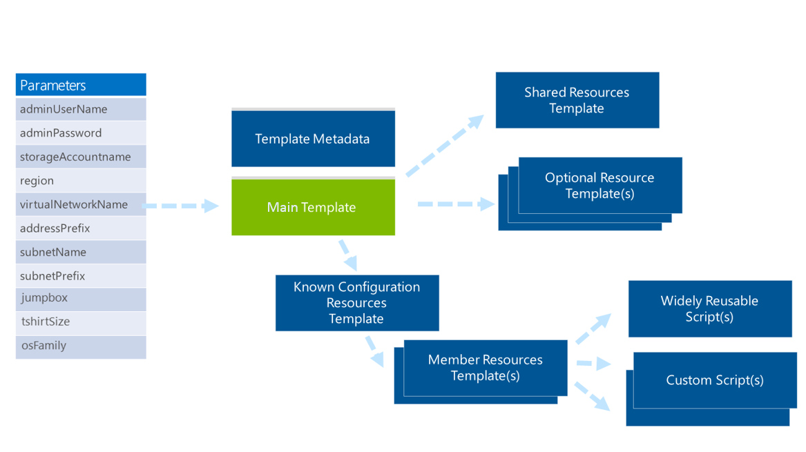
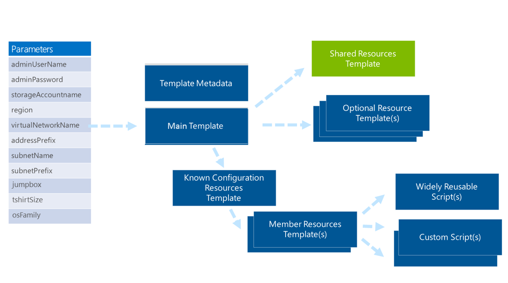
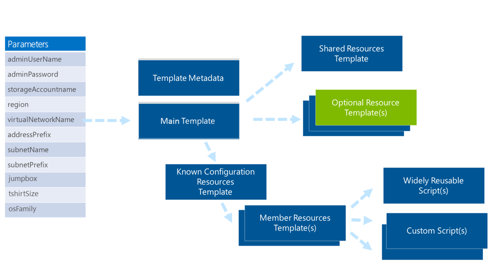
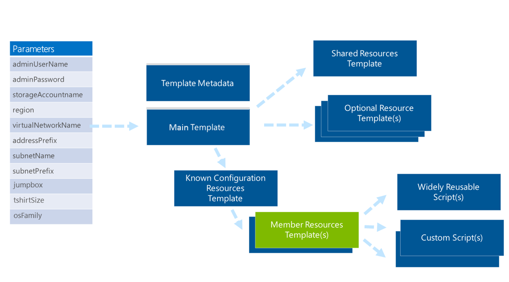
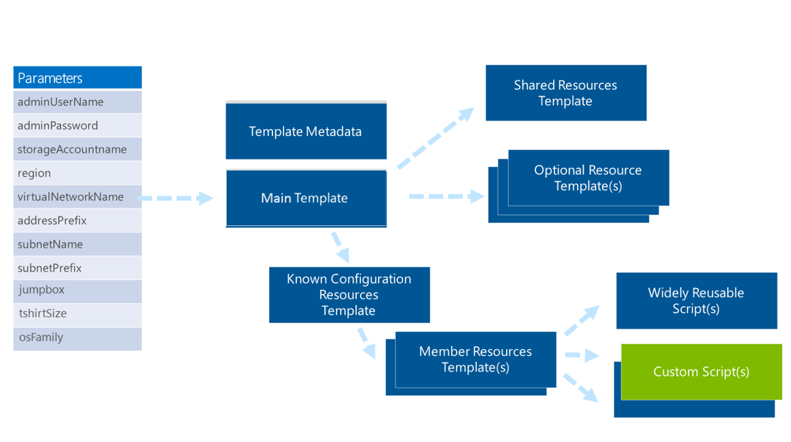
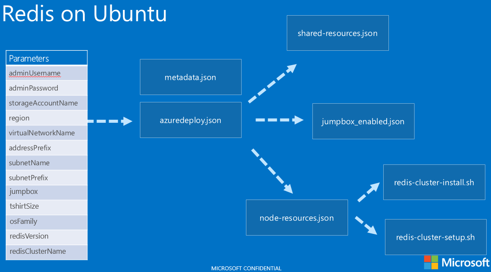

<properties
	pageTitle="Patterns for Resource Manager templates | Microsoft Azure"
	description="Show design patterns for Azure Resource Manager templates"
	services="azure-resource-manager"
	documentationCenter=""
	authors="tfitzmac"
	manager="timlt"
	editor="tysonn"/>

<tags
	ms.service="azure-resource-manager"
	ms.workload="multiple"
	ms.tgt_pltfrm="na"
	ms.devlang="na"
	ms.topic="article"
	ms.date="06/13/2016"
	ms.author="tomfitz"/>

# Patterns for designing Azure Resource Manager templates

In our work with enterprises, system integrator (SIs), cloud service vendor (CSVs), and open source software (OSS) project teams, it's often necessary to quickly 
deploy environments, workloads, or scale units. These deployments need to be supported, follow proven practices, and adhere to identified policies. Using a flexible 
approach based on Azure Resource Manager templates, you can deploy complex topologies quickly and consistently and then adapt these deployments easily as 
core offerings evolve or to accommodate variants for outlier scenarios or customers.

This topic is part of a larger whitepaper. To read the full paper, download [World Class ARM Templates Considerations and Proven Practices](http://download.microsoft.com/download/8/E/1/8E1DBEFA-CECE-4DC9-A813-93520A5D7CFE/World Class ARM Templates - Considerations and Proven Practices.pdf).

Templates combine the benefits of the underlying Azure Resource Manager with the adaptability and readability of JavaScript Object Notation (JSON). Using 
templates, you can:

- Deploy topologies and their workloads consistently.
- Manage all your resources in an application together using resource groups.
- Apply role-based access control (RBAC) to grant appropriate access to users, groups, and services.
- Use tagging associations to streamline tasks such as billing rollups.

This article provides details on consumption scenarios, architecture, and implementation patterns identified during our design sessions and real-world template 
implementations with Azure Customer Advisory Team (AzureCAT) customers. Far from academic, these are proven practices informed by the development of templates 
for 12 of the top Linux-based OSS technologies, including: Apache Kafka, Apache Spark, Cloudera, Couchbase, Hortonworks HDP, DataStax Enterprise powered by 
Apache Cassandra, Elasticsearch, Jenkins, MongoDB, Nagios, PostgreSQL, Redis, and Nagios. The majority of these templates were developed with a well-known vendor of 
a given distribution and influenced by the requirements of Microsoft’s enterprise and SI customers during recent projects.

This article shares these proven practices to help you architect world class Azure Resource Manager templates.  

In our work with customers, we have identified a number of Resource Manager template consumption experiences across enterprises, System Integrators (SI)s, and CSVs. 
The following sections provides a high-level overview of common scenarios and patterns for different customer types.

## Enterprises and system integrators

Within large organizations, we commonly see two consumers of ARM templates: internal software development teams and corporate IT. The scenarios for the 
SIs we’ve worked with have mapped to those of Enterprises, so the same considerations apply.

### Internal software development teams

If your team develops software to support your business, templates provide an easy way to quickly deploy technologies for use in business-specific solutions. 
You can also use templates to rapidly create training environments that enable team members to gain necessary skills.

You can use templates as-is or extend or compose them to accommodate your needs. Using tagging within templates, you can provide a billing summary with 
various views such as team, project, individual, and education.

Businesses often want software development teams to create a template for consistent deployment of a solution while also offering constraints so certain 
items within that environment remain fixed and can’t be overridden. For example, a bank might require a template to include RBAC so a programmer can’t revise a 
banking solution to send data to a personal storage account.

### Corporate IT

Corporate IT organizations typically use templates for delivering cloud capacity and cloud-hosted capabilities.

#### Cloud capacity

A common way for corporate IT groups to provide cloud capacity for teams within their organization is with “t-shirt sizes”, which are standard offering sizes 
such as small, medium, and large. The t-shirt sized offerings can mix different resource types and quantities while providing a level of standardization that 
makes it possible to use templates. The templates deliver capacity in a consistent way that enforces corporate policies and uses tagging to provide 
chargeback to consuming organizations.

For example, you may need to provide development, test, or production environments within which the software development teams can deploy their solutions. 
The environment has a predefined network topology and elements which the software development teams cannot change, such as rules governing access to the public 
internet and packet inspection. You may also have organization-specific roles for these environments with distinct access rights for the environment.

#### Cloud-hosted capabilities

You can use templates to support cloud-hosted capabilities, including individual software packages or composite offerings that are offered to internal lines 
of business. An example of a composite offering would be analytics-as-a-service—analytics, visualization, and other technologies—delivered in an optimized, 
connected configuration on a predefined network topology.

Cloud-hosted capabilities are affected by the security and role considerations established by the cloud capacity offering on which they’re built as described above.
These capabilities are offered as is or as a managed service. For the latter, access-constrained roles are required to enable access into the environment for 
management purposes.

## Cloud service vendors

After talking to many CSVs, we have identified multiple approaches you can take to deploy services for your customers and associated requirements.

### CSV-hosted offering

If you host your offering in your own Azure subscription, two hosting approaches are common: deploying a distinct deployment for every customer or deploying 
scale units that underpin a shared infrastructure used for all customers.

- **Distinct deployments for each customer.** Distinct deployments per customer require fixed topologies of different known configurations. These may have different 
virtual machine (VM) sizes, varying numbers of nodes, and different amounts of associated storage. Tagging of deployments is used for roll-up billing of each customer. 
RBAC may be enabled to allow customers access to aspects of their cloud environment.
- **Scale units in shared multi-tenant environments.** A template can represent a scale unit for multi-tenant environments. In this case, the same infrastructure 
is used to support all customers. The deployments represent a group of resources that deliver a level of capacity for the hosted offering, such as number of users 
and number of transactions. These scale units are increased or decreased as demand requires.

### CSV offering injected into customer subscription

You may want to deploy your software into subscriptions owned by end customers. You can use templates to deploy distinct deployments into a customer’s Azure account.

These deployments use RBAC so you can update and manage the deployment within the customer’s account.

### Azure Marketplace

If you want to advertise and sell your offerings through a marketplace, such as Azure Marketplace, you can develop templates to deliver distinct types of 
deployments that will run in a customer’s Azure account. This distinct deployments can be typically described as a t-shirt size (small, medium, large), 
product/audience type (community, developer, enterprise), or feature type (basic, high availability).  In some cases, these types will allow you to specify 
certain attributes of the deployment, such as VM type or number of disks.

## OSS projects

Within open source projects, Resource Manager templates enable a community to deploy a solution quickly using proven practices. You can store templates in a 
GitHub repository so the community can revise them over time. End users can then deploy these templates in their own Azure subscriptions.

The following sections identify the things you need to consider before designing your solution.

## Identifying what is outside and inside of a VM

As you design your template, it’s helpful to look at the requirements in terms of what’s outside and inside of the virtual machines (VMs):

- Outside means the VMs and other resources of your deployment, such as the network topology, tagging, references to the certs/secrets, and role-based access control. All of these resources are part of your template.
- Inside means the installed software and overall desired state configuration. Other mechanisms, such as VM extensions or scripts, are used in whole or in part. These mechanisms may be identified and executed by the template but aren’t in it.

Common examples of activities you would do “inside the box” include -  

- Install or remove server roles and features
- Install and configure software at the node or cluster level
- Deploy websites on a web server
- Deploy database schemas
- Manage registry or other types of configuration settings
- Manage files and directories
- Start, stop, and manage processes and services
- Manage local groups and user accounts
- Install and manage packages (.msi, .exe, yum, etc.)
- Manage environment variables
- Run native scripts (Windows PowerShell, bash, etc.)

### Desired state configuration (DSC)

Thinking about the internal state of your VMs beyond deployment, you’ll want to make sure this deployment doesn’t “drift” from the configuration that you have 
defined and checked into source control. This ensures your developers or operations staff don’t manually make ad-hoc changes to an environment that are not vetted, 
tested or recorded in source control. This is important, because the manual changes are not in source control, they are also not part of the standard deployment 
and will impact future automated deployments of the software.

Beyond your internal employees, desired state configuration is also important from a security perspective.  Hackers are regularly trying to compromise and exploit 
software systems. When successful, its common to install files and otherwise change the state of a compromised system. Using desired state configuration, you can 
identify deltas between the desired and actual state and restore a known configuration.

There are resource extensions for the most popular mechanisms for DSC - PowerShell DSC, Chef, and Puppet. Each of these can deploy the initial state of your VM and 
also be used to make sure the desired state is maintained.

## Common template scopes

In our experience, we’ve seen three key solution templates scopes emerge. These three scopes – capacity, capability, and end-to-end solution – are described in 
more detail below.

### Capacity scope

A capacity scope delivers a set of resources in a standard topology that is pre-configured to be in compliance with regulations and policies. The most common 
example is deploying a standard development environment in an Enterprise IT or SI scenario.

### Capability scope

A capability scope is focused on deploying and configuring a topology for a given technology. Common scenarios including technologies such as SQL Server, 
Cassandra, Hadoop, etc.

### End-to-end solution scope

An End-to-End Solution Scope is targeted beyond a single capability, and instead focused on delivering an end to end solution comprised of multiple capabilities.  

A solution-scoped template scope manifests itself as a set of one or more capability scoped templates with solution specific resources, logic, and desired state. An example of a solution-scoped template is an end to end data pipeline solution template that might mix solution specific topology and state with 
multiple capability scoped solution templates such as Kafka, Storm, and Hadoop.

## Choosing free-form vs. known configurations

You might initially think a template should give consumers the utmost flexibility, but many considerations affect the choice of whether to use free-form 
configurations vs. known configurations. This section identifies the key customer requirements and technical considerations that shaped the approach shared in 
this document.

### Free-form configurations

On the surface, free-form configurations sound ideal. They allow you to select a VM type and provide an arbitrary number of nodes and attached disks for those nodes—and 
do so as parameters to a template. When you look closely, though, and consider templates that will deploy multiple virtual machines of different sizes, additional 
considerations appear that make the choice less appropriate in a number of scenarios.

In [Sizes for virtual machines](./virtual-machines/virtual-machines-windows-sizes.md), the different VM 
types and available sizes are identified, and each of the number of durable disks (2, 4, 8, 16, or 32) that can be attached. Each attached disk provides 500 IOPS 
and multiples of these disks can be pooled for a multiplier of that number of IOPS. For example, 16 disks can be pooled to provide 8,000 IOPS. Pooling is done with 
configuration in the operating system, using Microsoft Windows Storage Spaces or redundant array of inexpensive disks (RAID) in Linux.

A free-form configuration enables the selection of a number of VM instances, a number of different VM types and sizes for those instances, a number of disks that 
can vary based on the VM type, and one or more scripts to configure the VM contents.

It is common that a deployment may have multiple types of nodes, such as master and data nodes, so this flexibility is often provided for every node type.

As you start to deploy clusters of any significance, you begin to work with multiples of all of these. If you were deploying a Hadoop cluster, for example, 
with 8 master nodes and 200 data nodes, and pooled 4 attached disks on each master node and pooled 16 attached disks per data node, you would have 208 VMs and 
3,232 disks to manage.

A storage account will throttle requests above its identified 20,000 transactions/second limit, so you should look at storage account partitioning and use 
calculations to determine the appropriate number of storage accounts to accommodate this topology. Given the multitude of combinations supported by the free-form 
approach, dynamic calculations are required to determine the appropriate partitioning. The Azure Resource Manager Template Language does not presently provide 
mathematical functions, so you must perform these calculations in code, generating a unique, hard-coded template with the appropriate details.

In enterprise IT and SI scenarios, someone must maintain the templates and provide support for the deployed topologies for one or more organizations. 
This additional overhead — different configurations and templates for each customer — is far from desirable.

You can use these templates to deploy environments in your customer’s Azure subscription, but both corporate IT teams and CSVs typically deploy them into their 
own subscriptions, using a chargeback function to bill their customers. In these scenarios, the goal is to deploy capacity for multiple customers across a pool 
of subscriptions and keep deployments densely populated into the subscriptions to minimize subscription sprawl—that is, more subscriptions to manage. With truly 
dynamic deployment sizes, achieving this type of density requires careful planning and additional development for scaffolding work on behalf of the organization.

In addition, you can’t create subscriptions via an API call but must do so manually through the portal. As the number of subscriptions increases, any resulting 
subscription sprawl requires human intervention—it can’t be automated. With so much variability in the sizes of deployments, you would have to pre-provision a 
number of subscriptions manually to ensure subscriptions are available.

Considering all these factors, a truly free-form configuration is less appealing than at first blush.

### Known configurations — the t-shirt sizing approach

Rather than offer a template that provides total flexibility and countless variations, in our experience a common pattern is to provide the ability to select 
known configurations — in effect, standard t-shirt sizes such as sandbox, small, medium, and large. Other examples of t-shirt sizes are product offerings, 
such as community edition or enterprise edition.  In other cases, it may be workload specific configurations of a technology – such as map reduce or no sql.

Many enterprise IT organizations, OSS vendors, and SIs make their offerings available today in this way in on-premises, virtualized environments 
(enterprises) or as software-as-a-service (SaaS) offerings (CSVs and OSVs).

This approach provides good, known configurations of varying sizes that are preconfigured for customers. Without known configurations, end customers 
must determine cluster sizing on their own, factor in platform resource constraints, and do math to identify the resulting partitioning of storage accounts 
and other resources (due to cluster size and resource constraints). Known configurations enable customers to easily select the right t-shirt size—that is, 
a given deployment. In addition to making a better experience for the customer, a small number of known configurations is easier to support and can help you 
deliver a higher level of density.

A known configuration approach focused on t-shirt sizes may also have varying number of nodes within a size. For example, a small t-shirt size may be 
between 3 and 10 nodes.  The t-shirt size would be designed to accommodate up to 10 nodes and provide the consumer the ability to make free form selections up to 
the maximum size identified.  

A t-shirt size based on workload type, may be more free form in nature in terms of the number of nodes that can be deployed but will have workload distinct 
node size and configuration of the software on the node.

T-shirt sizes based on product offerings, such as community or Enterprise, may have distinct resource types and maximum number of nodes that can be deployed, 
typically tied to licensing considerations or feature availability across the different offerings.

You can also accommodate customers with unique variants using the JSON-based templates. When dealing with outliers, you can incorporate the appropriate planning 
and considerations for development, support, and costing.

Based on the customer template consumption scenarios, requirements identified at the start of this document, and our hands-on experience creating numerous templates, 
we identified a pattern for template decomposition.

## Capacity and capability-scoped solution templates

Decomposition provides a modular approach to template development that supports reuse, extensibility, testing, and tooling. This section provides detail on how a 
decomposition approach can be applied to templates with a Capacity or Capability scope.

In this approach, a main template receives parameter values from a template consumer, then links to several types of templates and scripts downstream as 
shown below. Parameters, static variables, and generated variables are used to provide values in and out of the linked templates.

**Parameters are passed to a main template then to linked templates**

This following sections focus on the types of templates and scripts that a single template would be decomposed into and examines approaches for passing state 
information among the templates. Each template and the script types in the image are described along with examples. For a contextual example, see 
"Putting it together: a sample implementation" later in this document.

### Template metadata

Template metadata (the metadata.json file) contains key/value pairs that describe a template in JSON, which can be read by humans and software systems.

**Template metadata is described in the metadata.json file**

Software agents can retrieve the metadata.json file and publish the information and a link to the template in a web page or directory. Elements 
include *itemDisplayName*, *description*, *summary*, *githubUsername*, and *dateUpdated*.

An example file is shown below in its entirety.

    {
        "itemDisplayName": "PostgreSQL 9.3 on Ubuntu VMs",
        "description": "This template creates a PostgreSQL streaming-replication between a master and one or more slave servers each with 2 striped data disks. The database servers are deployed into a private-only subnet with one publicly accessible jumpbox VM in a DMZ subnet with public IP.",
        "summary": "PostgreSQL stream-replication with multiple slave servers and a publicly accessible jumpbox VM",
        "githubUsername": "arsenvlad",
        "dateUpdated": "2015-04-24"
    }

### Main template

The main template (the azuredeploy.json file) is called by an end user and is the template through which a set of user-defined parameters are presented.

**The main template receives parameters from a user**

The role of this template is to receive parameters from a user, use that information to populate a set of complex object variables, then execute the appropriate 
set of related templates using template linking.

One parameter that is provided is a known configuration type also known as the t-shirt size parameter because of its standardized values such as small, 
medium, or large. In practice you can use this parameter in multiple ways. For details, see "Known configuration resources template" later in this document.

Some resources are deployed regardless of the known configuration specified by a user parameter. These resources are provisioned using a single shared 
resource template and are shared by other templates, so the shared resource template is run first.

Some resources are deployed optionally regardless of the specified known configuration.

### Shared resources template

This template delivers resources that are common across all known configurations. It contains the virtual network, availability sets, and other resources that 
are required regardless of the known configuration template that is deployed.

**Shared resources template**

Resource names, such as the virtual network name, are based on the main template. You can specify them as a variable within that template or receive them as a 
parameter from the user, as required by your organization.

### Optional resources template

The optional resources template contains resources that are programmatically deployed based on the value of a parameter or variable.

**Optional resources template**

For example, you can use an optional resources template to configure a jumpbox that enables indirect access to a deployed environment from the public 
Internet. You would use a parameter or variable to identify whether the jumpbox should be enabled and the *concat* function to build the target name for the 
template, such as *jumpbox_enabled.json*. Template linking would use the resulting variable to install the jumpbox.

You can link the optional resources template from multiple places:

-	When applicable to every deployment, create a parameter-driven link from the shared resources template.
-	When applicable to select known configurations—for example, only install on large deployments—create a parameter-driven or variable-driven link from the 
known configuration template.

Whether a given resource is optional may not be driven by the template consumer but instead by the template provider. For example, you may need to satisfy a 
particular product requirement or product add-on (common for CSVs) or to enforce policies (common for SIs and enterprise IT groups). In these cases, you can use a 
variable to identify whether the resource should be deployed.

### Known configuration resources template

In the main template, a parameter can be exposed to allow the template consumer to specify a desired known configuration to deploy. In many cases, this known 
configuration uses a t-shirt size approach with a set of fixed configuration sizes such as sandbox, small, medium, and large.

**Known configuration resources template**

The t-shirt size approach is commonly used, but the parameters can represent any set of known configurations. For example, you can specify a set of environments 
for an enterprise application such as Development, Test, and Product. Or you could use it for a cloud service to represent different scale units, product versions, 
or product configurations such as Community, Developer, or Enterprise.

As with the shared resource template, variables are passed to the known configurations template from either:

-	An end user—that is, the parameters sent to the main template.
-	An organization—that is, the variables in the main template that represent internal requirements or policies.

### Member resources template

Within a known configuration, one or more member node types are often included. For example, with Hadoop you would have master nodes and data nodes. 
If you are installing MongoDB, you would have data nodes and an arbiter. If you are deploying DataStax, you would have data nodes as well as a VM 
with OpsCenter installed.

**Member resources template**

Each type of nodes can have different sizes of VMs, numbers of attached disks, scripts to install and set up the nodes, port configurations for the VM(s), 
number of instances, and other details. So each node type gets its own member resource template, which contains the details for deploying and configuring an 
infrastructure as well as executing scripts to deploy and configure software within the VM.

For VMs, typically two types of scripts are used, widely reusable and custom scripts.

### Widely reusable scripts

Widely reusable scripts can be used across multiple types of templates. One of the better examples of these widely reusable scripts sets up RAID on Linux to 
pool disks and gain a greater number of IOPS. Regardless of the software being installed in the VM, this script provides reuse of proven practices for common scenarios.

**Member resources templates can call widely reusable scripts**

### Custom scripts

Templates commonly call one or more scripts that install and configure software within VMs. A common pattern is seen with large topologies where multiple 
instances of one or more member types are deployed. An installation script is initiated for every VM that can be run in parallel, followed by a setup script 
that is called after all VMs (or all VMs of a given member type) are deployed.

**Member resources templates can call scripts for a specific purpose such as VM configuration**

## Capability-scoped solution template example - Redis

To show how an implementation might work, let’s look at a practical example of building a template that will facilitate the deployment and configuration of 
Redis in standard t-shirt sizes.  

For the deployment, there will be set of shared resources (virtual network, storage account, availability sets) and an optional resource (jumpbox). There are 
multiple known configurations represented as t-shirt sizes (small, medium, large) but each with a single node type. There are also two purpose specific scripts 
(installation, configuration).

### Creating the template files

You would create a Main Template named azuredeploy.json.

You create Shared Resources Template named shared-resources.json

You create an Optional Resource Template to enable the deployment of a jumpbox, named jumpbox_enabled.json

Redis will use just a single node type, so you’ll create a single Member Resource Template named node-resources.json.

With Redis, you’ll want to install each individual node and then, once all nodes are installed you’ll want to set up the cluster.  You have scripts to 
accommodate both of these, redis-cluster-install.sh and redis-cluster-setup.sh.

### Linking the templates

Using template linking, the main template links out to the shared resources template, which establishes the virtual network.

Logic is added within the main template to enable consumers of the template to specify if a jumpbox should be deployed. An *enabled* value for the *EnableJumpbox* 
parameter indicates that the customer wants to deploy a jumpbox. When this value is provided, the template concatenates *_enabled* as a suffix to a base template 
name for the jumpbox capability.

The main template applies the *large* parameter value as a suffix to a base template name for t-shirt sizes, and then uses that value in a template link out to 
*technology_on_os_large.json*.

The topology would resemble this illustration.

**Template structure for a Redis template**

### Configuring state

For the nodes in the cluster, there are two steps to configuring the state, both represented by Purpose Specific Scripts.  “redis-cluster-install.sh” will 
perform an installation of Redis and “redis-cluster-setup.sh” will set up the cluster.

### Supporting Different Size Deployments

Inside of variables, the t-shirt size template specifies the number of nodes of each type to deploy for the specified size (*large*). It then deploys that number of 
VM instances using resource loops, providing unique names to resources by appending a node name with a numeric sequence number from *copyIndex()*. It does this for 
both hot and warm zone VMs, as defined in the t-shirt name template

## Decomposition and end-to-end solution scoped templates

A solution template with an end-to-end solution scope is focused on delivering an end-to-end solution.  This will typically be a composition of multiple capability 
scoped templates with additional resources, logic and state.

As highlighted in the image below, the same model used for capability scoped templates is extended for templates with an End-to-End Solution Scope.

A Shared Resources Template and Optional Resources Templates serve the same function as in the capacity and capability scoped template approaches, but are 
scoped for the end to end solution.

As end to end solution scoped templates also can typically have t-shirt sizes, the Known Configuration Resources template reflects what is required for a 
given known configuration of the solution.

The Known Configuration Resources Template will link to one or more capability scoped solution templates that are relevant to the end to end solution as well 
as the Member Resource Templates that are required for the end to end solution.

As the t-shirt size of the solution may be different than that of individual capability scoped template, variables within the Known Configuration Resources 
Template are used to provide the appropriate values for downstream capability scoped solution templates to deploy the appropriate t-shirt size.

**The model used for capacity or capability scoped solution templates can be readily extended for end to end solution template scopes**

## Preparing templates for the Marketplace

The above approach readily accommodates scenarios where Enterprises, SIs, and CSVs want to either deploy the templates themselves or enable their customers to 
deploy on their own.

Another desired scenario is deploying a template via the marketplace.  This decomposition approach will work for the marketplace as well, with some minor changes.

As mentioned previously, templates can be used to offer distinct deployment types for sale in the marketplace. Distinct deployment types may be 
t-shirt sizes (small, medium, large) , product/audience type (community, developer, enterprise), or feature type (basic, high availability).

As shown below, the existing end to end solution or capability scoped templates can be readily utilized to list the different known configurations in the marketplace.

The parameters to the main template are first modified to remove the inbound parameter named tshirtSize.

While the distinct deployment types map to the Known Configuration Resources Template, they also need the common resources and configuration found in 
the Shared Resources Template and potentially those in Optional Resource Templates.

If you want to publish your template to the marketplace, you simply establish distinct copies of your Main template that replaces the previously available 
inbound parameter of tshirtSize to a variable embedded within the template.

**Adapting a solution scoped template for the marketplace**

## Next steps

- For recommendations about how to handle security in Azure Resource Manager, see [Security considerations for Azure Resource Manager](best-practices-resource-manager-security.md)
- To learn about sharing state into and out of templates, see [Sharing state in Azure Resource Manager templates](best-practices-resource-manager-state.md).
