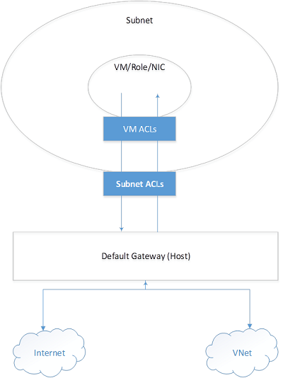
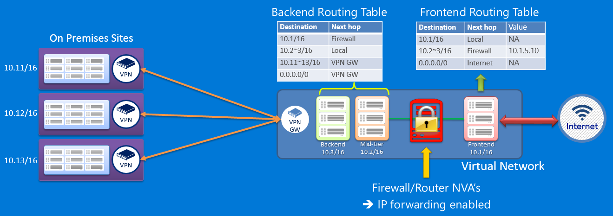

<properties
	pageTitle="Security considerations for Resource Manager | Microsoft Azure"
	description="Shows recommended approaches in Azure Resource Manager for securing resources with keys and secrets, role-based access control and network security groups."
	services="azure-resource-manager"
	documentationCenter=""
	authors="george-moore"
	manager="georgem"
	editor="tysonn"/>

<tags
	ms.service="azure-resource-manager"
	ms.workload="multiple"
	ms.tgt_pltfrm="na"
	ms.devlang="na"
	ms.topic="article"
	ms.date="08/01/2016"
	ms.author="georgem;tomfitz"/>

# Security considerations for Azure Resource Manager

When looking at aspects of security for your Azure Resource Manager templates, there are several areas to consider – keys and secrets, role-based access control,
and network security groups.

This topic assumes you are familiar with Role-Based Access Control (RBAC) in Azure Resource Manager. For more information, see
[Azure Role-based Access Control](./active-directory/role-based-access-control-configure.md).

This topic is part of a larger whitepaper. To read the full paper, download [World Class ARM Templates Considerations and Proven Practices](http://download.microsoft.com/download/8/E/1/8E1DBEFA-CECE-4DC9-A813-93520A5D7CFE/World Class ARM Templates - Considerations and Proven Practices.pdf).

## Secrets and certificates

Azure Virtual Machines, Azure Resource Manager and Azure Key Vault are fully integrated to provide support for the secure handling of certificates which are
to be deployed in the VM.  Utilizing Azure Key Vault with Resource Manager to orchestrate and store VM secrets and certificates is a best practice and
provides the following advantages:

- The templates only contain URI references to the secrets, which means the actual secrets are not in code, configuration or source code repositories. This prevents
key phishing attacks on internal or external repos, such as harvest-bots in GitHub.
- Secrets stored in the Key Vault are under full RBAC control of a trusted operator.  If the trusted operator leaves the company or transfers within the
company to a new group, they no longer have access to the keys they created in the Vault.
- Full compartmentalization of all assets:
      - the templates to deploy the keys
      - the templates to deploy a VM with references to the keys
      - the actual key materials in the Vault.  
  Each template (and action) can be under different RBAC roles for full separation of duties.
- The loading of secrets into a VM at deployment time occurs via direct channel between the Azure Fabric and the Key Vault within the confines of the Microsoft
datacenter.  Once the keys are in the Key Vault, they never see 'daylight' over an untrusted channel outside of the datacenter.  
- Key Vaults are always regional, so the secrets always have locality (and sovereignty) with the VMs. There are no global Key Vaults.

### Separation of keys from deployments

A best practice is to maintain separate templates for:

1.	Creation of vaults (which will contain the key material)
2.	Deployment of the VMs (with URI references to the keys contained in the vaults)

A typical enterprise scenario is to have a small group of Trusted Operators who have access to critical secrets within the deployed workloads, with a broader group
of dev/ops personnel who can create or update VM deployments.  Below is an example ARM template which creates and configures a new vault in the context
of the currently authenticated user's identity in Azure Active Directory.  This user would have the default permission to create, delete, list, update, backup,
restore, and get the public half of keys in this new key vault.

While most of the fields in this template should be self-explanatory, the **enableVaultForDeployment** setting deserves more background: vaults do not have any default
standing access by any other Azure infrastructure component. By setting this value, it allows the Azure Compute infrastructure components read-only access to this
specific named vault. Therefore, a further best practice is to not comingle corporate sensitive data in the same vault as virtual machine secrets.

    {
        "$schema": "https://schema.management.azure.com/schemas/2015-01-01/deploymentTemplate.json#",
        "contentVersion": "1.0.0.0",
        "parameters": {
            "keyVaultName": {
                "type": "string",
                "metadata": {
                    "description": "Name of the Vault"
                }
            },
            "location": {
                "type": "string",
                "allowedValues": ["East US", "West US", "West Europe", "East Asia", "South East Asia"],
                "metadata": {
                    "description": "Location of the Vault"
                }
            },
            "tenantId": {
                "type": "string",
                "metadata": {
                    "description": "Tenant Id of the subscription. Get using Get-AzureSubscription cmdlet or Get Subscription API"
                }
            },
            "objectId": {
                "type": "string",
                "metadata": {
                    "description": "Object Id of the AD user. Get using Get-AzureADUser cmdlet"
                }
            },
            "skuName": {
                "type": "string",
                "allowedValues": ["Standard", "Premium"],
                "metadata": {
                    "description": "SKU for the vault"
                }
            },
            "enableVaultForDeployment": {
                "type": "bool",
                "allowedValues": [true, false],
                "metadata": {
                    "description": "Specifies if the vault is enabled for a VM deployment"
                }
            }
        },
        "resources": [{
            "type": "Microsoft.KeyVault/vaults",
            "name": "[parameters('keyVaultName')]",
            "apiVersion": "2014-12-19-preview",
            "location": "[parameters('location')]",
            "properties": {
                "enabledForDeployment": "[parameters('enableVaultForDeployment')]",
                "tenantid": "[parameters('tenantId')]",
                "accessPolicies": [{
                    "tenantId": "[parameters('tenantId')]",
                    "objectId": "[parameters('objectId')]",
                    "permissions": {
                        "secrets": ["all"],
                        "keys": ["all"]
                    }
                }],
                "sku": {
                    "name": "[parameters('skuName')]",
                    "family": "A"
                }
            }
        }]
    }

Once the vault is created, the next step is to reference that vault in the deployment template of a new VM.  As mentioned above, a best practice is to have a
different dev/ops group manage VM deployments, with that group having no direct access to the keys as stored in the vault.

The below template fragment would be composed into higher order deployment constructs, each safely and securely referencing highly-sensitive secrets which are not
under the direct control of the operator.

    "vaultName": {
        "type": "string",
        "metadata": {
            "description": "Name of Key Vault that has a secret"
        }
    },
    {
        "apiVersion": "2015-05-01-preview",
        "type": "Microsoft.Compute/virtualMachines",
        "name": "[parameters('vmName')]",
        "location": "[parameters('location')]",
        "properties": {
            "osProfile": {
                "secrets": [{
                    "sourceVault": {
                        "id": "[resourceId('vaultrg', 'Microsoft.KeyVault/vaults', 'kayvault')]"
                    },
                    "vaultCertificates": [{
                        "certificateUrl": "[parameters('secretUrlWithVersion')]",
                        "certificateStore": "My"
                    }]
                }]
            }
        }
    }

To pass a value from a key vault as a parameter during deployment of a template, see [Pass secure values during deployment](resource-manager-keyvault-parameter.md).

## Service principals for cross-subscription interactions

Service identities are represented by service principals in Active Directory. Service principals will be at the center of enabling key scenarios for Enterprise IT organizations, System Integrators (SI), and Cloud Service Vendors (CSV). Specifically, there will be use cases where one of these organizations will need to interact with the subscription of one of their customers.  

Your organization could provide an offering that will monitor a solution deployed in your customers environment and subscription. In this case, you will need to
get access to logs and other data within a customers account so that you can utilize it in your monitoring solution. If you're a corporate IT organization, a systems integrator, you may provide an offering to a customer where you will deploy and manage a capability for them,
such as a data analytics platform, where the offering resides in the customers own subscription.

In these use cases, your organization would require an identity that could be given access to perform these actions within the context of a customer subscription.  

These scenarios bring with them a certain set of considerations for your customer:

-	For security reasons, access may need to be scoped to certain types of actions, e.g. read only access.
-	As deployed resources are provided at a cost, there may be similar constraints on access required for financial reasons.
-	For security reasons, access may need to be scoped only to a specific resource (storage accounts) or resources (resource group containing an environment or solution)
-	As a relationship with a vendor may change, the customer will want to have the ability to enable/disable access to SI or CSV
-	As actions against this account having billing implications, the customer desires support for auditability and accountability for billing.
-	From a compliance perspective, the customer will want to be able to audit your behavior within their environment

A combination of a service principal and RBAC can be used to address these requirements.

## Network security groups

Many scenarios will have requirements that specify how traffic to one or more VM instances in your virtual network is controlled. You can use a Network Security
Group (NSG) to do this as part of an ARM template deployment.

A network security group is a top-level object that is associated with your subscription. An NSG contains access control rules that allow or deny traffic to
VM instances. The rules of an NSG can be changed at any time, and changes are applied to all associated instances. To use an NSG, you must have a virtual network
that is associated with a region (location). NSGs are not compatible with virtual networks that are associated with an affinity group. If you don’t have a
regional virtual network and you want to control traffic to your endpoints, please see [About Network Access Control Lists (ACLs)](./virtual-network/virtual-networks-acl.md).

You can associate an NSG with a VM, or to a subnet within a virtual network. When associated with a VM, the NSG applies to all the traffic that is sent and
received by the VM instance. When applied to a subnet within your virtual network, it applies to all the traffic that is sent and received by all the VM instances
in the subnet. A VM or subnet can be associated with only 1 NSG, but each NSG can contain up to 200 rules. You can have 100 NSGs per subscription.

>[AZURE.NOTE]  Endpoint-based ACLs and network security groups are not supported on the same VM instance. If you want to use an NSG and have an endpoint ACL already in place, first remove the endpoint ACL. For information about how to do this, see [Managing Access Control Lists (ACLs) for Endpoints by using PowerShell](./virtual-network/virtual-networks-acl-powershell.md).

### How network security groups work

Network security groups are different than endpoint-based ACLs. Endpoint ACLs work only on the public port that is exposed through the Input endpoint. An
NSG works on one or more VM instances and controls all the traffic that is inbound and outbound on the VM.

A network security group has a *Name*, is associated with a *Region* (one of the supported Azure locations), and has a descriptive label. It contains two types of
rules, Inbound and Outbound. The Inbound rules are applied on the incoming packets to a VM and the Outbound rules are applied to the outgoing packets from the VM.
The rules are applied at the server machine where the VM is located. An incoming or outgoing packet must match an Allow rule to be permitted; otherwise, it’s dropped.

Rules are processed in the order of priority. For example, a rule with a lower priority number such as 100 is processed before rules with a higher priority numbers
such as 200. Once a match is found, no more rules are processed.

A rule specifies the following:

-	Name: A unique identifier for the rule
-	Type: Inbound/Outbound
-	Priority: An integer between 100 and 4096 (rules processed from low to high)
-	Source IP Address: CIDR of source IP range
-	Source Port Range: An integer or range between 0 and 65536
-	Destination IP Range: CIDR of the destination IP Range
-	Destination Port Range: An integer or range between 0 and 65536
-	Protocol: TCP, UDP or ‘\*’
-	Access: Allow/Deny

### Default rules

An NSG contains default rules. The default rules can't be deleted, but because they are assigned the lowest priority, they can be overridden by the rules that
you create. The default rules describe the default settings recommended by the platform. As illustrated by the default rules below, traffic originating and ending
in a virtual network is allowed both in Inbound and Outbound directions.

While connectivity to the Internet is allowed for outbound direction, it is by default blocked for inbound direction. A default rule allows the Azure load balancer
to probe the health of a VM. You can override this rule if the VM or set of VMs under the NSG does not participate in the load balanced set.

The default rules are shown in the tables below.

**Inbound default rules**

Name |	Priority |	Source IP |	Source Port |	Destination IP |	Destination Port |	Protocol |	Access
--- | --- | --- | --- | --- | --- | --- | ---
ALLOW VNET INBOUND	| 65000	| VIRTUAL_NETWORK |	\* |	VIRTUAL_NETWORK	| \* |	\*	| ALLOW
ALLOW AZURE LOAD BALANCER INBOUND	| 65001	| AZURE_LOADBALANCER	| \*	| \*	| \*	| \*	| ALLOW
DENY ALL INBOUND	| 65500	| \*	| \*	| \*	| \*	| \*	| DENY

**Outbound default rules**

Name |	Priority |	Source IP |	Source Port |	Destination IP |	Destination Port |	Protocol |	Access
--- | --- | --- | --- | --- | --- | --- | ---
ALLOW VNET OUTBOUND	| 65000	| VIRTUAL_NETWORK	| \*	| VIRTUAL_NETWORK	| \*	| \*	| ALLOW
ALLOW INTERNET OUTBOUND	| 65001	| \*	| \*	| INTERNET	| \*	| \*	| ALLOW
DENY ALL OUTBOUND	| 65500	| \*	| \*	| \*	| \*	| \*	| DENY

### Special infrastructure rules

NSG rules are explicit. No traffic is allowed or denied beyond what is specified in the NSG rules. However, two types of traffic are always allowed regardless of the
Network Security group specification. These provisions are made to support the infrastructure:

- **Virtual IP of the Host Node**: Basic infrastructure services such as DHCP, DNS, and Health monitoring are provided through the virtualized host IP address
168.63.129.16. This public IP address belongs to Microsoft and will be the only virtualized IP address used in all regions for this purpose. This IP address maps to
the physical IP address of the server machine (host node) hosting the VM. The host node acts as the DHCP relay, the DNS recursive resolver, and the probe source for the
load balancer health probe and the machine health probe. Communication to this IP address should not be considered as an attack.
- **Licensing (Key Management Service)**: Windows images running in the VMs should be licensed. To do this, a licensing request is sent to the Key Management Service
host servers that handle such queries. This will always be on outbound port 1688.

### Default tags

Default tags are system-provided identifiers to address a category of IP addresses. Default tags can be specified in user-defined rules.

**Default tags for NSGs**

Tag |	Description
--- | ---
VIRTUAL_NETWORK |	Denotes all of your network address space. It includes the virtual network address space (IP CIDR in Azure) as well as all connected on-premises address space (Local Networks). This also includes virtual network-to-virtual network address spaces.
AZURE_LOADBALANCER | Denotes the Azure Infrastructure load balancer and will translate to an Azure datacenter IP where Azure’s health probes will originate. This is needed only if the VM or set of VMs associated with the NSG is participating in a load balanced set.
INTERNET | Denotes the IP address space that is outside the virtual network and can be reached by public Internet. This range includes Azure-owned public IP space as well.

### Ports and port ranges

NSG rules can be specified on a single source or destination port, or on a port range. This approach is particularly useful when you want to open a wide range of ports
for an application, such as FTP. The range must be sequential and can't be mixed with individual port specifications.
To specify a range of ports, use the hyphen (–) character. For example, **100-500**.

### ICMP traffic

With the current NSG rules, you can specify TCP or UDP as protocols but not ICMP. However, ICMP traffic is allowed within a virtual network by default through
the Inbound rules that support traffic from and to any port and protocol (\*) within the virtual network.

### Associating an NSG with a VM

When an NSG is directly associated with a VM, the network access rules in the NSG are directly applied to all traffic that is destined to the VM. Whenever the NSG is
updated for rule changes, the traffic handling reflects the updates within minutes. When the NSG is disassociated from the VM, the state reverts to its
pre-NSG condition—that is, to the system defaults before the NSG was introduced.

### Associating an NSG with a subnet

When an NSG is associated with a subnet, the network access rules in the NSG are applied to all the VMs in the subnet. Whenever the access rules in the NSG are
updated, the changes are applied to all VMs in the subnet within minutes.

### Associating an NSG with a subnet and a VM

You can associate one NSG with a VM and another NSG with the subnet where the VM resides. This scenario is supported to provide the VM with two layers of protection.
On the inbound traffic, the packet follows the access rules specified in the subnet, followed by rules in the VM. When outbound, the packet follows the rules specified
in the VM first, then follows the rules specified in the subnet as shown below.

When an NSG is associated with a VM or subnet, the network access control rules become very explicit. The platform will not insert any implicit rule to allow
traffic to a particular port. In this case, if you create an endpoint in the VM, you must also create a rule to allow traffic from the Internet. If you don't do
this, the *VIP:{Port}* can't be accessed from outside.

For example, you can create a new VM and a new NSG. You associate the NSG with the VM. The VM can communicate with other VMs in the virtual network through the
ALLOW VNET INBOUND rule. The VM can also make outbound connections to the Internet using the ALLOW INTERNET OUTBOUND rule. Later, you create an endpoint on port 80
to receive traffic to your website running in the VM. Packets destined to port 80 on the VIP (public Virtual IP address) from the Internet will not reach the VM until
you add a rule similar to the following table to the NSG.

**Explicit rule allowing traffic to a particular port**

Name |	Priority |	Source IP |	Source Port |	Destination IP |	Destination Port |	Protocol |	Access
--- | --- | --- | --- | --- | --- | --- | ---
WEB	| 100	| INTERNET | *	| *	| 80	| TCP	| ALLOW

## User-defined routes

Azure uses a route table to decide how to forward IP traffic based on the destination of each packet. Although Azure provides a default route table based on
your virtual network settings, you may need to add custom routes to that table.

The most common need for a custom entry in the route table is the use of a virtual appliance in your Azure environment. Take into account the scenario shown in
the Figure below. Suppose you want to ensure that all traffic directed to the mid-tier and backed subnets initiated from the front end subnet go through a
virtual firewall appliance. Simply adding the appliance to your virtual network and connecting it to the different subnets will not provide this functionality.
You must also change the routing table applied to your subnet to ensure packets are forwarded to the virtual firewall appliance.

The same would be true if you implemented a virtual NAT appliance to control traffic between your Azure virtual network and the Internet. To ensure the virtual
appliance is used you have to create a route specifying that all traffic destined to the Internet must be forwarded to the virtual appliance.

### Routing

Packets are routed over a TCP/IP network based on a route table defined at each node on the physical network. A route table is a collection of individual
routes used to decide where to forward packets based on the destination IP address. A route consists of the following:

- Address Prefix. The destination CIDR to which the route applies, such as 10.1.0.0/16.
- Next hop type. The type of Azure hop the packet should be sent to. Possible values are:
  - Local. Represents the local virtual network. For instance, if you have two subnets, 10.1.0.0/16 and 10.2.0.0/16 in the same virtual network, the route for each subnet in the route table will have a next hop value of Local.
  - VPN Gateway. Represents an Azure S2S VPN Gateway.
  - Internet. Represents the default Internet gateway provided by the Azure Infrastructure
  - Virtual Appliance. Represents a virtual appliance you added to your Azure virtual network.
  - NULL. Represents a black hole. Packets forwarded to a black hole will not be forwarded at all.
-	Nexthop Value. The next hop value contains the IP address packets should be forwarded to. Next hop values are only allowed in routes where the next hop type is *Virtual Appliance*. The next hop needs to be on the subnet (the local interface of the virtual appliance according to the network ID), not a remote subnet.

### Default routes

Every subnet created in a virtual network is automatically associated with a route table that contains the following default route rules:

- Local VNet Rule: This rule is automatically created for every subnet in a virtual network. It specifies that there is a direct link between the VMs in the VNet and there is no intermediate next hop. This enables the VMs on the same subnet, regardless of the network ID that the VMs exist in, to communicate with each other without requiring a default gateway address.
- On-premises Rule: This rule applies to all traffic destined to the on-premises address range and uses VPN gateway as the next hop destination.
- Internet Rule: This rule handles all traffic destined to the public Internet and uses the infrastructure internet gateway as the next hop for all traffic destined to the Internet.

### BGP routes

At the time of this writing, [ExpressRoute](./expressroute/expressroute-introduction.md) is not yet supported in the [Network Resource Provider](./virtual-network/resource-groups-networking.md) for Azure Resource Manager.  If you have an ExpressRoute connection between your
on-premises network and Azure, you can enable BGP to propagate routes from your on-premises network to Azure once ExpressRoute is supported in the NRP. These
BGP routes are used in the same way as default routes and user defined routes in each Azure subnet. For more information see
[ExpressRoute Introduction](./expressroute/expressroute-introduction.md).

>[AZURE.NOTE] When ExpressRoute on NRP is supported, you will be able to configure your Azure environment to use forced tunneling through your on-premises network by creating a user defined route for subnet 0.0.0.0/0 that uses the VPN gateway as the next hop. However, this only works if you are using a VPN gateway, not ExpressRoute. For ExpressRoute, forced tunneling is configured through BGP.

### User-defined routes

You cannot view the default routes specified above in your Azure environment, and for most environments, those are the only routes you will need.
However, you may need to create a route table and add one or more routes in specific cases, such as:

-	Forced tunneling to the Internet via your on-premises network.
-	Use of virtual appliances in your Azure environment.

In the scenarios above, you will have to create a route table and add user defined routes to it. You can have multiple route tables, and the same route table can
be associated to one or more subnets. And each subnet can only be associated to a single route table. All VMs and cloud services in a subnet use the route table
associated to that subnet.

Subnets rely on default routes until a route table is associated to the subnet. Once an association exists, routing is done based on [Longest Prefix Match (LPM)](https://en.wikipedia.org/wiki/Longest_prefix_match)
among both user defined routes and default routes. If there is more than one route with the same LPM match then a route is selected based on its origin in the following
order:

1.	User defined route
2.	BGP route (when ExpressRoute is used)
3.	Default route

>[AZURE.NOTE] User defined routes are only applied to Azure VMs and cloud services. For instance, if you want to add a firewall virtual appliance between your on-premises network and Azure, you will have to create a user defined route for your Azure route tables that forwards all traffic going to the on-premises address space to the virtual appliance. However, incoming traffic from the on-premises address space will flow through your VPN gateway or ExpressRoute circuit straight to the Azure environment, bypassing the virtual appliance.

### IP forwarding

As described above, one of the main reasons to create a user defined route is to forward traffic to a virtual appliance. A virtual appliance is nothing more than a
VM that runs an application used to handle network traffic in some way, such as a firewall or a NAT device.

This virtual appliance VM must be able to receive incoming traffic that is not addressed to itself. To allow a VM to receive traffic addressed to other destinations,
you must enable IP Forwarding in the VM.

## Next steps
- To understand how to set up security principals with the correct access to work with resources in your organization, see [Authenticating a Service Principal with Azure Resource Manager](resource-group-authenticate-service-principal.md)
- If you need to lock access to a resource, you can use management locks. See [Lock Resources with Azure Resource Manager](resource-group-lock-resources.md)
- To configure routing and IP forwarding, see [Create User Defined Routes (UDR) in Resource Manager by using a template](./virtual-network/virtual-network-create-udr-arm-template.md)
- For an overview of role-based access control, see [Role-based access control in the Microsoft Azure portal](./active-directory/role-based-access-control-configure.md)
