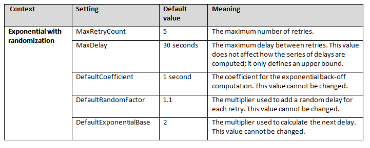
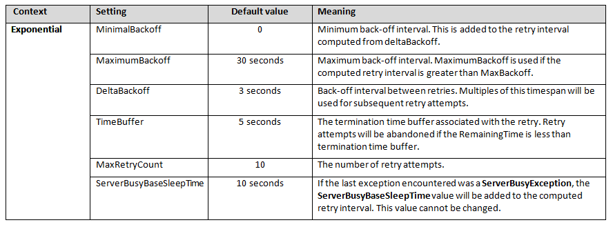
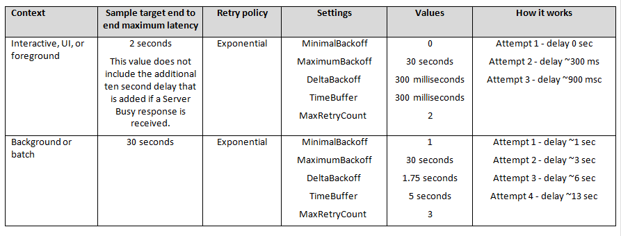

<properties
   pageTitle="Retry service specific guidance | Microsoft Azure"
   description="Service specific guidance for setting the retry mechanism."
   services=""
   documentationCenter="na"
   authors="dragon119"
   manager="christb"
   editor=""
   tags=""/>

<tags
   ms.service="best-practice"
   ms.devlang="na"
   ms.topic="article"
   ms.tgt_pltfrm="na"
   ms.workload="na"
   ms.date="07/13/2016"
   ms.author="masashin"/>

# Retry service specific guidance

[AZURE.INCLUDE [pnp-header](../includes/guidance-pnp-header-include.md)]

## Overview

Most Azure services and client SDKs include a retry mechanism. However, these differ because each service has different characteristics and requirements, and so each retry mechanism is tuned to a specific service. This guide summarizes the retry mechanism features for the majority of Azure services, and includes information to help you use, adapt, or extend the retry mechanism for that service.

For general guidance on handling transient faults, and retrying connections and operations against services and resources, see [Retry guidance](best-practices-retry-general.md).

The following table summarizes the retry features for the Azure services described in this guidance.

| **Service**                           | **Retry capabilities**                  | **Policy configuration**     | **Scope**                                        | **Telemetry features** |
|---------------------------------------|-----------------------------------------|------------------------------|--------------------------------------------------|------------------------
| **[AzureStorage](#azure-storage-retry-guidelines)**                      | Native in client                        | Programmatic                 | Client and individual operations                 | TraceSource            |
| **[SQL Database with Entity Framework](#sql-database-using-entity-framework-6-retry-guidelines)** | Native in client                        | Programmatic                 | Global per AppDomain                             | None                   |
| **[SQL Database with ADO.NET](#sql-database-using-ado-net-retry-guidelines)**         | Topaz*                                  | Declarative and programmatic | Single statements or blocks of code              | Custom                 |
| **[Service Bus](#service-bus-retry-guidelines)**                       | Native in client                        | Programmatic                 | Namespace Manager, Messaging Factory, and Client | ETW                    |
| **[Cache](#cache-redis-retry-guidelines)**                             | Native in client                        | Programmatic                 | Client                                           | TextWriter             |
| **[DocumentDB](#documentdb-pre-release-retry-guidelines)**                        | Native in service                       | Non-configurable             | Global                                           | TraceSource            |
| **[Search](#search-retry-guidelines)**                            | Topaz* (with custom detection strategy) | Declarative and programmatic | Blocks of code                                   | Custom                 |
| **[Active Directory](#azure-active-directory-retry-guidelines)**                  | Topaz* (with custom detection strategy) | Declarative and programmatic | Blocks of code                                   | Custom                 |
*Topaz in the friendly name for the Transient Fault Handling Application Block that is included in <a href="http://msdn.microsoft.com/library/dn440719.aspx">Enterprise Library 6.0</a>. You can use a custom detection strategy with Topaz for most types of services, as described in this guidance. Default strategies for Topaz are shown in the section [Transient Fault Handling Application Block (Topaz) strategies](#transient-fault-handling-application-block-topaz-strategies) at the end of this guidance. Note that the block is now an open-sourced framework and is not directly supported by Microsoft.

> [AZURE.NOTE] For most of the Azure built-in retry mechanisms, there is currently no way apply a different retry policy for different types of error or exception beyond the functionality include in the retry policy. Therefore, the best guidance available at the time of writing is to configure a policy that provides the optimum average performance and availability. One way to fine-tune the policy is to analyze log files to determine the type of transient faults that are occurring. For example, if the majority of errors are related to network connectivity issues, you might attempt an immediate retry rather than wait a long time for the first retry.

## Azure Storage retry guidelines

Azure storage services include table and blob storage, files, and storage queues.

### Retry mechanism

Retries occur at the individual REST operation level and are an integral part of the client API implementation. The client storage SDK uses classes that implement the [IExtendedRetryPolicy Interface](http://msdn.microsoft.com/library/microsoft.windowsazure.storage.retrypolicies.iextendedretrypolicy.aspx).

There are different implementations of the interface. Storage clients can choose from policies specifically designed for accessing tables, blobs, and queues. Each implementation uses a different retry strategy that essentially defines the retry interval and other details.

The built-in classes provide support for linear (constant delay) and exponential with randomization retry intervals. There is also a no retry policy for use when another process is handling retries at a higher level. However, you can implement your own retry classes if you have specific requirements not provided by the built-in classes.

Alternate retries switch between primary and secondary storage service location if you are using read access geo-redundant storage (RA-GRS) and the result of the request is a retryable error. See [Azure Storage Redundancy Options](http://msdn.microsoft.com/library/azure/dn727290.aspx) for more information.

### Policy configuration (Azure storage)

Retry policies are configured programmatically. A typical procedure is to create and populate a **TableRequestOptions**, **BlobRequestOptions**, **FileRequestOptions**, or **QueueRequestOptions** instance.

```csharp
TableRequestOptions interactiveRequestOption = new TableRequestOptions()
{
  RetryPolicy = new LinearRetry(TimeSpan.FromMilliseconds(500), 3),
  // For Read-access geo-redundant storage, use PrimaryThenSecondary.
  // Otherwise set this to PrimaryOnly.
  LocationMode = LocationMode.PrimaryThenSecondary,
  // Maximum execution time based on the business use case. Maximum value up to 10 seconds.
  MaximumExecutionTime = TimeSpan.FromSeconds(2)
};
```

The request options instance can then be set on the client, and all operations with the client will use the specified request options.

```csharp
client.DefaultRequestOptions = interactiveRequestOption;
var stats = await client.GetServiceStatsAsync();
```

You can override the client request options by passing a populated instance of the request options class as a parameter to operation methods.

```csharp
var stats = await client.GetServiceStatsAsync(interactiveRequestOption, operationContext: null);
```

You use an **OperationContext** instance to specify the code to execute when a retry occurs and when an operation has completed. This code can collect information about the operation for use in logs and telemetry.

	// Set up notifications for an operation
	var context = new OperationContext();
	context.ClientRequestID = "some request id";
	context.Retrying += (sender, args) =>
	{
	  /* Collect retry information */
	};
	context.RequestCompleted += (sender, args) =>
	{
	  /* Collect operation completion information */
	};
	var stats = await client.GetServiceStatsAsync(null, context);

In addition to indicating whether a failure is suitable for retry, the extended retry policies return a **RetryContext** object that indicates the number of retries, the results of the last request, whether the next retry will happen in the primary or secondary location (see table below for details). The properties of the **RetryContext** object can be used to decide if and when to attempt a retry. For more details, see [IExtendedRetryPolicy.Evaluate Method](http://msdn.microsoft.com/library/microsoft.windowsazure.storage.retrypolicies.iextendedretrypolicy.evaluate.aspx).

The following table shows the default settings for the built-in retry policies.

| **Context**              | **Setting**                                                 | **Default value**                  | **Meaning**                                                                                                                                                                                                                                                                                                                                                                                                                                                                                                                                                                                                                                                                                                                               |
|--------------------------|-------------------------------------------------------------|------------------------------------|-------------------------------------------------------------------------------------------------------------------------------------------------------------------------------------------------------------------------------------------------------------------------------------------------------------------------------------------------------------------------------------------------------------------------------------------------------------------------------------------------------------------------------------------------------------------------------------------------------------------------------------------------------------------------------------------------------------------------------------------|
| Table / Blob / File<br />QueueRequestOptions | MaximumExecutionTime<br /><br />ServerTimeout<br /><br /><br /><br /><br />LocationMode<br /><br /><br /><br /><br /><br /><br />RetryPolicy | 120 seconds<br /><br />None<br /><br /><br /><br /><br /><br /><br /><br /><br /><br /><br /><br />ExponentialPolicy | Maximum execution time for the request, including all potential retry attempts.<br />Server timeout interval for the request (value is rounded to seconds). If not specified, it will use the default value for all requests to the server. Usually, the best option is to omit this setting so that the server default is used.<br />If the storage account is created with the Read access geo-redundant storage (RA-GRS) replication option, you can use the location mode to indicate which location should receive the request. For example, if **PrimaryThenSecondary** is specified, requests are always sent to the primary location first. If a request fails, it is sent to the secondary location.<br />See below for details of each option. |
| Exponential policy                      | maxAttempt<br />deltaBackoff<br /><br /><br />MinBackoff<br /><br />MaxBackoff               | 3<br />4 seconds<br /><br /><br />3 seconds<br /><br />30 seconds   | Number of retry attempts.<br />Back-off interval between retries. Multiples of this timespan, including a random element, will be used for subsequent retry attempts.<br />Added to all retry intervals computed from deltaBackoff. This value cannot be changed.<br />MaxBackoff is used if the computed retry interval is greater than MaxBackoff. This value cannot be changed.                                                                                                                                                                                                                                                                                                                                                                       |
| Linear policy                           | maxAttempt<br />deltaBackoff                                     | 3<br />30 seconds                                 | Number of retry attempts.<br />Back-off interval between retries.                                                                                                                                                                                                                                                                                                                                                                                                                                                                                                                                                                                                                                                                              |

### Retry usage guidance
Consider the following guidelines when accessing Azure storage services using the storage client API:

* Use the built-in retry policies from the Microsoft.WindowsAzure.Storage.RetryPolicies namespace where they are appropriate for your requirements. In most cases, these policies will be sufficient.
* Use the **ExponentialRetry** policy in batch operations, background tasks, or non-interactive scenarios. In these scenarios, you can typically allow more time for the service to recover—with a consequently increased chance of the operation eventually succeeding.
* Consider specifying the **MaximumExecutionTime** property of the **RequestOptions** parameter to limit the total execution time, but take into account the type and size of the operation when choosing a timeout value.
* If you need to implement a custom retry, avoid creating wrappers around the storage client classes. Instead, use the capabilities to extend the existing policies through the **IExtendedRetryPolicy** interface.
* If you are using read access geo-redundant storage (RA-GRS) you can use the **LocationMode** to specify that retry attempts will access the secondary read-only copy of the store should the primary access fail. However, when using this option you must ensure that your application can work successfully with data that may be stale if the replication from the primary store has not yet completed.

Consider starting with following settings for retrying operations. These are general purpose settings, and you should monitor the operations and fine tune the values to suit your own scenario.  

| **Context**          | **Sample target E2E<br />max latency** | **Retry policy** | **Settings**            | **Values**  | **How it works**                                                            |
|----------------------|-----------------------------------|------------------|-------------------------|-------------|-----------------------------------------------------------------------------|
| Interactive, UI,<br />or foreground | 2 seconds                         | Linear           | maxAttempt<br />deltaBackoff | 3<br />500 ms    | Attempt 1 - delay 500 ms<br />Attempt 2 - delay 500 ms<br />Attempt 3 - delay 500 ms  |
| Background<br />or batch            | 30 seconds                        | Exponential      | maxAttempt<br />deltaBackoff | 5<br />4 seconds | Attempt 1 - delay ~3 sec<br />Attempt 2 - delay ~7 sec<br />Attempt 3 - delay ~15 sec |

## Telemetry

Retry attempts are logged to a **TraceSource**. You must configure a **TraceListener** to capture the events and write them to a suitable destination log. You can use the **TextWriterTraceListener** or **XmlWriterTraceListener** to write the data to a log file, the **EventLogTraceListener** to write to the Windows Event Log, or the **EventProviderTraceListener** to write trace data to the ETW subsystem. You can also configure auto-flushing of the buffer, and the verbosity of events that will be logged (for example, Error, Warning, Informational, and Verbose). For more information, see [Client-side Logging with the .NET Storage Client Library](http://msdn.microsoft.com/library/azure/dn782839.aspx).

Operations can receive an **OperationContext** instance, which exposes a **Retrying** event that can be used to attach custom telemetry logic. For more information, see [OperationContext.Retrying Event](http://msdn.microsoft.com/library/microsoft.windowsazure.storage.operationcontext.retrying.aspx).

## Examples (Azure storage)

The following code example shows how to create two **TableRequestOptions** instances with different retry settings; one for interactive requests and one for background requests. The example then sets these two retry policies on the client so that they apply for all requests, and also sets the interactive strategy on a specific request so that it overrides the default settings applied to the client.

```csharp
using System;
using System.Threading.Tasks;
using Microsoft.WindowsAzure.Storage;
using Microsoft.WindowsAzure.Storage.RetryPolicies;
using Microsoft.WindowsAzure.Storage.Table;

namespace RetryCodeSamples
{
    class AzureStorageCodeSamples
    {
        private const string connectionString = "UseDevelopmentStorage=true";

        public async static Task Samples()
        {
            var storageAccount = CloudStorageAccount.Parse(connectionString);

            TableRequestOptions interactiveRequestOption = new TableRequestOptions()
            {
                RetryPolicy = new LinearRetry(TimeSpan.FromMilliseconds(500), 3),
                // For Read-access geo-redundant storage, use PrimaryThenSecondary.
                // Otherwise set this to PrimaryOnly.
                LocationMode = LocationMode.PrimaryThenSecondary,
                // Maximum execution time based on the business use case. Maximum value up to 10 seconds.
                MaximumExecutionTime = TimeSpan.FromSeconds(2)
            };

            TableRequestOptions backgroundRequestOption = new TableRequestOptions()
            {
                // Client has a default exponential retry policy with 4 sec delay and 3 retry attempts
                // Retry delays will be approximately 3 sec, 7 sec, and 15 sec
                MaximumExecutionTime = TimeSpan.FromSeconds(30),
                // PrimaryThenSecondary in case of Read-access geo-redundant storage, else set this to PrimaryOnly
                LocationMode = LocationMode.PrimaryThenSecondary
            };

            var client = storageAccount.CreateCloudTableClient();
            // Client has a default exponential retry policy with 4 sec delay and 3 retry attempts
            // Retry delays will be approximately 3 sec, 7 sec, and 15 sec
            // ServerTimeout and MaximumExecutionTime are not set

            {
                // Set properties for the client (used on all requests unless overridden)
                // Different exponential policy parameters for background scenarios
                client.DefaultRequestOptions = backgroundRequestOption;
                // Linear policy for interactive scenarios
                client.DefaultRequestOptions = interactiveRequestOption;
            }

            {
                // set properties for a specific request
                var stats = await client.GetServiceStatsAsync(interactiveRequestOption, operationContext: null);
            }

            {
                // Set up notifications for an operation
                var context = new OperationContext();
                context.ClientRequestID = "some request id";
                context.Retrying += (sender, args) =>
                {
                    /* Collect retry information */
                };
                context.RequestCompleted += (sender, args) =>
                {
                    /* Collect operation completion information */
                };
                var stats = await client.GetServiceStatsAsync(null, context);
            }
        }
    }
}
```

## More information

- [Azure Storage Client Library Retry Policy Recommendations](https://azure.microsoft.com/blog/2014/05/22/azure-storage-client-library-retry-policy-recommendations/)
- [Storage Client Library 2.0 – Implementing Retry Policies](http://gauravmantri.com/2012/12/30/storage-client-library-2-0-implementing-retry-policies/)

## SQL Database using Entity Framework 6 retry guidelines

SQL Database is a hosted SQL database available in a range of sizes and as both a standard (shared) and premium (non-shared) service. Entity Framework is an object-relational mapper that enables .NET developers to work with relational data using domain-specific objects. It eliminates the need for most of the data-access code that developers usually need to write.

## Retry mechanism

Retry support is provided when accessing SQL Database using Entity Framework 6.0 and higher through a mechanism called [Connection Resiliency / Retry Logic](http://msdn.microsoft.com/data/dn456835.aspx). A full specification is available in the [.NET Entity Framework wiki](https://entityframework.codeplex.com/wikipage?title=Connection%20Resiliency%20Spec) on Codeplex. The main features of the retry mechanism are:

* The primary abstraction is the **IDbExecutionStrategy** interface. This interface:
  * Defines synchronous and asynchronous **Execute*** methods.
  * Defines classes that can be used directly or can be configured on a database context as a default strategy, mapped to provider name, or mapped to a provider name and server name. When configured on a context, retries occur at the level of individual database operations, of which there might be several for a given context operation.
  * Defines when to retry a failed connection, and how.
* It includes several built-in implementations of the **IDbExecutionStrategy** interface:
  * Default - no retrying.
  * Default for SQL Database (automatic) - no retrying, but inspects exceptions and wraps them with suggestion to use the SQL Database strategy.
  * Default for SQL Database - exponential (inherited from base class) plus SQL Database detection logic.
* It implements an exponential back-off strategy that includes randomization.
* The built-in retry classes are stateful and are not thread safe. However, they can be reused after the current operation is completed.
* If the specified retry count is exceeded, the results are wrapped in a new exception. It does not bubble up the current exception.

## Policy configuration (SQL Database using Entity Framework 6)

Retry support is provided when accessing SQL Database using Entity Framework 6.0 and higher. Retry policies are configured programmatically. The configuration cannot be changed on a per-operation basis.

When configuring a strategy on the context as the default, you specify a function that creates a new strategy on demand. The following code shows how you can create a retry configuration class that extends the **DbConfiguration** base class.

```csharp
public class BloggingContextConfiguration : DbConfiguration
{
  public BlogConfiguration()
  {
    // Set up the execution strategy for SQL Database (exponential) with 5 retries and 4 sec delay
    this.SetExecutionStrategy(
         "System.Data.SqlClient", () => new SqlAzureExecutionStrategy(5, TimeSpan.FromSeconds(4)));
  }
}
```

You can then specify this as the default retry strategy for all operations using the **SetConfiguration** method of the **DbConfiguration** instance when the application starts. By default, EF will automatically discover and use the configuration class.

	DbConfiguration.SetConfiguration(new BloggingContextConfiguration());

You can specify the retry configuration class for a context by annotating the context class with a **DbConfigurationType** attribute. However, if you have only one configuration class, EF will use it without the need to annotate the context.

	[DbConfigurationType(typeof(BloggingContextConfiguration))]
	public class BloggingContext : DbContext
	{ ...

If you need to use different retry strategies for specific operations, or disable retries for specific operations, you can create a configuration class that allows you to suspend or swap strategies by setting a flag in the **CallContext**. The configuration class can use this flag to switch strategies, or disable the strategy you provide and use a default strategy. For more information, see [Suspend Execution Strategy](http://msdn.microsoft.com/dn307226#transactions_workarounds) in the page Limitations with Retrying Execution Strategies (EF6 onwards).

Another technique for using specific retry strategies for individual operations is to create an instance of the required strategy class and supply the desired settings through parameters. You then invoke its **ExecuteAsync** method.

	var executionStrategy = new SqlAzureExecutionStrategy(5, TimeSpan.FromSeconds(4));
	var blogs = await executionStrategy.ExecuteAsync(
	    async () =>
	    {
	        using (var db = new BloggingContext("Blogs"))
	        {
	            // Acquire some values asynchronously and return them
	        }
	    },
	    new CancellationToken()
	);

The simplest way to use a **DbConfiguration** class is to locate it in the same assembly as the **DbContext** class. However, this is not appropriate when the same context is required in different scenarios, such as different interactive and background retry strategies. If the different contexts execute in separate AppDomains, you can use the built-in support for specifying configuration classes in the configuration file or set it explicitly using code. If the different contexts must execute in the same AppDomain, a custom solution will be required.

For more information, see [Code-Based Configuration (EF6 onwards)](http://msdn.microsoft.com/data/jj680699.aspx).

The following table shows the default settings for the built-in retry policy when using EF6.


## Retry usage guidance

Consider the following guidelines when accessing SQL Database using EF6:

* Choose the appropriate service option (shared or premium). A shared instance may suffer longer than usual connection delays and throttling due to the usage by other tenants of the shared server. If predictable performance and reliable low latency operations are required, consider choosing the premium option.
* A fixed interval strategy is not recommended for use with Azure SQL Database. Instead, use an exponential back-off strategy because the service may be overloaded, and longer delays allow more time for it to recover.
* Choose a suitable value for the connection and command timeouts when defining connections. Base the timeout on both your business logic design and through testing. You may need to modify this value over time as the volumes of data or the business processes change. Too short a timeout may result in premature failures of connections when the database is busy. Too long a timeout may prevent the retry logic working correctly by waiting too long before detecting a failed connection. The value of the timeout is a component of the end-to-end latency, although you cannot easily determine how many commands will execute when saving the context. You can change the default timeout by setting the **CommandTimeout** property of the **DbContext** instance.
* Entity Framework supports retry configurations defined in configuration files. However, for maximum flexibility on Azure you should consider creating the configuration programmatically within the application. The specific parameters for the retry policies, such as the number of retries and the retry intervals, can be stored in the service configuration file and used at runtime to create the appropriate policies. This allows the settings to be changed within requiring the application to be restarted.

Consider starting with following settings for retrying operations. You cannot specify the delay between retry attempts (it is fixed and generated as an exponential sequence). You can specify only the maximum values, as shown here; unless you create a custom retry strategy. These are general purpose settings, and you should monitor the operations and fine tune the values to suit your own scenario.

| **Context**          | **Sample target E2E<br />max latency** | **Retry policy** | **Settings**           | **Values**   | **How it works**                                                                                                            |
|----------------------|-----------------------------------|--------------------|------------------------|--------------|-----------------------------------------------------------------------------------------------------------------------------|
| Interactive, UI,<br />or foreground | 2 seconds                         | Exponential        | MaxRetryCount<br />MaxDelay | 3<br />750 ms     | Attempt 1 - delay 0 sec<br />Attempt 2 - delay 750 ms<br />Attempt 3 – delay 750 ms                                                   |
| Background<br /> or batch            | 30 seconds                        | Exponential        | MaxRetryCount<br />MaxDelay | 5<br />12 seconds | Attempt 1 - delay 0 sec<br />Attempt 2 - delay ~1 sec<br />Attempt 3 - delay ~3 sec<br />Attempt 4 - delay ~7 sec<br />Attempt 5 - delay 12 sec |

> [AZURE.NOTE] The end-to-end latency targets assume the default timeout for connections to the service. If you specify longer connection timeouts, the end-to-end latency will be extended by this additional time for every retry attempt.

## Examples (SQL Database using Entity Framework 6)

The following code example defines a simple data access solution that uses Entity Framework. It sets a specific retry strategy by defining an instance of a class named **BlogConfiguration** that extends **DbConfiguration**.

```csharp
using System;
using System.Collections.Generic;
using System.Data.Entity;
using System.Data.Entity.SqlServer;
using System.Threading.Tasks;

namespace RetryCodeSamples
{
	public class BlogConfiguration : DbConfiguration
	{
	    public BlogConfiguration()
	    {
	        // Set up the execution strategy for SQL Database (exponential) with 5 retries and 12 sec delay.
	        // These values could be loaded from configuration rather than being hard-coded.
	        this.SetExecutionStrategy(
	                "System.Data.SqlClient", () => new SqlAzureExecutionStrategy(5, TimeSpan.FromSeconds(12)));
	    }
	}

	// Specify the configuration type if more than one has been defined.
	// [DbConfigurationType(typeof(BlogConfiguration))]
	public class BloggingContext : DbContext
	{
	    // Definition of content goes here.
	}

	class EF6CodeSamples
	{
	    public async static Task Samples()
	    {
	        // Execution strategy configured by DbConfiguration subclass, discovered automatically or
	        // or explicitly indicated through configuration or with an attribute. Default is no retries.
	        using (var db = new BloggingContext("Blogs"))
	        {
	            // Add, edit, delete blog items here, then:
	            await db.SaveChangesAsync();
	        }
	    }
	}
}
```

More examples of using the Entity Framework retry mechanism can be found in [Connection Resiliency / Retry Logic](http://msdn.microsoft.com/data/dn456835.aspx).

## More information

* [Azure SQL Database Performance and Elasticity Guide](http://social.technet.microsoft.com/wiki/contents/articles/3507.windows-azure-sql-database-performance-and-elasticity-guide.aspx)

## SQL Database using ADO.NET retry guidelines

SQL Database is a hosted SQL database available in a range of sizes and as both a standard (shared) and premium (non-shared) service.

### Retry mechanism

SQL Database has no built-in support for retries when accessed using ADO.NET. However, the return codes from requests can be used to determine why a request failed. The page [Azure SQL Database Throttling](http://msdn.microsoft.com/library/dn338079.aspx) explains how throttling can prevent connections, the return codes for specific situations, and how you can handle these and retry operations.

You can use the Transient Fault Handling Application Block (Topaz) with the Nuget package EnterpriseLibrary.TransientFaultHandling.Data (class **SqlAzureTransientErrorDetectionStrategy**) to implement a retry mechanism for SQL Database.

The block also provides the **ReliableSqlConnection** class, which implements the old ADO.NET 1.0 API (**IDbConnection** instead of **DbConnection**) and performs retries and connection management internally. While convenient, this requires you to use a different set of methods for invoking operations with retries, and so is not a simple direct replacement. It does not support asynchronous execution, which is recommended when implementing and using Azure services. In addition, because this class uses ADO.NET 1.0, it does not benefit from the recent improvements and updates to ADO.NET.

### Policy configuration (SQL Database using ADO.NET)

The Transient Fault Handling Application Block supports both file-based and programmatic configuration. In general, you should use programmatic configuration for maximum flexibility (see the notes in the following section for more information). The following code, which would be executed once at application startup, creates and populates a **RetryManager** with a list of four retry strategies suitable for use with Azure SQL Database. It also sets the default strategies for the **RetryManager**. These are the strategies that will be used for connections and commands if an alternative is not specified when creating a connection or command.

```csharp
RetryManager.SetDefault(new RetryManager(
	new List<RetryStrategy> { new ExponentialBackoff(name: "default", retryCount: 3,
	                                                minBackoff: 	TimeSpan.FromMilliseconds(100),
	                                                maxBackoff: 	TimeSpan.FromSeconds(30),
	                                                deltaBackoff: 	TimeSpan.FromSeconds(1),
	                                                firstFastRetry: true),
	                        new ExponentialBackoff(name: "default sql connection", retryCount: 3,
	                                                minBackoff: 	TimeSpan.FromMilliseconds(100),
	                                                maxBackoff: 	TimeSpan.FromSeconds(30),
	                                                deltaBackoff: 	TimeSpan.FromSeconds(1),
	                                                firstFastRetry: true),
	                        new ExponentialBackoff(name: "default sql command", retryCount: 3,
	                                                minBackoff: 	TimeSpan.FromMilliseconds(100),
	                                                maxBackoff: 	TimeSpan.FromSeconds(30),
	                                                deltaBackoff: 	TimeSpan.FromSeconds(1),
	                                                firstFastRetry: true),
	                        new ExponentialBackoff(name: "alt sql", retryCount: 5,
	                                                minBackoff: 	TimeSpan.FromMilliseconds(100),
	                                                maxBackoff: 	TimeSpan.FromSeconds(30),
	                                                deltaBackoff: 	TimeSpan.FromSeconds(1),
	                                                firstFastRetry: true), },
	"default",
	new Dictionary<string, string> {
	    {
	    RetryManagerSqlExtensions.DefaultStrategyConnectionTechnologyName, "default sql connection"
	    },
	    {
	    RetryManagerSqlExtensions.DefaultStrategyCommandTechnologyName, "default sql command"}
	    }));
```

For information about how you can use the retry policies you have configured when you access Azure SQL Database, see the [Examples](#examples-sql-database-using-ado-net-) section below.

Default strategies for the Transient Fault Handling Application Block are shown in the section [Transient Fault Handling Application Block (Topaz) strategies](#transient-fault-handling-application-block-topaz-strategies) at the end of this guidance.

### Retry usage guidance

Consider the following guidelines when accessing SQL Database using ADO.NET:

* Choose the appropriate service option (shared or premium). A shared instance may suffer longer than usual connection delays and throttling due to the usage by other tenants of the shared server. If more predictable performance and reliable low latency operations are required, consider choosing the premium option.
* Ensure that you perform retries at the appropriate level or scope to avoid non-idempotent operations causing inconsistency in the data. Ideally, all operations should be idempotent so that they can be repeated without causing inconsistency. Where this is not the case, the retry should be performed at a level or scope that allows all related changes to be undone if one operation fails; for example, from within a transactional scope. For more information, see [Cloud Service Fundamentals Data Access Layer – Transient Fault Handling](http://social.technet.microsoft.com/wiki/contents/articles/18665.cloud-service-fundamentals-data-access-layer-transient-fault-handling.aspx#Idempotent_Guarantee).
* A fixed interval strategy is not recommended for use with Azure SQL Database except for interactive scenarios where there are only a few retries at very short intervals. Instead, consider using an exponential back-off strategy for the majority of scenarios.
* Choose a suitable value for the connection and command timeouts when defining connections. Too short a timeout may result in premature failures of connections when the database is busy. Too long a timeout may prevent the retry logic working correctly by waiting too long before detecting a failed connection. The value of the timeout is a component of the end-to-end latency; it is effectively added to the retry delay specified in the retry policy for every retry attempt.
* Close the connection after a certain number of retries, even when using an exponential back off retry logic, and retry the operation on a new connection. Retrying the same operation multiple times on the same connection can be a factor that contributes to connection problems. For an example of this technique, see [Cloud Service Fundamentals Data Access Layer – Transient Fault Handling](http://social.technet.microsoft.com/wiki/contents/articles/18665.cloud-service-fundamentals-data-access-layer-transient-fault-handling.aspx).
* When connection pooling is in use (the default) there is a chance that the same connection will be chosen from the pool, even after closing and reopening a connection. If this is the case, a technique to resolve it is to call the **ClearPool** method of the **SqlConnection** class to mark the connection as not reusable. However, you should do this only after several connection attempts have failed, and only when encountering the specific class of transient failures such as SQL timeouts (error code -2) related to faulty connections.
* If the data access code uses transactions initiated as **TransactionScope** instances, the retry logic should reopen the connection and initiate a new transaction scope. For this reason, the retryable code block should encompass the entire scope of the transaction.
* The Transient Fault Handling Application Block supports retry configurations entirely defined in configuration files. However, for maximum flexibility on Azure you should consider creating the configuration programmatically within the application. The specific parameters for the retry policies, such as the number of retries and the retry intervals, can be stored in the service configuration file and used at runtime to create the appropriate policies. This allows the settings to be changed within requiring the application to be restarted.

Consider starting with following settings for retrying operations. These are general purpose settings, and you should monitor the operations and fine tune the values to suit your own scenario.

| **Context**          | **Sample target E2E<br />max latency** | **Retry strategy** | **Settings**                                                          | **Values**                 | **How it works**                                                                                                              |
|----------------------|-----------------------------------|--------------------|-----------------------------------------------------------------------|----------------------------|-------------------------------------------------------------------------------------------------------------------------------|
| Interactive, UI,<br />or foreground | 2 sec                             | FixedInterval      | Retry count<br />Retry interval<br />First fast retry                           | 3<br />500 ms<br />true              | Attempt 1 - delay 0 sec<br />Attempt 2 - delay 500 ms<br />Attempt 3 - delay 500 ms                                                     |
| Background<br />or batch            | 30 sec                            | ExponentialBackoff | Retry count<br />Min back-off<br />Max back-off<br />Delta back-off<br />First fast retry | 5<br />0 sec<br />60 sec<br />2 sec<br />false | Attempt 1 - delay 0 sec<br />Attempt 2 - delay ~2 sec<br />Attempt 3 - delay ~6 sec<br />Attempt 4 - delay ~14 sec<br />Attempt 5 - delay ~30 sec |

> [AZURE.NOTE] The end-to-end latency targets assume the default timeout for connections to the service. If you specify longer connection timeouts, the end-to-end latency will be extended by this additional time for every retry attempt.

### Examples (SQL Database using ADO.NET)

This section describes how you can use the Transient Fault Handling Application Block to access Azure SQL Database using a set of retry policies you have configured in the **RetryManager** (as shown in the previous section [Policy configuration](#policy-configuration-sql-database-using-ado-net-). The simplest approach to using the block is through the **ReliableSqlConnection** class, or by calling the extension methods such as **OpenWithRetry** on a connection (see [The Transient Fault Handling Application Block](http://msdn.microsoft.com/library/hh680934.aspx) for more information).

However, in the current version of the Transient Fault Handling Application Block these approaches do not indigenously support asynchronous operations against SQL Database. Good practice demands that you use only asynchronous techniques to access Azure services such as SQL Database, and so you should consider the following techniques to use the Transient Fault Handling Application Block with SQL Database.

You can use the simplified asynchronous support in version 5 of the C# language to create asynchronous versions of the methods provided by the block. For example, the following code shows how you might create an asynchronous version of the **ExecuteReaderWithRetry** extension method. The changes and additions to the original code are highlighted. The source code for Topaz is available on Codeplex at [Transient Fault Handling Application Block ("Topaz")](http://topaz.codeplex.com/SourceControl/latest).

```csharp
public async static Task<SqlDataReader> ExecuteReaderWithRetryAsync(this SqlCommand command, RetryPolicy cmdRetryPolicy,
RetryPolicy conRetryPolicy)
{
	GuardConnectionIsNotNull(command);

	// Check if retry policy was specified, if not, use the default retry policy.
	return await (cmdRetryPolicy ?? RetryPolicy.NoRetry).ExecuteAsync(async () =>
	{
	    var hasOpenConnection = await EnsureValidConnectionAsync(command, conRetryPolicy).ConfigureAwait(false);

	    try
	    {
	        return await command.ExecuteReaderAsync().ConfigureAwait(false);
	    }
	    catch (Exception)
	    {
	        if (hasOpenConnection && command.Connection != null && command.Connection.State == ConnectionState.Open)
	        {
	            command.Connection.Close();
	        }

	        throw;
	    }
	}).ConfigureAwait(false);
}
```

This new asynchronous extension method can be used in the same way as the synchronous versions included in the block.

```csharp
var sqlCommand = sqlConnection.CreateCommand();
sqlCommand.CommandText = "[some query]";

var retryPolicy =
	RetryManager.Instance.GetRetryPolicy<SqlDatabaseTransientErrorDetectionStrategy>("alt sql");
using (var reader = await sqlCommand.ExecuteReaderWithRetryAsync(retryPolicy))
{
	// Do something with the values
}
```

However, this approach deals only with individual operations or commands, and not with blocks of statements where there can be properly defined transactional boundaries. In addition, it does not address the situation of removing faulty connections from the connection pool so that they are not selected for subsequent attempts. A synchronous example of resolving these issues can be found in [Cloud Service Fundamentals Data Access Layer – Transient Fault Handling](http://social.technet.microsoft.com/wiki/contents/articles/18665.cloud-service-fundamentals-data-access-layer-transient-fault-handling.aspx#Timeouts_amp_Connection_Management). In addition to retrying arbitrary sequences of database instructions, it clears the connection pool to remove invalid connections, and instruments the entire process. While the code shown in this example is synchronous, it is relatively easy to convert it to asynchronous code.

### More information

For detailed information about using the Transient Fault Handling Application Block, see:

* [Using the Transient Fault Handling Application Block with SQL Azure](http://msdn.microsoft.com/library/hh680899.aspx)
* [Perseverance, Secret of All Triumphs: Using the Transient Fault Handling Application Block](http://msdn.microsoft.com/library/dn440719.aspx)
* [Cloud Service Fundamentals Data Access Layer – Transient Fault Handling](http://social.technet.microsoft.com/wiki/contents/articles/18665.cloud-service-fundamentals-data-access-layer-transient-fault-handling.aspx)

For general guidance on getting the most from SQL Database, see:

* [Azure SQL Database Performance and Elasticity Guide](http://social.technet.microsoft.com/wiki/contents/articles/3507.windows-azure-sql-database-performance-and-elasticity-guide.aspx)
* [Minimizing Connection Pool errors in SQL Azure](http://blogs.msdn.com/b/adonet/archive/2011/11/05/minimizing-connection-pool-errors-in-sql-azure.aspx)

## Service Bus retry guidelines

Service Bus is a cloud messaging platform that provides loosely coupled message exchange with improved scale and resiliency for components of an application, whether hosted in the cloud or on-premises.

### Retry mechanism

Service Bus implements retries using implementations of the [RetryPolicy](http://msdn.microsoft.com/library/microsoft.servicebus.retrypolicy.aspx) base class. All of the Service Bus clients expose a **RetryPolicy** property that can be set to one of the implementations of the **RetryPolicy** base class. The built-in implementations are:

* The [RetryExponential Class](http://msdn.microsoft.com/library/microsoft.servicebus.retryexponential.aspx). This exposes properties that control the back-off interval, the retry count, and the **TerminationTimeBuffer** property that is used to limit the total time for the operation to complete.
* The [NoRetry Class](http://msdn.microsoft.com/library/microsoft.servicebus.noretry.aspx). This is used when retries at the Service Bus API level are not required, such as when retries are managed by another process as part of a batch or multiple step operation.

Service Bus actions can return a range of exceptions, as listed in [Appendix: Messaging Exceptions](http://msdn.microsoft.com/library/hh418082.aspx). The list provides information about which if these indicate that retrying the operation is appropriate. For example, a [ServerBusyException](http://msdn.microsoft.com/library/microsoft.servicebus.messaging.serverbusyexception.aspx) indicates that the client should wait for a period of time, then retry the operation. The occurrence of a **ServerBusyException** also causes Service Bus to switch to a different mode, in which an extra 10-second delay is added to the computed retry delays. This mode is reset after a short period.

The exceptions returned from Service Bus expose the **IsTransient** property that indicates if the client should retry the operation. The built-in **RetryExponential** policy relies on the **IsTransient** property in the **MessagingException** class, which is the base class for all Service Bus exceptions. If you create custom implementations of the **RetryPolicy** base class you could use a combination of the exception type and the **IsTransient** property to provide more fine-grained control over retry actions. For example, you could detect a **QuotaExceededException** and take action to drain the queue before retrying sending a message to it.

### Policy configuration (Service bus)

Retry policies are set programmatically, and can be set as a default policy for a **NamespaceManager** and for a **MessagingFactory**, or individually for each messaging client. To set the default retry policy for a messaging session you set the **RetryPolicy** of the **NamespaceManager**.

	namespaceManager.Settings.RetryPolicy = new RetryExponential(minBackoff: TimeSpan.FromSeconds(0.1),
	                                                             maxBackoff: TimeSpan.FromSeconds(30),
	                                                             maxRetryCount: 3);

Note that this code uses named parameters for clarity. Alternatively you can omit the names because none of the parameters is optional.

	namespaceManager.Settings.RetryPolicy = new RetryExponential(TimeSpan.FromSeconds(0.1),
	                 TimeSpan.FromSeconds(30), TimeSpan.FromSeconds(2), TimeSpan.FromSeconds(5), 3);

To set the default retry policy for all clients created from a messaging factory, you set the **RetryPolicy** of the **MessagingFactory**.

	messagingFactory.RetryPolicy = new RetryExponential(minBackoff: TimeSpan.FromSeconds(0.1),
	                                                    maxBackoff: TimeSpan.FromSeconds(30),
	                                                    maxRetryCount: 3);

To set the retry policy for a messaging client, or to override its default policy, you set its **RetryPolicy** property using an instance of the required policy class:

```csharp
client.RetryPolicy = new RetryExponential(minBackoff: TimeSpan.FromSeconds(0.1),
	                                        maxBackoff: TimeSpan.FromSeconds(30),
	                                        maxRetryCount: 3);
```

The retry policy cannot be set at the individual operation level. It applies to all operations for the messaging client.
The following table shows the default settings for the built-in retry policy.



### Retry usage guidance

Consider the following guidelines when using Service Bus:

* When using the built-in **RetryExponential** implementation, do not implement a fallback operation as the policy reacts to Server Busy exceptions and automatically switches to an appropriate retry mode.
* Service Bus supports a feature called Paired Namespaces, which implements automatic failover to a backup queue in a separate namespace if the queue in the primary namespace fails. Messages from the secondary queue can be sent back to the primary queue when it recovers. This feature helps to address transient failures. For more information, see [Asynchronous Messaging Patterns and High Availability](http://msdn.microsoft.com/library/azure/dn292562.aspx).

Consider starting with following settings for retrying operations. These are general purpose settings, and you should monitor the operations and fine tune the values to suit your own scenario.




### Telemetry

Service Bus logs retries as ETW events using an **EventSource**. You must attach an **EventListener** to the event source to capture the events and view them in Performance Viewer, or write them to a suitable destination log. You could use the [Semantic Logging Application Block](http://msdn.microsoft.com/library/dn775006.aspx) to do this. The retry events are of the following form:

```text
Microsoft-ServiceBus-Client/RetryPolicyIteration
ThreadID="14,500"
FormattedMessage="[TrackingId:] RetryExponential: Operation Get:https://retry-guidance-tests.servicebus.windows.net/TestQueue/?api-version=2014-05 at iteration 0 is retrying after 00:00:00.1000000 sleep because of Microsoft.ServiceBus.Messaging.MessagingCommunicationException: The remote name could not be resolved: 'retry-guidance-tests.servicebus.windows.net'.TrackingId:6a26f99c-dc6d-422e-8565-f89fdd0d4fe3, TimeStamp:9/5/2014 10:00:13 PM."
trackingId=""
policyType="RetryExponential"
operation="Get:https://retry-guidance-tests.servicebus.windows.net/TestQueue/?api-version=2014-05"
iteration="0"
iterationSleep="00:00:00.1000000"
lastExceptionType="Microsoft.ServiceBus.Messaging.MessagingCommunicationException"
exceptionMessage="The remote name could not be resolved: 'retry-guidance-tests.servicebus.windows.net'.TrackingId:6a26f99c-dc6d-422e-8565-f89fdd0d4fe3,TimeStamp:9/5/2014 10:00:13 PM"
```

### Examples (Service bus)

The following code example shows how to set the retry policy for:

* A namespace manager. The policy applies to all operations on that manager, and cannot be overridden for individual operations.
* A messaging factory. The policy applies to all clients created from that factory, and cannot be overridden when creating individual clients.
* An individual messaging client. After a client has been created, you can set the retry policy for that client. The policy applies to all operations on that client.

```csharp
using System;
using System.Threading.Tasks;
using Microsoft.ServiceBus;
using Microsoft.ServiceBus.Messaging;

namespace RetryCodeSamples
{
	class ServiceBusCodeSamples
	{
		private const string connectionString =
		    @"Endpoint=sb://[my-namespace].servicebus.windows.net/;
		        SharedAccessKeyName=RootManageSharedAccessKey;
		        SharedAccessKey=C99..........Mk=";

		public async static Task Samples()
		{
		    const string QueueName = "TestQueue";

		    ServiceBusEnvironment.SystemConnectivity.Mode = ConnectivityMode.Http;

		    var namespaceManager = NamespaceManager.CreateFromConnectionString(connectionString);

		    // The namespace manager will have a default exponential policy with 10 retry attempts
		    // and a 3 second delay delta.
		    // Retry delays will be approximately 0 sec, 3 sec, 9 sec, 25 sec and the fixed 30 sec,
		    // with an extra 10 sec added when receiving a ServiceBusyException.

		    {
		        // Set different values for the retry policy, used for all operations on the namespace manager.
		        namespaceManager.Settings.RetryPolicy =
		            new RetryExponential(
		                minBackoff: TimeSpan.FromSeconds(0),
		                maxBackoff: TimeSpan.FromSeconds(30),
		                maxRetryCount: 3);

		        // Policies cannot be specified on a per-operation basis.
		        if (!await namespaceManager.QueueExistsAsync(QueueName))
		        {
		            await namespaceManager.CreateQueueAsync(QueueName);
		        }
		    }


		    var messagingFactory = MessagingFactory.Create(
		        namespaceManager.Address, namespaceManager.Settings.TokenProvider);
		    // The messaging factory will have a default exponential policy with 10 retry attempts
		    // and a 3 second delay delta.
		    // Retry delays will be approximately 0 sec, 3 sec, 9 sec, 25 sec and the fixed 30 sec,
		    // with an extra 10 sec added when receiving a ServiceBusyException.

		    {
		        // Set different values for the retry policy, used for clients created from it.
		        messagingFactory.RetryPolicy =
		            new RetryExponential(
		                minBackoff: TimeSpan.FromSeconds(1),
		                maxBackoff: TimeSpan.FromSeconds(30),
		                maxRetryCount: 3);


		        // Policies cannot be specified on a per-operation basis.
		        var session = await messagingFactory.AcceptMessageSessionAsync();
		    }


		    {
		        var client = messagingFactory.CreateQueueClient(QueueName);
		        // The client inherits the policy from the factory that created it.


		        // Set different values for the retry policy on the client.
		        client.RetryPolicy =
		            new RetryExponential(
		                minBackoff: TimeSpan.FromSeconds(0.1),
		                maxBackoff: TimeSpan.FromSeconds(30),
		                maxRetryCount: 3);


		        // Policies cannot be specified on a per-operation basis.
		        var session = await client.AcceptMessageSessionAsync();
		    }
		}
	}
}
```

## More information

* [Asynchronous Messaging Patterns and High Availability](http://msdn.microsoft.com/library/azure/dn292562.aspx)

## Cache (Redis) retry guidelines

Azure Redis Cache is a fast data access and low latency cache service based on the popular open source Redis Cache. It is secure, managed by Microsoft, and is accessible from any application in Azure.

The guidance in this section is based on using the StackExchange.Redis client to access the cache. A list of other suitable clients can be found on the [Redis website](http://redis.io/clients), and these may have different retry mechanisms.

Note that the StackExchange.Redis client uses multiplexing through a single connection. The recommended usage is to create an instance of the client at application startup and use this instance for all operations against the cache. For this reason, the connection to the cache is made only once, and so all of the guidance in this section is related to the retry policy for this initial connection—and not for each operation that accesses the cache.

### Retry mechanism

The StackExchange.Redis client uses a connection manager class that is configured through a set of options. These options include a **ConnectRetry** property that specifies the number of times a failed connection to the cache will be retried. However, the retry policy in used only for the initial connect action, and it does not wait between retries.

### Policy configuration (Azure Redis Cache)

Retry policies are configured programmatically by setting the options for the client before connecting to the cache. This can be done by creating an instance of the **ConfigurationOptions** class, populating its properties, and passing it to the **Connect** method.

```csharp
var options = new ConfigurationOptions { EndPoints = { "localhost" },
	                                        ConnectRetry = 3,
	                                        ConnectTimeout = 2000 };
ConnectionMultiplexer redis = ConnectionMultiplexer.Connect(options, writer);
```

Note that the **ConnectTimeout** property specifies the maximum waiting time in milliseconds), not the delay between retries.

Alternatively, you can specify the options as a string, and pass this to the **Connect** method.

```csharp
	var options = "localhost,connectRetry=3,connectTimeout=2000";
	ConnectionMultiplexer redis = ConnectionMultiplexer.Connect(options, writer);
```

It is also possible to specify options directly when you connect to the cache.

```csharp
var conn = ConnectionMultiplexer.Connect("redis0:6380,redis1:6380,connectRetry=3");
```

The following table shows the default settings for the built-in retry policy.

| **Context**          | **Setting**                             | **Default value**<br />(v 1.0.331)           | **Meaning**                                                                                                                                                                                                   |
|----------------------|-----------------------------------------|-----------------------------------------|---------------------------------------------------------------------------------------------------------------------------------------------------------------------------------------------------------------|
| ConfigurationOptions | ConnectRetry<br /><br />ConnectTimeout<br /><br />SyncTimeout | 3<br /><br />Maximum 5000 ms plus SyncTimeout<br />1000 | The number of times to repeat connect attempts during the initial connection operation.<br />Timeout (ms) for connect operations. Not a delay between retry attempts.<br />Time (ms) to allow for synchronous operations. |

> [AZURE.NOTE] SyncTimeout contributes to the end-to-end latency of an operation. However, in general, using synchronous operations is not recommended. For more information see [Pipelines and Multiplexers](http://github.com/StackExchange/StackExchange.Redis/blob/master/Docs/PipelinesMultiplexers.md).

## Retry usage guidance

Consider the following guidelines when using Azure Redis Cache:

* The StackExchange Redis client manages its own retries, but only when establishing a connection to the cache when the application first starts. You can configure the connection timeout and the number of retry attempts to establish this connection, but the retry policy does not apply to operations against the cache.
* The retry mechanism has no delay between retry attempts. It simply retries a failed connection after the specified connection timeout expires, and for the specified number of times.
* Instead of using a large number of retry attempts, consider falling back by accessing the original data source instead.

## Telemetry

You can collect information about connections (but not other operations) using a **TextWriter**.

```csharp
var writer = new StringWriter();
...
ConnectionMultiplexer redis = ConnectionMultiplexer.Connect(options, writer);
```

An example of the output this generates is shown below.

```text
localhost:6379,connectTimeout=2000,connectRetry=3
1 unique nodes specified
Requesting tie-break from localhost:6379 > __Booksleeve_TieBreak...
Allowing endpoints 00:00:02 to respond...
localhost:6379 faulted: SocketFailure on PING
localhost:6379 failed to nominate (Faulted)
> UnableToResolvePhysicalConnection on GET
No masters detected
localhost:6379: Standalone v2.0.0, master; keep-alive: 00:01:00; int: Connecting; sub: Connecting; not in use: DidNotRespond
localhost:6379: int ops=0, qu=0, qs=0, qc=1, wr=0, sync=1, socks=2; sub ops=0, qu=0, qs=0, qc=0, wr=0, socks=2
Circular op-count snapshot; int: 0 (0.00 ops/s; spans 10s); sub: 0 (0.00 ops/s; spans 10s)
Sync timeouts: 0; fire and forget: 0; last heartbeat: -1s ago
resetting failing connections to retry...
retrying; attempts left: 2...
...
```

## Examples (Azure Redis Cache)

The following code example shows how you can configure the connection timeout setting and the number of retries when initializing the StackExchange.Redis client to access Azure Redis Cache at application startup. Note that the connection timeout is the period of time that you are willing to wait for connection to the cache; it is not the delay between retry attempts.

This example shows how to set the configuration using an instance of the **ConfigurationOptions**.

```csharp
using System;
using System.Collections.Generic;
using System.IO;
using System.Linq;
using System.Text;
using System.Threading.Tasks;
using StackExchange.Redis;

namespace RetryCodeSamples
{
	class CacheRedisCodeSamples
	{
	    public async static Task Samples()
	    {
	        var writer = new StringWriter();

	        {
	            try
	            {
	                // Using object-based configuration.
	                var options = new ConfigurationOptions
	                                    {
	                                        EndPoints = { "localhost" },
	                                        ConnectRetry = 3,
	                                        ConnectTimeout = 2000  // The maximum waiting time (ms), not the delay for retries.
	                                    };
	                ConnectionMultiplexer redis = ConnectionMultiplexer.Connect(options, writer);

	                // Store a reference to the multiplexer for use in the application.
	            }
	            catch
	            {
	                Console.WriteLine(writer.ToString());
	                throw;
	            }
	        }
	    }
	}
}
```

This example shows how to set the configuration by specifying the options as a string.

```csharp
using System.Collections.Generic;
using System.IO;
using System.Linq;
using System.Text;
using System.Threading.Tasks;
using StackExchange.Redis;

namespace RetryCodeSamples
{
	class CacheRedisCodeSamples
	{
	    public async static Task Samples()
	    {
	        var writer = new StringWriter();

	        {
	            try
	            {
	                // Using string-based configuration.
	                var options = "localhost,connectRetry=3,connectTimeout=2000";
	                ConnectionMultiplexer redis = ConnectionMultiplexer.Connect(options, writer);

	                // Store a reference to the multiplexer for use in the application.
	            }
	            catch
	            {
	                Console.WriteLine(writer.ToString());
	                throw;
	            }
	        }
	    }
	}
}
```

For more examples, see [Configuration](http://github.com/StackExchange/StackExchange.Redis/blob/master/Docs/Configuration.md#configuration) on the project website.

## More information

* [Redis website](http://redis.io/)

## DocumentDB (pre-release) retry guidelines

DocumentDB is a fully-managed document database-as-a-service with rich query and indexing capabilities over a schema-free JSON data model. It offers configurable and reliable performance, native JavaScript transactional processing, and is built for the cloud with elastic scale.

## Retry mechanism

The pre-release version of the DocumentDB client includes an internal and non-configurable retry mechanism (this may change in subsequent releases). The default settings for this vary depending on the context of its use. Some operations use an exponential back-off strategy with hard-coded parameters. Others specify only how many retries should be attempted, and use the retry delay in the [DocumentClientException](http://msdn.microsoft.com/library/microsoft.azure.documents.documentclientexception.retryafter.aspx) instance that is returned from the service. A delay of five seconds is used if no delay is specified.

## Policy configuration (DocumentDB)

None. All of the classes used to implement retries are internal. The retry parameters are either constants or are set using parameters to the class constructors.

The following table shows the default settings for the built-in retry policy.

| **Context**            | **Settings**                                      | **Values** | **How it works**                                                                                                                                               |
|------------------------|---------------------------------------------------|------------|----------------------------------------------------------------------------------------------------------------------------------------------------------------|
| RetryPolicy (internal) | MaxRetryAttemptsOnQuery<br /><br />MaxRetryAttemptsOnRequest | 3<br /><br />0        | The number of retry attempts for document queries. This value cannot be changed.<br />The number of retry attempts for other requests. This value cannot be changed. |

## Retry usage guidance

Consider the following guidelines when using DocumentDB:

* You cannot change the default retry policy.
* See [TBD] for more information about the default settings.

## Telemetry

Retry attempts are logged as unstructured trace messages through a .NET **TraceSource**. You must configure a **TraceListener** to capture the events and write them to a suitable destination log.

## Search retry guidelines

Azure Search can be used to add powerful and sophisticated search capabilities to a website or application, quickly and easily tune search results, and construct rich and fine-tuned ranking models.

### Retry mechanism

There is no built-in retry mechanism for Search as the typical usage is though HTTP requests. To implement retries you can use a generic implementation of a REST client, and make decisions on when and if to retry the operation based on the response from the service. For more information, see the section [General REST and retry guidelines](#general-rest-and-retry-guidelines) later in this guidance.

### Retry usage guidance

Consider the following guidelines when using Azure Search:

* Use the status code returned by the service to determine the type of failure. The status codes are defined in [HTTP status codes (Azure Search)](http://msdn.microsoft.com/library/dn798925.aspx). The status code 503 (Service Unavailable) indicates that the service is under heavy load and the request cannot be processed immediately. The appropriate action is to retry the operation only after allowing time for the service to recover. Retrying after too short a delay interval is likely to prolong the unavailability.
* See the section [General REST and retry guidelines](#general-rest-and-retry-guidelines) later in this guidance for general information about retrying REST operations.

## More information

* [Azure Search REST API](http://msdn.microsoft.com/library/dn798935.aspx)

## Azure Active Directory retry guidelines

Azure Active Directory (AD) is a comprehensive identity and access management cloud solution that combines core directory services, advanced identity governance, security, and application access management. Azure AD also offers developers an identity management platform to deliver access control to their applications, based on centralized policy and rules.

### Retry mechanism

There is no built-in retry mechanism for Azure Active Directory in the Active Directory Authentication Library (ADAL). You can use the Transient Fault Handling Application Block to implement a retry strategy that contains a custom detection mechanism for the exceptions returned by Active Directory.

### Policy configuration (Azure Active Directory)

When using the Transient Fault Handling Application Block with Azure Active Directory you create a **RetryPolicy** instance based on a class that defines the detection strategy you want to use.

```csharp
var policy = new RetryPolicy<AdalDetectionStrategy>(new ExponentialBackoff(retryCount: 5,
	                                                                 minBackoff: TimeSpan.FromSeconds(0),
	                                                                 maxBackoff: TimeSpan.FromSeconds(60),
	                                                                 deltaBackoff: TimeSpan.FromSeconds(2)));
```

You then call the **ExecuteAction** or **ExecuteAsync** method of the retry policy, passing in the operation you want to execute.

```csharp
var result = await policy.ExecuteAsync(() => authContext.AcquireTokenAsync(resourceId, clientId, uc));
```

The detection strategy class receives exceptions when a failure occurs, and must detect whether this is likely to be a transient fault or a more permanent failure. Typically it will do this by examining the exception type and status code. For example, a Service Unavailable response indicates that a retry attempt should be made. The Transient Fault Handling Application Block does not include a detection strategy class that is suitable for use with the ADAL client, but an example of a custom detection strategy is provided in the [Examples](#examples-azure-active-directory-) section below. Using a custom detection strategy is no different from using one supplied with the block.

Default strategies for the Transient Fault Handling Application Block are shown in the section [Transient Fault Handling Application Block (Topaz) strategies](#transient-fault-handling-application-block-topaz-strategies) at the end of this guidance.

## Retry usage guidance

Consider the following guidelines when using Azure Active Directory:

* If you are using the REST API for Azure Active Directory, you should retry the operation only if the result is an error in the 5xx range (such as 500 Internal Server Error, 502 Bad Gateway, 503 Service Unavailable, and 504 Gateway Timeout). Do not retry for any other errors.
* If you are using the Active Directory Authentication Library (ADAL), HTTP codes are not readily accessible. You will need to create a custom detection strategy that includes logic to check the properties of the ADAL-specific exceptions. See the [Examples](#examples-azure-active-directory-) section below.
* An exponential back-off policy is recommended for use in batch scenarios with Azure Active Directory.

Consider starting with following settings for retrying operations. These are general purpose settings, and you should monitor the operations and fine tune the values to suit your own scenario.


| **Context**          | **Sample target E2E<br />max latency** | **Retry strategy** | **Settings**                                                          | **Values**                 | **How it works**                                                                                                              |
|----------------------|----------------------------------------------|--------------------|-----------------------------------------------------------------------|----------------------------|-------------------------------------------------------------------------------------------------------------------------------|
| Interactive, UI,<br />or foreground | 2 sec                                        | FixedInterval      | Retry count<br />Retry interval<br />First fast retry                           | 3<br />500 ms<br />true              | Attempt 1 - delay 0 sec<br />Attempt 2 - delay 500 ms<br />Attempt 3 - delay 500 ms                                                     |
| Background or<br />batch            | 60 sec                                       | ExponentialBackoff | Retry count<br />Min back-off<br />Max back-off<br />Delta back-off<br />First fast retry | 5<br />0 sec<br />60 sec<br />2 sec<br />false | Attempt 1 - delay 0 sec<br />Attempt 2 - delay ~2 sec<br />Attempt 3 - delay ~6 sec<br />Attempt 4 - delay ~14 sec<br />Attempt 5 - delay ~30 sec |

## Examples (Azure Active Directory)

The following code example shows how you can use the Transient Fault Handling Application Block (Topaz) to define a custom transient error detection strategy suitable for use with the ADAL client. The code creates a new **RetryPolicy** instance based on a custom detection strategy of type **AdalDetectionStrategy**, as defined in the code listing below. Custom detection strategies for Topaz implement the **ITransientErrorDetectionStrategy** interface and return true if a retry should be attempted, or **false** if the failure appears to be non-transient and a retry should not be attempted.

	using System;
	using System.Linq;
	using System.Net;
	using System.Threading.Tasks;
	using Microsoft.Practices.TransientFaultHandling;
	using Microsoft.IdentityModel.Clients.ActiveDirectory;

	namespace RetryCodeSamples
	{
	    class ActiveDirectoryCodeSamples
	    {
	        public async static Task Samples()
	        {
	            var authority = "[some authority]";
	            var resourceId = “[some resource id]”;
	            var clientId = “[some client id]”;

	            var authContext = new AuthenticationContext(authority);

	            var uc = new UserCredential(“[user]", "[password]");

	            // Use Topaz with a custom detection strategy to manage retries.
	            var policy =
	                new RetryPolicy<AdalDetectionStrategy>(
	                    new ExponentialBackoff(
	                        retryCount: 5,
	                        minBackoff: TimeSpan.FromSeconds(0),
	                        maxBackoff: TimeSpan.FromSeconds(60),
	                        deltaBackoff: TimeSpan.FromSeconds(2)));

	            var result = await policy.ExecuteAsync(() => authContext.AcquireTokenAsync(resourceId, clientId, uc));

	            // Get the access token
	            var accessToken = result.AccessToken;

	            // Use the result, probably to authorize an API call.
	        }
	    }

	    // TODO: This is sample code that needs validation from the WAAD team!
	    // based on existing detection strategies
	    public class AdalDetectionStrategy : ITransientErrorDetectionStrategy
	    {
	        private static readonly WebExceptionStatus[] webExceptionStatus =
	            new[]
	            {
	                WebExceptionStatus.ConnectionClosed,
	                WebExceptionStatus.Timeout,
	                WebExceptionStatus.RequestCanceled
	            };

	        private static readonly HttpStatusCode[] httpStatusCodes =
	            new[]
	            {
	                HttpStatusCode.InternalServerError,
	                HttpStatusCode.GatewayTimeout,
	                HttpStatusCode.ServiceUnavailable,
	                HttpStatusCode.RequestTimeout
	            };

	        public bool IsTransient(Exception ex)
	        {
	            var adalException = ex as AdalException;
	            if (adalException == null)
	            {
	                return false;
	            }

	            if (adalException.ErrorCode == AdalError.ServiceUnavailable)
	            {
	                return true;
	            }

	            var innerWebException = adalException.InnerException as WebException;
	            if (innerWebException != null)
	            {
	                if (webExceptionStatus.Contains(innerWebException.Status))
	                {
	                    return true;
	                }

	                if (innerWebException.Status == WebExceptionStatus.ProtocolError)
	                {
	                    var response = innerWebException.Response as HttpWebResponse;
	                    return response != null && httpStatusCodes.Contains(response.StatusCode);
	                }
	            }

	            return false;
	        }
	    }
	}

For information about retrying Active Directory Graph API operations and the error codes returned see:

* [Code Sample: Retry Logic](http://msdn.microsoft.com/library/azure/dn448547.aspx)
* [Azure AD Graph Error Codes](http://msdn.microsoft.com/library/azure/hh974480.aspx)

## More information

* [Implementing a Custom Detection Strategy](http://msdn.microsoft.com/library/hh680940.aspx) (Topaz)
* [Implementing a Custom Retry Strategy](http://msdn.microsoft.com/library/hh680943.aspx) (Topaz)
* [Token Issuance and Retry Guidelines](http://msdn.microsoft.com/library/azure/dn168916.aspx)

## General REST and retry guidelines

Consider the following when accessing Azure or third party services:

* Use a systematic approach to managing retries, perhaps as reusable code, so that you can apply a consistent methodology across all clients and all solutions.
* Consider using a retry framework such as the Transient Fault Handling Application Block to manage retries if the target service or client has no built-in retry mechanism. This will help you implement a consistent retry behavior, and it may provide a suitable default retry strategy for the target service. However, you may need to create custom retry code for services that have non-standard behavior, that do not rely on exceptions to indicate transient failures, or if you want to use a **Retry-Response** reply to manage retry behavior.
* The transient detection logic will depend on the actual client API you use to invoke the REST calls. Some clients, such as the newer **HttpClient** class, will not throw exceptions for completed requests with a non-success HTTP status code. This improves performance but prevents the use of the Transient Fault Handling Application Block. In this case you could wrap the call to the REST API with code that produces exceptions for non-success HTTP status codes, which can then be processed by the block. Alternatively, you can use a different mechanism to drive the retries.
* The HTTP status code returned from the service can help to indicate whether the failure is transient. You may need to examine the exceptions generated by a client or the retry framework to access the status code or to determine the equivalent exception type. The following HTTP codes typically indicate that a retry is appropriate:
  * 408 Request Timeout
  * 500 Internal Server Error
  * 502 Bad Gateway
  * 503 Service Unavailable
  * 504 Gateway Timeout
* If you base your retry logic on exceptions, the following typically indicate a transient failure where no connection could be established:
  * WebExceptionStatus.ConnectionClosed
  * WebExceptionStatus.ConnectFailure
  * WebExceptionStatus.Timeout
  * WebExceptionStatus.RequestCanceled
* In the case of a service unavailable status, the service might indicate the appropriate delay before retrying in the **Retry-After** response header or a different custom header (as in the DocumentDB service). Services might also send additional information as custom headers, or embedded in the content of the response. The Transient Fault Handling Application Block cannot use the standard or any custom “retry-after” headers.
* Do not retry for status codes representing client errors (errors in the 4xx range) except for a 408 Request Timeout.
* Thoroughly test your retry strategies and mechanisms under a range of conditions, such as different network states and varying system loadings.

## Retry strategies

The following are the typical types of retry strategy intervals:

* **Exponential**: A retry policy that performs a specified number of retries, using a randomized exponential back off approach to determine the interval between retries. For example:

		var random = new Random();

		var delta = (int)((Math.Pow(2.0, currentRetryCount) - 1.0) *
		            random.Next((int)(this.deltaBackoff.TotalMilliseconds * 0.8),
		            (int)(this.deltaBackoff.TotalMilliseconds * 1.2)));
		var interval = (int)Math.Min(checked(this.minBackoff.TotalMilliseconds + delta),
		               this.maxBackoff.TotalMilliseconds);
		retryInterval = TimeSpan.FromMilliseconds(interval);

* **Incremental**: A retry strategy with a specified number of retry attempts and an incremental time interval between retries. For example:

		retryInterval = TimeSpan.FromMilliseconds(this.initialInterval.TotalMilliseconds +
		               (this.increment.TotalMilliseconds * currentRetryCount));

* **LinearRetry**: A retry policy that performs a specified number of retries, using a specified fixed time interval between retries. For example:

		retryInterval = this.deltaBackoff;

## More information

* [Circuit breaker strategies](http://msdn.microsoft.com/library/dn589784.aspx)

## Transient Fault Handling Application Block (Topaz) strategies

The Transient Fault Handling Application Block has the following default strategies.

| **Strategy**            | **Setting**                                         | **Default value**           | **Meaning**                                                                                                                                                                                                                                                                                 |
|-------------------------|-----------------------------------------------------|-----------------------------|---------------------------------------------------------------------------------------------------------------------------------------------------------------------------------------------------------------------------------------------------------------------------------------------|
| **Exponential**         | retryCount<br />minBackoff<br /><br />maxBackoff<br /><br />deltaBackoff<br /><br />fastFirstRetry   | 10<br />1 second<br /><br />30 seconds<br /><br />10 seconds<br /><br />true | The number of retry attempts.<br />The minimum back-off time. The higher of this value or the computed back-off will be used as the retry delay.<br />The minimum back-off time. The lower of this value or the computed back-off will be used as the retry delay.<br />The value used to calculate a random delta for the exponential delay between retries.<br />Whether the first retry attempt will be made immediately. |
| **Incremental**         | retryCount<br />initialInterval<br />increment<br /><br />fastFirstRetry<br />| 10<br />1 second<br />1 second<br /><br />true   | The number of retry attempts.<br />The initial interval that will apply for the first retry.<br />The incremental time value that will be used to calculate the progressive delay between retries.<br />Whether the first retry attempt will be made immediately.                                          |
| **Linear (fixed interval)** | retryCount<br />retryInterval<br />fastFirstRetry<br />             | 10<br />1 second<br />true            | The number of retry attempts.<br />The delay between retries.<br />Whether first retry attempt will be made immediately.                                                                                                                                                                              |
For examples of using the Transient Fault Handling Application Block, see the Examples sections earlier in this guidance for Azure SQL Database using ADO.NET and Azure Active Directory.
