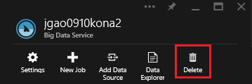
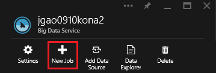
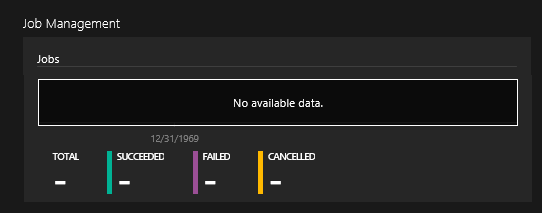
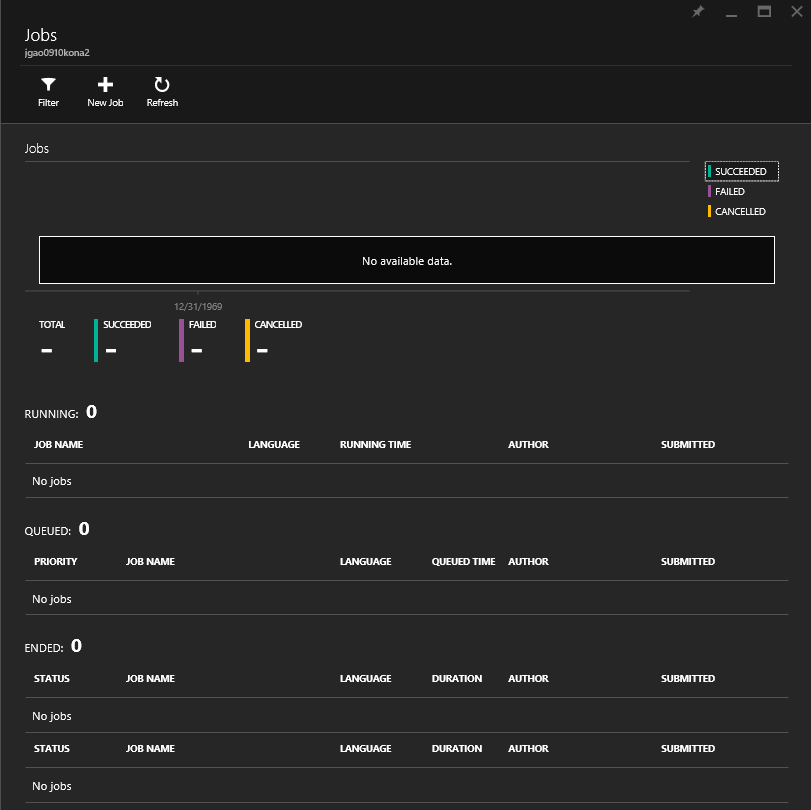

<properties 
   pageTitle="Manage Azure Big Analytics  using the Azure Preview portal | Azure" 
   description="Learn how to manage Big Analytics jobs, data sources, users. " 
   services="big-analytics" 
   documentationCenter="" 
   authors="mumian" 
   manager="paulettm" 
   editor="cgronlun"/>
 
<tags
   ms.service="big-analytics"
   ms.devlang="na"
   ms.topic="article"
   ms.tgt_pltfrm="na"
   ms.workload="big-data" 
   ms.date="09/29/2015"
   ms.author="jgao"/>

# Manage Azure Big Analytics using the Azure Preview portal

[jgao: working in progress -  a general management article for Kona]

Learn how to manage Azure Big Analytics accounts, users, jobs, and data sources.

**Prerequisites**

Before you begin this tutorial, you must have the following:

- **An Azure subscription**. See [Get Azure free trial](http://azure.microsoft.com/documentation/videos/get-azure-free-trial-for-testing-hadoop-in-hdinsight/).

This article includes:

- Manage aba accounts
- Manage aba users
- Manage aba data sources
- Manage aba jobs
- Manage account usage

## Manage Big Analytics accounts

Before running any Big Analytics jobs, you must have an Azure subscription and create a Big Analytics account.

**To create a Big Analytics account**
[This procedure will change when the product releases.]

1. Sign on to the new [Azure portal](https://portal.azure.com/signin/index/?Microsoft_Azure_Kona=true&Microsoft_Azure_DataLake=true&hubsExtension_ItemHideKey=AzureDataLake_BigStorage%2cAzureKona_BigCompute).
2. Click **Home** on the left menu.
3. Click the **Marketplace** tile.  
3. Type **kona** in the search box on the **Everything** pane, and the press **ENTER**. You shall see **Kona** in the list.
4. Click **Kona** from the list.
5. Click **Create** in the bottom right corner.
6. Type or select the following:

	

	- **Name**: Enter a name for the Big Analytics account.
	- **Data Lake**: Each Big Analytics account has a dependent Azure Data Lake account. The Big Analytics account and the dependent Data Lake account must be located in the same Azure data center. Follow the instruction to create a new Data Lake account, or select an existing one.
	- **Subscription**: Enter the Azure subscription that you want to associate with this Big Analytics account.
	- **Resource Group**. Select an existing Azure Resource Group or create a new one. Applications are typically made up of many components, for example a web app, database, database server, storage, and 3rd party services. Azure Resource Manager (ARM) enables you to work with the resources in your application as a group, referred to as an Azure Resource Group. You can deploy, update, monitor or delete all of the resources for your application in a single, coordinated operation. You use a template for deployment and that template can work for different environments such as testing, staging and production. You can clarify billing for your organization by viewing the rolled-up costs for the entire group. For more information, see [Azure Resource Manager Overview](resource-group-overview.md). 
	- **Location**. Select a data center for Big Analytics account.

	

7. Select **Pin to Startboard**. This is required for following this tutorial.
8. Click **Create**. It takes you to the HOME page of the portal. A new tile is added to the Home page. It takes a few moments to create a Big Analytics account. When the account is created, the portal shows the account on a blade.

	

	[jgao: this screenshot needs to be updated]

**To delete an Big Analytics account**

1. Sign on to the new [Azure portal](https://portal.azure.com/signin/index/?Microsoft_Azure_Kona=true&Microsoft_Azure_DataLake=true&hubsExtension_ItemHideKey=AzureDataLake_BigStorage%2cAzureKona_BigCompute).
2. Click **BROWSE ALL** on the left menu, click **Big Data Services**, and the click the account you want to delete.
3. Click **Delete**.

	

## Manage users

When you create a Big Analytics account, a "Subscription admins" is added to the account. You can add additional users with the following roles:

|Role|Description|
|----|-----------|
|Owner|Lets you manage everything, including access to resources.|
|Contributor|Lets you manage everything except access to resources.|
|Reader|Lets you view everything, but not make any changes.|  
|DevTest Lab User|Lets you view everything, and connect, start, restart, and shutdown virtual machines[jgao: I never seen discussion related to ABA and VM]|  
|User Access Administrator|Lets you manage user acess to Azure resources.|  

**To add users**

[jgao: I don't see how this can be done from the portal.]

**To configure job access**

1. Sign on to the new [Azure portal](https://portal.azure.com/signin/index/?Microsoft_Azure_Kona=true&Microsoft_Azure_DataLake=true&hubsExtension_ItemHideKey=AzureDataLake_BigStorage%2cAzureKona_BigCompute).
2. Click **BROWSE ALL** on the left menu, click **Big Data Services**, and the click the account you want to configure the user roles.
3. Click **Access**.
4. 

## Manage Big Analytics jobs

You must have an Big Analytics account before you can create a job.  For more information, see [Manage Big Analytics accounts](#manage-big-analytics-accounts).

**To create a job**

1. Sign on to the new [Azure portal](https://portal.azure.com/signin/index/?Microsoft_Azure_Kona=true&Microsoft_Azure_DataLake=true&hubsExtension_ItemHideKey=AzureDataLake_BigStorage%2cAzureKona_BigCompute).
2. Click **BROWSE ALL** on the left menu, click **Big Data Services**, and the click the account that you want to use to run the job.
3. Click **New Job**.

	

	You will see a new blade similar to:

	

	For each job, you can configure

	|Name|Description|
	|----|-----------|
	|Job Name|Enter the name of the job.|
	|Priority|Lower number is higher priority.|
	|BDU|Max number of compute processes that can happen at the same time. Increasing this number can improve performance but can also increase cost.|
	|Script|Enter the U-SQL script for the job.|

	Using the same interface, you can also explore the link data sources, and add addtional files to the linked data sources. 

**To monitor jobs**

1. Sign on to the new [Azure portal](https://portal.azure.com/signin/index/?Microsoft_Azure_Kona=true&Microsoft_Azure_DataLake=true&hubsExtension_ItemHideKey=AzureDataLake_BigStorage%2cAzureKona_BigCompute).
2. Click **BROWSE ALL** on the left menu, click **Big Data Services**, and the click the account where you used to run the job. The Job Management panel shows the basic job information:

	

3. Click **Job Management** as shown in the previous screenshot.

	

## Create jobs
bla, bla, bla ...
## Monitor jobs
bla, bla, bla ...
# Manage account data sources
##Add additional data source
## Explore data from the linked data sources
[jgao: talk about catalog and data accounts]

bla, bla, bla ...
# Manage users
bla, bla, bla ...

# Monitor account usage

[introduction - we need to explain the terms, and connect the pieces. ]

## Manage Kona users using PowerShell [jgao: to be moved to a different article]

[**jgao:** If this is not needed to go through the tutorial, then we shall separated it into a management topic]
[saveenr - sounds good - talk to mahi about the correct way to do user management]

To add a user to your Kona Account:

	New-KonaUser –UserEmail user1@aadtenant.onmicrosoft.com –UserRole User 

To list the existing Kona users:

	Get-KonaUser 

The following is a sample output:

	CreationTime                LastModifiedTime            Name                        Roles                      
	------------                ----------------            ----                        -----                      
	Mon, 13 Oct 2014 18:42:3... Mon, 13 Oct 2014 18:42:3... KiwiPublicTest@JianywKiw... {Admin}                    
	Tue, 14 Oct 2014 02:24:3... Tue, 14 Oct 2014 02:24:3... konauser2@test              {Admin}                    
	Tue, 14 Oct 2014 02:26:0... Tue, 14 Oct 2014 02:26:0... konauser1@onboardflow.on... {Admin}                    
	Wed, 15 Oct 2014 00:14:1... Wed, 15 Oct 2014 00:14:1... This Obviously Isn't a user {ReadOnly}  
	               

To remove a Kona user account:

	Remove-KonaUser –UserEmail user1@aadtenant.onmicrosoft.com 

