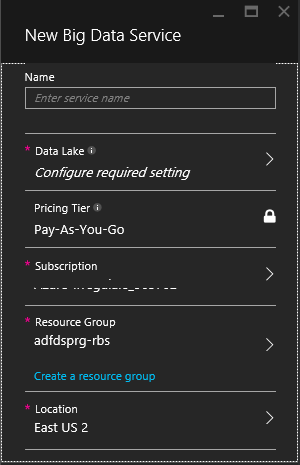
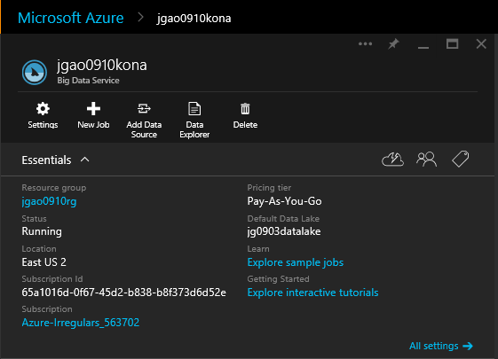

# Get Started with Azure Big Analytics using Azure Preview Portal

Learn how to use the Azure Preview portal to create a Big Analytics account, create a Big Analytics job using [U-SQL], and submit the job.  For more information about Big Analytics, see [Azure Big Analytics overview](big-analytics-overview.md).

See the following articles for using other tools:

- [Get started with Azure Big Analytics using Azure PowerShell](big-analytics-get-started-powershell.md)
- [Get started with Azure Big Analytics and U-SQL using Visual Studio](big-analytics-get-started-u-sql.md)

Basic Big Analytics process:

An Big Analytics job reads files from the dependent Azure Data Lake account, process the files as instructed in a U-SQL script, and save the output back to the Data Lake account.

**Prerequisites**

Before you begin this tutorial, you must have the following:

- **An Azure subscription**. See [Get Azure free trial](http://azure.microsoft.com/documentation/videos/get-azure-free-trial-for-testing-hadoop-in-hdinsight/).

##Create a Big Analytics account

A Big Analytics account has an [Azure Data Lake]() account dependency.  You can create the Data Lake account beforehand or when you create your Big Analytics account.  

**To create a Big Analytics account**
[This procedure will change when the product releases.]

1. Sign on to the new [Azure portal](https://portal.azure.com/signin/index/?Microsoft_Azure_Kona=true&Microsoft_Azure_DataLake=true&hubsExtension_ItemHideKey=AzureDataLake_BigStorage%2cAzureKona_BigCompute).
2. Click **Home** on the left menu.
3. Click the **Marketplace** tile.  
3. Type **kona** in the search box on the **Everything** pane, and the press **ENTER**. You shall see **Kona** in the list.
4. Click **Kona** from the list.
5. Click **Create** in the bottom right corner.
6. Type or select the following:

	

	- **Name**: Enter a name for the Big Analytics account.
	- **Data Lake**: Each Big Analytics account has a dependent Azure Data Lake account. The Big Analytics account and the dependent Data Lake account must be located in the same Azure data center. Follow the instruction to create a new Data Lake account, or select an existing one.
	- **Subscription**: Enter the Azure subscription that you want to associate with this Big Analytics account.
	- **Resource Group**. Select an existing Azure Resource Group or create a new one. Applications are typically made up of many components, for example a web app, database, database server, storage, and 3rd party services. Azure Resource Manager (ARM) enables you to work with the resources in your application as a group, referred to as an Azure Resource Group. You can deploy, update, monitor or delete all of the resources for your application in a single, coordinated operation. You use a template for deployment and that template can work for different environments such as testing, staging and production. You can clarify billing for your organization by viewing the rolled-up costs for the entire group. For more information, see [Azure Resource Manager Overview](resource-group-overview.md). 
	- **Location**. Select a data center for Big Analytics account.

	

7. Select **Pin to Startboard**. This is required for following this tutorial.
8. Click **Create**. It takes you to the HOME page of the portal. A new tile is added to the Home page. It takes a few moments to create a Big Analytics account. When the account is created, the portal shows the account on a blade.

	

	[jgao: this screenshot needs to be updated]

##Upload data to the Azure Data Lake account

Now you have a Big Analytics account.  You will still need some data to run a Big Analytics job. The data file used in this tutorial is a tab separated file with the following fields:

        Athlete              string,
        Age                  string,
        Country              string,
        Year                 string,
        ClosingCeremonyDate  string,
        Sport                string,
        GoldMedals           string,
        SilverMedals         string,
        BronzeMedals         string,
        TotalMedals          string,

You can download a data file from [Github](https://github.com/MicrosoftBigData/ProjectKona/tree/master/SQLIPSamples/SampleData/OlympicAthletes.tsv) to your workstation. Click **Raw**, and save the file locally.

[jgao: we might need a better place for this file.]

**To upload the file to the Azure Data Lake account**

1. From the preview portal, click **Browse All** from the left menu.
2. Click **Data Lake**, and then click the Data Lake account associated with your Big Analytics account.
3. Click **Data Explorer** from the top menu.
4. Click **New Directory**, and then create a new directory called **SampleData**.
5. Click **SampleData** to open the folder.
6. Click **Upload** from the top menu, and upload the OlympicAthletes.tsv to the folder.

 

##Create and submit Big Analytics jobs

**To submit the job**

1. From the Azure preview portal, click **Home** from the left menu.
2. Click the tile with your Big Analytics account name.  It was pinned here when the account was created.
3. Click **New Job** from the top menu.
4. Enter a Job name, and the following U-SQL script:

		@athletes =
		    EXTRACT
		        Athlete              string,
		        Age                  string,
		        Country              string,
		        Year                 string,
		        ClosingCeremonyDate  string,
		        Sport                string,
		        GoldMedals           string,
		        SilverMedals         string,
		        BronzeMedals         string,
		        TotalMedals          string
		    FROM @"/SampleData/OlympicAthletes.tsv"
		    USING new DefaultTextExtractor();
		
		OUTPUT @athletes
		    TO @"/SampleData/OlympicAthletes_Copy.tsv"
		    USING new DefaultTextOutputter();

	This U-SQL script reads the input data file using the DefaultTextExtrator, and then make a copy of the file using the DefaultTextOutputter.

5. Click **Submit Job** from the top. A new Job Details pane opens. On the title bar, it shows the job status. You can also click **Refresh** to get the latest status.
6. Wait until the job status is changed to **Succeeded**. 

**To see all the jobs**

1. From the Azure portal, click **Home** from the left menu.
2. Click the tile with your Big Analytics account name.  The job summary is shown on the **Job Management** tile.

3. Click the **Job Management** tile to see the details. The jobs are categorized in **Running**, **Queued**, and **Ended**. 

**To check the job output**

- Use the instructions in the upload data to Data Lake section to browse to the associated Data Lake account, and list the content.  

#See also

Until now, you’ve learned: 

- Upload, list, and upload files to Azure Data Lake
- Submit a Big Analytics jobs

To read more:

- [Azure Big Analytics overview](big-analytics-overview.md)
- [Get started with Azure Big Analytics using Azure PowerShell](big-analytics-get-started-powershell.md)
- [Get started with Azure Big Analytics and U-SQL using Visual Studio](big-analytics-get-started-u-sql.md)

