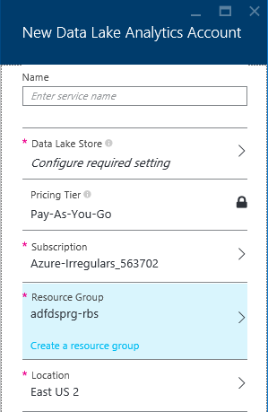
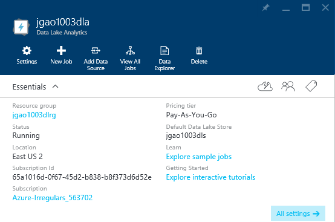

<properties 
   pageTitle="Get Started with Azure Data Lake Analytics using Azure Preview Portal | Azure" 
   description="Learn how to use the Azure Preview portal to create a Data Lake Analytics account, create a Data Lake Analytics job using U-SQL, and submit the job. For more information about Data Lake Analytics. " 
   services="data-lake-analytics" 
   documentationCenter="" 
   authors="mumian" 
   manager="paulettm" 
   editor="cgronlun"/>
 
<tags
   ms.service="data-lake-analytics"
   ms.devlang="na"
   ms.topic="article"
   ms.tgt_pltfrm="na"
   ms.workload="big-data" 
   ms.date="10/27/2015"
   ms.author="jgao"/>

# Get Started with Azure Data Lake Analytics using Azure Preview Portal

Learn how to use the Azure Preview portal to create an Azure Data Lake (ADL) Analytics account, define an ADL Analytics
job in [U-SQL](), and submit the job. This job reads a tab separated values (TSV) file and convert it into a comma 
separated values (CSV) file. For more information about Data Lake Analytics, see 
[Azure Data Lake Analytics overview](data-lake-analytics-overview.md).

To go through the same tutorial using other supported tools, see:

- [Get started with Azure Data Lake Analytics using Azure PowerShell](data-lake-analytics-get-started-powershell.md)
- [Get started with Azure Data Lake Analytics and U-SQL using Visual Studio](data-lake-analytics-get-started-u-sql.md)
- [Get started with Azure Data Lake Analytics using .NET SDK](data-lake-analytics-get-started-dotnet-sdk.md)

Basic ADL Analytics process:

1. Craete an ADL Analytics account.
2. Prepare/upload the inbound data.
3. Develop a U-SQL script.
4. Submit a job (U-SQL script). The job reads the data from ADL Storage accounts and/or Azure Blob 
storage accounts, process the data as instructed in the U-SQL scripts, and save the output to an ADL Storage 
account or an Azure Blob storage account.

**Prerequisites**

Before you begin this tutorial, you must have the following:

- **An Azure subscription**. See [Get Azure free trial](http://azure.microsoft.com/documentation/videos/get-azure-free-trial-for-testing-hadoop-in-hdinsight/).

##Create ADL Analytics account

Each ADL Analytics account has an [Azure Data Lake storage]() account dependency.  This account is referred
as the default ADL Storage account.  You can create the Data Lake storage account beforehand or when you create 
your ADL Analytics account. In this tutorial, you will create the ADL Storage account with the Analytics 
account

**To create an ADL Analytics account**

1. Sign on to the new [Azure portal](https://portal.azure.com/signin/index/?Microsoft_Azure_Kona=true&Microsoft_Azure_DataLake=true&hubsExtension_ItemHideKey=AzureDataLake_BigStorage%2cAzureKona_BigCompute).
2. Click **Microsoft Azure** in the upper left corner to open the StartBoard.
3. Click the **Marketplace** tile.  
3. Type **Azure Data Lake Analytics** in the search box on the **Everything** blade, and the press **ENTER**. You shall see **Azure Data Lake Analytics** in the list.
4. Click **Azure Data Lake Analytics** from the list.
5. Click **Create** on the bottom of the blade.
6. Type or select the following:

    

	- **Name**: Name the Analytics account.
	- **Data Lake Store**: Each ADL Analytics account has a dependent ADL Storage account. The ADL Analytics account and the dependent ADL Storage account must be located in the same Azure data center. Follow the instruction to create a new ADL Storage account, or select an existing one.
	- **Subscription**: Choose the Azure subscription used for the Analytics account.
	- **Resource Group**. Select an existing Azure Resource Group or create a new one. Applications are typically made up of many components, for example a web app, database, database server, storage, and 3rd party services. Azure Resource Manager (ARM) enables you to work with the resources in your application as a group, referred to as an Azure Resource Group. You can deploy, update, monitor or delete all of the resources for your application in a single, coordinated operation. You use a template for deployment and that template can work for different environments such as testing, staging and production. You can clarify billing for your organization by viewing the rolled-up costs for the entire group. For more information, see [Azure Resource Manager Overview](resource-group-overview.md). 
	- **Location**. Select an Azure data center for the ADL Analytics account. 
7. Select **Pin to Startboard**. This is required for following this tutorial.
8. Click **Create**. It takes you to the portal StartBoard. A new tile is added to the Home page with the label showing "Deploying Azure Data Lake Analytics". It takes a few moments to create an ADL Analytics account. When the account is created, the portal opens the account on a new blade.

	

After an Analytics account is created, you can add additional ADL Storage accounts and Azure Storage 
accounts. For instructions, see [Manage account data sources](data-lake-analytics-manage-use-portal.md#manage-account-data-sources).

##Upload data to the default ADL Storage account

In this tutorial, you will process some search logs.  The search log can be located in the default ADL Storage 
account, or any linked ADL Storage account, or any linked Azure Storage account. 

The Azure Preview portal provides an user interface to upload some sample data files. You will use it to upload
the sample data files to the default ADL Storage account.

**To upload sample data files**

1. From the Azure preview portal, click **Microsoft Azure** in the upper left corner.
2. Click the tile with your ADL Analytics account name.  It was pinned here when the account was created.
If the account is not pinned there, see 
[Open an Analytics account from portal](data-lake-analytics-manage-use-portal.md#access-adla-account) to open the
account.
3. Expand the **Essentials** pane, and then click **Explore sample jobs**. It opens another blade called **Sample
Jobs**.
4. Click **Update Sample**, and then click **OK** to confirm.
5. Click **Notification** which is a bell shaped icon. You shall see a log saying **Updating sample data completed**.
6. Click anywhere outside the notification pane to close it.
7. From the ADL analytics account blade, click **Data Explorer**. It opens two blades. One is **Data Explorer**, and
the other is the Default ADL Storage account.
8. In the default ADL Storage account blade, click **Samples** to expand the folder, and the click **Data** to expand the folder. You shall see three files listed there:

    - SearchLog.tsv
    - version.txt
    - WebLog.log
    
    In this tutorial, you will use SearchLog.tsv.

In practice, you will either program your applications to write data into the linkd Storage accounts or upload data. For uploading files, see 
[Manage Data Lake Analytics using Portal](data-lake-analytics-manage-use-portal.md#upload-data). 

##Create and submit ADL Analytics jobs

After you have prepared the inbound data, you can start developing your U-SQL script.  

**To submit the job**

1. From the Azure preview portal, click **Microsoft Azure** in the upper left corner.
2. Click the tile with your ADL Analytics account name.  It was pinned here when the account was created.
If the account is not pinned there, see 
[Open an Analytics account from portal](data-lake-analytics-manage-use-portal.md#access-adla-account).
3. Click **New Job** from the top menu.
4. Enter a Job name, and the following U-SQL script:

	

        @searchlog =
            EXTRACT UserId          int,
                    Start           DateTime,
                    Region          string,
                    Query           string,
                    Duration        int?,
                    Urls            string,
                    ClickedUrls     string
            FROM "/Samples/Data/SearchLog.tsv"
            USING Extractors.Tsv();
        
        OUTPUT @searchlog   
            TO "/output/SearchLog-from-adls.csv"
        USING Outputters.Csv();

	This U-SQL script reads the input data file using the Extractors.tsv(), and then creates a csv file using
    theOutputters.csv(). 
    
    Notice the path is a relative path. You can also use absolute path.  For example 
    
        adl://<ADLStorageAccountName>.azuredatalake.net/Samples/Data/SearchLog.tsv
        
    You must use absolute path to access the files in the linked Storage accounts.  The syntax for files stored in linked Azure Storage account is:
    
        wasb://<BlobContainerName>@<StorageAccountName>.blob.core.windows.net/Samples/Data/SearchLog.tsv

    >[AZURE.NOTE] Azure Blob container with public blobs or public containers access permissions are not currently supported.    
     
5. Click **Submit Job** from the top. A new Job Details pane opens. On the title bar, it shows the job status. You can also click **Refresh** to get the latest status.
6. Wait until the job status is changed to **Succeeded**. When the job is completed, the portal opens the job details in a new blade.

    In case the job failed, click the exclamation sign under **Job Details** as shown in the screenshot to see the detailed messages:
    
    

    
7. At the bottom of the Job Detail blade, Click the job name in **SearchLog-from-adls.csv**. You can preview, download, rename, delete the output file.

**To see all the jobs**

1. From the Azure portal, click **Microsoft Azure** in the upper left corner.
2. Click the tile with your ADL Analytics account name.  The job summary is shown on the **Job Management** tile.

    
3. Click the **Job Management** tile to see the jobs. The jobs are categorized in **Running**, **Queued**, and **Ended**
4. Scroll to the bottom of the blade, and then double-click one of the jobs.  You can identify a job by its name. From here, you can view U-SQL script, cancel the job and resubmit the job. 

#See also

- [Azure Data Lake Analytics overview](data-lake-analytics-overview.md)
- [Get started with Azure Data Lake Analytics using Azure PowerShell](data-lake-analytics-get-started-powershell.md)
- [Get started with Azure Data Lake Analytics and U-SQL using Visual Studio](data-lake-analytics-get-started-u-sql-studio.md)
- [Manage Azure Data Lake Analytics using Azure Preview Portal](data-lake-analytics-manage-use-portal.md)

