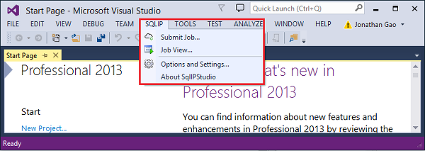
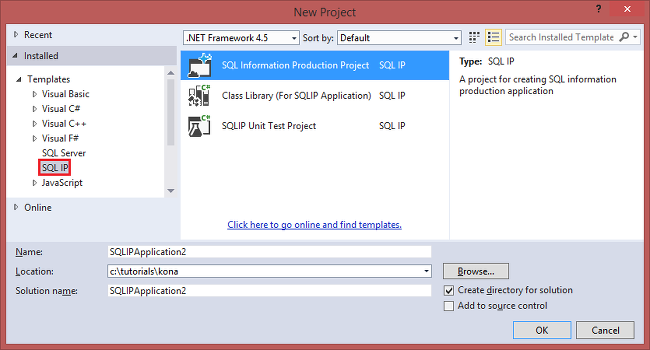

# Get started using Azure Big Analytics U-SQL Studio

Learn how to install U-SQL Studio, and use U-SQL Studio to write and submit U-SQL job against the data stored in Azure Data Land and Azure Blob storage.

**Prerequisites**

- Visual Studio 2015, Visual Studio 2013 update 4, or Visual Studio 2012 with Visual C++ Installed 
- Microsoft Azure SDK for .NET version 2.5 or above.  Install it using the Web platform installer.
- A Big Analytics account.  See [Get Started with Azure Big Analytics using Azure Preview Portal](big-analytics-get-started-portal.md) or [Get Started with Azure Big Analytics using Azure PowerShell](big-analytics-get-started-powershell.md).

## Install the U-SQL Studio

Before the product release, download the package from [https://microsoft.sharepoint.com/teams/ProjectKona/Documents/Microsoft.SqlIPStudio.zip](https://microsoft.sharepoint.com/teams/ProjectKona/Documents/Microsoft.SqlIPStudio.zip).
[jgao: The package date is 9/7/2015 when this article is written.]
 
Once U-SQL Studio is installed, you will see a U-SQL menu in Visual Studio:

## Connect to Azure

[jgao:  It doesn't cache the login information. This might change before the product release]

**To connect to Big Analytics**

1. Open Visual Studio.
2. From the **U-SQL** menu, click **Options and Settings**.
4. Click **Sign In**, or **Change User** if someone has signed in, and follow the instructions to sign in.
5. Click **OK** to close the Options and Settings dialog.

**To browse your Big Analytics accounts**

1. From Visual Studio, open **Server Explorer** by press **CTRL+ALT+S**.
2. From **Server Explorer**, expand **Azure**, and then expand **U-SQL**. You shall see a list of your Big Analytics accounts if there are any.

You will not be able to create Big Analystics accounts from the studio. To create an account, see [Get Started with Azure Big Analytics using Azure Preview Portal](big-analytics-get-started-portal.md) or [Get Started with Azure Big Analytics using Azure PowerShell](knoa-get-started-powershell.md).

## Upload source data files

Before you can create and run a Big Analytics job, you will need some data. The data file used in this tutorial is a tab separated file with the following fields:

        Athlete              string,
        Age                  string,
        Country              string,
        Year                 string,
        ClosingCeremonyDate  string,
        Sport                string,
        GoldMedals           string,
        SilverMedals         string,
        BronzeMedals         string,
        TotalMedals          string,

You can download a data file from [Github](https://github.com/MicrosoftBigData/ProjectKona/tree/master/SQLIPSamples/SampleData/OlympicAthletes.tsv) to your workstation.

**To upload the file to the dependent Azure Data Lake account**

1. From **Server Explorer**, expand **Azure**, expand **U-SQL**, expand your Big Analytics account, expand **Linked Storage**, right-click your Azure Data Lake Account, and then click **Explorer**.  It opens the U-SQL Studio Explorer pane.  In the left, it shows a tree view, the content view is on the right.
2. Right-click any blank space in the content view, and then click **New Folder** to create a folder called **SampleData**.

	
3. Double-click **SampleData** to open its content in the content view.
4. Right-click any blank space in the content view, click **Upload**, click **As Text**. Follow the instruction to upload OlympicAthletes.tsv.

**To upload the file to a Azure Blob storage account**

[jgao: xiaoyong wants to copy the text here instead of using a link.]
See [Get started with HDInsight Tools for Visual Studio]().
 
## Create and submit a Big Analytics job written in U-SQL 
 

**To create and submit a Big Analytics job** 

1. From the **File** menu, click **New**, and then click **Project**.
2. Type or select the following:

	- **Templates**: SQL IP
	- **Template**: SQL Information Production Project
	- **Name**: MyFirstSQLIPApplication
	- **Location**: c:\tutorials\aba

	

3. Click **OK**. Visual studio creates a solution with a Script.sip file.
4. Enter the following script into the Script.sip file:

		@athletes =
		    EXTRACT
		        Athlete              string,
		        Age                  string,
		        Country              string,
		        Year                 string,
		        ClosingCeremonyDate  string,
		        Sport                string,
		        GoldMedals           string,
		        SilverMedals         string,
		        BronzeMedals         string,
		        TotalMedals          string
		    FROM @"/SampleData/OlympicAthletes.tsv"
		    USING new DefaultTextExtractor();
		
		OUTPUT @athletes
		    TO @"/SampleData/OlympicAthletes_Copy.tsv"
		    USING new DefaultTextOutputter();

	>[AZURE.NOTE] To use the data in Azure Blob Storage, use the following syntax: wasb://<yourContainer>@<yourStorageAccount>/<your path to>/OlympicAthletes.tsv" 

	Notice the following features:

	- **IntelliSense**
	 
		Name auto completed and the members will be shown for Rowset, Classes, Databases, Schemas and User Defined Objects (UDOs). 
		 
		IntelliSense for catalog entities (Databases, Schemas, Tables, UDOs etc.) is related to your compute account. You can check the current active compute account, database and schema in the top toolbar, and switch them through the dropdown lists. 
 
	- **Auto Format** 
	
		Users can change the indentation of the Scope script based on the code structure under Edit->Advanced:
  
		- Format Document (Ctrl+E, D) : Formats the whole document   
		- Format Selection (Ctrl+K, Ctrl+F): Formats the selection. If no selection has been made, this shortcut formats the line the cursor is in.  
		
		All the formatting rules are configurable under Tools->Options->Text Editor->SIP->Formatting.  
	- **Smart Indent**
	 
		SQL IP Studio is able to indent expressions automatically while you are writing scripts. This feature is disabled by default, users need to enable it through checking U-SQL->Options and Settings ->Switches->Enable Smart Indent.

	- **Go To Definition and Find All References**
	
		Right-clicking the name of a RowSet/parameter/column/UDO etc. and clicking Go To Definition (F12) allows you to navigate to its definition. By clicking Find All References (Shift+F12), will show all the references. 

	- **Insert Azure Path**
		
		Rather than remembering Azure file path and type it manually when writing script, U-SQL Studio provides an easy way: right click in the editor, click Insert Azure Path. Navigate to the file in the Azure Blob Browser dialog. Click OK button the file path will be inserted to your code. 

5. From **Solution Explorer**, right click **Script.sip**, and then click **Build Script**. Verify the result in the Output pane.
6. From **Solution Explorer**, right click **Script.sip**, and then click **Submit Script**.
7. Click **Submit**. Submission results and job link are available in the U-SQL Studio Results window when the submission is completed.
8. You must click the Refresh button to see the latest job status and refresh the screen. When the job successes, it will show you the Stage connection view, script, state history, and diagnostic information:

	

	* Job Summary. Show the summary information of current job, e.g.: State, Progress, Execution Time, Runtime Name, Submitter etc.   
	* Job Details. Detailed information on this job is provided, including script, algebra, vertexdef, code, resources.
	* Job Graph. Four graphs are provided to visualize the job’s information:  Stage Connection View, Stage Table View, Stage Timing View and Vertex Run Time Stats by Stage View. Tabs are used to switch among them. You can also right click on stage node or row to navigate to other views. [jgao: I don't see four graphs.  is the information merged?]

	* Job script. 
	* Job state history. 
	* Job Diagnostics. U-SQL Studio will diagnose job execution automatically. You will receive alerts when there are some errors or performance issues in their jobs. See Job Diagnostics (link TBD) part for more information. 
	
**To check job state**

1. From Server Explorer, expand **Azure**, expand **SQL IP**, expand the Big Analytics account name, expand **Jobs**. You will see a list of the jobs.
2. Click a job to see the status

**To see the job output**

1. From **Server Explorer**, expand **Azure**, expand **SQL IP**, expand your Big Analytics account, expand **Linked Storage**, right-click the dependent Azure Data Lake account, and then click **Explorer**. 
2.  Double-click **SampleData**.
3.  Double-click **OlympicAthletes_copy.tsv**.

###Job Playback 

Job playback enables you to watch job execution progress and visually detect out performance anomalies and bottlenecks. This feature can be used before the job completes execution (i.e. during the time the job is actively running) as well as after the execution has completed. Doing playback during job execution will allow the user to play back the progress up to the current time. 

**To view job execution progress**  

1. Click **Load Profile** on the upper right corner.  See the previous screen shot.
2. Click on the Play button on the bottom left corner to review the job execution progress. 
3. During the playback, click **Pause**  to stop it or directly drag the progress bar to specific positions. 

###Heat Map 

SQL IP Studio provides user-selectable color-overlays on job view to indicate progress, data I/O, execution time, I/O throughput of each stage. Through this, users can figure out potential issues and distribution of job properties directly and intuitively. You can choose a data source to display from the drop-down list.  

[jgao: information to be provided by xiaoyong]

##See also

- [Get started with Big Analytics using PowerShell](big-analytics-get-started-powershell.md)
- [Get started with Big Analytics using the Azure portal](big-analytics-get-started-portal.md)
- [Define U-SQL user defined operators for Big Analytics](big-analytics-u-sql-develop-user-defined-operators.md)