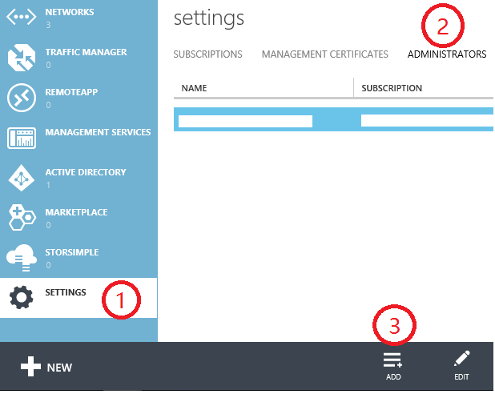
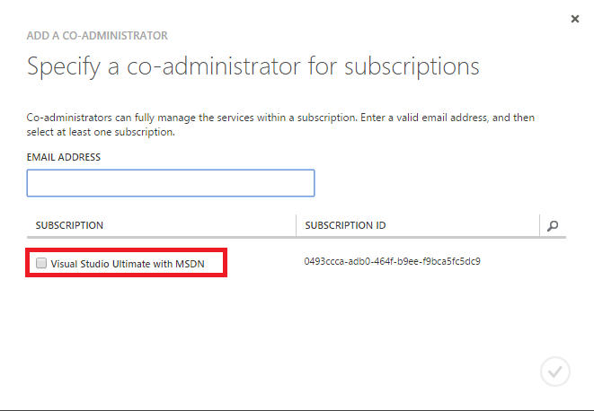
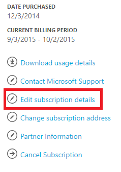
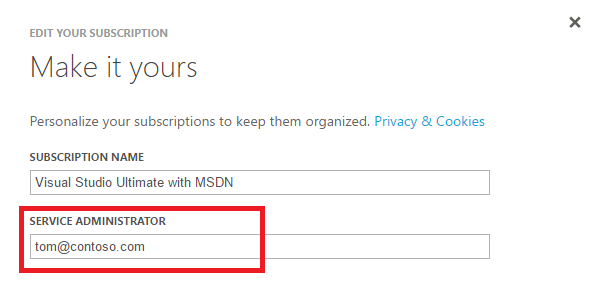

<properties
	pageTitle="How to add or change Azure Administrator Roles | Microsoft Azure"
	description="Describes how to add or change Azure Co-Administrator, Service Administrator and Account Administrator"
	services="billing"
	documentationCenter=""
	authors="genlin"
	manager="msmbaldwin"
	editor="meerak"
	/>

<tags
	ms.service="billing"
	ms.workload="na"
	ms.tgt_pltfrm="na"
	ms.devlang="na"
	ms.topic="article"
	ms.date="12/21/2015"
	ms.author="genli"/>

# How to add or change Azure Administrator Roles

## Administrator roles explained

There are three kinds of administrator roles in Microsoft Azure:

| Administrative role   | Limit  | Description
| ------------- | ------------- |---------------|
|Account Administrator (AA)  | 1 per Azure account  |This is the person who signed up for or bought Azure subscriptions, and is authorized to access the [Account Center](https://account.windowsazure.com/Home/Index) and perform various management tasks. These include being able to create subscriptions, cancel subscriptions, change the billing for a subscription, and change the Service Administrator.
| Service Administrator (SA) | 1 per Azure subscription  |This person is authorized to manage services on the [Azure Portal](https://manage.windowsazure.com/). By default, for a new subscription, the Account Administrator is also the Service Administrator.|
|Co-administrator (CA)|200 per subscription|This person has the same access privileges as the Service Administrator, but can’t change the association of subscriptions to Azure directories.|

**Note** Azure Active Directory Role-based Access Control (RBAC) allows users to be added to multiple roles. For more information, see [Azure Active Directory Role-based Access Control](./active-directory/role-based-access-control-configure.md).
## How to add a Co-Administrator for a subscription
1. Sign in to the [Azure classic portal](https://manage.windowsazure.com/).
2. In the navigation pane, select **Settings**> **Administrators**> **Add**.  
3. Type the email address of the person you want to add as Co-administrator and then select the subscription that you want the Co-administrator to access.   

The following email address can be added as a Co-Administrator:

* **Microsoft Account** (formerly Windows Live ID)  
 You can use a Microsoft Account to sign in to all consumer-oriented Microsoft products and cloud services, such as Outlook (Hotmail), Skype (MSN), OneDrive, Windows Phone, and Xbox LIVE.
* **Organizational account** 
 An organizational account is an account that is created under Azure Active Directory. The organizational account address resembles the following:
	user@<your domain>.onmicrosoft.com

**Note**

 * Each subscription is associated with an Azure Active Directory (aks Default Directory). To find the Default Directory which the subscription is associated with, go to [Azure classic portal](https://manage.windowsazure.com/), select **Settings** > **Subscriptions**, check the subscription ID to find the Default Directory the subscription is associated with.

 * If you are logged in with a Microsoft Account, you can only add other Microsoft Accounts or users within the Default Directory as Co-Administrator.
 * If you are logged in with an organizational account, you can add other organizational accounts in your organization as Co-Administrator. For example, abby@contoso.com can add bob@contoso.com as Service Administrator or Co-Administrator, but cannot add john@notcontoso.com unless john@noncontoso.com is the user in Default Directory. Users logged in with organizational accounts can continue to add Microsoft Account users as Service Administrator or Co-Administrator.
 * Now that it is possible to log into Azure with an organizational account, here are the changes to Service Administrator and Co-administrator account requirements:

| Login Method| Add Microsoft Account or users within Default Directory as Co-Administrator or Service Administrator?  |Add organizational account in the same organization as Co-Administrator or Service Administrator? |Add organizational account in different organization as Co-Administrator or Service Administrator?
| ------------- | ------------- |---------------|---------------|
|Microsoft Account |Yes|No|No|
|Organizational Account|Yes|Yes|No|

## How to change Service Administrator for a subscription
Only the Account Administrator can change the Service Administrator for a subscription.

1. Log on into [Account Management Portal](https://account.windowsazure.com/subscriptions) by using the Account Administrator.
2. Select the subscription you want to change.
3. On the right side, click **Edit subscription** details.  

4. In the **SERVICE ADMINISTRATOR** box, enter the email address of the new Service Administrator. 

## How to change the Account Administrator

To transfer ownership of the Azure account to another account, see [Transferring an Azure subscription](../billing-subscription-transfer.md).
