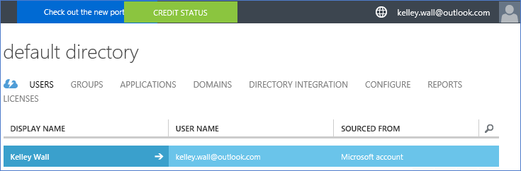
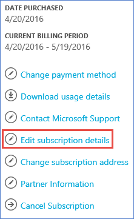
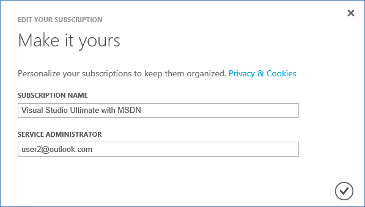
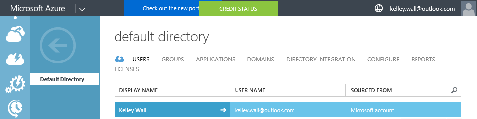
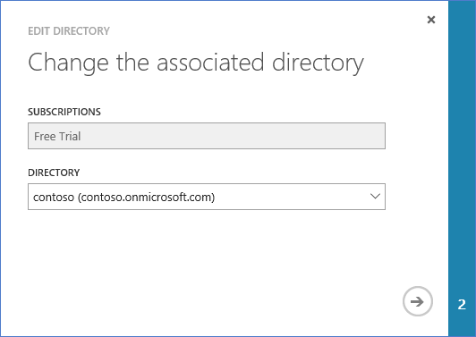
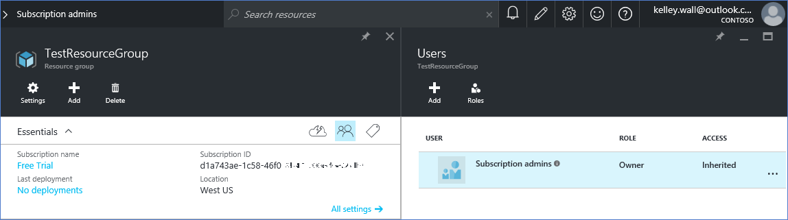
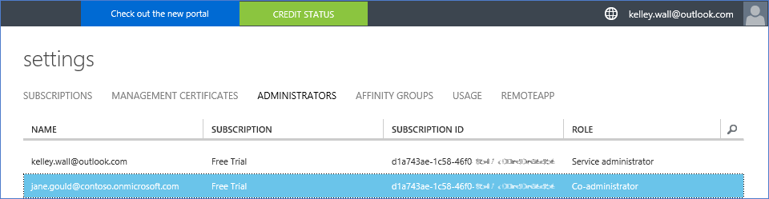
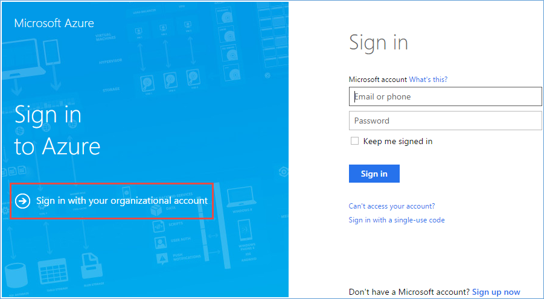
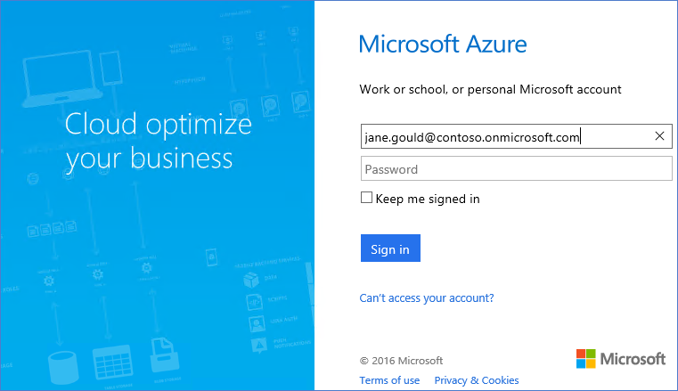

<properties
	pageTitle="Use Office 365 tenant with Azure subscription | Microsoft Azure"
	description="Learn how to add an Office 365 directory (tenant) to an Azure subscription to make the association."
	services="billing"
	documentationCenter=""
	authors="jiangchen79"
	manager="mbaldwin"
	editor=""
	tags="top-support-issue"/>

<tags
	ms.service="billing"
	ms.workload="na"
	ms.tgt_pltfrm="ibiza"
	ms.devlang="na"
	ms.topic="article"
	ms.date="06/15/2016"
	ms.author="cjiang"/>

# Associate an Office 365 tenant with an Azure subscription
Scenarios: You acquired both of the Azure and Office 365 subscriptions separately in the past, and wants to be able to access the Office 365 tenant from the Azure subscription. This article shows you how easy it is to achieve it.

> [AZURE.NOTE] This article doesn’t apply to Enterprise Agreement (EA) customers.

## Quick guidance
If you want to associate your Office 365 tenant with your Azure subscription, use your Azure account to add your Office 365 tenant, and then associate your Azure subscription with the Office 365 tenant. See detailed steps.

## Detailed steps
In this scenario, Kelley Wall is a user who has an Azure subscription under the account kelly.wall@outlook.com. Kelley also has an Office 365 subscription under the account kelley.wall@contoso.onmicrosoft.com. Now Kelley wants to access the Office 365 tenant with the Azure subscription.

**Prerequisites:**

- You need credentials of the service administrator of the Azure subscription. Co-administrators cannot execute a subset of the steps.
- You need credentials of a global administrator of the Office 365 tenant.
- The email address of the service administrator must not be contained in the Office 365 tenant.
- The email address of the service administrator must not match that of any global administrator of the Office 365 tenant.
- If you are currently using an email address that is both a Microsoft account and an organizational account, we recommend that you temporarily change the service administrator of your Azure subscription to use another Microsoft account. This will limit the known limitations that the procedure has. You can create a new Microsoft account at the [Microsoft account signup page](https://signup.live.com/).

	To change your service administrator, follow these steps:

	1. Log on into the [Account Management Portal](https://account.windowsazure.com/subscriptions).
	2. Select the subscription you want to change.
	3. On the right side, click **Edit subscription details**.

		

	4. In the **SERVICE ADMINISTRATOR** box, enter the email address of the new service administrator.

		

To associate the Office 365 tenant with the Azure subscription, follow these steps:

1. 	Sign in the [Account Management Portal](https://account.windowsazure.com/subscriptions) with the service administrator credentials.
2.	Click **ACTIVE DIRECTORY** on the left pane.

	

	> [AZURE.NOTE] You should not see the Office 365 tenant. If you see it, skip the next step.

	

3. Add the Office 365 tenant to your Azure subscription.
	1. Click **NEW** > **DIRECTORY** > **CUSTOM CREATE**.

		

	2. On the **Add directory** page, select **Use existing directory** under **DIRECTORY**, click to select **I am ready to be signed out now**, and then click **Complete** .

		

	3. After you are signed out, sign in with the global administrator’s credentials of your Office 365 tenant.

		

	4. Click **Continue**.

		

	5. Click **Sign out now**.

		

	6. Sign in the [Account Management Portal](https://account.windowsazure.com/subscriptions) with the service administrator credentials.

		

	7. You should see your Office 365 tenant in the dashboard.

		

4. Change the directory associated with the Azure subscription.

	1. Click **Settings**.

		

	2. Click your Azure subscription, and then click **EDIT DIRECTORY**.

		

	3. Click **Next** .

		

		> [AZURE.WARNING] You will receive a warning that all co-administrators will be removed.

		

		>[AZURE.WARNING] Additionally, all [Role-Based Access Control (RBAC)](./active-directory/role-based-access-control-configure.md) users with Assigned access in the existing resource groups will also be removed. However, the warning you receive only mentions the removal of co-administrators.

		

	4. Click **Complete** .

5. Now you can add your Office 365 organizational accounts as co-administrators to the AAD tenant.

	1. Click the **ADMINISTRATORS** tab, and then click **ADD**.

		

	2. Enter an organizational account of your Office 365 tenant, click to select the Azure subscription, and then click **Complete** .

		

	3. Go back to the **ADMINISTRATORS** tab, you should see the organizational account displayed as co-administrator.

		

6. Next you can test access with the co-administrator.

	1. Sign out the Account Management Portal.
	2. Open the [Account Management Portal](https://account.windowsazure.com/subscriptions) or the [Azure Portal](https://portal.azure.com/).
	3. If the Azure sign-in page has a link of **Sign in with your organization account**, click the link. Otherwise, skip this step.

		

	4. Enter the credentials of the co-administrator, and then click **Sign in**.

		

## Next steps
There are related scenarios where you already have an Office 365 subscription and are ready for an Azure subscription, but want to use the existing Office 365 user account(s) for your Azure subscription. Alternatively, you are an Azure subscriber and want to get an Office 365 subscription for the users in your existing Azure Active Directory. To learn how to accomplish these tasks, see [Use your existing Office 365 account with your Azure subscription, or vice versa](billing-use-existing-office-365-account-azure-subscription.md).
