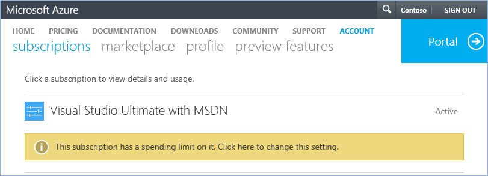

<properties
	pageTitle="Azure spending limit | Microsoft Azure"
	description="Introduces the Azure spending limit feature which protect you from accidentally incurring charges"
	services="billing"
	documentationCenter=""
	authors="jiangchen79"
	manager="felixwu"
	editor=""
	tags="billing"/>

<tags
	ms.service="billing"
	ms.workload="na"
	ms.tgt_pltfrm="ibiza"
	ms.devlang="na"
	ms.topic="article"
	ms.date="04/28/2016"
	ms.author="cjiang"/>

# Azure spending limit – How it works and how to enable or remove it

## Use Azure with peace of mind
To protect you from accidentally incurring charges for usage beyond the included offer amount, we have introduced the spending limit feature. All new customers who sign up for the trial offer or offers that includes credits over multiple months will now, by default, have the spending limit turned on with a value of $0. The value can’t be changed. It’s always 0. The spending limit isn’t available for subscription types such as Pay-As-You-Go subscriptions and commitment plans. See the [full list of Azure offers and the availability of the spending limit](https://azure.microsoft.com/support/legal/offer-details/).

**Note**: Offers that includes credits over multiple months are Monthly Credit for Visual Studio subscribers, the MSDN benefit, the Microsoft Partner Network Cloud Essentials program, and so on.

**Important**: There are [scenarios that aren't suitable for turning on the spending limit](#scenarios-that-are-not-suitable-for-turning-on-the-spending-limit).

##  What happens when I reach the spending limit?
When your usage results in charges that exhausts the monthly amounts included in your offer, the services that you deployed will be disabled for the rest of that billing month. For example, Cloud Services that you deployed are removed from production and your Azure virtual machines are stopped and deallocated. To prevent your services from being disabled, you can choose to [remove your spending limit](#remove-the-spending-limit). When your services are disabled, the data in your storage accounts and databases will be available in a read-only manner for administrators. At the beginning of the next billing month if your offer includes credits over multiple months, your subscription will be re-enabled and you can re-deploy your Cloud Services and have full access to your storage accounts and databases.

If you are on our free trial, you have the ability at any time within 90 days after your hitting your spending limit to re-enable your subscription and have it automatically upgrade to our standard Pay-As-You-Go offer.

You will receive notifications as soon as you hit the spending limit for your offer. Log on to the [Azure Account Center](https://account.windowsazure.com/Subscriptions/), click **ACCOUNT**, and then click **subscriptions**. You will see notifications about subscriptions that have reached the spending limit.

## Things you will be charged for even if you have a spending limit enabled
Be aware that some Azure services and [Marketplace purchases](https://azure.microsoft.com/marketplace/) can incur charges under the payment method (CC) even if a spending limit is set. Examples are Visual studio licenses, Azure Active Directory premium, support plans and most third party branded services sold through the Marketplace.

## When not to use the spending limit
The spending limit could prevent you from deploying or using certain marketplace and Microsoft services. Here are the scenarios where you should remove the spending limit on your subscription.

- You plan to deploy first party images like Oracle and services such as Visual Studio Online (VSO). This will cause you to exceed your spending limit almost immediately and cause your subscription to be disabled.
- You have services that cannot be disrupted.
- You have services and resources with settings like virtual IP addresses that you don't want to lose. These settings will be lost when the services and resources are deallocated.

## Remove the spending limit

You can remove the spending limit at any time as long as there's a valid payment method associated with your subscription. For offers that have credit over multiple months, you can also re-enable the spending limit at the beginning of your next billing cycle.

To remove your spending limit, follow these steps:

1. Log on to the [Azure Account Center](https://account.windowsazure.com/Subscriptions/)

	
2. Select a subscription.
3. If the subscription is disabled due to the Spending Limit being reached, click this notification: "Subscription reached the Spending Limit and has been disabled to prevent charges." Otherwise, click **Remove spending limit** in the **SUBSCRIPTION STATUS** area.

	
4. Select an option that is appropriate for you.

	

	| Option                                               | Effect                                                                                                     |
	|------------------------------------------------------|------------------------------------------------------------------------------------------------------------|
	| Remove spending limit indefinitely                   | Removes the spending limit without turning it on automatically at the start of the next billing period.    |
	| Remove spending limit for the current billing period | Removes the spending limit so that it turns back on automatically at the start of the next billing period. |
