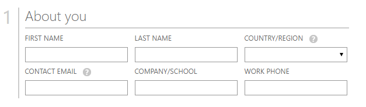
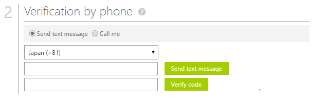
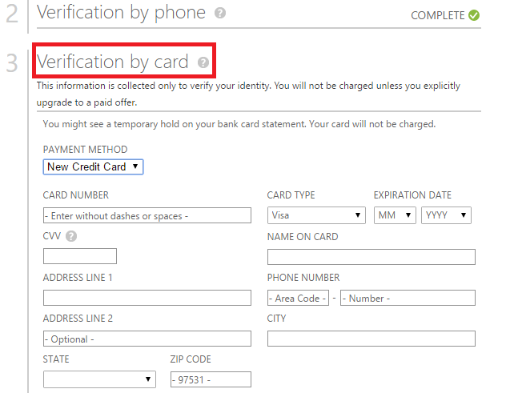
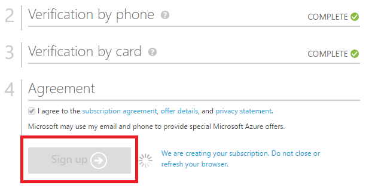
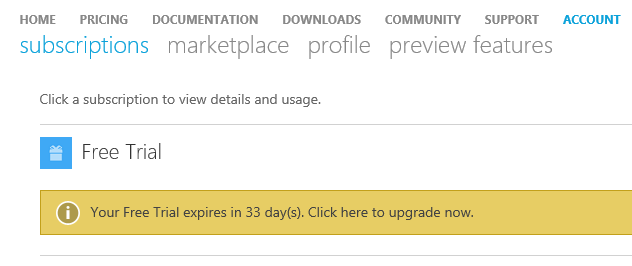
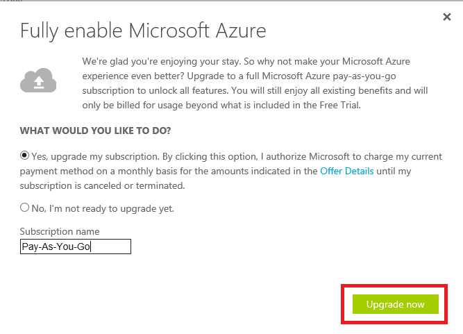

<properties
	pageTitle="How to sign up for, purchase, upgrade or activate an Azure subscription | Microsoft Azure"
	description="Describes How to buy or sign up for an Azure subscription"
	services="billing"
	documentationCenter=""
	authors="genlin"
	manager="msmbaldwin"
	editor="meerak"
	tags="billing,top-support-issue"
	/>

<tags
	ms.service="billing"
	ms.workload="na"
	ms.tgt_pltfrm="na"
	ms.devlang="na"
	ms.topic="article"
	ms.date="06/21/2016"
	ms.author="genli"/>

# How to sign up, purchase, upgrade or Activate Azure

Azure provides various offers to suit your business needs and get started using Azure. Visit [Azure Offers](https://azure.microsoft.com/support/legal/offer-details/) for a complete listing of all active offers with details on each offer about what they cover, benefits and availability by countries/region.

## Azure Offers - benefits & limits

The following table provides details on common offers:

| Offer                                                                              | Detail |
|--------------------------------------------------------------------------------------|---------|
| Free Trial                                                                           |•	[Sign-up and step by step guide](billing-buy-sign-up-azure-subscription.md#SignupFreeTrial) •	[Benefits](https://azure.microsoft.com/pricing/free-trial/) • [FAQ](https://azure.microsoft.com/pricing/free-trial-faq/) • [Upgrade Free Trial to Pay-As-You-Go](billing-buy-sign-up-azure-subscription.md#UpgradeFreeToPYG)     |
| Pay-As-You-Go                                                                        | •	[Sign-up](https://azure.microsoft.com/pricing/purchase-options/) • [Pricing](https://azure.microsoft.com/pricing/)   |
| MPN (Microsoft Partner Network) - Members receive monthly Azure credits at no charge | •	[Azure Benefits for partners](https://azure.microsoft.com/offers/ms-azr-0025p/) •	[Enroll as a partner](http://go.microsoft.com/fwlink/?linkid=309258&clcid=0x409) or [Subscribe to Microsoft Action pack](http://go.microsoft.com/fwlink/?linkid=525768&clcid=0x409) • Use Azure credits - Access the [MPN portal](https://partner.microsoft.com) and verify your eligibility status and follow steps under Software Keys & benefits. If you cannot verify your eligibility, contact [MPN support](https://partner.microsoft.com/Support/).   |
| MSDN & Visual Studio subscriber                                                      |• [MSDN Dev/Test Benefits](https://azure.microsoft.com/offers/ms-azr-0023p/) • [Visual Studio subscriber benefits](https://azure.microsoft.com/pricing/member-offers/msdn-benefits-details/) • [Activate Visual Studio subscriber Azure credit](https://azure.microsoft.com/pricing/member-offers/msdn-benefits-details/) • [Activate MSDN Azure benefits in three simple steps](https://www.youtube.com/watch?v=SN2CA71uOEI&feature=youtu.be):  Logon to [MSDN account page](https://msdn.microsoft.com/subscriptions/manage/default.aspx) and verify eligibility, click on 'Activate Azure benefit'. If you cannot verify your eligibility, contact the [MSDN Subscriptions Customer Service Centers](https://msdn.microsoft.com/subscriptions/contactus.aspx).|
| BizSpark                                                                             | • [Benefits BizSpark](https://www.microsoft.com/bizspark/default.aspx#start-two). For more details, see [Monthly Azure credit for Visual Studio Enterprise](https://azure.microsoft.com/offers/ms-azr-0064p/) • [Join BizSpark](https://www.microsoft.com/bizspark/signup/default.aspx). If you encounter issues, please contact the [BizSpark Team](mailto:bizspark@microsoft.com?subject=BizSpark%20Support&body=Thank%20you%20for%20contacting%20BizSpark.%20Please%20provide%20as%20much%20of%20the%20following%20information%20as%20possible,%20as%20it%20will%20help%20expedite%20our%20response%20to%20you.%0aContact%20name:%0aStartup%20name:%0aMicrosoft%20Account/Live%20ID:%0aSpecific%20description%20of%20issue%20experienced%20or%20question:%0a%0aThank%20you,%0a%0aThe%20BizSpark%20Team).      |
| BizSpark Plus                                                                        |• [Learn about BizSpark Plus](https://www.microsoft.com/bizspark/plus/default.aspx). For more details, see [BizSpark Plus Benefits](https://azure.microsoft.com/offers/ms-azr-0149p/) • [Join BizSpark](https://www.microsoft.com/bizspark/signup/default.aspx) and then work with your partner contact to upgrade to BizSpark Plus. If you encounter issues, please contact the [BizSpark Team](mailto:bizspark@microsoft.com?subject=BizSpark%20Support&body=Thank%20you%20for%20contacting%20BizSpark.%20Please%20provide%20as%20much%20of%20the%20following%20information%20as%20possible,%20as%20it%20will%20help%20expedite%20our%20response%20to%20you.%0aContact%20name:%0aStartup%20name:%0aMicrosoft%20Account/Live%20ID:%0aSpecific%20description%20of%20issue%20experienced%20or%20question:%0a%0aThank%20you,%0a%0aThe%20BizSpark%20Team).     |
| Resellers (Open Volume License programs)                                             |• [Activate Online service Key - step by step guide](billing-buy-sign-up-azure-subscription.md#activateKey) • [Purchase, Benefits, Activate](https://azure.microsoft.com/offers/ms-azr-0111p/)        |
| EA (Enterprise Agreement)                                                            |• [Licensing Azure for the Enterprise](https://azure.microsoft.com/pricing/enterprise-agreement/) • To activate, contact your Microsoft Account Manager or Reseller to get started today     |

## Sign up for an Azure Free Trial subscription

To sign up for an Azure Free Trial subscription, you must provide a phone number, a credit card, and a Microsoft Account. Your Microsoft account is the email address you use, along with your password, to sign in to any Windows Live program or service, such as Outlook, Hotmail, or OneDrive. You may set up a Microsoft account using any email address belonging to you, including your company email. Please see [Microsoft account FAQ](https://www.microsoft.com/account/faq.aspx) for more details.

>[AZURE.NOTE] Your phone number and credit card details are used only to verify your identity. Although your credit card won’t be charged, Microsoft will place an authorization hold on it for a minimal amount to verify that the credit card is valid. The hold will be released within 3-5 business days, depending on your financial institution’s policies.

1. Open the [Azure free trial page](https://azure.microsoft.com/pricing/free-trial/), and then select **Try it now**.

2. Sign in with your Microsoft account or School/Work account.

3. In the **About you** section, enter your personal information.  

	

	**Note** The email address and Country information that you provide when you sign up for an Azure subscription will always be associated with the subscription, and cannot be changed at a later time. 

4. In the **Verification by phone** section, you must provide a phone number to receive a verification code that you can provide to complete the verification process.

    You can choose to receive the verification code either as a text message or through a voice call. Make your choice by selecting either **Send text message** or **Call me**. Select the international dialing code for your country in the first box, and enter your phone number in the second box. After you receive the verification code, enter it in the third box, and then select the **Verify code** button.

    **Note** You cannot use a VOIP phone number for the phone verification process.
 
    
    
    If you don't receive a text message or a call, try using a different phone number or contact [Azure Support](http://go.microsoft.com/fwlink/?linkid=544831&clcid=0x409) for help. 

5. In the **Verification by card** section, enter the details of a valid credit card. This information is collected only to verify your identity.

    If you receive an error after submitting your credit card information, see the article [My credit card doesn’t go through when I try to sign up for Azure](billing-credit-card-fails-during-azure-sign-up.md).

    

6. In the **Agreement** section, check the box if you agree to the subscription agreement, offer details and privacy statement. Then select **Sign up**. The agreement form may vary by country.

    
 
    It can take a few minutes to set up your subscription. If the subscription setup does not complete in 15 minutes contact [Azure Support](https://portal.azure.com/#blade/Microsoft_Azure_Support/HelpAndSupportBlade) for assistance.
 
    If you get an error message, follow the steps in the message to resolve the issue. A typical error message is:

    **Sorry, we could not complete the operation. Please try again later or reload the web page** 

    In this case, try using another browser to complete the sign-up process. If the issue still occurs, contact [Azure Support](https://portal.azure.com/#blade/Microsoft_Azure_Support/HelpAndSupportBlade) for help.

7. When the subscription is ready, select **Start managing my service** to begin.
 
    

## Upgrade Azure Free Trial to Pay-As-You-Go

1. Log on to the [Azure Account Portal](https://account.windowsazure.com/subscriptions) by using the Microsoft account or your organizational account that you used to sign up for the free trial.

2. Select the subscription, and then select **Upgrade

    

3. Select **Yes**, and then select **Upgrade now**. 

    

When you upgrade from a Free Trial subscription to a Pay-As-You-Go subscription, any benefits left over from your free trial such as the 30 day limit or the $200 credit to use on Azure services will continue until one of them is exhausted. The subscription upgrade will happen only after that.

## Activate using an Online Service Activation Key

If you bought **Azure in Open** credits from a reseller and got a activation key (5x5 key), follow these steps to activate your subscription:

1. Go to the [subscription summary page](https://account.windowsazure.com/subscriptions).

2. Select **Azure in Open**. In the [Azure in Open License key](https://azure.microsoft.com/offers/ms-azr-0111p/) page, select **Activate a new subscription or existing subscription**.

3. Enter the product key, and then check the agreement option.
