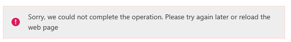
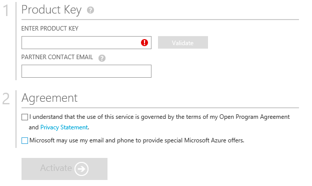

<properties
	pageTitle= "How to buy or sign up for an Azure subscription | Microsoft Azure"
	description="Describes How to buy or sign up for an Azure subscription"
	services="billing"
	documentationCenter=""
	authors="genlin"
	manager="jarrettr"
	editor="meerak"
	tags="billing"
	/>

<tags
	ms.service="billing"
	ms.workload="na"
	ms.tgt_pltfrm="na"
	ms.devlang="na"
	ms.topic="billing"
	ms.date="10/20/2015"
	ms.author="genli"/>

#How to buy or sign up for an Azure subscription

This topic will help you with the following tasks:

* Sign up for an Azure Free Trial subscription
* Upgrade your Azure Free Trial subscription to a Pay-As-You-Go subscription
* Activate your Azure subscription by using a Online Service Activation Key (a 5x5 key)

## Sign up for an Azure Free Trial subscription
To sign up for an Azure Free Trial subscription, you must provide a phone number, a credit card, and a [Microsoft Account](https://www.microsoft.com/en-us/account/faq.aspx) (formerly Windows Live ID) or a School/Work account (aka Organizations ID). Your phone number and credit card are used only to verify your identity, and your credit card will not be  billed.

Note: Your credit card will be charged $1 to make sure it is a valid card, and the charge is reversed after 3-5 business days.

To sign up for an Azure Free Trial subscription:

1. Open the [Azure free trial page](https://azure.microsoft.com/en-us/pricing/free-trial/), and then select **Try it now**.
2. Sign in to your Microsoft account or School/Work account.
3. In the **About you** section, type your personal information. 
4. In the **Verification by phone** section, select the international dialing code for your country, type your phone number (Do not type the internal dialing code) and then select **Send text message** or **Call me**. After you receive a verification code, enter it in the **Verify code** box, and then select the **Verify code** button to verify your phone number.   Note: A VOIP phone number cannot be used for phone verification.
 
If you do not receive a text message or a call back, try using a different phone number or contact [Microsoft Support](https://ms.portal.azure.com/#blade/Microsoft_Azure_Support/HelpAndSupportBlade) for help.
5. After the Phone verification is completed, move to the card
 verification section.

  
6. After the credit card verification is completed, select the **Agreement** option, and then select **Sign Up**. 

 
Note: It can take a few minutes to set up your subscription. If the subscription setup does not complete in 15 minutes contact [Microsoft Support](https://ms.portal.azure.com/#blade/Microsoft_Azure_Support/HelpAndSupportBlade) for assistance.  
If you get any error message, follow the steps in the message to resolve the issue. A typical error message is:
**Sorry, we could not complete the operation. Please try again later or reload the web page**  
In this case, try using another browser to complete the sign-up process. If the issue still occurs, contact [Microsoft Support](https://ms.portal.azure.com/#blade/Microsoft_Azure_Support/HelpAndSupportBlade) for help.

 
7. When the subscription is ready, select **Start managing my service**.

## Upgrade your Azure Free Trial subscription to a Pay-As-You-Go subscription

1. Log on to the [Azure Account Portal](https://account.windowsazure.com/subscriptions) by using the Microsoft account or your School/Work account that you used to sign up for the free trail.
2. Select the subscription, and then select **Upgrade**. 
3. Select **Yes**, and then select **Upgrade now**.  

## Activate your Azure subscription by using a Online Service Activation Key (a 5x5 key)

If you bought Azure in Open credits from a reseller, please follow these steps to activate your subscription:

1. Open the [Azure in Open License key](http://azure.microsoft.com/en-us/offers/ms-azr-0111p/) page, and then select Activate a new subscription or existing subscription.
2. Type the product key, and then check the first agreement option (and also the second option if you want to receive special offers) to activate the subscription. 
3. Select **Activate**.
