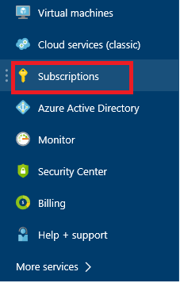
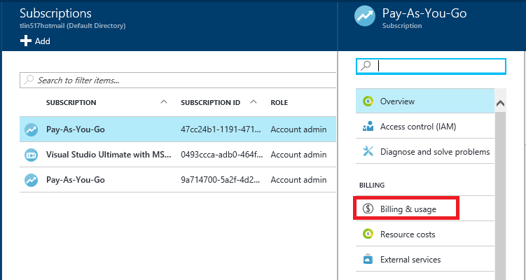

---
title: How to download your Azure billing invoice and daily usage data | Microsoft Docs
description: Describes how to download your Azure billing invoice and daily usage data
services: ''
documentationcenter: ''
author: genlin
manager: mbaldwin
editor: ''
tags: billing

ms.assetid: 6d568d1d-3bd6-4348-97d0-1098b5fe0661
ms.service: billing
ms.workload: na
ms.tgt_pltfrm: na
ms.devlang: na
ms.topic: article
ms.date: 12/2/2016
ms.author: genli

---
# How to download your Azure billing invoice and daily usage data
The billing invoice and daily usage is downloadable from the [Azure Account Center](https://account.windowsazure.com/subscriptions). Only the account administrator has permission to get to the billing invoice and usage information. To find out who is the account administrator of the subscription, see the [Transferring ownership of an Azure subscription - FAQ](billing-subscription-transfer.md#faq).

## Get invoice and usage from Azure Account Center
1. Sign into the [Azure Account Center](https://account.windowsazure.com/subscriptions) as the account administrator.
2. Select the subscription for which you want the invoice and usage information.
3. Select **BILLING HISTORY**.  
4. You can see your statements for the last six billing periods and the current unbilled period.   
5. Select **View Current Statement** to see an estimate of your charges at the time the estimate was generated. This information is only updated daily and may not include all your usage. Your monthly bill may differ from this estimate.   
6. Select **Download Invoice** to see a copy of your last bill.  
7. Select **Download Usage** to download the daily usage data as a CSV file. If you see two versions available, download version 2. 

For more information about your invoice and daily usage, see [Understand your bill for Microsoft Azure](./billing/billing-understand-your-bill.md).

You can also download your invoice from the [Azure portal](https://portal.azure.com) by going to **Subscriptions**, select the subscription, and then select **Billing & usage**. 

## Get invoice from Azure portal
You can view the daily usage from the Azure portal but only the invoice is available for download.

1. Sign in to the [Azure portal](https://portal.azure.com) as the account administrator. 
2. On the Hub menu, select **Subscriptions**. 

     

3. In the **Subscriptions** blade, select the subscription that you want to view, and then select **Billing & usage**. 

     

4. On the **Billing & usage** blade, click **Download Invoice** to view a copy of your bill. 

    

5. You can view your daily usage by clicking the billing period. 

##  Why don't I see an invoice for the last billing period?
There could be several reasons that you don't see an invoice:
- You have a monthly credit amount with your subscription that you didn't exceed or you have a free trial. An invoice isn't generated unless you owe money.
- It's less than 30 days from the day you subscribed to Azure.
- The invoice isn't generated yet. Wait until the end of the billing period.

## Need help? Contact support.
If you still have further questions, please [contact support](https://portal.azure.com/?#blade/Microsoft_Azure_Support/HelpAndSupportBlade) to get your issue resolved quickly.

