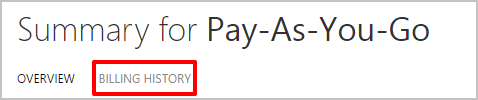
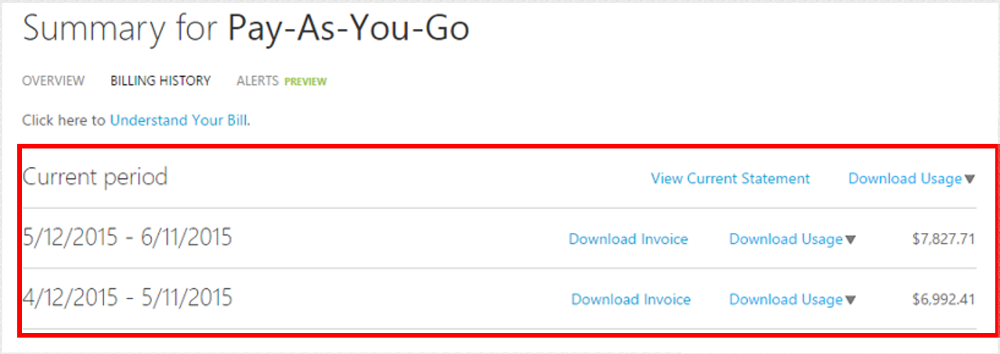
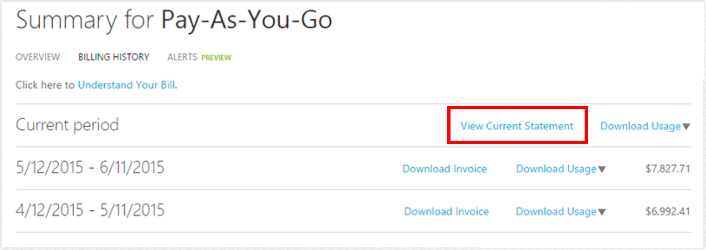
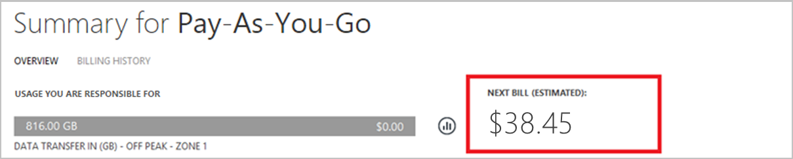
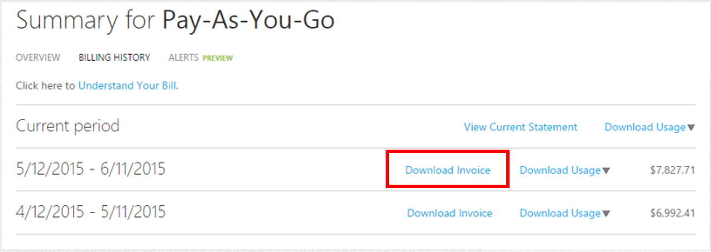

<properties
	pageTitle="How to download your Azure billing invoice and daily usage data | Microsoft Azure"
	description="Describes how to download your Azure billing invoice and daily usage data"
	services="billing"
	documentationCenter=""
	authors="genlin"
	manager="jarrettr"
	editor="meerak"
	tags="billing"
	/>

<tags
	ms.service="billing"
	ms.workload="na"
	ms.tgt_pltfrm="na"
	ms.devlang="na"
	ms.topic="article"
	ms.date="07/25/2016"
	ms.author="genli"/>

# How to download your Azure billing invoice and daily usage data

As the Azure account administrator, you can view the current bill at the Azure Account Center and download statements for the previous six billing periods as well. Here’s how:

1. Sign into the [Azure Account Center](https://account.windowsazure.com/subscriptions) as the account administrator. In the [Azure portal](https://portal.azure.com), you can access the Account Center by selecting **Subscription**>*the subscription name*>**Manage**. For more information about how to find out who is the account administrator of the subscription, see the [Frequently asked questions](billing-subscription-transfer.md#faq).

	> [AZURE.NOTE] Only the  account administrator has permission to access the Account Center. For more information about account administrator, see [How to add or change Azure administrator roles](billing-add-change-azure-subscription-administrator.md).
2. Select the subscription for which you want the invoice and usage information.
3. Select **BILLING HISTORY**.  
4. You can see your statements for the last six billing periods as well as the current unbilled period.   
5. Select **View Current Statement** to see an estimate of your charges at the time the estimate was generated. This information is only updated daily and may not include all of your usage. Your monthly bill may differ from this estimate.   
6. Select **Download Invoice** to see a copy of your last bill.  
7. Select **Download Usage** to download the daily usage data as a CSV file. 
