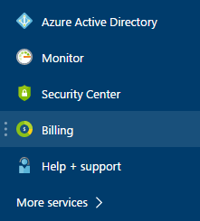
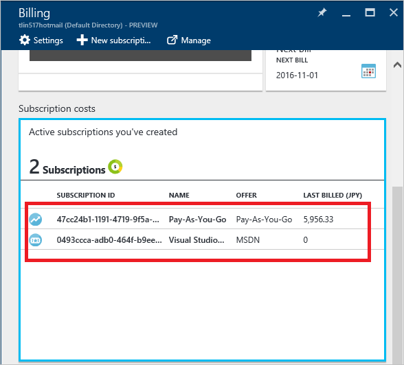
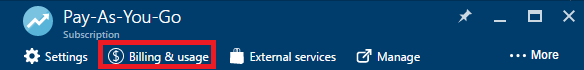
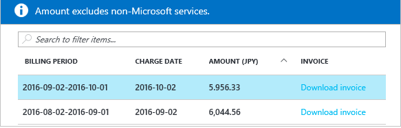

<properties
	pageTitle="How to download your Azure billing invoice and daily usage data | Microsoft Azure"
	description="Describes how to download your Azure billing invoice and daily usage data"
	services=""
	documentationCenter=""
	authors="genlin"
	manager="mbaldwin"
	editor=""
	tags="billing"
	/>

<tags
	ms.service="billing"
	ms.workload="na"
	ms.tgt_pltfrm="na"
	ms.devlang="na"
	ms.topic="article"
	ms.date="10/10/2016"
	ms.author="genli"/>

# How to download your Azure billing invoice and daily usage data

> [AZURE.NOTE] If you need more help at any point in this article, please [contact support](https://portal.azure.com/?#blade/Microsoft_Azure_Support/HelpAndSupportBlade) to get your issue resolved quickly.

As the Azure account administrator, you can view the billing invoice and the daily usage data at the [Azure portal](https://portal.azure.com) or the [Azure Account Center](https://account.windowsazure.com/subscriptions). Here’s how:

## Azure portal

1. Sign in to the [Azure portal](https://portal.azure.com) as the account administrator.

	>[AZURE.NOTE] Only the  account administrator has permission to access the billing data. For more information about how to find out who is the account administrator of the subscription, see the [Frequently asked questions](billing-subscription-transfer.md#faq).

2. On the Hub menu, select **Billing**. On the **Billing** blade, you can find some useful information such as next billing date.

	
3. In the **Subscription costs** section, select the subscription that you want to view.

	
4. Click **Billing & usage**.

	

5. On the **Billing history** blade, click **Download Invoice** to view a copy of your bill. Click a billing period to view the daily usage data.

	

## Azure Account Center

1. Sign into the [Azure Account Center](https://account.windowsazure.com/subscriptions) as the account administrator.
2. Select the subscription for which you want the invoice and usage information.
3. Select **BILLING HISTORY**.  
4. You can see your statements for the last six billing periods and the current unbilled period.   
5. Select **View Current Statement** to see an estimate of your charges at the time the estimate was generated. This information is only updated daily and may not include all your usage. Your monthly bill may differ from this estimate.   
6. Select **Download Invoice** to see a copy of your last bill.  
7. Select **Download Usage** to download the daily usage data as a CSV file. 

> [AZURE.NOTE] If you still have further questions, please [contact support](https://portal.azure.com/?#blade/Microsoft_Azure_Support/HelpAndSupportBlade) to get your issue resolved quickly.
