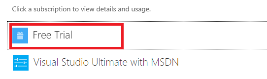
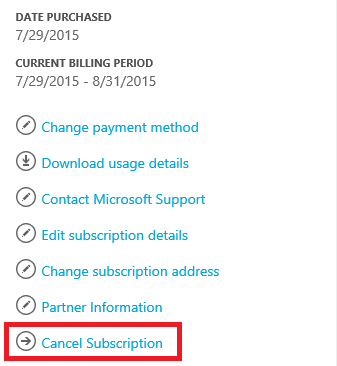
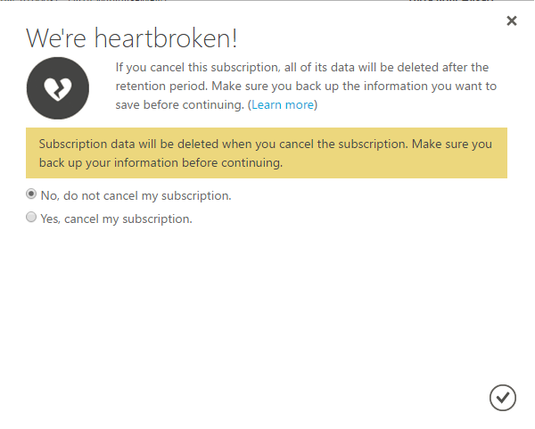

<properties
	pageTitle="How to cancel your Azure subscription | Microsoft Azure"
	description="Describes how to cancel your Azure subscription, like the Free Trial subscription"
	services=""
	documentationCenter=""
	authors="genlin"
	manager="mbaldwin"
	editor=""
	tags="billing"
	/>

<tags
	ms.service="billing"
	ms.workload="na"
	ms.tgt_pltfrm="na"
	ms.devlang="na"
	ms.topic="article"
	ms.date="09/26/2016"
	ms.author="genli"/>

# How to cancel your Azure subscription

Canceling your azure subscription means you will no longer be able to access the Azure services and resources you have. Make sure you take the time to back up your data and stop your services safely.

>[AZURE.NOTE] An [Azure Support plan](https://azure.microsoft.com/en-us/support/plans/) has a 6-month term and Microsoft requires continued monetary commitment for the duration of the term. Cancellation before the term expires does not forgive the remaining commitment or provide refunds any pre-paid amount.

## Before you cancel your subscription

- Back up your data. For example, if you're storing data in Azure storage or SQL, download a copy. If you have a virtual machine, you may want to obtain an image of it and save it locally.

- Shut down your services. Go to the [resources page in the management portal](https://ms.portal.azure.com/?flight=1#blade/HubsExtension/Resources/resourceType/Microsoft.Resources%2Fresources), and **Stop** any running virtual machines, applications, or other services.

## To cancel your subscription

1. Log on to the [Azure Account Center](https://account.windowsazure.com/subscriptions) as the Account Administrator.

2. Under **Click a subscription to view details and usage**, select the subscription that you want to cancel. 

	

3. On the right side of the page, select **Cancel Subscription**.
	
	

4. Select **Yes, cancel my subscription**.
	
	

5. Click  to close the dialog window and return to your subscription page.

## After you cancel your subscription 

If you canceled your Pay-As-You-Go subscription accidentally, you can follow the [instructions outlined here] (billing-subscription-become-disable.md#how-to-re-enable-non-pay-as-you-go-subscriptions) to reactivate it.

When you cancel your subscription, we wait 90 days before permanently deleting your data in case you need to access it or change your mind. [Learn more](https://go.microsoft.com/fwLink/p/?LinkID=822930&clcid=0x409).

> [AZURE.NOTE] If you still have further questions, please [contact support](https://portal.azure.com/?#blade/Microsoft_Azure_Support/HelpAndSupportBlade) to get your issue resolved quickly.
