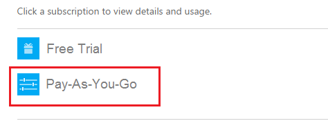
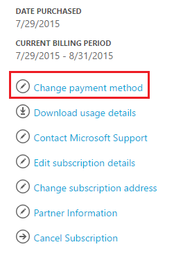
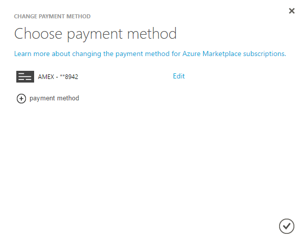

<properties
	pageTitle="How to change the credit card used to pay for an Azure subscription | Microsoft Azure"
	description="Describes how to How to change the credit card used to pay for an Azure subscription"
	services=""
	documentationCenter=""
	authors="genlin"
	manager="jarrettr"
	editor=""
	tags="billing"
	/>

<tags
	ms.service="billing"
	ms.workload="na"
	ms.tgt_pltfrm="na"
	ms.devlang="na"
	ms.topic="article"
	ms.date="05/05/2016"
	ms.author="genli"/>

# How to change the credit card used to pay for an Azure subscription

You may sometimes need to update details of the credit card in your account information, or change the card used to pay your bill.

If your credit card gets renewed and the number remains the same, you can simply update the details of the existing credit card, such as expiration date.

If your credit card number ever changes, due to being lost, stolen or expired, you will need to add the new credit card to your account. This is because the CVV security code on the card is changed when the credit card number changes.

[AZURE.INCLUDE [support-disclaimer](../includes/support-disclaimer.md)]

## Edit payment information for an existing credit card
1. Log on to the [Azure Account Center](https://account.windowsazure.com/Subscriptions) as the account administrator. In the [Azure portal](https://portal.azure.com), you can access the Account Center by selecting **Subscription**>*the subscription name*>**Manage**.

	**Note** Only the  account administrator has permission to access the Account Center. For more information about account administrator, see [How to add or change Azure administrator roles](billing-add-change-azure-subscription-administrator.md).

2. Under **Click a subscription to view details and usage**, select the subscription that is linked to the credit card.  
3. On the right side of the page, select **Change payment method**.  
4. On the **Choose payment method** page, select **Edit** next to the credit card number.  
5. On the **Edit** page, verify that you have selected the correct credit card type and card number.
6. Make the changes you need to the card details, and then select **Next** to the **Choose payment method** page.

## Add a new credit card as a payment method
1. Log on to the [Azure Account Center](https://account.windowsazure.com/Subscriptions) as the Account Administrator.
2. Under **Click a subscription to view details and usage**, select the subscription for which you want to add a new payment method.
3. On the right side of the page, select **Change payment method**.
4. On the **Choose payment method** page, select “+” to add a new credit card.
5. Choose a credit card type, and then provide all the required information.
6. Select **Next** to return to the **Choose payment method** page. If the card you added is valid, it will be added to the list of available payment methods. You can view all available credit cards by selecting the drop-down arrow next to the credit card.

## Change the credit card that you use to pay an Azure invoice
1. Log on to the [Azure Account Center](https://account.windowsazure.com/Subscriptions) as the Account Administrator.
2. Under **Click a subscription to view details and usage**, select the subscription for which you want to update the payment method.
3. On the right side of the page, select **Change payment method**.
4. On the **Choose payment method** page, select the drop-down arrow next to the credit card, select the credit card you want use, and then select  to close the window.

> [AZURE.NOTE] To remove a credit card that you no longer use as an Azure payment method, you must submit a support ticket to request assistance. To create a support ticket to remove a credit card, see the article [How to create a support ticket for Azure billing and subscription issues](billing-how-to-create-billing-support-ticket)
