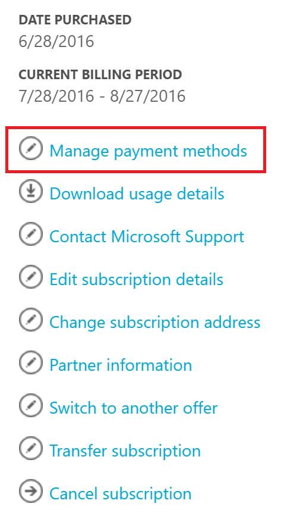
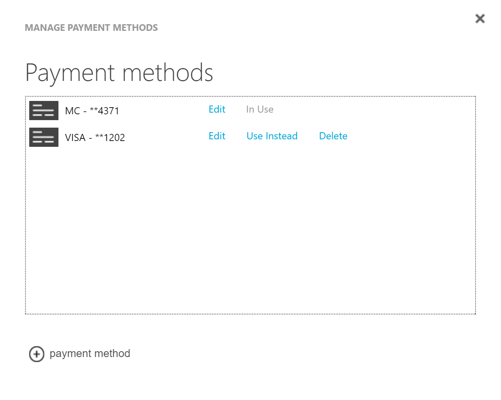

# Change the credit card used to pay for an Azure subscription

This article explains how to add, change or remove a credit card that’s associated with your Azure account, and how to make payments.

## Add a credit card as a payment method

Follow these steps to add a credit card to your account.

1. Log on to the [Azure Account Center](https://account.windowsazure.com/Subscriptions) as the account administrator.
2. Under **Click a subscription to view details and usage**, select the subscription for which you want to add a payment method.
3. On the right side of the page, select **Manage payment methods**.
4. On the **Manage payment methods** page, select “+” to add a credit card.
5. Choose a credit card type, and then provide all the required information.
6. Select **Next** to return to the **Manage payment methods** page. If the card you added is valid, it will be added to the list of available payment methods.

> [!NOTE]
>If you receive an error message after you submit your credit card information, see the article [Your debit card or credit card is declined or not accepted](billing-credit-card-fails-during-azure-sign-up.md).
>
>

## Edit payment information for an existing credit card

Follow these steps to verify your payment method and update the details of an existing credit card.

1. Log on to the [Azure Account Center](https://account.windowsazure.com/Subscriptions) as the account administrator.

   > [!NOTE]
   > Only the  account administrator has permission to access the Account Center. For more information about the account administrator, see [How to add or change Azure administrator roles](billing-add-change-azure-subscription-administrator.md).
   >
   >
2. Under **Click a subscription to view details and usage**, select the subscription that is linked to the credit card.  
3. On the right side of the page, select **Manage payment methods**.  

  You will see the current payment method listed. Select it to verify the required information.

  **How to update the details of an existing credit card**

  If your credit card gets renewed and the number remains the same, you can simply update the existing credit card details, such as the expiration date. However, if your credit card number ever changes because the card is lost, stolen or expired, you may have to [add a credit card to your account](#addcard). This is because the CVV security code on the card is changed when the credit card number changes.

4. On the **Manage payment methods** page, select **Edit** next to the credit card number.  
5. On the **Edit** page, verify that you have selected the correct credit card type and card number.
6. Make the necessary changes you need to the card details, and then select **Next** to the **Choose payment method** page.

## Change the credit card that you use to pay an Azure bill

1. Log on to the [Azure Account Center](https://account.windowsazure.com/Subscriptions) as the account administrator.
2. Under **Click a subscription to view details and usage**, select the subscription for which you want to update the payment method.
3. On the right side of the page, select **Manage payment methods**.
4. On the **Manage payment methods** page, click **Use Instead**, select the credit card that you want to use.

## Remove a credit card from the account
1. Log on to the [Azure Account Center](https://account.windowsazure.com/Subscriptions) as the account administrator.
2. Under **Click a subscription to view details and usage**, select the subscription for which you want to update the payment method.
3. On the right side of the page, select **Manage payment methods**.
4. On the **Manage payment methods** page, click **Delete** to select the credit card you want to delete.

   > [!NOTE]
   > You will not be able to delete a credit card if it is associated with other active Microsoft subscriptions. If you receive an error that the card is in use, please ensure that it is disassociated from all active subscriptions that you have with Microsoft.
   >
   >

##  How to make payments

If you have set up a credit card or a debit card as your payment method, the payment is made automatically.
If you are on [an invoice method of payment](https://azure.microsoft.com/pricing/invoicing/), send your payment to the location listed at the bottom of your invoice.

## Need help? Contact support

If you still need help, [contact support](https://portal.azure.com/?#blade/Microsoft_Azure_Support/HelpAndSupportBlade) to get your issue resolved quickly.
