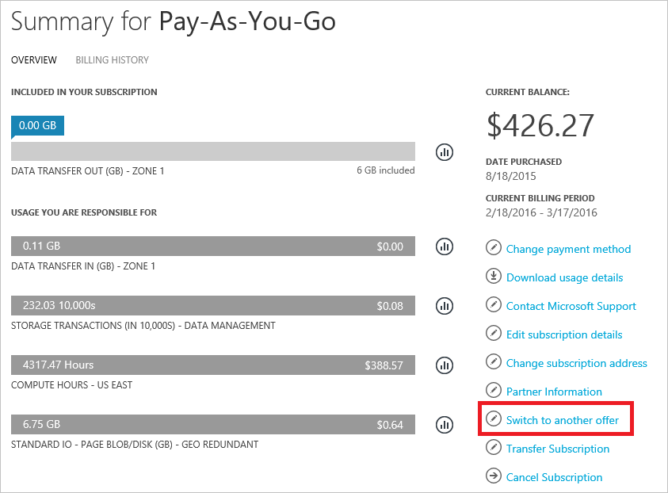
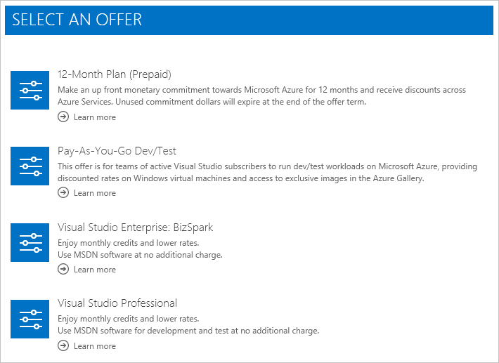
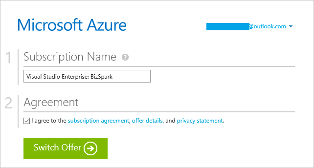

<properties
	pageTitle="Switch your Azure subscription to another offer | Microsoft Azure"
	description="Learn about how to change your Azure subscription and switch to a different offer using the subscription management portal"
	services=""
	documentationCenter=""
	authors="genlin"
	manager="msmbaldwin"
	editor=""
	tags="billing,top-support-issue"/>

<tags
	ms.service="billing"
	ms.workload="na"
	ms.tgt_pltfrm="na"
	ms.devlang="na"
	ms.topic="article"
	ms.date="09/06/2016"
	ms.author="genli"/>

# Switch your Azure subscription to another offer

## What you need to know

You [may be eligible](#where-is-the-button) to switch your subscription to a more favorable offer, without any service downtime. Below are the paths we currently support in the [Account Center](https://account.windowsazure.com/Subscriptions). Click the links to learn about requirements.

| From                                                              | To                                                                                      |
|-------------------------------------------------------------------|-----------------------------------------------------------------------------------------|
| [Pay-As-You-Go](https://azure.microsoft.com/offers/ms-azr-0003p/) | [Pay-As-You-Go Dev/Test](https://azure.microsoft.com/offers/ms-azr-0023p/)              |
| [Pay-As-You-Go](https://azure.microsoft.com/offers/ms-azr-0003p/) | [12-Month Prepay](https://azure.microsoft.com/offers/ms-azr-0026p/)                     |
| [Pay-As-You-Go](https://azure.microsoft.com/offers/ms-azr-0003p/) | [Visual Studio Professional](https://azure.microsoft.com/offers/ms-azr-0059p/)          |
| [Pay-As-You-Go](https://azure.microsoft.com/offers/ms-azr-0003p/) | [Visual Studio Test Professional](https://azure.microsoft.com/offers/ms-azr-0060p/)     |
| [Pay-As-You-Go](https://azure.microsoft.com/offers/ms-azr-0003p/) | [MSDN Platforms](https://azure.microsoft.com/offers/ms-azr-0062p/)                      |
| [Pay-As-You-Go](https://azure.microsoft.com/offers/ms-azr-0003p/) | [Visual Studio Enterprise](https://azure.microsoft.com/offers/ms-azr-0063p/)            |
| [Pay-As-You-Go](https://azure.microsoft.com/offers/ms-azr-0003p/) | [Visual Studio Enterprise (Bizspark)](https://azure.microsoft.com/offers/ms-azr-0064p/) |
> [AZURE.NOTE] If you're on Free Trial, learn how to [upgrade to Pay-As-You-Go](billing-buy-sign-up-azure-subscription.md#upgrade-azure-free-trial-to-pay-as-you-go).

> If you've signed up for your subscription recently, you must wait until your first billing period to complete before you can change offers.

> For other offer changes, please [contact support](https://portal.azure.com/?#blade/Microsoft_Azure_Support/HelpAndSupportBlade).
	
## Guide to switching your subscription to another offer

> [AZURE.VIDEO switch-to-a-different-azure-offer]

1.	Sign in at [Azure Account Center](https://account.windowsazure.com/Subscriptions).
2.	Select the subscription to change.
3.	Click **Switch to another offer**. Find out why [if you don't see the button](#where-is-the-button).

	
	
4.	You will be presented with all the offers your subscription can be switched to.  This list will vary based on the memberships that your account is associated with, and also by the current offer. You can click the **Learn more** under each offer for detailed information about it. Click the desired offer to proceed to the next step.

	
5.	Depending on the offer you’re switching to, you may see a note about the impact of switching. Go through this list carefully and follow the instructions before you proceed.

	
6.	You can to rename your subscription. By default, we set it to the new offer name. Click **Switch Offer** to complete the process.

	
7.	Success! Your subscription is now switched to the new offer.

## Frequently asked questions (FAQ)

### What offer changes do you support?

See the list of [available offers you can switch to](#what-you-need-to-know).

### Where is the button?

You might not see **Switch to another offer** if:

- You're still on your first billing period; you must wait for your first billing period to complete before you can change offers.

- You're not eligible for any offer changes. Check the list of [available offers you can switch to](#what-you-need-to-know) to make sure your desired offer change is supported.

### Does switching offers have any impact to my service?

There is no service downtime. However, the offer you switch to may have restrictions. For instance, some offers prohibit production use. So you would need to move production resources to another subscription.

### Does switching offers have any impact to service administrators? 

There is no impact to any users associated with the subscription.

### What billing-related changes can I expect upon switching offers?

On the day you switch, an invoice will be generated for all outstanding charges. Subsequently, your subscription will be billed per the new offer’s pricing terms. Your subscription billing anniversary changes to the date on which you changed offers. Usage and billing data prior to the offer change will not be retained, so we recommend that you download these prior to switching.

> [AZURE.NOTE] Due to billing-related constraints, offer changes are not possible within the first billing cycle after creating a subscription.

### Can I use this mechanism to migrate from web direct to [Cloud Solution Provider](https://partner.microsoft.com/Solutions/cloud-reseller-overview) (CSP), or an [Enterprise Agreement](https://azure.microsoft.com/pricing/enterprise-agreement/) (EA) offer?

This mechanism can be used to switch from - and to - only web direct offers. To move your existing subscription into EA, have your enrollment admin add your account into the EA. You will then receive an invitation email. When you follow the instructions to accept the invitation, your subscriptions will automatically be moved under the Enterprise Agreement. There is no option to move an existing web direct subscription into CSP today.

## Next steps

- Learn how to [manage administrator roles](billing-add-change-azure-subscription-administrator.md) for your subscription

- Track your usage by [downloading usage data and invoice](billing-download-azure-invoice-daily-usage-date.md)

> [AZURE.NOTE] If you still have further questions, please [contact support](https://portal.azure.com/?#blade/Microsoft_Azure_Support/HelpAndSupportBlade) to get your issue resolved quickly.
