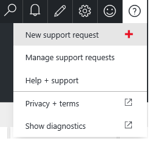

<properties
	pageTitle="What do I do if my Azure subscription is disabled? | Microsoft Azure"
	description="Describes the reasons and resolution for Azure subscription becomes disabled"
	services=""
	documentationCenter=""
	authors="genlin"
	manager="msmbaldwin"
	editor="na"
	tags="billing"
	/>

<tags
	ms.service="billing"
	ms.workload="na"
	ms.tgt_pltfrm="na"
	ms.devlang="na"
	ms.topic="article"
	ms.date="07/27/2016"
	ms.author="genli"/>

# What do I do if my Azure subscription is disabled?

If your Azure subscription becomes disabled, you can use the steps in this article to re-enable it. Your Azure subscription can become disabled for the following reasons:

## You have reached your spending limit

To protect you from accidentally incurring charges for usage beyond the included offer amount, we have introduced the [spending limit](https://azure.microsoft.com/pricing/spending-limits/) feature. When your usage exhausts the monthly amounts included in your offer, we will disable your service for the remainder of that billing month. You can opt to remove the spending limit to avoid this and [set up billing alerts for your Microsoft Azure subscriptions](billing-set-up-alerts.md) to help you monitor and manage billing activity for your Azure accounts.

Here is how you can remove your Spending Limit:

1. Log in to the [Azure Account Center](https://account.windowsazure.com/Home/Index).

2. Click on **Subscriptions**.

3. Select a subscription.

4. If you see *Subscription reached the Spending Limit and has been disabled to prevent charges*, click on it.
	
	Alternatively, click **Remove spending limit** in the **Subscription Status** area. 
	
5. Select one of the following options that is appropriate for you：

|Option|Effect|
|------|------|
|Remove spending limit indefinitely|Removes the spending limit without turning it on automatically at the start of the next billing period.|
|Remove spending limit for the current billing period|Removes the spending limit so that it turns back on automatically at the start of the next billing period.|

>[AZURE.NOTE] If you are using a Free Trial subscription, removing the spending limit will convert your subscription to Pay-As-You-Go at the end of the Free Trial.

## Your bill is past due

Pay your outstanding balance in full. To do this, see the article [Why have you received a notification that your Azure subscription has a past due balance?](billing-azure-subscription-past-due-balance.md#what-can-you-do-to-resolve-the-issue)

## The bill exceeds your credit card limit

To resolve this issue, use one of the following method:

- [Switch to a different credit card](billing-how-to-change-credit-card.md).
- If you are a business, you can [switch to the invoice method of payment](https://azure.microsoft.com/pricing/invoicing/).

## How to re-enable your subscription

To re-enable a cancelled subscription, you must create a support ticket: sign into the [Azure portal](https://portal.azure.com/), select **Help + support**>**New support request**.

If you cannot access the portal, submit a support request from the Azure Support web site or from the Azure Accounts Center:

 * To submit a support ticket from the [Azure Support web site](https://azure.microsoft.com/support/options/), click **Get support**.
 * To submit a support ticket from the [Azure Account Center](https://account.windowsazure.com/Subscriptions), select a subscription, and then click **Contact Microsoft Support**.

For more information, see [How to Create a Support Ticket for Azure Billing and Subscription Issues](billing-how-to-create-billing-support-ticket.md).
