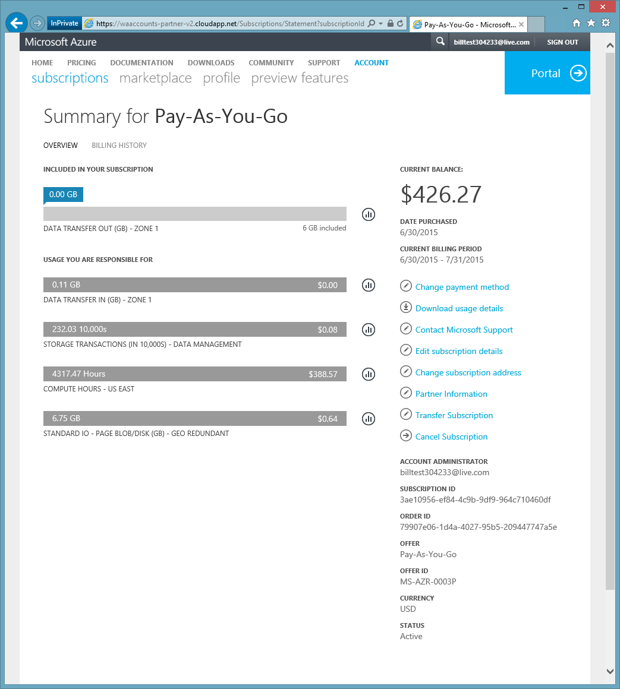
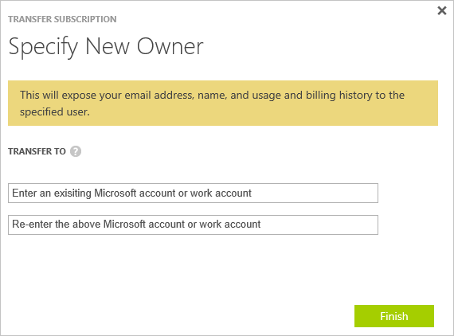
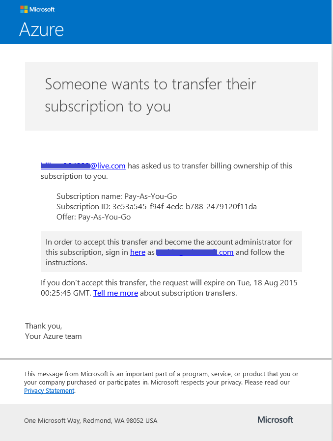
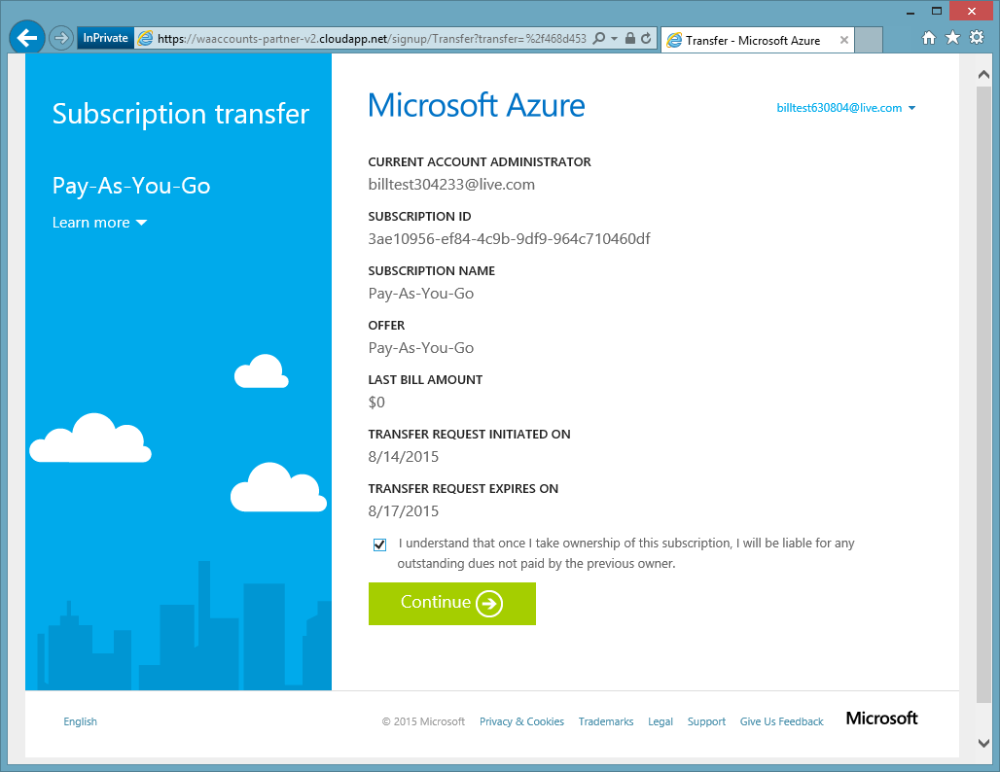
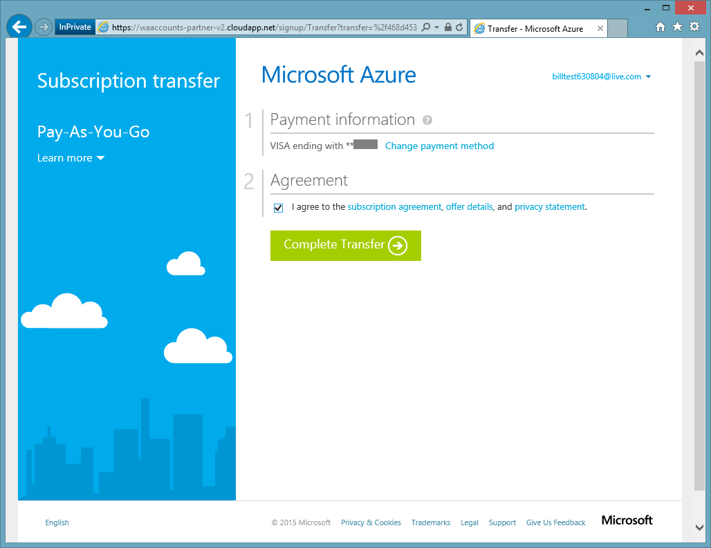

<properties
   pageTitle="Transferring Ownership of an Azure subscription| Microsoft Azure"
   description="How to transfer an Azure subscription to another user, and some frequently asked questions (FAQ) about the process"
   services=""
   documentationCenter=""
   authors="genlin"
   manager="stevenpo"
   editor="n/a"
   tags="billing,top-support-issue"/>

<tags
   ms.service="billing"
   ms.workload="na"
   ms.tgt_pltfrm="na"
   ms.devlang="na"
   ms.topic="article"
   ms.date="07/21/2016"
   ms.author="genli"/>

# Transferring Ownership of an Azure subscription

Do you:

- Need to hand over billing ownership of your Azure subscription to someone else?
- Want to change the account used to sign up for Azure? Perhaps you used your Microsoft Account but meant to use your work or school account instead?
- Want to move your Azure subscription from one directory to another?
- Have Azure and Office 365 in different tenants and want to consolidate?

You can now do this easily in the Microsoft Azure Account Center- for Pay-As-You-Go, MSDN, Action Pack, or BizSpark subscriptions.  We’ve added the ability to transfer your subscription to another user. In other words, you can now change the account admin on any Pay-As-You-Go, MSDN, Action Pack, or BizSpark subscription that you own, no matter which country you operate in. We now support the transfer of Azure Marketplace Purchases for these subscription types as well.

> [AZURE.NOTE]  To change your subscription to a different offer, see [Switch Azure subscription to another offer](billing-how-to-switch-azure-offer.md) for more information.

> You have to be the account administrator to perform an ownership transfer. For more information about how to find out who is the account administrator of the subscription, see the [Frequently asked questions](#faq).

## How to transfer ownership of an Azure subscription

> [AZURE.VIDEO transfer-an-azure-subscription]

1.  Sign in at <https://account.windowsazure.com/Subscriptions>

2.  Select the subscription to transfer.

3.  Click the **Transfer Subscription** option.

    

4.  Follow the prompts to specify the recipient.

    

5.  The recipient will automatically get an email with a acceptance link.

    

6.  The recipient clicks on the link and follows the instructions,
    including entering their payment information.

    

    

7. Success! The subscription is now transferred.

## Frequently asked questions (FAQ)

-   **How can I know who is the account administrator of the subscription?**

    You can confirm who is the account administrator of the subscription as follows:

    1. Sign in to the [Azure portal](https://portal.azure.com).
    2. On the Hub menu, select **Subscription**.
    3. Select the subscription you want to check, and then select **Settings**.
    4. Select **Properties**. The account administrator of the subscription will be displayed in the **Account Admin** box.  

-   **Does a subscription transfer result in any service downtime?**

    There is no impact to the service. This effectively cancels the
    subscription under the current Account Administrator and creates a
    new one under the recipient’s account, but associates the underlying
    Azure services with the new subscription. The subscription ID
    remains the same.

-   **How do I use this mechanism to change the directory for subscription?**-   
    An Azure subscription is created in the directory that the Account Admin belongs to. So, in order to change the directory, just transfer the subscription to a user account in the target directory. When that user completes the steps to accept transfer, the subscription will automatically move to the target directory.

-   **If I take over billing ownership of a subscription from another
    organization, will they continue to have access to my resources?**

    If the subscription is transferred to another tenant, the users associated with the previous tenant will lose access to the subscription. Even if a user is not a Service Admin or Co-admin anymore, they might still have access to the subscription through other security mechanisms. These include:
    - Management certificates that grant the user admin rights to subscription resources. For more information, see [Create and Upload a Management Certificate for Azure](https://msdn.microsoft.com/library/azure/gg551722.aspx)
    -	Access keys for services like Storage. For more information, see [View, copy, and regenerate storage access keys](storage-create-storage-account.md#view-copy-and-regenerate-storage-access-keys)
    -	Remote Access credentials for services like Azure Virtual Machines

    This is not a complete list. The recipient should consider updating any secrets associated with the service if they need to restrict access to their resources. Most resources can be updated as follows:

    1.   Go to the Azure portal:   [*https://portal.azure.com*](https://portal.azure.com)

    2.    Click Browse All -&gt; All Resources

    3.    Select the resource. This opens the resource blade.

    4.    In the resource blade, click **Settings**. Here you can view and update existing secrets.

-   **If I transfer the subscription in the middle of the billing cycle,
    does the recipient pay for the entire billing cycle?**

    The sender is responsible for payment for any usage that was reported up to the point that the transfer is completed. The recipient is responsible for usage reported from the time of
    transfer onwards. There may be some usage that took place before transfer but was reported afterwards. This will be included in the recipient’s bill.

-   **Does the recipient have access to usage and billing history?**

    At this time, the only information revealed to the recipient is the amount of the last bill (or the current balance, if the subscription was transferred before the first bill was generated). The rest of the usage and billing history does not transfer with the subscription.

-   **Can the offer be changed during a transfer?**

    The offer must remain the same. To change your offer, you must [contact Support](http://go.microsoft.com/fwlink/?LinkID=619338).

-   **Can I transfer a subscription to a user account in another
    country?**

    No, at this time this is not supported. The recipient’s user account must be in the same country.

-   **Can the recipient use a different payment mechanism?**

    Yes. There are limitations here: now the subscription billing history is split across two accounts. But the advantage is that you can do this without having to [contact Support](http://go.microsoft.com/fwlink/?LinkID=619338).

-   **Will the payment method be impacted after I transferred an Azure subscription?**

    In order to accept a subscription transfer, a credit card or similar payment method must be provided to pay for the subscription. For example, if Bob transfers a subscription to Jane and Jane accepts the transfer, Jane must also provide a payment method that she will use to pay for the subscription. After the transfer is complete, Bob will no longer be charged for the subscription he transferred to Jane.

## Next steps after accepting ownership of a subscription

1. You are now the Account Administrator. Review and update the Service Administrator and Co-Administrators. Manage admins in the [Azure classic portal](https://manage.windowsazure.com) by going to Settings. [Learn more](http://go.microsoft.com/fwlink/?LinkID=533293).
2. You can also use role-based access control (RBAC) for your subscription and services. Visit the [Azure portal](https://portal.azure.com) [Learn more about RBAC](http://go.microsoft.com/fwlink/?LinkID=544802)
3. Update credentials associated with this subscription's services. These include:
    - Management certificates that grant the user admin rights to subscription resources. For more information, see [Create and upload a management certificate for Azure](https://msdn.microsoft.com/library/azure/gg551722.aspx)
    -	Access keys for services like Storage. For more information, see [View, copy, and regenerate storage access keys](storage-create-storage-account.md#view-copy-and-regenerate-storage-access-keys)
    -	Remote Access credentials for services like Azure Virtual Machines
4. Update billing alerts for this subscription, at the [Azure Account Center](https://account.windowsazure.com/Subscriptions)  [Learn more](http://go.microsoft.com/fwlink/?LinkID=533292)
5. 	If you’re working with a partner, consider updating the partner ID on this subscription. You can do this in the [Azure Account Center](https://account.windowsazure.com/Subscriptions).
