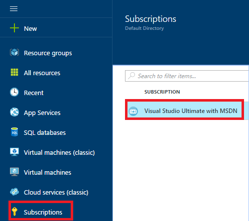
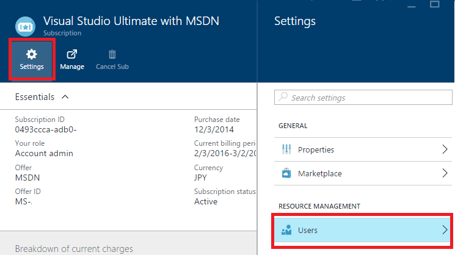
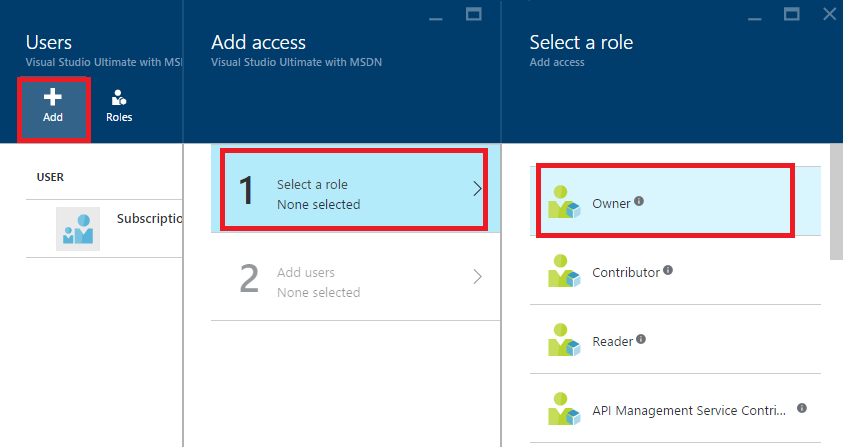
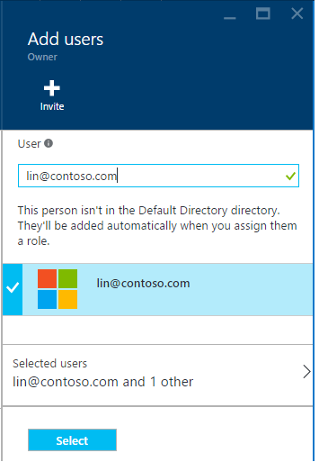

<properties
	pageTitle="How to add or change Azure administrator roles | Microsoft Azure"
	description="Describes how to add or change Azure Co-Administrator, Service Administrator and Account Administrator"
	services=""
	documentationCenter=""
	authors="genlin"
	manager="msmbaldwin"
	editor="meerak"
	tags="billing"/>

<tags
	ms.service="billing"
	ms.workload="na"
	ms.tgt_pltfrm="na"
	ms.devlang="na"
	ms.topic="article"
	ms.date="03/22/2016"
	ms.author="genli"/>

# How to add or change Azure administrator roles

## How to add an admin for a subscription

**Azure portal**

1. Sign in to the [Azure portal](https://portal.azure.com).

2. On the Hub menu, select **Subscription** > *the subscription that you want the admin to access*.

	

3. In the subscription blade, select **Settings**> **Users**.

	
4. In the Users blade, select **Add**>**Select a role** > **Owner**.

	

	**Note**
	- The owner role has same access privileges as co-administrator. This role does not have access privilege to the [Azure Account Center](https://account.windowsazure.com/subscriptions).
	- The owners you added through the [Azure portal](https://portal.azure.com) cannot manage services in the [Azure classic portal](https://manage.windowsazure.com).  

5. Type the email address of the user you want to add as owner, click the user, and then click **Select**.

	
