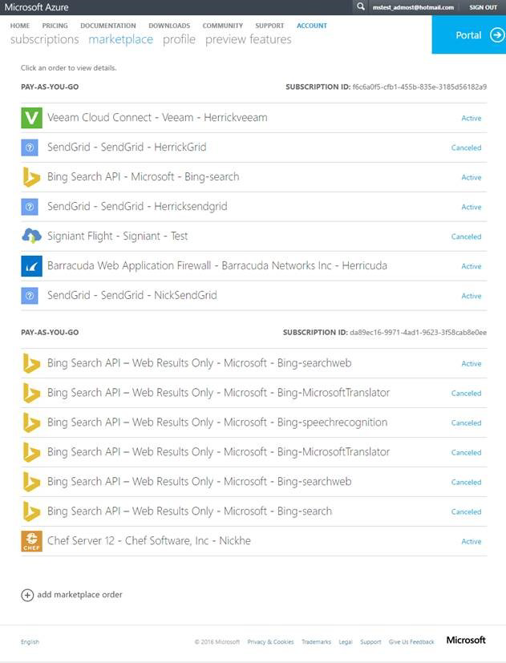
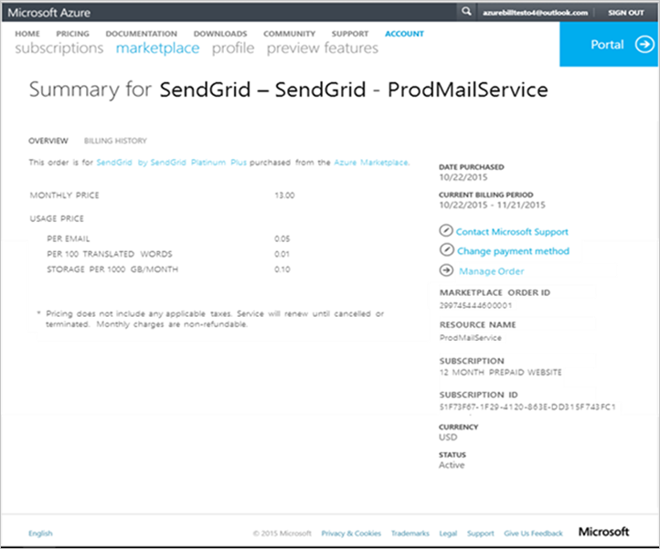
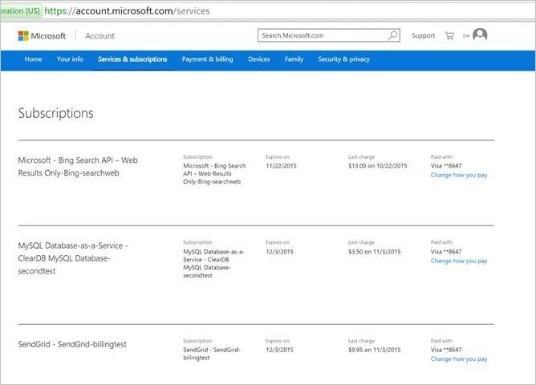
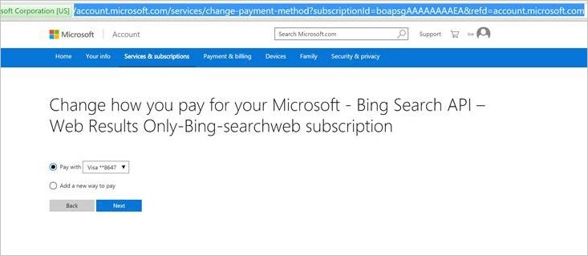
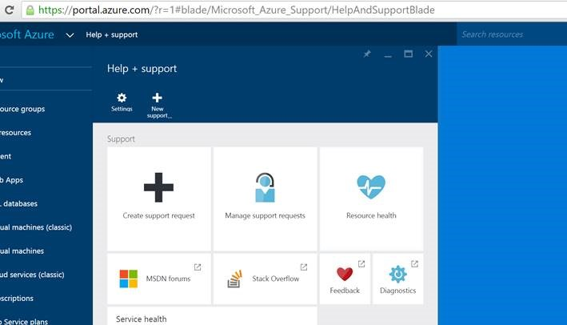
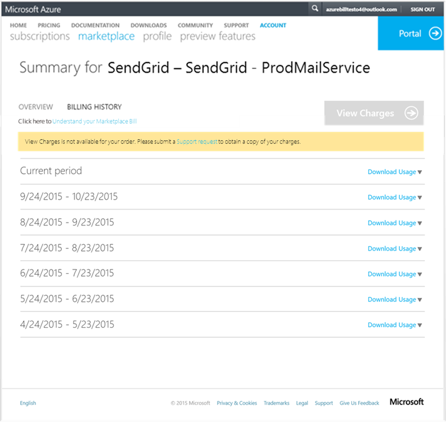
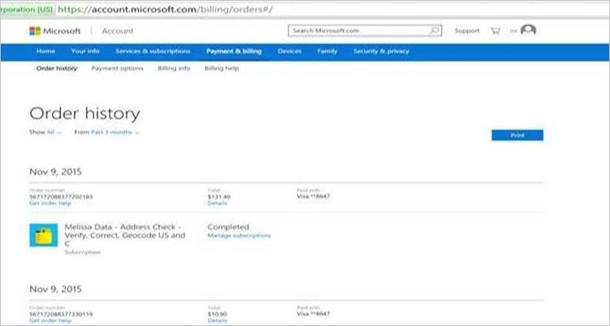
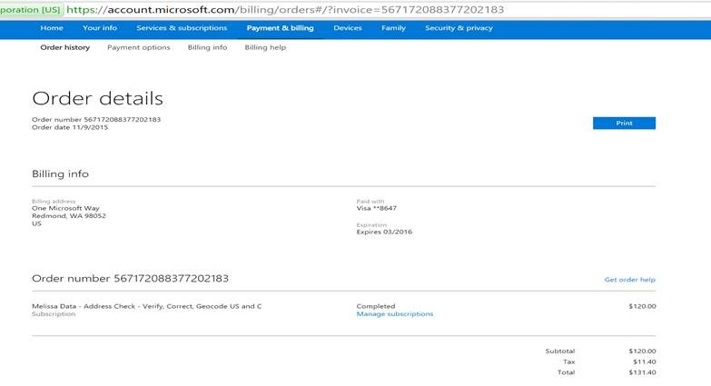

<properties
	pageTitle="Understand your Azure Marketplace charges | Microsoft Azure"
	description="Describes how to understand charges related to your Marketplace orders."
	services="billing"
	documentationCenter=""
	authors="jiangchen79"
	manager="felixwu"
	editor=""
	tags="billing"
	/>

<tags
	ms.service="billing"
	ms.workload="na"
	ms.tgt_pltfrm="na"
	ms.devlang="na"
	ms.topic="article"
	ms.date="05/10/2016"
	ms.author="cjiang"/>

# Understand your Azure Marketplace charges
This article provides you an overview of how to understand charges related to your Marketplace orders. A few things to keep in mind while reviewing your bill are the different pricing types (Base Only, Usage Only and Base + Usage). Please note that each Marketplace order you place will have its own monthly billing cycle. These topics will be covered in detail below.

## Review your Marketplace bill
Once you log in the [Azure Accounts Portal](https://account.windowsazure.com/subscriptions/) you can review and download current and past bills.

To view or download your bill:

1. Sign in to the Azure Accounts Portal using your Org ID.
2. Click **Marketplace**.
The list being displayed is a complete list of all Marketplace orders that have been placed by your Azure account. You’ll notice that the orders are grouped by the parent Azure subscription name and ID.

    

3. Clicking any of the displayed orders will take you to the summary overview of that order for the current billing cycle. An explanation of the different pricing models can be found on [Marketplace FAQ](https://azure.microsoft.com/marketplace/faq/).

    

The summary view contains the following information for each order:
- Price
- Billing Cycle
- Purchase Date
- Associated Parent Subscription
- Billing Currency

Pleaes note that We made a few changes to how this information is displayed. Previously we displayed the cost of the order which included tax. This has been updated to show the price which may be tax exclusive or inclusive, depending on which country you are in. The location of the price has moved from the right hand navigation to the center as well. To help track which Azure subscription these charges are associated to we also added the Azure subscription name and ID to the right hand navigation as well as the **Change payment method** option.

## Update Payment Method and Order Management
The summary page has user actions, allowing you to update the payment model and order management functions:

> [AZURE.NOTE] If you are using your organization ID to change personal information you will need to log a ticket with support.

To update your payment method click on the **Change payment method** link on the right side of the page.

This link will bring you to a different portal where you will be able to make changes to your preferred payment method.

To change your payment method, follow these steps:

1. Click on **Change how you pay**.

    

2. Select the payment method you want to change to. The **Pay with** option allows you to select your credit card. The **Add a new way to pay** option allows you add a new credit card.

    

## Order management
From the summary overview page you’ll see an **Manage Order** link. This link will bring you to your portal where you can see all your Marketplace orders, view service health and request support.

To request support, click on the **Help + support** tile. This will bring up the following **Help + support** page where you can do the following:
- Open a new support request.
- Manage existing support requests.
- Manage resource health.

## Billing History
A new feature on the summary page is the ability to view usage based offers like virtual machines. You are now able to download usage based on billing cycle for both current and closed periods. To view usage, click on the **Download Usage** link per the period you would like to view.

If you are interested in viewing your actual charges click **View Charges**. You will be redirected to a different portal where you’ll be able to view all charges including taxes. If you are using an organization ID, the **View Charges** button will not be enabled and you will need to submit a support ticket to request a summary of your charges.

To view actual charges, follow these steps:

1. Click **View Charges** on the **BILLING HISTORY** page.

	A new tab will open showing the [order history](https://account.microsoft.com/billing/orders#/).

    Please note that if you are trying to access your raw usage in the Billing and Account Management Portal you’ll need to call support by clicking on the support link at the bottom of the page.)

    

2. Identify the order you would like to review and click **Details** to view a breakdown of your charges which will include subtotal, tax and total charges.

    
