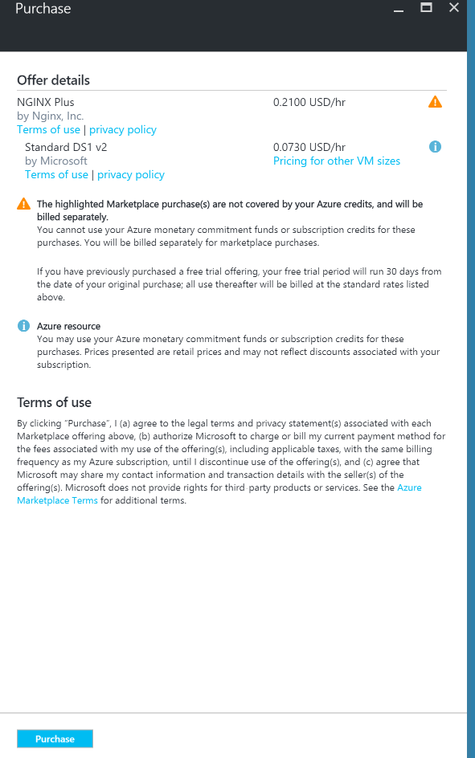
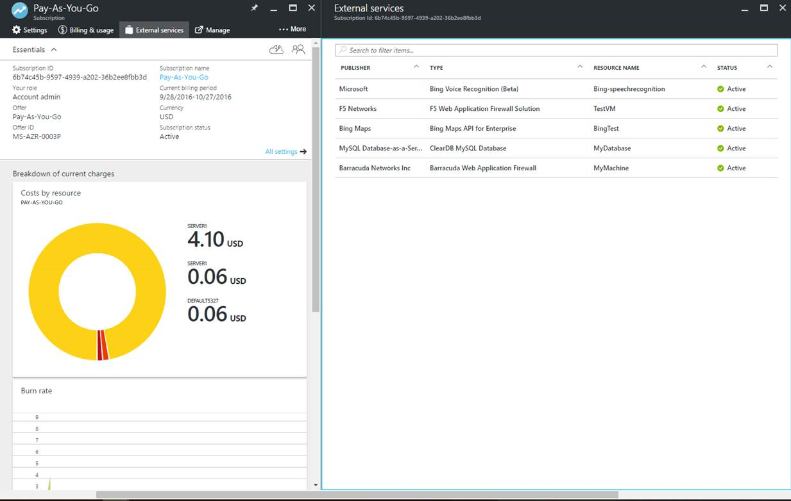
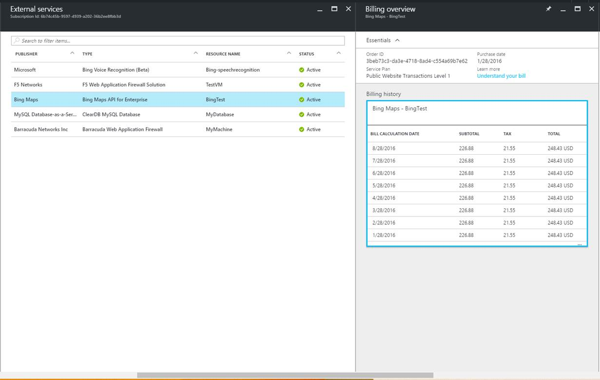
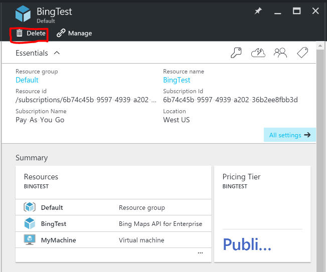

<properties
	pageTitle="Understand your Azure external service charges | Microsoft Azure"
	description="Learn about billing of external services, formerly known as Marketplace, charges in Azure."
	services=""
	documentationCenter=""
	authors="adpick"
	manager="felixwu"
	editor=""
	tags="billing"
	/>

<tags
	ms.service="billing"
	ms.workload="na"
	ms.tgt_pltfrm="na"
	ms.devlang="na"
	ms.topic="article"
	ms.date="10/06/2016"
	ms.author="adpick"/>

# Understand your Azure external service charges

This article explains the billing of external services in Azure. External services used to be called Marketplace orders. External Services are provided by independent service vendors, but are integrated completely within the Azure ecosystem. Learn how to:

- Identify External Services
- Understand how the billing differs from other Azure resources
- View and track any costs you accrue from the use of external services
- Manage external service orders and how you pay for them

## What are Azure external services?

External services used to be called Azure Marketplace. Generally, they're services published by third-parties available for Azure. For example, ClearDB and SendGrid are external services that you can purchase in Azure.

### Identify external services

When you provision a new external service or resource, you'll see a warning about it:

>[AZURE.NOTE] Usually external services are published by companies that are not Microsoft, but sometimes Microsoft products are also categorized as external services.

### External services are billed separately

External services are treated as individual orders within your Azure subscription. The billing period for each service is set when you purchase the service. Not to be confused with the billing period of the subscription under which you purchased it. You also receive separate bills and your credit card is charged separately.

### Different external services are biilled differently

You need a credit card for Azure external services. If your subscription uses invoice pay, you are not able to buy them. Some services are billed in a pay-as-you-go fashion while others use a monthly-based payment model. Keep this in mind when you're buying external services.

### You can't use monthly free credits for external services

If you are using an azure subscription that includes [free credit](https://azure.microsoft.com/pricing/spending-limits/), this credit can't be applied to external service bills. You must have a credit card associated with your subscription to purchase external services, and this is the card that is charged.

## View external service spending and history

You can view a list of the external services that are on each subscription within the [Azure portal](https://portal.azure.com/): 

1. Navigate to the [Billing blade](https://portal.azure.com/?flight=1#blade/Microsoft_Azure_Billing/BillingBlade).
  
2. Select a subscription.
   
	

3. Click **External Services** to view each of your external service orders, the publisher name, service tier you bought, name you gave the resource, and the current order status.

	

4. From here, you can view past bill amounts including the tax breakdown.

	

## Manage payment methods for external service orders

Update your payment methods for external service orders from the [Account Center](https://account.windowsazure.com/).

> [AZURE.NOTE] If you purchased your subscription with a work or school account you should [contact support](https://portal.azure.com/?#blade/Microsoft_Azure_Support/HelpAndSupportBlade) to make changes to your payment instrument

1. To update your payment method click **Change payment method** on the right side of the [page](https://account.windowsazure.com/Store).
    
    

2. This link brings you to a different portal where you are able to make changes to your preferred payment method.

3. Click **Change how you pay**.

    

4. Select the payment method you want to change to. The **Pay with** option allows you to select your credit card. The **Add a new way to pay** option allows you to add a new credit card.

    
    
## Cancel an external service order

If you want to cancel your external service order, you need to delete the resource in the [Azure portal](https://portal.azure.com).

## Need help? Contact support.

If you still have further questions, please [contact support](https://portal.azure.com/?#blade/Microsoft_Azure_Support/HelpAndSupportBlade) to get your issue resolved quickly.
