<properties
   pageTitle="Understand Your Azure Bill"
   description="Understand Your Azure Bill"
   services=""
   documentationCenter="Azure"
   authors="erihur"
   manager="stevenpo"
   editor=""
   tags="billing"/>

<tags
   ms.service="billing"
   ms.devlang="na"
   ms.topic="article"
   ms.tgt_pltfrm="na"
   ms.workload="na"
   ms.date="07/21/2016"
   ms.author="erihur;genli"/>

# Understand your bill for Microsoft Azure

The charges for Microsoft Azure subscriptions vary by rate plan. Some rate plans, such as the Visual Studio Enterprise (MPN) subscribers, include monthly credits that you can use on any Azure service based on your needs.

Please note that up to 24 hours of latent usage from your prior billing period can be reported in your current billing period.

For more information about consumption and rate plans, see the [Microsoft Azure Purchase Options page](https://azure.microsoft.com/pricing/purchase-options/).

<!-- The below links cover a complete list of all Microsoft Azure services.

<!-- - [Service Details list (csv1)](https://azurepricing.blob.core.windows.net/supplemental/MOSPServices_csv1.xlsx)
<!-- - [Service Details list (csv2)](https://azurepricing.blob.core.windows.net/supplemental/MOSPServices_csv2.xlsx)

<!-- *NOTE: The **csv1** link refers to the column header names for csv version 1 and **csv2** link refers to the new column header names for csv version 2.  These files are updated monthly.*-->

### View or download a bill for Microsoft Azure:

In the [Azure Account Center](https://account.windowsazure.com/subscriptions) you can view current and download past bills.

To view or download a bill:

1. Sign in to the [Account Center](https://account.windowsazure.com/subscriptions) using your Microsoft Account ID or Work or School Account ID.

2. Click on the subscription in which you would like to see details and usage.

3. Click **Billing History**

    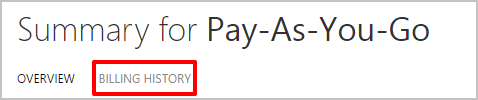

4. The **Billing History** section lists your statements for prior billing periods plus the current unbilled period. The statement for the current period is an estimate of your charges as of the time the estimate was generated. This information is only updated daily and may not include all of your usage incurred to date. Your monthly bill may differ from this estimate.  

    

5. Click **View Current Statement** to view an estimate of your charges as of the time the estimate was generated. This information is only updated daily and may not include all of your usage incurred to date. Your monthly bill may differ from this estimate.

    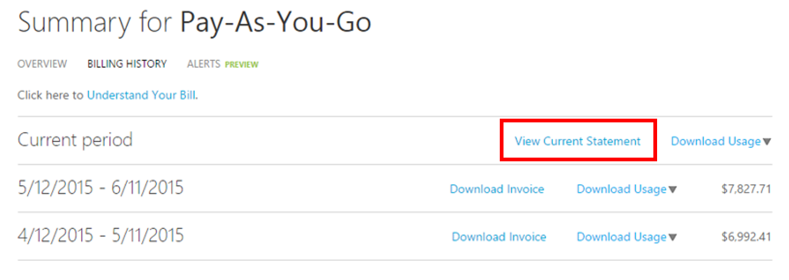

    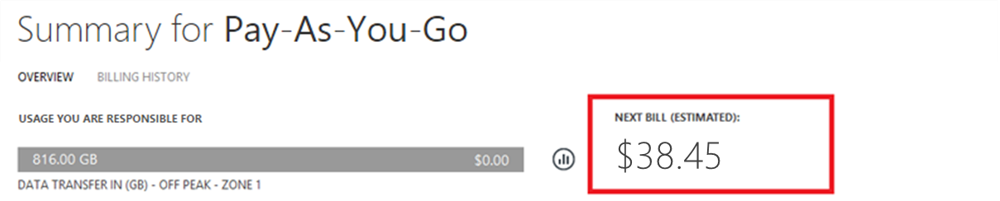

6. Click **Download Invoice** to view a copy of your previous bill.

    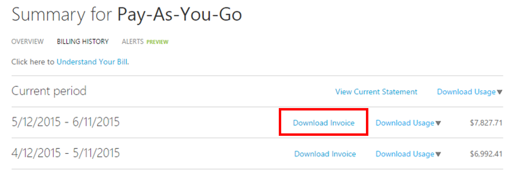

***Important:***
*Charges listed on billing statements for international customers are for estimation purposes only as banks have different costs for the conversion rates.*

Below are some sample statements for two different offers available on Microsoft Azure.

 **OFFER TYPE** | **DESCRIPTION** | **DOWNLOAD** |
 :--------- |:-------- | :-------|
Pay-As-You-Go | Pay in arrears monthly | [Sample file](https://azurepricing.blob.core.windows.net/sampleinvoices/Microsoft_Azure_ccinvoice_Sample.pdf)
Commitment offer | Spend deducted from your prepaid commitment | [Sample file](https://azurepricing.blob.core.windows.net/sampleinvoices/Microsoft_Azure_invoice_Sample.pdf)

## Account information

The account information section identifies pertinent information in regards to your usage and profile.
    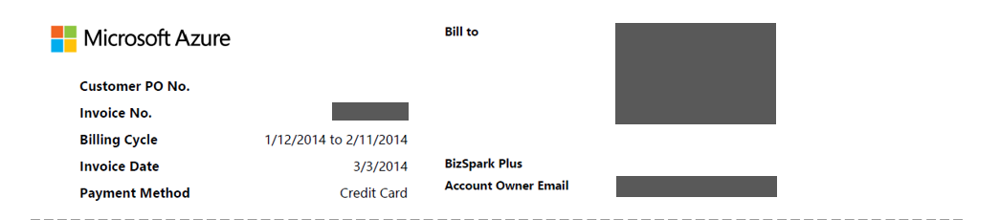

### Invoice No.
A unique invoice identifier for tracking purposes.

### Billing cycle
The time frame in which usage has taken place.

### Invoice date
Date that the invoice was generated.

### Payment method
Type of payment used on the account (i.e. invoice or credit card).

### Bill to
Microsoft Azure payments address.

### Subscription offer
Type of subscription offer that was purchased (i.e. Pay-As-You-Go, BizSpark Plus, Azure Pass, etc.)

### Account owner email
The account email address that the Microsoft Azure account is registered under.

## Understand the invoice summary
The **Invoice Summary** section of the bill summarizes transactions since your last bill and your current usage charges.

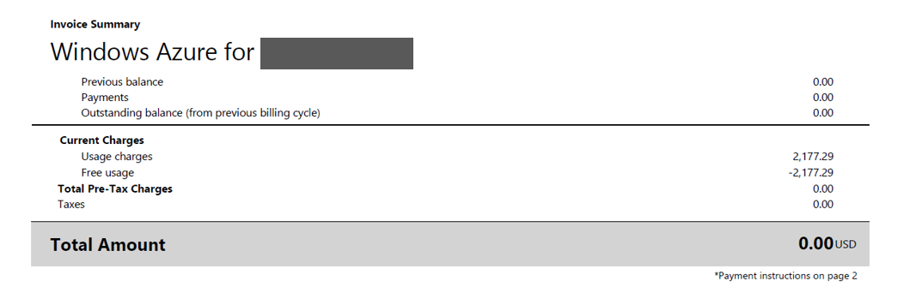

The previous balance, payments, and outstanding balance section of the bill summarizes transactions since your last bill.

### Previous balance
Previous balance is the total amount due from your last bill.

### Payments
Payments are your total payments applied to your last bill.

### Outstanding balance (from previous billing cycle)
Any bill adjustments (credits or balances) applied to your account since your last bill.

## Understand the current charges
The Current Charges section of the bill contains details about your monthly charges. The links are organized into the following subsections.

### Usage charges
Usage charges are total monthly charges on a subscription. You are billed in arrears for your past month’s usage.

### Discounts
Service discounts on your usage would be reflected in this line item that are applied to your current bill.

### Adjustments
Miscellaneous adjustments are miscellaneous credits or outstanding charges applied to your current bill. For example, if you have the Visual Studio Enterprise with MSDN offer, you would see a monthly credit in this line item. If you cancel your subscription, you would see charges for monthly usage in excess of the monthly credit included in your offer from the start of your current billing period to your subscription cancellation date.

## Footer information
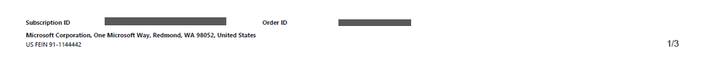

## Understand the additional information
The additional information page gives you references to other resources to understand your invoice, and links to view your usage as well as other relevant information for your bill.

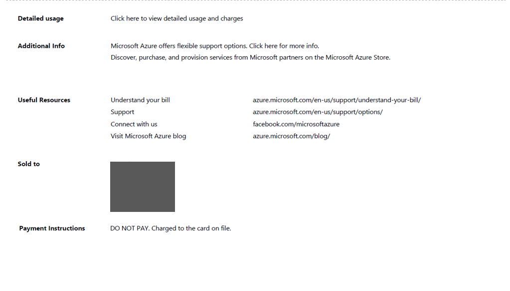

### Detailed usage
A link in the description under **Detailed Usage** directs you the Account Center where you can view your detailed usage for this subscription.  There are now two versions available to download:  **.csv version 1** contains the old naming convention and usage fields and **.csv version 2** contains customer friendly names for each of the categories plus additional fields that will help you understand what services you are using on Microsoft Azure. Please note that in .csv version 1 that there are no Azure Resource Manager details. Azure Resource Manager information can be found in .csv version 2.

### Additional information and useful resources
This section has links to simple questions regarding compute instance sizes, SQL DB charges, and useful links to help you answer further questions.

### Sold to
This is prepopulated with the profile address on the account.

### Payment instructions
This section is the payment instructions of where to send checks, wire transfers or overnight checks if your payment method is invoice.

## Understand detailed usage charges

As part of our ongoing commitment to help customers easily manage their Azure use, we've enhanced the download usage file that reports on your Azure services usage and costs.  The download link contains two versions of the usage file: **Version 1** uses the pre-existing format; **Version 2** includes additional information and updated column names in the Daily Usage section.  

Usage charges are total **monthly** charges on a subscription less any credit or discount. You are billed in arrears for your past month’s usage.  The top section of the file display the details on the services you are being billed for during the previous month's billing cycle.  The table below lists the names of the columns for each of the .csv version files.

**Version 1** |  **Version 2**  |  **Description**|
:---------------| :---------------- | --------|
Billing Period | Billing Period | The billing period when the resource was consumed.
Name | Meter Category | Identifies the top-level service for which this usage belongs.
Type | Meter Sub-Category | Azure service may be further defined by type in this column, which can affect the rate.
Resource | Meter Name | Identifies the unit of measure for the resource being consumed.
Region | Meter Region | Identifies the location of the datacenter for certain services that are priced based on datacenter location.
SKU | SKU | Identifies the unique system identifier for each Azure resource.
Unit | Unit | Identifies the Unit that the service is charged in. For example, GB, hours, 10,000s.
Consumed | Consumed Quantity | Contains the amount of the resource that has been consumed during the billing period.
Included | Included Quantity | Contains the amount of the resource that is included at no charge in your current billing period.
Billable | Overage Quantity | If the Consumed amount exceeds the included amount, this column displays the difference. You are billed for this amount. For Pay-As-You-Go offers with no amount included with the offer, this total will be the same as the Consumed quantity.
Within Commitment | Within Commitment | Contains the resource charges that are decremented from your commitment amount associated with your 6 or 12 month offer. Note that your resource charges are decremented from your commitment amount in chronological order.
Currency | Currency | Identifies the currency reflected in your current billing period.
Overage | Overage | Contains the resource charges that exceed your commitment amount associated with your 6 or 12 month offer.
Commitment Rate | Commitment Rate | Contains the commitment rate based on your total commitment amount associated with your 6 or 12 month offer.
Rate | Rate | Rate displays the rate you are charged per billable unit.
Value | Value | Displays the result of multiplying the Billable column by the Rate column. If the Consumed amount does not exceed the included amount, there will be no charge in this column.

## Analyze daily usage data
Depending on your usage, there can be thousands of rows of daily usage data. If you want to analyze this data, click **Download Usage** and choose a comma-separated variable file (.csv) version to see your daily usage data for the appropriate billing period.  For your reference, you can download a sample .csv file for each version below.

 NAME | DOWNLOAD |
 :----------:| :-------: |
  Detailed Usage .csv Version 1|  [Sample File](https://azurepricing.blob.core.windows.net/sampleinvoices/Micorosft_Azure_Detailed_Usage_v1.csv)
  Detailed Usage .csv Version 2 | [Sample File](https://azurepricing.blob.core.windows.net/sampleinvoices/Micorosft_Azure_Detailed_Usage_v2.csv)

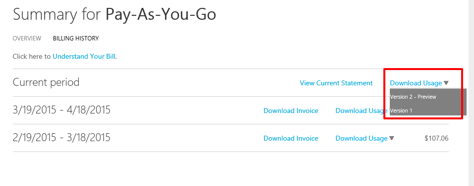

In the .csv file, the items are broken down to display a list of how much of each resource was consumed within the current billing period.

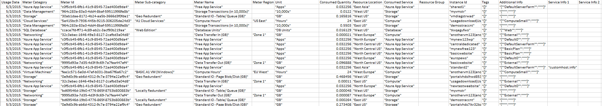

The following columns display details that affect the rates at the beginning of the billing period:

**Version 1** |   **Version 2**   |  **Description** |
:---------------| :----------------| -----|
Usage Date | Usage Date | The date when the resource was emitted.
Name | Meter Category | Identifies the top-level service for which this usage belongs.
Resource GUID | Meter ID | The billed meter identifier.  This is used as the identifier used to price billing usage.
Type | Meter Sub-Category | Azure service may be further defined by type in this column, which can affect the rate.
Resource | Meter Name | Identifies the unit of measure for the resource being consumed.
Region | Meter Region | Identifies the location of the datacenter for certain services that are priced based on datacenter location.
Unit | Unit | Identifies the Unit that the service is charged in. For example, GB, hours, 10,000s.
Consumed | Consumed Quantity | Contains the amount of the resource that has been consumed for that day.
Sub Region | Resource Location | Identifies the datacenter where the resource is running.
Service | Consumed Service | This column is utilized to track the individual Azure platform service that may not be specifically identified in the Name column. This Service column will indicate which specific service the usage pertains.
N/A | Resource Group | _**New column addition.**_ The resource group in which the deployed resource is running in. Refer to http://azure.microsoft.com/en-us/documentation/articles/resource-group-overview/
Component | Instance ID | The identifier for the running resource. The identifier contains the name you specify for the resource when it was created.
N/A | Tags | _**New column addition.**_ New resource types in Azure allow you to tag resources. Refer to http://azure.microsoft.com/en-us/updates/organize-your-azure-resources-with-tags/
Additional Info | Additional Info | Additional metadata related to the service.
Service Info 1 | Service Info 1 | This column provides the project name that the service belongs to on your subscription.
Service Info 2 | Service Info 2 | This is a legacy field that captures optional service specific metadata.

In addition to some new fields and name changes to csv Version 2, there will be standardized formatting for the data in the below fields:

- **Instance ID**: The Instance ID field represents the user specified identifier for the service provisioned. Currently, there are two formats in which the Instance ID is represented: it is either the name of the Resource or the fully qualified Resource ID. Microsoft Azure services are transitioning to represent the Instance ID in a standardized fully qualified Resource ID format _**(/subscriptions/<subscription id>/resourcegroups/<resourcegroupname>/providers/<providername>/<resourcename>)**_. As services transition to the new format you will see the Instance ID data field change from just the resource name to Resource ID. The Resource ID is the format used by the [Azure Resource Manager API](https://msdn.microsoft.com/library/azure/dn790567.aspx) to identify resources in an a subscription.

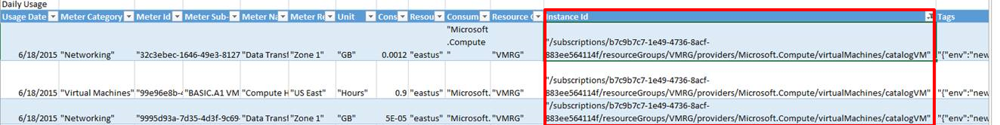

- **Additional Info**: The Additional Info column in the usage .csv specifies service specific metadata. For example, an image type for a VM. Currently, a service emits service specific metadata in multiple columns: Additional Info, Service Info1, and Service Info 2 fields. Microsoft Azure services will be standardizing emitting service specific metadata in the Additional Info column only.  See the below snapshot of the standardized format:

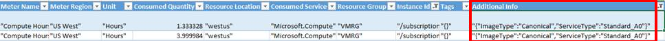

- **Tags**:  This column contains the user specified resource tags. The tags can be used to group billing records. For example, you can use tags to distribute costs by department using the service. Learn more about [using tags to organize Azure Resources](./resource-group-using-tags.md). Services that support emitting tags are:  
    - Virtual Machines
    - Storage and
    - Networking services provisioned using the [Azure Resource Manager API](https://msdn.microsoft.com/library/azure/dn790567.aspx)

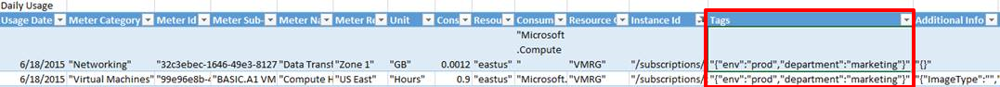

## More resources
Navigate to the section, **Manage Accounts, Subscriptions, and Admin Roles**, under [Manage your services](https://msdn.microsoft.com/library/azure/dn578292.aspx) for some very helpful links:

- [Azure Billing and Subscription FAQ ](billing-subscription-faq.md)

- [How to change the credit card used to pay for an Azure subscription](billing-how-to-change-credit-card.md)

<!--
OLD MSDN Articles
- [What do I do if my Azure subscription become disabled?](https://msdn.microsoft.com/library/azure/dn736049.aspx)
- [Edit payment information for an existing credit card](https://msdn.microsoft.com/library/azure/dn736053.aspx)
- [Add a new credit card to use as a payment method](https://msdn.microsoft.com/library/azure/dn736057.aspx)
- [Change the credit card on your Microsoft Azure account](https://msdn.microsoft.com/library/azure/dn736050.aspx)
- [Manage your payment method](https://msdn.microsoft.com/library/azure/dn736054.aspx)
-->

<!--Image references-->
