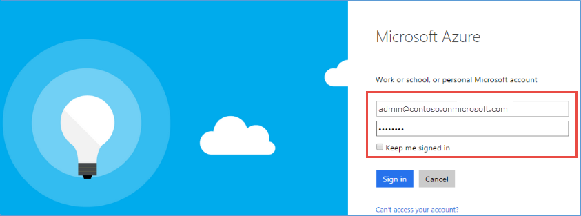
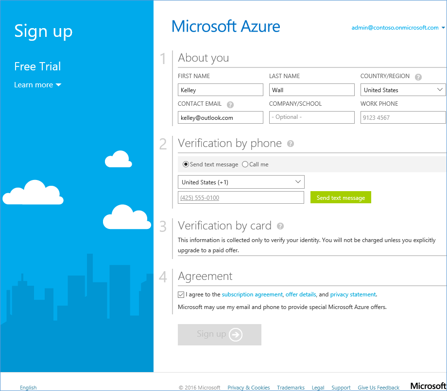
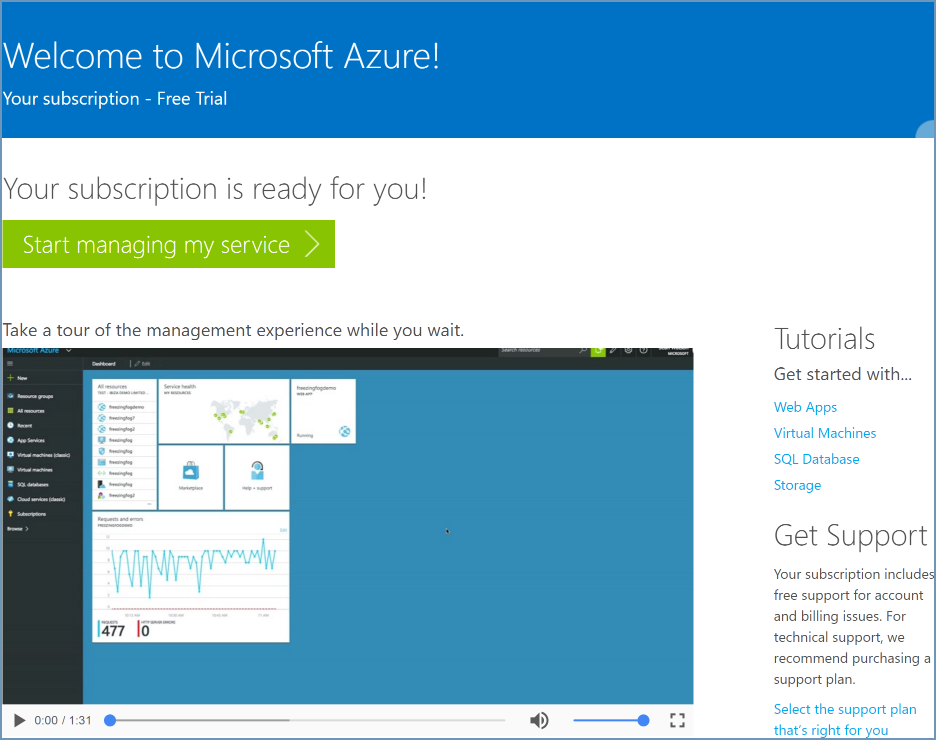
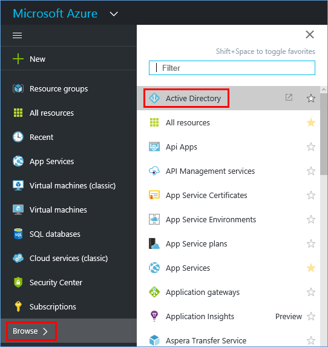
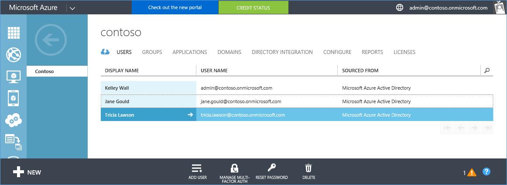
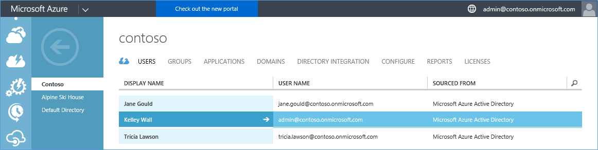
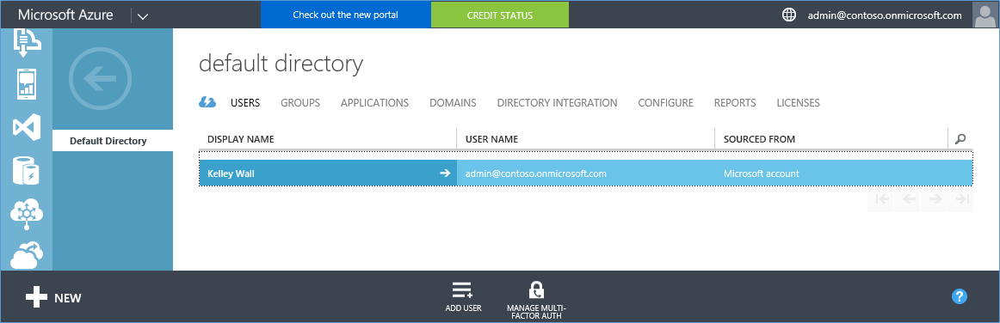

<properties
	pageTitle="Share a single Azure AD tenant across Office 365 and Azure subscriptions | Microsoft Azure"
	description="Learn how to share your Office 365 Azure AD tenant and its users with your Azure subscription, or vice versa"
	services="billing"
	documentationCenter=""
	authors="jiangchen79"
	manager="mbaldwin"
	editor=""
	tags="top-support-issue"/>

<tags
	ms.service="billing"
	ms.workload="na"
	ms.tgt_pltfrm="ibiza"
	ms.devlang="na"
	ms.topic="article"
	ms.date="06/20/2016"
	ms.author="cjiang"/>

# Use your existing Office 365 account with your Azure subscription, or vice versa
Scenario: If you already have an Office 365 subscription and are ready for an Azure subscription, but want to use the existing Office 365 user account(s) for your Azure subscription. Alternatively, you are an Azure subscriber and want to get an Office 365 subscription for the users in your existing Azure Active Directory. This article shows you how easy it is to achieve both.

> [AZURE.NOTE] This article doesn’t apply to Enterprise Agreement (EA) customers.

## Quick guidance

- If you already have an Office 365 subscription and want to sign up for Azure, use the **Sign in with your organizational account** option and continue the Azure sign up with your Office 365 account. See [detailed steps](#s1).
- If you already have an Azure subscription and want to get an Office 365 subscription, sign in to Office 365 with your Azure account and proceed with the sign up steps. Once completed, the Office 365 subscription is added to the same Azure Active Directory that your Azure subscription belongs to. See [detailed steps](#s2).

>[AZURE.NOTE] To get an Office 365 subscription, the account you use for sign-in must be a member of the Global Admin or Billing Admin directory role in your Azure AD tenant. [Learn how to know the role of your Azure Active Directory](#how-to-know-your-role-in-your-azure-active-directory)

To understand how things work when you add a subscription to an account, see the [background information](#background-information) later in the article.

## Detailed steps

### Scenario 1: Office 365 users plan to buy Azure
In this scenario, we assume Kelley Wall is a user who has an Office 365 subscription, and is planning to subscribe to Azure. There are two additional active users, Jane and Tricia. Kelley’s account is admin@contoso.onmicrosoft.com.

To sign up for Azure, follow these steps:

1. Sign up for Azure at [Azure.com](https://azure.microsoft.com/). Click on **Try for free**. On the next page, click **Start now**.

	

2. Click **Sign in with your organizational account**.

	

3. Sign in with your Office 365 account. In this case, it is Kelley’s Office 365 account.

	

4. Fill in the information and complete the sign-up process.

	

5. Click **Start managing my service** and you are good to go.

	

Now you are all set. In the Azure portal, you will see the same users showing up in the same directory. To verify this, follow these steps:

1. Click **Start managing my service** in the screenshot above.
2. Click **Browse**, and then click **Active Directory**.

	

3. Click **USERS**.

	

4. All the users including Kelley are listed as expected.

	

### Scenario 2: Azure users plan to buy Office 365

In this scenario, Kelley Wall is a user who has an Azure subscription under the account admin@contoso.onmicrosoft.com. Kelley wants to subscribe to Office 365 and use the same directory she already has with Azure.

>[AZURE.NOTE] To get an Office 365 subscription, the account you use for sign-in must be a member of the Global Admin or Billing Admin directory role in your Azure AD tenant. [Learn how to know the role of your Azure Active Directory](#how-to-know-your-role-in-your-azure-active-directory)

To subscribe to Office 365, follow these steps:

1. Go to the [Office 365 product page](https://products.office.com/business), and then select a plan that is suitable for you.
2. After you select the plan, the following page is displayed. Do not fill in the form. Click **Sign in** on the top right of the page.

	

3. Sign in with the credential of your account. In this case, it is Kelley’s account.

	

4. Click **Try now**.

	

5. On the order receipt page, click **Continue**.

	

Now you are all set. In the Office 365 admin center, you will see same users from the Contoso directory showing up as active users. To verify this, follow these steps:

1. Open the Office 365 admin center.
2. Expand **USERS**, and then click **Active Users**.

	

### How to know your role in your Azure Active Directory

1. Sign in to the [Azure portal](https://portal.azure.com/).
2. Click **Browse**, and then click **Active Directory**.

	

3. Click **USERS**.

	

4. Click the user. In this example, Kelley Wall.
5. Notice the field of **ORGANIZATIONAL ROLE**.

	

## Background information
Office 365 and Azure use the Azure Active Directory (AAD) service to manage users and subscriptions. Consider an Azure directory as a container for you to group users and subscriptions. In order to use the same user account for your Microsoft Azure and Office 365 subscriptions, you need to make sure that the subscriptions are created in the same directory.

- A subscription gets created under a directory, not the other way around.
- Users belong to directories, not the other way around.
- A subscription lands in the directory of the user creating the subscription. As a result, your Office 365 subscription is tied to the same account of your Azure subscription when you use the account to create the Office 365 subscription.

See [How Azure subscription are associated with Azure Active Directory](./active-directory/active-directory-how-subscriptions-associated-directory.md) for more information.

**Notes:**

- Azure subscriptions are owned by individual users in the directory.
- Office 365 subscriptions are owned by the directory itself. Users within the directory can operate on these subscriptions if they have the requisite permissions.

##Next steps
There is a related scenario where you acquired both of the Azure and Office 365 subscriptions separately in the past, and wants to be able to access the Office 365 tenant from the Azure subscription. To learn how to accomplish this task, see [Associate an Office 365 tenant with an Azure subscription](billing-add-office-365-tenant-to-azure-subscription.md).
