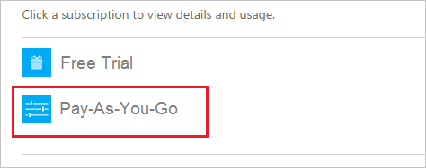

<properties
	pageTitle="How to verify your payment method and make payments for an Azure subscription | Microsoft Azure"
	description="Describes How to verify your payment method and make payments for an Azure subscription"
	services=""
	documentationCenter=""
	authors="genlin"
	manager="msmbaldwin"
	editor="meerak"
	tags="billing"
	/>

<tags
	ms.service="billing"
	ms.workload="na"
	ms.tgt_pltfrm="na"
	ms.devlang="na"
	ms.topic="article"
	ms.date="07/12/2016"
	ms.author="genli"/>

# How to verify your payment method and make payments for an Azure subscription

>[AZURE.NOTE] If you receive an error after submitting your credit card information, see the article [My credit card doesn’t go through when I try to sign up for Azure](billing-credit-card-fails-during-azure-sign-up.md).

[AZURE.INCLUDE [support-disclaimer](../includes/support-disclaimer.md)]

## Verify the current payment method
1. Log on to the [Azure Account Center](https://account.windowsazure.com/Subscriptions) as the Account Administrator.

2. Under **Click a subscription to view details and usage**, select the subscription for which you want to verify the payment method.

     

3. Select **Change payment method**.

    

4. You will see the current payment method listed. Select it to verify the information you need.

    

## Make payments

If you have set up a credit card or a debit card as your payment method, the payment will be made automatically.  To change the card at any time, see [How to change Payments or Credits for an azure subscription](billing-how-to-change-credit-card.md).

If you are on an invoice method of payment, send your payment to the location listed at the bottom of your invoice. For additional help, contact [Microsoft Support](https://portal.azure.com/#blade/Microsoft_Azure_Support/HelpAndSupportBlade).
