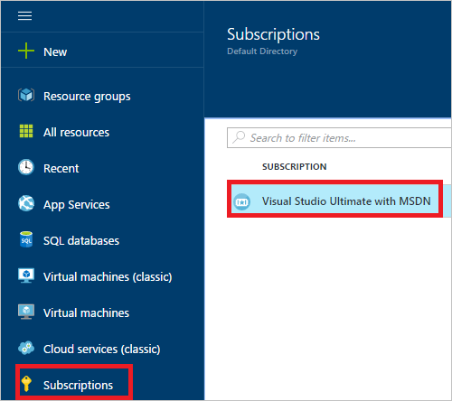
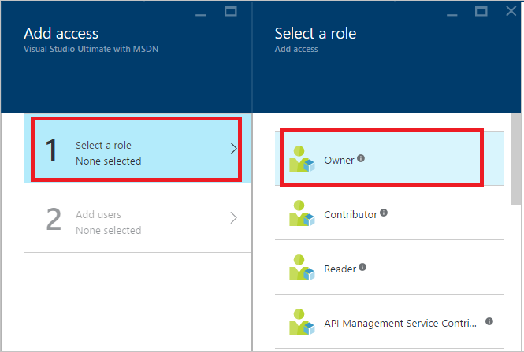
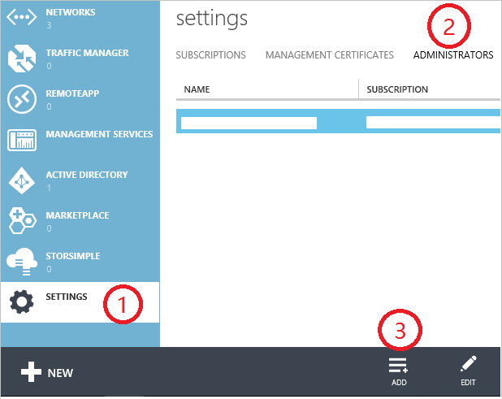
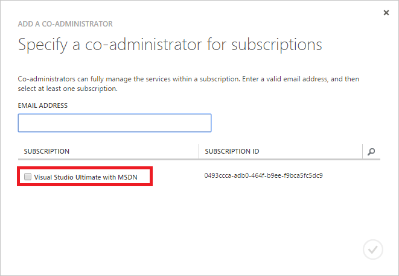

# Add or change Azure administrator roles that manage the subscription or services
You can change the Azure administrator that manages your Azure subscription or manages the Azure services used in your subscription. To view Azure billing information and manage subscriptions, you must sign in to the [Account Center](https://account.windowsazure.com/Home/Index) as the Account Administrator. 

## Add an admin for a subscription
You can add an Azure administrator in the Azure portal or in the Azure classic portal.

**Azure portal**

To add someone as an admin for a subscription in the Azure portal, you give them the owner role. The owner role can only manage the resources in the subscription that you assigned. It doesn't have access privilege to other subscriptions. The owners you add through the [Azure portal](https://portal.azure.com) can't manage resource in the [Azure classic portal](https://manage.windowsazure.com).

1. Sign in to the [Azure portal](https://portal.azure.com).
2. On the Hub menu, select **Subscription** > *the subscription that you want the admin to access*.

    

3. In the subscription blade, select **Access control (IAM)**> **Add**.

    
4. Select **Select a role** > **Owner**.

    

5. Type the email address of the user you want to add as owner, click the user, and then click **Select**.

    

**Azure classic portal**

1. Sign in to the [Azure classic portal](https://manage.windowsazure.com/).
2. In the navigation pane, select **Settings**> **Administrators**> **Add**.  

    
3. Type the email address of the person you want to add as Co-administrator and then select the subscription that you want the Co-administrator to access. 

     

The following email address can be added as a Co-Administrator:

* **Microsoft Account** (formerly Windows Live ID)  
  You can use a Microsoft Account to sign in to all consumer-oriented Microsoft products and cloud services, such as Outlook (Hotmail), Skype (MSN), OneDrive, Windows Phone, and Xbox LIVE.
* **Organizational account** 
  An organizational account is an account that is created under Azure Active Directory. The organizational account address has this format:

    user@&lt;your domain&gt;.onmicrosoft.com

## Change Service Administrator for a subscription
Only the Account Administrator can change the Service Administrator for a subscription.

1. Sign in to [Azure Account Center](https://account.windowsazure.com/subscriptions) by using the Account Administrator.
2. Select the subscription you want to change.
3. On the right side, click **Edit subscription** details.  

    
4. In the **SERVICE ADMINISTRATOR** box, enter the email address of the new Service Administrator.  

    

## Change the Account Administrator
To transfer ownership of the Azure account to another account, see [Transferring Ownership of an Azure subscription](billing-subscription-transfer.md).

We strongly recommend that you don't delete or rename the Account Administrator's email address. You may see unexpected and undesirable behavior with the Azure account. You may not be able sign-in to Azure with that account, make changes to the account, or manage resources with that account. 

## Check the Account Administrator of the subscription
If you're not sure who the account administrator is for your subscription, use the following steps to find out.

  1. Sign in to the [Azure portal](https://portal.azure.com).
  2. On the Hub menu, select **Subscription**.
  3. Select the subscription you want to check, and then look under **Settings**.
  4. Select **Properties**. The account administrator of the subscription is displayed in the **Account Admin** box.  

## Types of Azure admin accounts
 Account Administrator, Service Administrator, and Co-administrator are the three kinds of administrator roles in Microsoft Azure. The following table describes the difference between these three administrative roles.

| Administrative role | Limit | Description |
| --- | --- | --- |
| Account Administrator (AA) |1 per Azure account |This is the person who signed up for or bought Azure subscriptions, and is authorized to access the [Account Center](https://account.windowsazure.com/Home/Index) and perform various management tasks. These include being able to create subscriptions, cancel subscriptions, change the billing for a subscription, and change the Service Administrator. |
| Service Administrator (SA) |1 per Azure subscription |This role is authorized to manage services in the [Azure portal](https://portal.azure.com). By default, for a new subscription, the Account Administrator is also the Service Administrator. |
| Co-administrator (CA) in the [Azure classic portal](https://manage.windowsazure.com) |200 per subscription |This role has the same access privileges as the Service Administrator, but can’t change the association of subscriptions to Azure directories. |

Azure Active Directory Role-based Access Control (RBAC) allows users to be added to multiple roles. For more information, see [Azure Active Directory Role-based Access Control](../active-directory/role-based-access-control-configure.md).

## Limitations and restrictions for admin accounts
* Each subscription is associated with an Azure AD directory (also known as the Default Directory). To find the Default Directory the subscription is associated with, go to the [Azure classic portal](https://manage.windowsazure.com/), select **Settings** > **Subscriptions**. Check the subscription ID to find the Default Directory.
* If you are signed in with a Microsoft Account, you can only add other Microsoft Accounts or users within the Default Directory as Co-Administrator.
* If you are signed in with an organizational account, you can add other organizational accounts in your organization as Co-Administrator. For example, abby@contoso.com can add bob@contoso.com as Service Administrator or Co-Administrator, but can't add john@notcontoso.com unless john@notcontoso.com is in Default Directory. Users signed in with organizational accounts can continue to add Microsoft Account users as Service Administrator or Co-Administrator.
* Now that it is possible to sign in to Azure with an organizational account, here are the changes to Service Administrator and Co-administrator account requirements:

  | Sign in Method | Add Microsoft Account or users within Default Directory as CA or SA? | Add organizational account in the same organization as CA or SA? | Add organizational account in different organization as CA or SA? |
  | --- | --- | --- | --- |
  |  Microsoft Account |Yes |No |No |
  |  Organizational Account |Yes |Yes |No |

## Learn more about resource access control and Active Directory
* To learn more about how resource access is controlled in Microsoft Azure, see [Understanding resource access in Azure](../active-directory/active-directory-understanding-resource-access.md).
* For more information about Azure Active Directory, see [How Azure subscriptions are associated with Azure Active Directory](../active-directory/active-directory-how-subscriptions-associated-directory.md) and [Assigning administrator roles in Azure Active Directory](../active-directory/active-directory-assign-admin-roles.md).

## Need help? Contact support.
If you still need help, [contact support](https://portal.azure.com/?#blade/Microsoft_Azure_Support/HelpAndSupportBlade) to get your issue resolved quickly.
