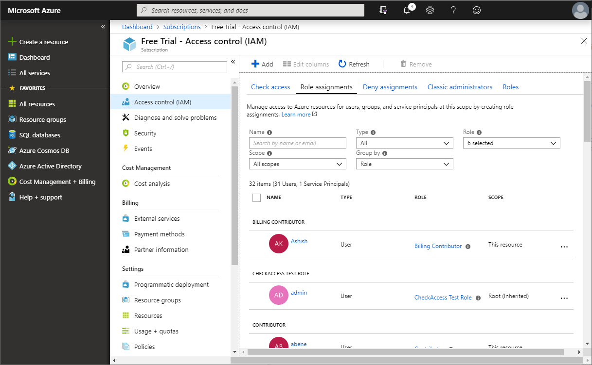
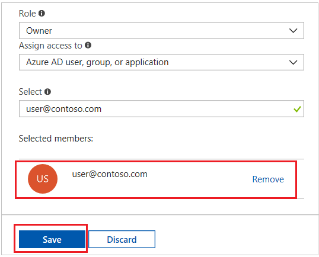

# Add or change Azure subscription administrators

To manage access to Azure resources, you must have the appropriate administrator role. Azure has an authorization system called role-based access control (RBAC) with several built-in roles you can choose from. You can assign these roles at different scopes, such as management group, subscription, or resource group.

Microsoft recommends that you manage access to resources using RBAC. However, if you are still using the classic deployment model and managing the classic resources by using [Azure Service Management PowerShell Module](https://docs.microsoft.com/powershell/module/servicemanagement/azure), you'll need to use a classic administrator. 

> [!TIP]
> If you only use the Azure portal to manage the classic resources, you won’t need to use the classic administrator.

For more information, see [Azure Resource Manager vs. classic deployment](../azure-resource-manager/resource-manager-deployment-model.md) and [Azure classic subscription administrators](../role-based-access-control/classic-administrators.md).

This article describes how add or change the administrator role for a user using RBAC at the subscription scope.

## Assign a user as an administrator of a subscription

To make a user an administrator of an Azure subscription, assign them the [Owner](../role-based-access-control/built-in-roles.md#owner) role  (an RBAC role) at the subscription scope. The Owner role gives the user full access to all resources in the subscription, including the right to delegate access to others. These steps are the same as any other role assignment.

1. In the Azure portal, open [Subscriptions](https://portal.azure.com/#blade/Microsoft_Azure_Billing/SubscriptionsBlade).

1. Click the subscription where you want to grant access.

1. Click **Access control (IAM)**.

1. Click the **Role assignments** tab to view all the role assignments for this subscription.

    

1. Click **Add** > **Add role assignment** to open the **Add role assignment** pane.

    If you don't have permissions to assign roles, the option will be disabled.

1. In the **Role** drop-down list, select the **Owner** role.

1. In the **Select** list, select a user. If you don't see the user in the list, you can type in the **Select** box to search the directory for display names and email addresses.

    

1. Click **Save** to assign the role.

    After a few moments, the user is assigned the Owner role at the subscription scope.

## Next steps

* [What is role-based access control (RBAC)?](../role-based-access-control/overview.md)
* [Understand the different roles in Azure](../role-based-access-control/rbac-and-directory-admin-roles.md)
* [How to: Associate or add an Azure subscription to Azure Active Directory](../active-directory/fundamentals/active-directory-how-subscriptions-associated-directory.md)
* [Administrator role permissions in Azure Active Directory](../active-directory/users-groups-roles/directory-assign-admin-roles.md)

## Need help? Contact support

If you still need help, [contact support](https://portal.azure.com/?#blade/Microsoft_Azure_Support/HelpAndSupportBlade) to get your issue resolved quickly.
