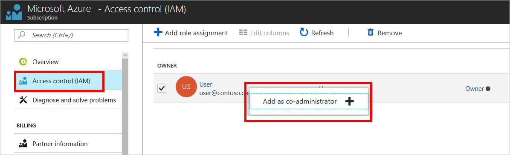
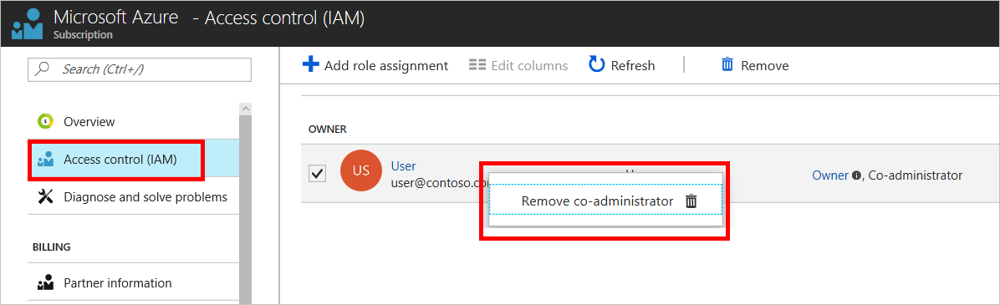
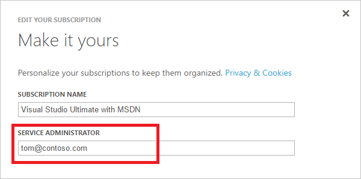

# Add or change Azure subscription administrators

To manage access to Azure resources, you must have the appropriate administrator role. This article describes how to add or change the administrator role for a user at the subscription level.

> [!div class="nextstepaction"]
> [Help improve Azure billing docs](https://go.microsoft.com/fwlink/p/?linkid=2010091)

## What administrator role do I use?

Azure has several different roles. To manage access to resources, you can use the classic subscription administrator roles, such as Service administrator and Co-administrator, or a newer authorization system called role-based access control (RBAC). To ensure better control and to simplify access management, we recommend that you use RBAC for all access management needs. If possible, we recommend that you reconfigure existing access policies using RBAC. For more information, see [What is role-based access control (RBAC)](../role-based-access-control/overview.md) and [Understand the different roles in Azure](../role-based-access-control/rbac-and-directory-admin-roles.md).

## Add an RBAC Owner for a subscription in Azure portal 

To add someone as an administrator for an Azure subscription, assign them the [Owner](../role-based-access-control/built-in-roles.md#owner) role (an RBAC role) at the subscription scope. The Owner role can manage the resources in the subscription that you assigned and doesn't have access privilege to other subscriptions.

1. Visit [**Subscriptions** in Azure portal](https://portal.azure.com/#blade/Microsoft_Azure_Billing/SubscriptionsBlade).
2. Select the subscription that you want to give access.
3. Select **Add**.
   (If the Add button is missing, you do not have permission to add permissions.)
4. Select **Access control (IAM)** in the list.
5. In the **Role** box, select **Owner**. 
6. In the **Assign access to** box, select **Azure AD user, group, or application**. 
7. In the **Select** box, type the email address of the user you want to add as Owner. Select the user, and then select **Save**.

    

This gives the user full access to all resources including the right to delegate access to others. To give access at a different scope, like a resource group, visit the **Access control (IAM)** blade for that scope.

## Add or change Co-administrator

Only an [Owner](../role-based-access-control/built-in-roles.md#owner) can be added as a Co-administrator. Other users with roles such as [Contributor](../role-based-access-control/built-in-roles.md#contributor) and [Reader](../role-based-access-control/built-in-roles.md#reader) cannot be added as Co-administrators.

> [!TIP]
> You only need to add the Owner as a Co-administrator if the user needs to manage Azure classic deployments. We recommend using RBAC for all other purposes.

1. If you haven't already, add someone as an Owner following instructions from above.
2. **Right-click** the Owner user you just added, and then select **Add as co-administrator**. If you do not see the **Add as co-administrator** option, refresh the page or try another Internet browser. 

    

    To remove the Co-administrator permission, **right-click** the Co-administrator user and then select **Remove co-administrator**.

    

## Change the Service administrator for an Azure subscription

Only the Account administrator can change the Service administrator for a subscription. By default, when you sign up, the Service administrator is the same as the Account administrator. If the Service administrator is changed to a different user, then the Account administrator loses access to Azure portal. However, the Account administrator can always use Account Center to change the Service administrator back to themselves.

1. Make sure your scenario is supported by checking the [limits for changing Service administrators](#limits).
1. Sign in to [Account Center](https://account.windowsazure.com/subscriptions) as the Account administrator.
1. Select a subscription.
1. On the right side, select **Edit subscription details**.

    
1. In the **SERVICE ADMINISTRATOR** box, enter the email address of the new Service administrator.

    

### Limitations for changing Service administrators

* Each subscription is associated with an Azure AD directory. To find the directory the subscription is associated with, go to [**Subscriptions**](https://portal.azure.com/#blade/Microsoft_Azure_Billing/SubscriptionsBlade), then select a subscription to see the directory.
* If you are signed in with a Work or School account, you can add other accounts in your organization as Service administrator. For example, abby@contoso.com can add bob@contoso.com as Service administrator, but can't add john@notcontoso.com unless john@notcontoso.com has presence in the contoso.com directory. Users signed in with Work or School accounts can continue to add Microsoft Account users as Service administrator.

  | Sign-in Method | Add Microsoft Account user as a Service administrator? | Add Work or School account in the same organization as a Service administrator? | Add Work or School account in different organization as a Service administrator? |
  | --- | --- | --- | --- |
  |  Microsoft Account |Yes |No |No |
  |  Work or School Account |Yes |Yes |No |

## Change the Account administrator for an Azure subscription

The Account administrator is the user that initially signed up for the Azure subscription, and is responsible as the billing owner of the subscription. To change the Account administrator of a subscription, see [Transfer ownership of an Azure subscription to another account](billing-subscription-transfer.md).

**Not sure who the Account administrator is?** Follow these steps:

1. Visit [**Subscriptions** in Azure portal](https://portal.azure.com/#blade/Microsoft_Azure_Billing/SubscriptionsBlade).
1. Select the subscription you want to check, and then look under **Settings**.
1. Select **Properties**. The Account administrator of the subscription is displayed in the **Account Admin** box.  

## Learn more about resource access control and Active Directory

* To learn more about RBAC, see [What is role-based access control (RBAC)?](../role-based-access-control/overview.md)
* To learn more about all the roles in Azure, see [Understand the different roles in Azure](../role-based-access-control/rbac-and-directory-admin-roles.md).
* For more information about Azure Active Directory, see [How Azure subscriptions are associated with Azure Active Directory](../active-directory/active-directory-how-subscriptions-associated-directory.md) and [Assigning administrator roles in Azure Active Directory](../active-directory/users-groups-roles/directory-assign-admin-roles.md).

## Need help? Contact support.

If you still need help, [contact support](https://portal.azure.com/?#blade/Microsoft_Azure_Support/HelpAndSupportBlade) to get your issue resolved quickly.
