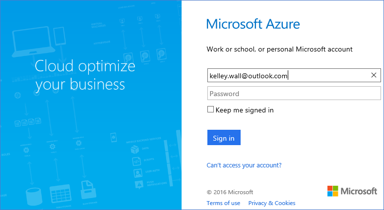
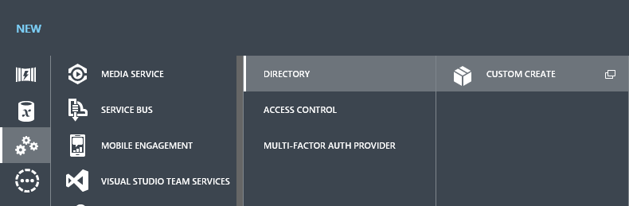
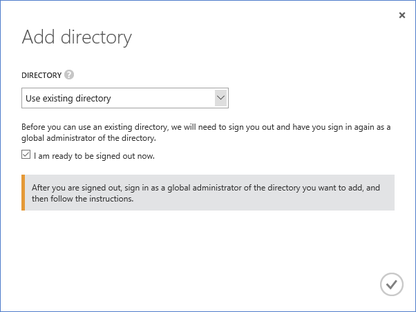
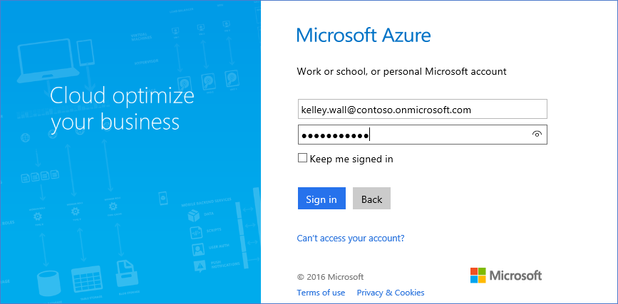
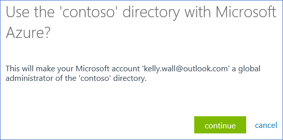
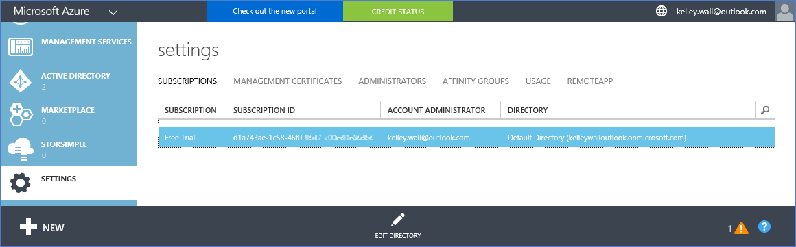
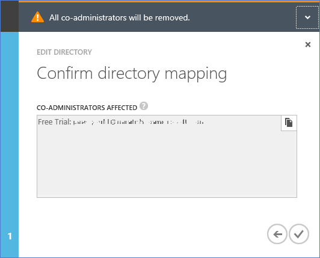
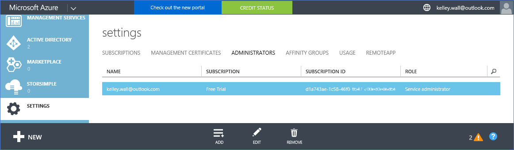
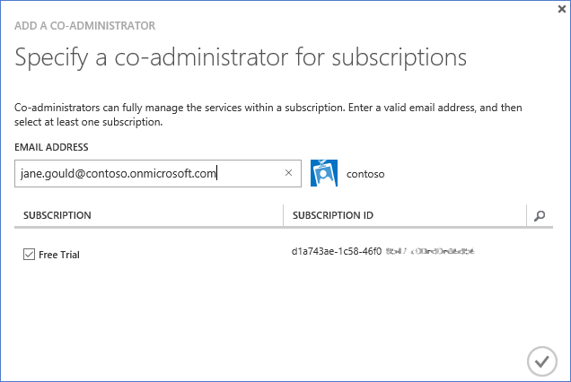

# Associate an Office 365 tenant to an Azure subscription
Link your separate Azure and Office 365 subscriptions so that you can access the Office 365 tenant from your Azure subscription. To link your subscriptions, sign in to Azure with the Azure service administrator account, add a directory, and add the Office 365 organizational accounts to the Azure Active Directory tenant.

If you want an Office 365 subscription for users in your Azure Active Directory instance or you have an Office 365 account but not an Azure account, see [Sign up for Azure with Office 365 account](billing-use-existing-office-365-account-azure-subscription.md). 

## Before you begin
* You must have the credentials of the Azure subscription service administrator. Co-administrator accounts can't do some of the steps in this article. To change your service administrator, see [How to add or change Azure administrator roles](billing-add-change-azure-subscription-administrator.md#change-service-administrator-for-a-subscription).
* You must have the credentials of a global administrator of the Office 365 tenant.
* The email address of the service administrator must not be in the Office 365 tenant.
* The email address of the service administrator must not match that of any global administrator of the Office 365 tenant.
* If you use an email address that is both a Microsoft account and an organizational account, temporarily change the service administrator of your Azure subscription to use another Microsoft account. You can create a Microsoft account at the [Microsoft account signup page](https://signup.live.com/).

## Link Office 365 tenant to Azure subscription
To associate the Office 365 tenant to the Azure subscription, follow these steps:

### Step 1: Add Office 365 tenant to your Azure subscription

1. Sign in to the [Azure classic portal](https://manage.windowsazure.com/) with the service administrator credentials.

    

2. In the left pane, select **ACTIVE DIRECTORY**. You shouldn't see the Office 365 tenant. If you see it, skip to [Step 2: Change the directory associated with the Azure subscription](#Step2).
   
   

3. Select **NEW** > **DIRECTORY** > **CUSTOM CREATE**.
   
    
   
4. On the **Add directory** page, under **DIRECTORY**, select **Use existing directory**. Then select **I am ready to be signed out now**, and select **Complete** .
   
    
   
5. After you are signed out, sign in with the global administrator’s credentials of your Office 365 tenant.
   
    
   
6. Select **Continue**.
   
    
   
7. Select **Sign out now**.
   
    
   
8. Sign in to the [Azure classic portal](https://manage.windowsazure.com/) with the service administrator credentials.
   
    
   
9. You should see your Office 365 tenant in the dashboard.
   
    

### Step 2: Change the directory associated with the Azure subscription
   
1. Select **Settings**.
   
    
   
2. Select your Azure subscription, and then select **EDIT DIRECTORY**.

    
   
3. Select **Next** .
   
    
   
4. Review the affected accounts. All co-administrators and [Role-Based Access Control (RBAC)](../active-directory/role-based-access-control-configure.md) users with assigned access in the existing resource groups are removed. The warning you receive only mentions the removal of co-administrators.
      
    
   
    
   
5. Select **Complete** .

### Step 3: Add your Office 365 organizational accounts as co-administrators to the Azure Active Directory tenant
   
1. Select the **ADMINISTRATORS** tab, and then select **ADD**.
   
    
   
2. Enter an organizational account of your Office 365 tenant, select the Azure subscription, and then select **Complete** .
   
    
   
3. Go back to the **ADMINISTRATORS** tab. You should see the organizational account displayed as co-administrator.
   
    
4.  Test access to Azure with the co-administrator account.
   
    a. Sign out of the Azure classic portal.
   
    b. Open the [Azure portal](https://portal.azure.com/).
   
    c. Enter the credentials of the co-administrator, and then select **Sign in**.
   
    

## Need help? Contact support.
If you still need help, [contact support](https://portal.azure.com/?#blade/Microsoft_Azure_Support/HelpAndSupportBlade) to get your issue resolved quickly.

