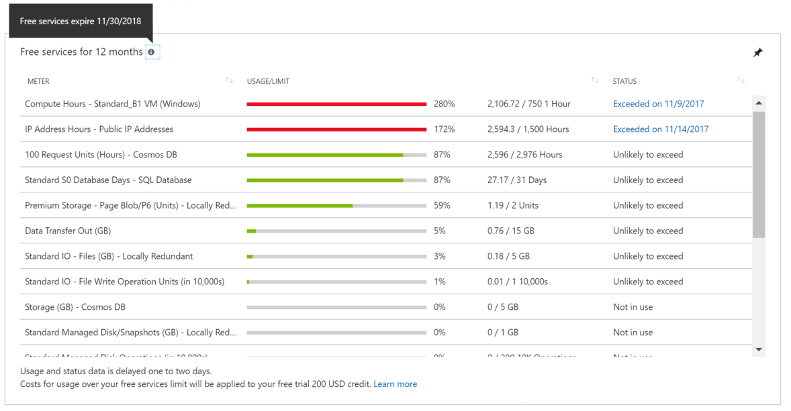

# Avoid charges with your Azure free account

Azure free account gives you $200 in Azure credits for the first 30 days and a limited quantity of free services for 12 months. For more information, see [Azure free account](https://azure.microsoft.com/free/). Depending on the status of your credit, you may use your credit or get charged for usage beyond the free services and quantities.

## Azure free account might use account credit
If you still have Azure credit that hasn't expired, Azure uses your credit to pay for usage beyond the free services and quantities.

## Your credit runs out or is expired
If your credit runs out or expires at the end of 30 days, Azure disables your subscription. To continue using Azure services, you must upgrade your subscription to an individual subscription with pay-as-you-go rates. For more information, see [Upgrade your free trial Azure subscription](billing-upgrade-azure-subscription.md). After you upgrade, your subscription still has access to free services for 12 months. You only get charged for usage beyond the free services and quantities.

Let's look at some of the reasons you can incur charges on your Azure free account.

### Usage exceeds the limits of free services

You get a limited quantity of free services each month with your Azure free account. The free quantity expires at the end of the month and doesn't roll over to the next month. For example, you get 5 GB of File storage each month. If in a month, you only use 2 GB, the remaining 3 GB doesn't roll over to the next month. To avoid getting charged, keep your usage within the limits. To learn about limits of free services, see the [Azure free account FAQ](https://azure.microsoft.com/free/free-account-faq/). To check your free service usage, see [Check usage of free services included with Azure free Account](billing-check-free-service-usage.md).

### Some services are not free

You get charged pay-as-you-go rates for using services that aren't included for free with your Azure free account. To learn about services included with a free account, see the [Azure free account FAQ](https://azure.microsoft.com/free/free-account-faq/). You can check your service usage in the Azure portal or in your Azure usage file. To learn more, see [Regularly check the portal for cost breakdown and burn rate](billing-getting-started.md#costs) and [Download usage from the Account Center](billing-download-azure-invoice-daily-usage-date.md).

### You reached the end of your free 12 months

Your free services and quantities expire at the end of 12 months. You can find out when your free services expire in the Azure portal.

1. Sign in to the [Azure portal](https://portal.azure.com).

2. In the left navigation area, select **All services**.

3.	Select **Subscriptions**.

4.	Select the subscription that you created when you signed up for free account.

5.  Scroll down to find free services grid. Click the tooltip located on the top left of the grid.

Once your free services and quantities are expired, Azure charges you pay-as-you-go rates for any services you're using. You can use the Azure portal to delete the resources for the services that you don't use. If you don’t intend to use any Azure service, you can [cancel your subscription](billing-how-to-cancel-azure-subscription.md).

## Need help? Contact us.

If you have questions or need help,  [create a support request](https://go.microsoft.com/fwlink/?linkid=2083458).

## Next steps
- [Upgrade your free trial Azure subscription](billing-upgrade-azure-subscription.md)
