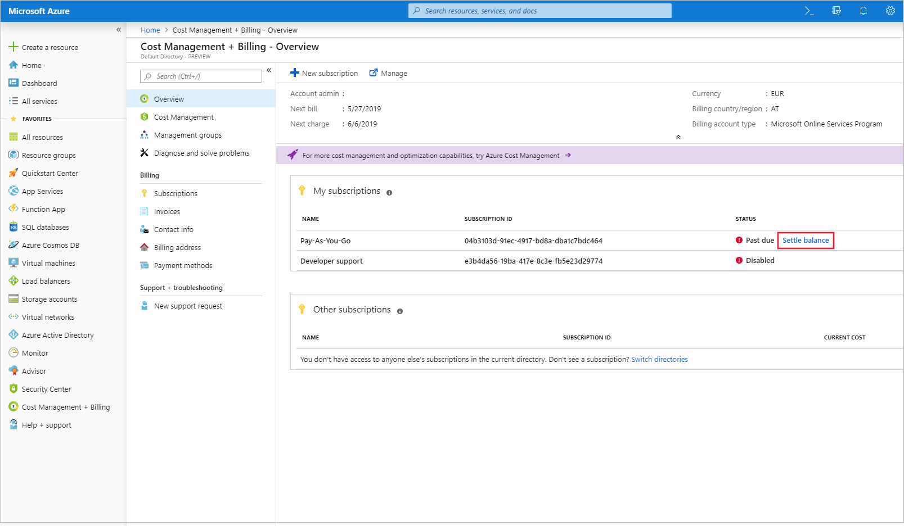

# Resolve past due balance for your Azure subscription

If your payment isn't received or if we can't process your payment, you might get an email or see an alert in the Azure portal or Account Center.
If you are the [Account Administrator](billing-subscription-transfer.md#whoisaa), you can settle the outstanding charges in the [Azure portal](https://portal.azure.com). If you are on an invoice mode of payment, send your payment to the location listed at the bottom of your invoice.

> [!IMPORTANT]
> * If you have multiple subscriptions using the same credit card and they are all past due, you must pay the entire outstanding balance at once.
> * The payment instrument you use to settle the outstanding charges will become the new active payment method for all subscriptions that were using the failed payment method.

## Resolve past due balance in the Azure portal

1. Sign in to the [Azure portal](https://portal.azure.com) as the Account Admin.
1. Search for **Cost Management + Billing**.
1. In the Overview page, you'll see a list of your subscriptions. If your subscription status is past due, click the **Settle balance** link.
    
1. The total outstanding balance reflects outstanding charges across all Microsoft services using the failed payment method.
1. Select a payment method to pay the balance. This payment method will become the active payment method for all subscriptions currently using the failed payment method.
    
1. If the selected payment method also has outstanding charges for Microsoft services, this will be reflected in the total outstanding balance. You must pay those outstanding charges, too.
1. Click **Pay**.

## Not getting billing email notifications?

If you're the Account Administrator, [check what email address is used for notifications](billing-how-to-change-azure-account-profile.md). We recommend that you use an email address that you check regularly. If the email is right, check your spam folder.

## If I forget to pay, what happens?

The service is canceled and your resources are no longer available. Your Azure data is deleted 90 days after the service is terminated. To learn more, see [Microsoft Trust Center - How we manage your data](https://go.microsoft.com/fwLink/p/?LinkID=822930&clcid=0x409).

If you know your payment has been processed but your subscription is still disabled, contact [Azure Support](https://portal.azure.com/#blade/Microsoft_Azure_Support/HelpAndSupportBlade).

## Need help? Contact us.

If you have questions or need help,  [create a support request](https://go.microsoft.com/fwlink/?linkid=2083458).
