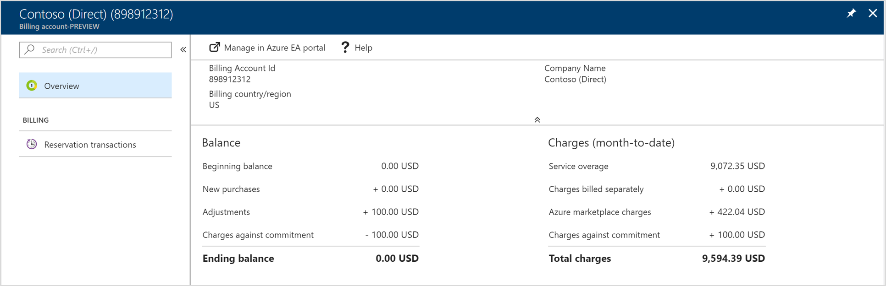
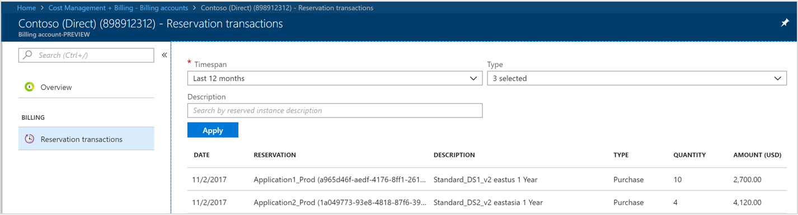

# Use billing account to manage billing for Azure  

Billing accounts define your Azure billing relationships. You can have multiple billing accounts, for instance, you might have signed up for Azure for your personal use and you have Azure through your organization's enterprise agreement. You can use Azure portal's [Cost Management + Billing page](https://portal.azure.com/#blade/Microsoft_Azure_Billing/BillingMenuBlade/Overview) to view details of each billing account.

## Preview features for Enterprise administrators

The  preview features are launched only for Enterprise administrators. In future, other enterprise agreement roles will be supported. The following features are now available in [Azure portal](https://portal.azure.com/).

1.	**Reserved instance purchases.**

2.	**Balance and month-to-date charges.**

### Access preview features

1.	Log in to the [Azure portal]( http://portal.azure.com).

2.	From left navigation area, select **Cost Management + Billing**.

3.	Select **Billing accounts**.

4.	Select the enterprise agreement for which you want to view reserved instance purchases.

    

    The overview page lists your current balance and month-to-date charges.

5.	Select **Reservation transactions** to view list of all reserved instance purchases.

   

## Need help? Contact support

If you need help, [contact support](https://portal.azure.com/?#blade/Microsoft_Azure_Support/HelpAndSupportBlade) to get your issue resolved quickly.
