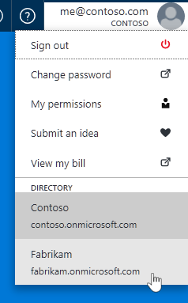

# I can't sign in to manage my Azure subscription
This article guides you through some of the most common methods to resolve login issues.

## Page hangs in the loading status
If your internet browser page hangs, try each of the following steps until you can get to the [Azure portal](https://portal.azure.com).

* Refresh the page.
* Use a different Internet browser.
* If you’re using Microsoft Internet Explorer, browse to the Azure portal by using the InPrivate Browsing mode. 
  
  A. Click **Tools**  > **Safety** > **InPrivate Browsing**.
  
  B. Browse to the [Azure portal](https://portal.azure.com), and then sign in to the portal.

## Error message "No subscriptions found”
If your account doesn’t have sufficient permissions, you may see a **No subscription found** error message. Make sure you log in as the right administrator. An Account Administrator can only access the [Account Center](https://account.windowsazure.com/Subscriptions). The Service Administrators (SA) and Co-Administrators (CA) only have access to the [Azure portal](https://portal.azure.com) or the Azure classic portal.

**Scenario 1: Error message is received in the [Azure portal](https://portal.azure.com)**

To fix this issue:

* Make sure the right Azure directory is selected by clicking your account at the top right.

* If the right Azure directory is selected but you still get the error, [have your account added as an Owner](billing-add-change-azure-subscription-administrator.md).

**Scenario 2: Error message is received in the [Azure Account Center](https://account.windowsazure.com/Subscriptions)**

Check whether the account that you used is the account administrator. To verify who the account administrator is, follow these steps:

1. Sign in to the [Azure portal](https://portal.azure.com).
2. On the Hub menu, select **Subscription**.
3. Select the subscription that you want to check, and then select **Settings**.
4. Select **Properties**. The account administrator of the subscription is displayed in the **Account Admin** box.

## You are automatically signed in as a different user
This issue can occur if you use more than one user account in an Internet browser.

To resolve the issue, try one of the following methods:

* Clear the cache and delete Internet cookies. In Internet Explorer, click **Tools**  > **Internet Options** > **Delete**. Make sure that the check boxes for temporary files, cookies, password, and browsing history are selected, and then click Delete.
* Reset the Internet Explorer settings to revert any personal settings that you’ve made. Click **Tools** > **Internet Options** > **Advanced** >select the **Delete personal settings** box > **Reset**.
* Browse to the Azure portal in InPrivate Browsing mode. Click **Tools**  > **Safety** > **InPrivate Browsing**.

## Need help? Contact support.
If you still need help, [contact support](http://go.microsoft.com/fwlink/?linkid=544831&clcid=0x409) to get your issue resolved quickly. 

