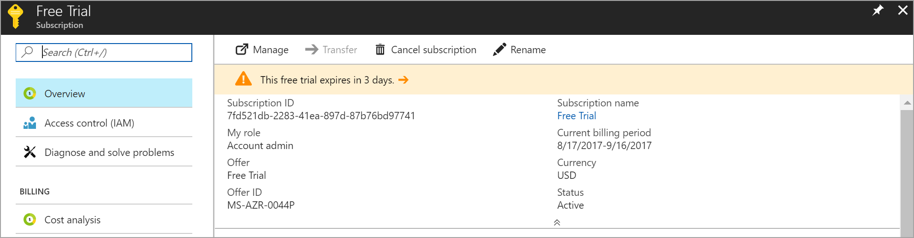
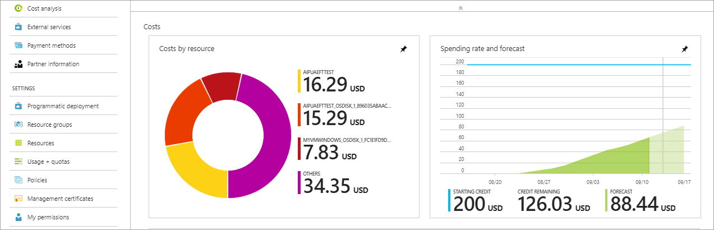
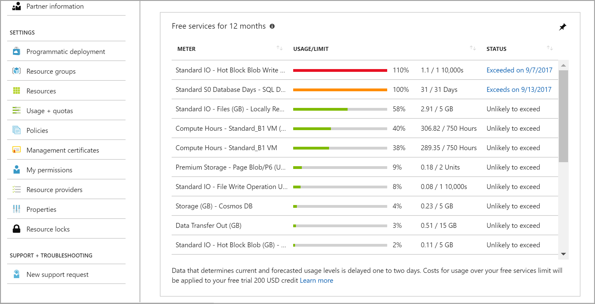
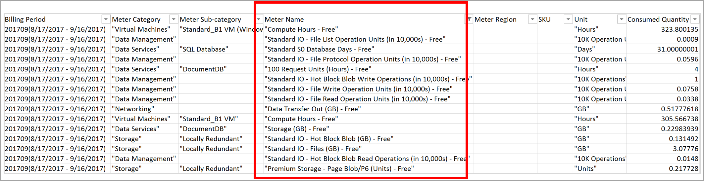

# Check free service usage included with your Azure free account

You're not charged for services included for free with an Azure free account, unless you exceed the limits of the services. To remain in the limits, you can use the Azure portal or your usage file to monitor and track the free service usage.

## Check usage in the Azure portal

1.	Sign in to the [Azure portal](https://portal.azure.com).

2.	In the left navigation area, select **All services**.

3.	Select **Subscriptions**.

4.	Select the subscription that you created when you signed up for free account.

    

5.  The overview section shows you essential information about your subscription. For example, subscription ID, offer type, and subscription name. You can also find information when your free account credit expires.

    

6.  Scroll down to find information about your current and forecasted cost. The cost includes service usage not included with your free account and usage exceeding the limits of free services.

    

7.	The final part of the overview section has a table showing free service usage.

    

    The table has the following columns:

* **Meter Name:** Identifies the unit of measure for the meter being consumed. To learn about service to meter mapping, see [Understand free service to meter mapping](billing-understand-free-service-meter-mapping.md).
* **Usage/Limit:** Current month's usage and limit for the meter. You can also find this information in the status bar.
* **Status:** Usage status of the meter. Based on your usage pattern, you can have one of the following statutes:
  * **Not in use:** You haven't used the meter or the usage for the meter hasn't reached the billing system.
  * **Exceeded on \<Date>:** You have exceeded the limit for the meter on \<Date>.
  * **Unlikely to Exceed:** You're unlikely to exceed the limit for the meter.
  * **Exceeds on \<Date>:** You're likely to exceed the limit for the meter on \<Date>.

## Check usage with the usage file

Your usage file provides detailed information for your Azure subscription. You can download your monthly and daily usage file from the Azure Account Center. To learn how to download the usage file and understand the access required, see [Get Invoice and Usage](billing-download-azure-invoice-daily-usage-date.md). To learn about columns in the usage file, see [Understand terms on your usage](billing-understand-your-usage.md).

The usage file has usage information for both free and paid services. Free service meters would have **Free** appended at the end of the meter name. To find free meters, open the file in excel and filter the **Meter Category column** for cells that have text **- Free** (Use Text Filters &rarr; Contains filter).

## Need help? Contact us.

If you have questions or need help,  [create a support request](https://go.microsoft.com/fwlink/?linkid=2083458).

## Next steps
- [Upgrade your subscription](billing-upgrade-azure-subscription.md)
